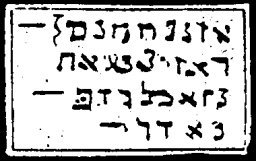

  
[Intangible Textual Heritage](../../index)  [Grimoires](../index) 
[Index](index)  [Previous](m738)  [Next](m740) 

------------------------------------------------------------------------

### SIGNS OF GRASSHOPPERS AND DARKNESS

The inscriptions on the seal are to be said as follows:

HASSADAY HAYLOES, LUCASIM ELAYH JACIHAGA, YOININO, SEPACTICAS BARNE LUD
CASTY:

------------------------------------------------------------------------

[Next: THE SPIRIT APPEARS IN THE BURNING BUSH](m740)
