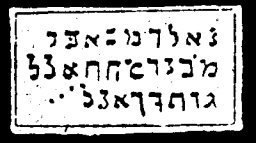

  
[Intangible Textual Heritage](../../index)  [Grimoires](../index) 
[Index](index)  [Previous](m739)  [Next](m741) 

------------------------------------------------------------------------

### THE SPIRIT APPEARS IN THE BURNING BUSH

The inscriptions on the seal are to be read as follows:

BABA CUCI HIEBU ZIADHI ELENEHET NA VEAN VIE ACHYA SALNA

The spirit which appears here is God himself.

------------------------------------------------------------------------

[Next: MOSES CHANGES THE STAFF INTO A SERPENT](m741)
