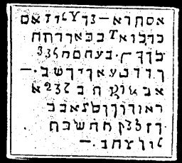

  
[Intangible Textual Heritage](../../index)  [Grimoires](../index) 
[Index](index)  [Previous](m743)  [Next](m745) 

------------------------------------------------------------------------

### PRINCIPAL CITATION ON ALL MINISTERING SPIRITS OF THE AIR AND OF EARTH, THE LIKE OF WHICH MANASSES AND SOLOMON USED AS THE TRUE KEY SOLOMONIS REGIS ISRAEL

You must stand on a prominent rock, hold a palm twig in your right hand,
and wear a wreath of laurel around the temples. Then turn toward the
east and say:

ALIJA LAIJA LAUMIN OTHEON!

At this time, a halo of light will surround you, and when you become
aware of this light, fall upon your knees and worship. Then say in an
audible voice the words inscribed in the following seal. You must speak
slowly and distinctly.

ELIAM YOENA ADONAI CADUS EBREEL ELOYELA AGIEL, AYOM SACHADON OSSUSELAS
ELOYM DE LIOMAR ELYNLA LELIA YAZI ZAZALL UNNEL OVELA DILATAM SADAY ALMA
PANAIM ALYM CANAL DENSY USAMI YASAS CALIPI CALFAS SASNA SAFFA SADOJA
AGLATA PANTOMEL AMRIEL AZIEN PHANATON SARZE PENERION YA EMANUEL JOD
JALAPH AMPHIA THAN DOMIRAEL ALOWIN.

CHARACTERS

BA M N LAZIES ALA PHONFIN AGALOYES PYOL PAERTEON THESERYM. BASIMEL JAEL
BARIONIA APIOLET CENET.

------------------------------------------------------------------------

[Next: Treatise Sion](m745)
