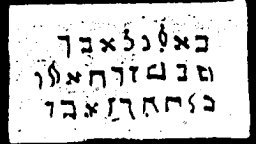

  
[Intangible Textual Heritage](../../index)  [Grimoires](../index) 
[Index](index)  [Previous](m749)  [Next](m751) 

------------------------------------------------------------------------

### CHAPTER I. THE SPIRIT APPEARS UNTO MOSES IN A BURNING BUSH

Conjuration

KALUKU! UBESU! LAWISU!--Arise and teach me.  
Calls with voice and horn as instructed.

------------------------------------------------------------------------

[Next: CHAPTER II. MOSES CHANGES THE STAFF INTO A SERPENT](m751)
