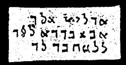

  
[Intangible Textual Heritage](../../index)  [Grimoires](../index) 
[Index](index)  [Previous](m755)  [Next](m757) 

------------------------------------------------------------------------

### CHAPTER VII. GENERAL CITATION OF MOSES ON ALL SPIRITS

Conjuration

ADULAL! ABULAL! LEBUSI!--Arise and bring before me the spirit N.  
Calls with voice and horn as instructed.

------------------------------------------------------------------------

[Next: THE PENTAGON OR OMNIPOTENT FIVE CORNERS](m757)
