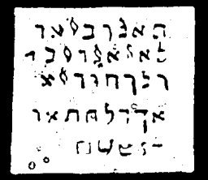

  
[Intangible Textual Heritage](../../index)  [Grimoires](../index) 
[Index](index)  [Previous](m758)  [Next](m760) 

------------------------------------------------------------------------

### CHAPTER I. THE SPIRIT APPEARS IN A PILLAR OF FIRE BY NIGHT

Conjuration

TALUBSI! LATUBUSI! KALUBUSI! ALUSI!--Arise and bring me the pillar of
Fire that I may see.

The name of each angel must be called out three times to the four
quarters of the earth, first with the voice, then with the horn.

------------------------------------------------------------------------

[Next: CHAPTER II. THE SPIRIT APPEARS IN A PILLAR OF CLOUD BY DAY](m760)
