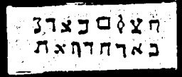

  
[Intangible Textual Heritage](../../index)  [Grimoires](../index) 
[Index](index)  [Previous](m760)  [Next](m762) 

------------------------------------------------------------------------

### CHAPTER III. BALAAM'S SORCERY

Conjuration

ONU, BASCHBA, NISCHOAZ HUERETZ--In the name of God I conjure the earth.

------------------------------------------------------------------------

[Next: CHAPTER IV. EGYPT](m762)
