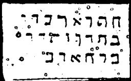

  
[Intangible Textual Heritage](../../index)  [Grimoires](../index) 
[Index](index)  [Previous](m765)  [Next](m767) 

------------------------------------------------------------------------

### \* CHAPTER VII. CONJURATION OF ELEAZAR

DUWATU, BUWATIE, BEMAIM--I come to you on the water! Bring me up N.N.!

DISMISSAL OF ELEAZAR

Conjuration

ORUM, BOLECTN, UBAJOM--Cursed by night and by day!

------------------------------------------------------------------------

[Next: CHAPTER VIII. CITATION OF QUERNITHAY OR LEVIATHAN](m767)
