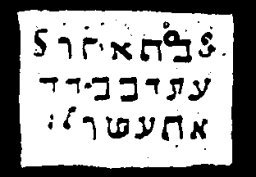
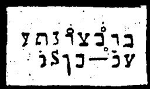

  
[Intangible Textual Heritage](../../index)  [Grimoires](../index) 
[Index](index)  [Previous](m766)  [Next](m768) 

------------------------------------------------------------------------

### CHAPTER VIII. CITATION OF QUERNITHAY OR LEVIATHAN

Conjuration

ELUBATEL, EBUHUEL, ATUESUEL!

Each name must be repeated three times. These, as well as the following
invocations, contain only the peculiar names of the angels of
omnipotence who will permit the conjured spirits to appear, or will
compel them to appear by force.

DISMISSAL

Conjuration

I beseech thee, angel Elubatel, conduct N.N. {name of spirit} from my
presence.

Each angel's name must be pronounced three times with the voice and
three times the horn must be blown, each time towards the four quarters
of the earth.

------------------------------------------------------------------------

[Next: CHAPTER IX. MAGICAL LAWS OF MOSES](m768)
