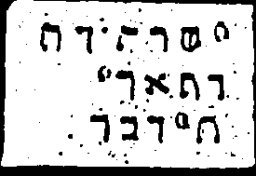

  
[Intangible Textual Heritage](../../index)  [Grimoires](../index) 
[Index](index)  [Previous](m769)  [Next](m771) 

------------------------------------------------------------------------

### CHAPTER XI. BREASTPLATE OF MOSES

Conjuration

SCHEDUSI, WEDUSE, TIWISI.--I have sinned, I shall sin.

Prayer

Eternal God of our All! Our god! Hear our voice, spare and have mercy
upon us. Accept our prayer in mercy and with pleasure. I have sinned. I
have committed transgressions. I have sinned before Thee. I have done
that which is displeasing unto Thee here in the earth. For the sake of
Thy great name pardon me all the sins and iniquities and transgressions
which I have committed against Thee from my youth. Perfect again all the
holy names which I have blemished, Great Champion, terrible, highest
God, eternal Lord, God Sabaoth.

------------------------------------------------------------------------

[Next: CHAPTER XII. BREASTPLATE OF AARON](m771)
