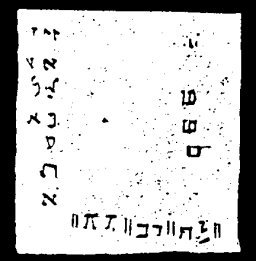
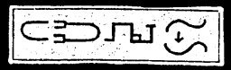
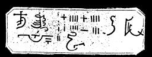

  
[Intangible Textual Heritage](../../index)  [Grimoires](../index) 
[Index](index)  [Previous](m771)  [Next](m773) 

------------------------------------------------------------------------

### CHAPTER XIII. THE CHALICE OF HOLINESS

Conjuration

AI, AI, AI--Arise, Thou eternal Angel!

This must be repeated three times in a loud voice, and the horn must
also be blown three times, for he is an angel of the sanctuary.

Prayer

Thou that art, wast, and wilt be in the old and new covenant! Eternal,
Jehovah, Jesus Christ, Messias, All Beautiful, All True, All Holy! All
Loving and All Merciful in the old and in the new covenant. Thou hast
said: Heaven and earth shall pass away, but my words shall not pass
away. Thou hast said: I came not to destroy the old covenant, but to
fulfill it. Thou hast said: He who sees me, sees the Father. Thou hast
said: If ye have true faith, ye can perform the wonders which I have
done, yea, ye will perform yet much greater wonders than I have done.
Come also to me for the sake of my faith, come also unto me for the sake
of Moses, Thy messenger of faith. Reveal also to me Thy mysterious name
from Jehovah, as Thou once did to Thy fire prophet Moses in solitude.
Come, and say unto me in love, through the heart of Moses and with the
tongue of Aaron: SCAHEBUAL! I shall come!

FOR THE LEFT HAND

These signs were used at the time of burnt offerings in the holy temple.

FOR THE RIGHT HAND

These are also symbolical of the plagues of Pharaoh in Egypt. SCHEMA
ISRAEL ADONAI ELOHJEINU, ADONAI ECHAD.--Hear, O Israel, the Lord our
God, the Lord is one.

------------------------------------------------------------------------

[Next: BIBLIA ARCANA MAGICA ALEXANDER](m773)
