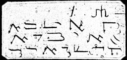

  
[Intangible Textual Heritage](../../index)  [Grimoires](../index) 
[Index](index)  [Previous](m785)  [Next](m787) 

------------------------------------------------------------------------

### CHAPTER IV. EGYPT

------------------------------------------------------------------------

[Next: CHAPTER V. CONJURATION OF THE LAWS OF MOSES](m787)
