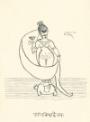
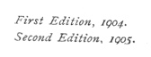

  
[Intangible Textual Heritage](../../../index)  [Hinduism](../../index) 
[F.W. Bain](../index)  [Index](index)  [Next](iggh01) 

------------------------------------------------------------------------

[Buy this Book at
Amazon.com](https://www.amazon.com/exec/obidos/ASIN/1406716642/internetsacredte)

------------------------------------------------------------------------

  
*In the Great God's Hair*, by F. W. Bain, \[1905\], at Intangible
Textual Heritage

------------------------------------------------------------------------

##### IN THE

# GREAT GOD'S HAIR

( )

##### TRANSLATED FROM THE ORIGINAL MANUSCRIPT

###### BY

## F. W. BAIN

 

<table data-border="0">
<colgroup>
<col style="width: 100%" />
</colgroup>
<tbody>
<tr class="odd">
<td data-valign="top">
Thou art my Lord: I, thy Satí: 
I have no other God but Thee. 
                  Motto of the Faithful Hindoo Wife.
</td>
</tr>
</tbody>
</table>

##### SECOND EDITION.

#### James Parker and Co.,

##### 31 BEDFORD-STREET, STRAND, LONDON;

##### AND 27 BROAD-STREET, OXFORD.

#### \[1905\]

Scanned, proofed and formatted by John Bruno Hare at Intangible Textual
Heritage, November 2007. This text is in the public domain in the US
because it was published prior to 1923. These files may be used for any
purpose.

 
[  
Click to enlarge](img/front.jpg)  
Frontispiece  

  [  
Click to enlarge](img/title.jpg)  
Title Page  

 

p. iv

First Edition, 1904.  
Second Edition, 1905.

p. v

DEDICATED

TO

HUSBANDS AND WIVES.

------------------------------------------------------------------------

[Next: Preface](iggh01)
