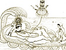

  
[Intangible Textual Heritage](../../../index)  [Hinduism](../../index) 
[F.W. Bain](../index)  [Index](index)  [Previous](iggh09) 
[Next](iggh11) 

------------------------------------------------------------------------

[Buy this Book at
Amazon.com](https://www.amazon.com/exec/obidos/ASIN/1406716642/internetsacredte)

------------------------------------------------------------------------

  
*In the Great God's Hair*, by F. W. Bain, \[1905\], at Intangible
Textual Heritage

------------------------------------------------------------------------

### VII. Out of a Former Birth

said Indra: O dark-haired lady, thou talkest of thy husband as if thou
hadst known him from thy birth; whereas thou didst set eyes on him for

p. 38

the very first time in thy life, last night. And how then canst thou
tell that he will not cease to satisfy thy soul, or that he on his part
may not weary of thee, and cast thee carelessly away: for ye are
strangers that have met by chance.

Then said Wanawallarí: Brahman, thou art speaking only to beguile me: or
else thou art but a poor pundit on the essence of the world. Know, that
a woman recognises in an instant, with unerring sagacity, if only she be
fortunate enough to see him, the man proper to be her husband: for this
depends not upon the shallow and casual experiences of this life, but
the store of reminiscences of a former birth. Moreover, there are
instants and atoms of time containing in themselves causes and
consequences that run both ways into the two eternities of the past and
the future, being as it were the fruit of the one and the seed of the
other: and many times it happens that the twinkling of an eye determines
the destiny of a soul. And this was my case: for since I saw my husband,
I am other than I was, altered for infinity by a moment of illumination
and the nectar of mutual recognition. Has not the Creator planted in the
core of all things animate and inanimate aversions and attractions to be
their destiny, not to be controlled

p. 39

or disobeyed? As once there was a mournful maiden, married against her
will to a certain king. So when they were united, horror and the hatred
of life entered and inhabited her soul. And every time that he
approached her, she fell into a swoon that resembled a foretaste of
death. Then finding it impossible to come near her, that king was
amazed. And he said to himself: Surely there must be for this
extraordinary antipathy some extraordinary cause, buried in the
mysterious darkness of the past. For other women, so far from shunning
my embraces, welcome and even court them, becoming *abhisárikás* [q](#fn_25) for my sake: for I am a very handsome man.
And he went and offered sacrifice in the temple of Maheshwara. And
standing before the image, he exclaimed: O thou knower of past, present,
and future, if thou dost not reveal to me the cause of this aversion, I
will this very moment cut off my own head. Then the image of the deity
uttered a loud laugh. And it said: O foolish king, this is a very simple
thing. Know, that long ago, in a former birth, thou and she fell by
reason of sins previously committed into the bodies of brutes. And she
became

p. 40

a snake, and thou a peacock. Hence she cannot endure even thy proximity,
for thou dost retain a strain of the nature of the peacock, and its
vanity. And the king said: But why, then, do I feel no corresponding
aversion for her? And the god said: Because in another birth thou wast a
bird of the race of Garuda, of which snakes are the appropriate food.
Moreover, women retain traces of these affections and abhorrences more
permanently than men, because emotion is of the essence of their soul:
and plunged in bodies, like vats, they carry away, like pure water, the
stain of the dye. So learning the truth, the king took another wife, and
lived with her in peace. And thus, O Brahman, I was drawn to my husband
the very moment that I saw him by a cord woven in a former birth,
irresistible and invisible as the power that draws grass to the amber
jewel. And now I have been rivetted to him by our marriage as with
adamantine bolts.

------------------------------------------------------------------------

### Footnotes

[39:q](iggh10.htm#fr_25) An *abhisáriká* is a
woman who goes of her own accord to her lover, or, as we might say,
throws herself at his head.

------------------------------------------------------------------------

[Next: VIII. The Illusion of Beauty](iggh11)
