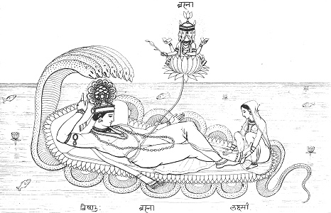

  
[Intangible Textual Heritage](../../../index)  [Hinduism](../../index) 
[F.W. Bain](../index) 

------------------------------------------------------------------------

[Buy this Book at
Amazon.com](https://www.amazon.com/exec/obidos/ASIN/1406716642/internetsacredte)

------------------------------------------------------------------------

<table width="75%">
<colgroup>
<col style="width: 50%" />
<col style="width: 50%" />
</colgroup>
<tbody>
<tr class="odd">
<td width="50%" data-valign="TOP"></td>
<td width="50%" data-valign="CENTER"><h1 id="in-the-great-gods-hair" data-align="CENTER">In the Great God's Hair</h1>
<h2 id="by-f.-w.-bain" data-align="CENTER">by F. W. Bain</h2>
<h4 id="section" data-align="CENTER">[1905]</h4></td>
</tr>
</tbody>
</table>

------------------------------------------------------------------------

[Contents](#contents)    [Page Index](pageidx)    [Text](iggh.txt)   
[Start Reading](iggh00)

------------------------------------------------------------------------

|                                                                                                                           |
|---------------------------------------------------------------------------------------------------------------------------|
|  |

 [Title Page](iggh00)  
[Preface](iggh01)  
[Contents](iggh02)  
[Prologue](iggh03)  

### A Lotus of the World

[I. A Denier of Deity](iggh04)  
[II. A Rajpoot Marriage](iggh05)  
[III. Water-Lily](iggh06)  
[IV. A God and a Mortal](iggh07)  
[V. Man's Other Half](iggh08)  
[VI. Wild Flowers](iggh09)  
[VII. Out of a Former Birth](iggh10)  
[VIII. The Illusion of Beauty](iggh11)  
[IX. The Two Kings](iggh12)  
[X. A Pariah Dog](iggh13)  
[XI. A Red Lotus](iggh14)  
[XII. The Wind and the Leaves](iggh15)  
[XIII. A King and Queen](iggh16)  
[XIV. Love the Fisherman](iggh17)  
[XV. A Woman's Lord](iggh18)  
[XVI. A God abashed](iggh19)  
[XVII. Nectar](iggh20)  
[XVIII. The Favour of Fortune](iggh21)  
[XIX. The Triumph of Beauty](iggh22)  

 

[Epilogue](iggh23)  
[By the same Author](iggh24)  
