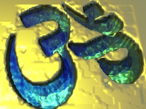

  
[Intangible Textual Heritage](../../index)  [Hinduism](../index) 

------------------------------------------------------------------------

[Buy this Book at
Amazon.com](https://www.amazon.com/exec/obidos/ASIN/B002DEMAYK/internetsacredte)

------------------------------------------------------------------------

<table width="75%">
<colgroup>
<col style="width: 50%" />
<col style="width: 50%" />
</colgroup>
<tbody>
<tr class="odd">
<td width="50%" data-valign="TOP"></td>
<td width="50%" data-valign="CENTER"><h1 id="brahma-knowledge" data-align="CENTER">Brahma-Knowledge</h1>
<h2 id="by-l.-d.-barnett" data-align="CENTER">by L. D. Barnett</h2>
<h4 id="section" data-align="CENTER">[1911]</h4></td>
</tr>
</tbody>
</table>

------------------------------------------------------------------------

[Contents](#contents)    [Start Reading](brk00)    [Page
Index](pageidx)    [Text \[Zipped\]](brk.txt.gz)

------------------------------------------------------------------------

|                                                                                                                           |
|---------------------------------------------------------------------------------------------------------------------------|
|  |

This book, part of the [Wisdom of the East](../../woe/index) series, is
a short exposition of the Vedanta philosophy. The 'Brahma' of the title
is not the Hindu god Brahmā, but the abstract, primordial spirit of
creation. Barnett draws from the Upanishads, the writings of Shankara,
and other literature, and sees parallels with the Greek Eleatic
philosophers, particularly Parmenides.

------------------------------------------------------------------------

 [Title Page](brk00)  
[Table of Contents](brk01)  
[Editorial Note](brk02)  
[Introduction](brk03)  

### Part I

[Vedanta, The Vedas' End](brk04)  
[The Four Vedas](brk05)  
[The Upanishads](brk06)  
[Foundations of Upanishadic Ideas](brk07)  
[Brahma and Prana](brk08)  
[Doctrine of Transmigration and Works](brk09)  
[Atma, Self or Spirit](brk10)  
[Upanishadic Principals](brk11)  
[Origin of the Universe from Brahma](brk12)  
[Brahma is Absolute Being](brk13)  
[Brahma is Thought](brk14)  
[Brahma is Atma](brk15)  
[Brahma is Incogitable](brk16)  
[Parmenides](brk17)  
[Phases of the Self](brk18)  
[Maya](brk19)  
[Relation of Universal to Individual Soul](brk20)  
[Organism of Soul](brk21)  
[The Subtle Body](brk22)  
[Karma](brk23)  
[Freedom of Will](brk24)  
[God](brk25)  
[Brahma the Destroyer](brk26)  
[Salvation](brk27)  
[The After Life](brk28)  

### Part II. Some Texts of the Vendanta

[I. Creation](brk29)  
[II: Who am I?](brk30)  
[III: The World Within](brk31)  
[IV: The Infinite I](brk32)  
[V: Know Thy Self](brk33)  
[VI: Parables](brk34)  
[VII: The Soul in Sleep](brk35)  
[VII: Gargi and Yajnavalkya](brk36)  
[IX: The Everlasting Nay](brk37)  
[X: The Spirit Within](brk38)  
[XI: The Wisdom of Raikva](brk39)  
[XII: Satyakama](brk40)  
[XIII: Light and Darkness](brk41)  
[XIV: The False and the True](brk42)  
[XV: Gloria in Excelsis](brk43)  
[XVI: The Advaita-Makaranda of Lakshmidara](brk44)  

 

[Appendix I: The Sambandhas](brk45)  
[Appendix II: List of the Chief Upanishads](brk46)  
[Bibliography](brk47)  
[Advertisements](brk48)  
