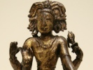

  
[Intangible Textual Heritage](../../index)  [Hinduism](../index) 
[Index](index)  [Next](dast01) 

------------------------------------------------------------------------

  
*Dakshinamurti Stotra*, translated by Alladi Mahadeva Sastri, \[1920\],
at Intangible Textual Heritage

------------------------------------------------------------------------

# DAKSHINAMURTI STOTRA

###### OF

### SRI SANKARACHARYA

###### AND

#### DAKSHINAMURTI UPANISHAD

###### WITH

##### SRI SURESWARACHARYA'S MANASOLLASA

###### AND

#### PRANAVA VARTIKA

#### TEXTS AND TRANSLATION IN ENGLISH

###### BY

## Alladi Mahadeva Sastry

##### WITH THE INTRODUCTORY ESSAY

##### THE VEDANTA DOCTRINE OF SANKARACHARYA

#### Madras: Samata Books

#### \[1920\]

Scanned, proofed and formatted by John Bruno Hare at Intangible Textual
Heritage, March 2009. This text is in the public domain in the US
because it was published prior to 1923.

------------------------------------------------------------------------

[Next: Preface to the First Edition](dast01)
