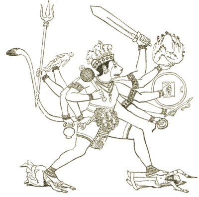

  
[Intangible Textual Heritage](../../index)  [Hinduism](../index) 

------------------------------------------------------------------------

[Buy this Book at
Amazon.com](https://www.amazon.com/exec/obidos/ASIN/B002B55Q4M/internetsacredte)

------------------------------------------------------------------------

<table width="75%">
<colgroup>
<col style="width: 50%" />
<col style="width: 50%" />
</colgroup>
<tbody>
<tr class="odd">
<td width="50%" data-valign="TOP"></td>
<td width="50%" data-valign="CENTER"><h1 id="the-ramayana-and-mahabharata" data-align="CENTER">The Ramayana and Mahabharata</h1>
<h2 id="translated-by-romesh-c.-dutt" data-align="CENTER">translated by Romesh C. Dutt</h2>
<h4 id="section" data-align="CENTER">[1899]</h4></td>
</tr>
</tbody>
</table>

------------------------------------------------------------------------

[Contents](#contents)    [Start Reading](duttintr)    [Text
\[Zipped\]](dutt.txt.gz)

------------------------------------------------------------------------

|                                                                                                                           |
|---------------------------------------------------------------------------------------------------------------------------|
|  |

This is an abridged verse translation of the two longest epic poems in
world literature, the Ramayana and Mahabharata. This translation is
surprisingly readable and very moving once you get used to the rhymed
couplet format. This also serves as an ideal introduction to the
sprawling plots of these epic tales.

A complete Ramayana translation can be found [here](../rama/index), and
a complete Mahabharata translation can be found [here](../maha/index).

------------------------------------------------------------------------

 [Introduction](duttintr)  
[Book I: The Bridal of Sita](rama01)  
[Book II: The Banishment](rama02)  
[Book III: The Death of the King](rama03)  
[Book IV: The Meeting of the Princes](rama04)  
[Book V: On the Banks of the Godavari](rama05)  
[Book VI: Sita Lost](rama06)  
[Book VII: In the Nilgiri Mountains](rama07)  
[Book VIII: Sita Discovered](rama08)  
[Book IX: The Council of War](rama09)  
[Book X: The War in Ceylon](rama10)  
[Book XI: Rama's Return and Consecration](rama11)  
[Book XII: Sacrifice of the Horse](rama12)  
[Conclusion](ramaconc)  
[Epilogue](ramaepi)  
[Book I: The Tournament](maha01)  
[Book II: The Bride's Choice](maha02)  
[Book III: The Imperial Sacrifice](maha03)  
[Book IV: The Fatal Dice](maha04)  
[Book V: Woman's Love](maha05)  
[Book VI: Cattle-Lifting](maha06)  
[Book VII: The Council of War](maha07)  
[Book VIII: Fall of Bhishma](maha08)  
[Book IX: Fall of Drona](maha09)  
[Book X: Fall of Karna](maha10)  
[Book XI: Funeral Rites](maha11)  
[Book XII: Sacrifice of the Horse](maha12)  
[Conclusion](mahaconc)  
[Epilogue](mahaepi)  
[Glossary](duttglos)  
