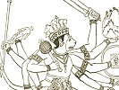

  
[Intangible Textual Heritage](../../index)  [Hinduism](../index) 
[Index](index)  [Previous](maha09)  [Next](maha11) 

------------------------------------------------------------------------

[Buy this Book at
Amazon.com](https://www.amazon.com/exec/obidos/ASIN/B002B55Q4M/internetsacredte)

------------------------------------------------------------------------

  
*The Ramayana and Mahabharata*, by Romesh C. Dutt, \[1899\], at
Intangible Textual Heritage

------------------------------------------------------------------------

# MAHABHARATA BOOK X

# KARNA-BADHA

(Fall of Karna)

KARNA was chosen as the leader of the Kuru forces after the death of
Drona, and held his own for two days. The great contest between Karna
and Arjun, long expected and long deferred, came on at last. It is the
crowning incident of the Indian Epic, as the contest between Hector and
Achilles is the crowning incident of the Iliad. With a truer artistic
skill than that of Homer, the Indian poet represents Karna as equal to
Arjun in strength and skill, and his defeat is only due to an accident.

After the death of Karna, Salya led the Kuru troops on the eighteenth
and last day of the war, and fell. A midnight slaughter in the Pandav
camp, perpetrated by the vengeful son of Drona, concludes the war.
Duryodhan, left wounded by Bhima, heard of the slaughter and died happy.

Books viii., ix., and x. of the original have been abridged in this
Book.

## I

## KARNA AND ARJUN MEET

Sights of red and ghastly carnage day disclosed upon the plain,  
Mighty chiefs and countless warriors round the warlike Drona slain,

Sad Duryodhan gazed in sorrow and the tear was in his eye,  
Till his glances fell on Karna and his warlike heart beat high!

"Karna!" so exclaimed Duryodhan, "hero of resistless might,  
Thou alone canst serve the Kuru in this dread and dubious fight,

Step forth, Kuru's chief and leader, mount thy sounding battle-car,  
Lead the still unconquered Kurus to the trophies of the war!

Matchless was the ancient Bhishma in this famed and warlike land,  
But a weakness for Yudhishthir palsied Bhishma's slaying hand,

Matchless too was doughty Drona in the warrior's skill and art,  
Kindness for his pupil Arjun lurked within the teacher's heart!

Greater than the ancient grandsire, greater than the Brahman old,  
Fiercer in thy deathless hatred, stronger in thy prowess bold,

Peerless Karna, lead us onward to a brighter happier fate,  
For thy arm is nerved to action by an unforgotten hate!

Lead us as the martial SKANDA led the conquering gods of old,  
Smite the foe as angry INDRA smote the Danavs fierce and bold,

As before the light of morning flies the baleful gloom of night,  
Pandavs and the proud Panchalas fly before thy conquering might!

Priests with hymns and chanted mantra and with every sacred rite  
Hailed him Leader of the Kurus, chieftain of unconquered might,

Earthen jars they placed around him with the sacred water full,  
Elephant's tusk they laid beside him and the horn of mighty bull,

Gem and jewel, corn and produce, by the arméd hero laid,  
Silken cloth of finest lustre o'er his crownéd head they spread,

Brahmans poured the holy water, bards his lofty praises sung,  
Kshatras, Vaisyas, purer Sudras hailed him Leader bold and strong!

"Vanquish warlike sons of Pritha! " thus the holy Brahmans blessed,  
Gold and garments, food and cattle, joyous Karna on them pressed,

And the holy rite concluded, Karna ranged his men in war,  
To the dreaded front of battle drove his swift and conquering car!

Morn to noon and noon to evening raged the battle on the plain,  
Countless warriors fought and perished, car-borne chiefs were pierced
and slain,

Helméd Arjun, crownéd Karna, met at last by will of fate,  
Life-long was their mutual anger, deathless was their mutual hate!

And the firm earth shook and trembled 'neath the furious rush of war,  
And the echoing welkin answered shouts that nations heard afar,

And the thickening cloud of arrows filled the firmament on high,  
Darker, deeper, dread and deadlier, grew the angry face of sky,

Till the evening's sable garment mantled o'er the battle-field,  
And the angry rivals parted, neither chief could win or yield!

## II

## FALL OF KARNA

At the break of morning Karna unto Prince Duryodhan went,  
Thus in slow and measured accents to his inner thoughts gave vent:

"Morning dawns, O Kuru's monarch! mighty Arjun shall be slain,  
Or fulfilling warrior's duty Karna dyes the gory plain!

Long through life within our bosoms ever burnt the mutual hate,  
Oft we met and often parted, rescued by the will of fate,

But yon sun with crimson lustre sees us meet to part no more,  
Gallant Arjun's course this evening or proud Karna's shall be o'er,

Room is none for Arjun's glory and for archer Karna's fame,  
One must sink and one must sparkle with a brighter richer flame!

List yet more; in wealth of arrows and in wondrous strength of bow,  
Arjun scarcely me surpasseth, scarcely I excel my foe,

In the light skill of the archer and in sight and truth of aim,  
Arjun beats not, scarcely rivals, Karna's proud and peerless fame!

If his wondrous bow *Gandiva* is the gift of gods in heaven,  
Karna's bow the famed *Vijaya* is by Par'su-Rama given,

Ay, the son of Jamadagni, kings of earth who proudly slayed,  
On the youthful arms of Karna his destructive weapon laid!

Yet I own, O king of Kuru! Arjun doth his foe excel,  
Matchless are his fiery coursers, peerless Krishna leads them well,

Krishna holds the reins for Arjun, Krishna speeds his battle-car,  
Drives the lightning-wingéd coursers o'er the startled field of war,

Sweeps in pride his sounding chariot till it almost seems to fly,  
Arjun lords it o'er the battle like the comet in the sky!

Grant me, monarch, mighty Salya drive my swift and warlike steed,  
And against the car-borne Arjun, Karna's fiery chariot lead,

Salya,too is skilled, like Krishna, with the steed and battle-car,  
Equal thus I meet my foeman in this last and fatal war!"

Spake Duryodhan; warlike Salya mounted Karna's sounding car,  
Karna sought for mighty Arjun in the serried ranks of war:

"Hundred milch-kine Karna offers, costly garment, yellow gold,  
Unto him who in this battle points to me my foeman bold,

Cars and steeds and fertile acres, peaceful hamlets rich and fair,  
Dark-eyed damsels lotus-bosomed, crowned with glossy raven hair,

These are his who points out Arjun hiding from this fatal war,  
Arjun's snowy steeds and banner and his swift and thund'ring car!"

Karna spake, but long and loudly laughed the king of Madra's land,  
As he reined the fiery coursers with his strong and skilful hand,

"Of rewards and gifts," he uttered, "little need is there, I ween,  
Arjun is not wont to tarry from the battle's glorious scene,

Soon will Arjun's snowy coursers shake the battle's startled field,  
Helméd Arjun like a comet gleam with bow and sword and shield!

As the forest-ranging tiger springs upon his fated prey,  
As the homéd bull infuriate doth the weakling cattle slay,

As the fierce and lordly lion smites the timid jungle-deer,  
Arjun soon shall smite thee, Karna, for he knows nor dread nor fear,

Save thee then, O mighty archer I while I drive my sounding car,  
Pandu's son hath met no equal in the valiant art of war!

Darkly frowned the angry Karna, Salya held the loosened rein,  
Dashing through the hostile forces then the warrior sped amain,

Through the serried ranks of battle Karna drove in furious mood,  
Facing him in royal splendour good Yudhishthir fearless stood!

Surging ranks of brave Nishadas closed between and fought in vain,  
Proud Panchalas stout and faithful vainly strove among the slain,

Onward came the fiery Karna like the ocean's heaving swell,  
With the sweeping wrath of tempest on the good Yudhishthir fell!

Wrathful then the son of Pandu marked his noblest chieftains dead,  
And in words of scornful anger thus to archer Karna said:

"Hast thou, Karna, vowed the slaughter of my younger Arjun brave,  
Wilt thou do Duryodhan's mandate, proud Duryodhan's willing slave,

Unfulfilled thy vow remaineth, for the righteous gods ordain,  
By Yudhishthir's hand thou fallest, go and slumber with the slain!"

Fiercely drew his bow Yudhishthir, fiercely was the arrow driven,  
Rocky cliff or solid mountain might the shaft have pierced and riven,

Lightning-like it came on Karna, struck and pierced him on the left,  
And the warrior fell and fainted as of life and sense bereft!

Soon he rose; the cloud of anger darkened o'er his livid face,  
And he drew his godlike weapon with a more than godlike grace,

Arrows keen and dark as midnight gleaming in their lightning flight,  
Struck Yudhishthir's royal armour with a fierce resistless might!

Clanking fell the shattered armour from his person fair and pale,  
As from sun's meridian splendour clouds are drifted by the gale,

Armourless but bright and radiant brave Yudhishthir waged the fight,  
Bright as sky with stars bespangled on a clear and cloudless night,

And he threw his pointed lances like the summer's bursting flood,  
Once again Yudhishthir's weapons drank his fiery foeman's blood!

Pale with anguish, wrathful Karna fiercely turned the tide of war,  
Out Yudhishthir's royal standard, crashed his sumptuous battle-car,

And he urged his gallant coursers till his chariot bounding flew,  
And with more than godlike prowess then his famed Vijaya drew,

Faint Yudhishthir sorely bleeding waged no more the fatal fight,  
Carless, steedless, void of armour, sought his safety in his flight!

"Speed, thou timid man of penance! "thus insulting Karna said,  
"Famed for virtue not for valour! blood of thine I will not shed,

Speed and chant thy wonted mantra, do the rites that sages know,  
Bid the helméd warrior Arjun come and meet his warlike foe!"

To his tent retired Yudhishthir in his wrath and in his shame,  
Spake to Arjun who from battle to his angry elder came:

"Hast thou yet, O tardly Arjun, base insulting Karna slain,  
Karna dealing dire destruction on this battle's reddened plain?

Like his teacher Par'su-Rama dyes in purple blood his course,  
Like a snake of deathful poison Karna guards the Kuru force,

Karna smote my chariot-driver and my standard rent in twain,  
Shattered car and lifeless horses strew the red inglorious plain,

Scarce with life in speechless anguish from the battle-field I fled,  
Scorn of foes and shame of kinsmen! Warrior's fame and honour dead!

Ten long years and three Yudhishthir joy nor peace nor rest hath seen,  
And while Karna lives and glories all our insults still are green,

Hast thou, Arjun, slain that chieftain as in swelling pride he stood,  
Hast thou wiped our wrongs and insults in that chariot-driver's blood?"

"At a distance," Krishna answered, "fiery Arjun fought his way,  
Now he seeks the archer Karna and he vows his death to-day."

Anger lit Yudhishthir's forehead and a tremor shook his frame,  
As he spake to silent Arjun words of insult and of shame:

"Wherefore like a painted warrior doth the helméd Arjun stand,  
Wherefore useless lies Gandiva in his weak and nerveless hand,

Wherefore hangs yon mighty sabre from his belt of silk and gold,  
Wherefore doth the peerless Krishna drive his coursers fleet and bold,

If afar from war's arena timid Arjun seeks to hide,  
If he shuns the mighty Karna battling in unconquered pride?

Arjun! yield thy famed *Gandiva* unto worthier hands than thine,  
On some braver, truer warrior let thy mighty standard shine,

Yield thy helmet and thy armour, yield thy gleaming sword and shield,  
Hide thee from this deathful battle, matchless Karna rules the field!"

Sparkled Arjun's eye in anger with a red and livid flame,  
And the tempest of his passion shook his more than mortal frame.

Heedless, on the sword-hilt Arjun placed his swift and trembling hand,  
Heedless, with a warrior's instinct drew the dark and glistening brand!

Sacred blood of king and elder would have stained his trenchant steel,  
But the wise and noble Krishna strove the fatal feud to heal:

"Not before thy elder, Arjun, but in yonder purple field,  
'Gainst thy rival and thy foeman use thy warlike sword and shield,

Render honour to thy elder, quench thy hasty impious wrath,  
Render faith to holy *sastra*, leave not virtue's sacred path,

Bow before thy virtuous elder as before the gods in heaven,  
Sheathe thy sword and quell thy passion, be thy hasty sin forgiven!

Duteous Arjun silent listened and obeyed the mandate high,  
Tears of manly sorrow trickled from his soft and altered eye,

Dear in joy and dear in suffering, calm his righteous elder stood,  
Dear in Indra-prastha's mansions, dearer in the jungle wood!

Arjun sheathed his flashing sabre, joined his hands and hung his head,  
Fixed his eye on good Yudhishthir and in humble accents said:

"Pardon, great and saintly monarch, vassal's disrespectful word,  
Pardon, elder, if a younger heedless drew his sinful sword,

But thy best to yield my weapon stung my soul to bitter strife,  
Dearer is the bow *Gandiva* unto Arjun than his life,

Pardon if the blood of anger mantled o'er this rugged brow,  
Pardon if I drew my sabre 'gainst my duty and my vow,

For that hasty act repenting Arjun bows thy heart to move  
Grant me, holy king and elder, monarch's grace and brother's love!"

From Yudhishthir's altered eyelids gentle tears of sorrow start,  
And he lifts his younger brother to his ever-loving heart:

"Arjun, I have wronged thee brother, and no fault or sin is thine,  
Hasty words of thoughtless anger 'scaped these sinful lips of mine,

Bitter was my shame and anguish when from Karna's car I fled,  
Redder than my bleeding bosom warrior's fame and honour bled,

Hasty words I uttered, Arjun, by my pain and anguish driven,  
Wipe them with a brother's kindness, be thy elder's sin forgiven!"

Stronger by his elder's blessing Arjun mounts the battle-car,  
Krishna drives the milk-white coursers to the thickening ranks of war.

Onward came the fiery Karna with his chiefs and arméd men,  
Salya urged his flying coursers with the whip and loosened rein,

Often met and often parted, life-long rivals in their fame,  
Not to part again the heroes, each before the other came,

Not to part until a chieftain by the other chief was slain,  
Arjun dead or lifeless Karna, pressed the Kuru-kshetra plain!

Long they strove, but neither archer could his gallant foeman beat,  
Though like surging ocean billows did the angry warriors meet,

Arjun's arrows fell on Karna like the summer's angry flood,  
Karna's shafts like hissing serpents drank the valiant Arjun's blood,

Fierce and quick from his Gandiva angry accents Arjun woke,  
Till the bow-string strained and heated was by sudden impulse broke!

"Hold," cried Arjun to his rival, "mind the honoured rules of war,  
Warriors strike not helpless foemen thus disabled on the car,

Hold, brave Karna, until Arjun mends his over-strainéd bow,  
Arjun then will crave for mercy nor from god nor mortal foe!"

Vain he spake, for wild with anger heedless Karna, fiercely lowered,  
Thick and fast on bowless Arjun countless arrows darkly showered,

Like the cobra dark and hissing Karna's gleaming lightning dart,  
Struck the helpless archer Arjun on his broad and bleeding heart!

Furious like a wounded tiger quivering in the darksome wood,  
With his mended warlike weapon now the angry Arjun stood,

Blazing with a mighty radiance like a flame in summer night,  
Fierce he fell on archer Karna with his more than mortal might!

Little recked the dauntless Karna if his foe in anger rose,  
Karna feared not face of mortal, dreaded not immortal foes,

Nor with all his wrath and valour Arjun conquered him in war,  
Till within the soft earth sinking stuck the wheel of Karna's car!

Stood unmoved the tilted chariot, vainly wrathful Salya strove,  
Urging still the struggling coursers Karna's heavy car to move,

Vainly too the gallant Karna leaped upon the humid soil,  
Sought to lift the sunken axle with a hard unwonted toil,

"Hold," he cried to noble Arjun, "wage no false and impious war  
On a foeman, helpless, carless,--thou upon thy lofty car."

Loudly laughed the helméd Arjun, answer nor rejoinder gave,  
Unto Karna pleading virtue Krishna answered calm and grave:

"Didst thou seek the path of virtue, mighty Karna, archer bold,  
When Sakuni robbed Yudhishthir of his empire and his gold,

Didst thou tread the path of honour on Yudhishthir's fatal fall,  
Heaping insults on Draupadi in Hastina's council hall?

Didst thou then fulfil thy duty when, Yudhishthir's exile crost,  
Krishna asked in right and justice for Yudhishthir's empire lost,

Didst thou fight a holy battle when with six marauders skilled,  
Karna hunted Abhimanyu and the youthful hero killed?

Speak not then of rules of honour, blackened in your sins you die,  
Death is come in shape of Arjun, Karna's fatal hour is nigh!

Stung to fury and to madness, faint but frantic Karna fought,  
Reckless, ruthless, and relentless, valiant Arjun's life he sought,

Sent his last resistless arrow on his foeman's mighty chest,  
Arjun felt a shock of thunder on his broad and mailéd breast!

Fainting fell the bleeding Arjun, darkness dimmed his manly eye,  
Pale and breathless watched his warriors, anxious watched the gods in
sky,

Then it passed, and helméd Arjun rose like newly lighted fire,  
Abhimanyu's sad remembrance kindled fresh a father's ire!

And he drew his bow *Gandiva*, aimed his dart with stifled breath,  
Vengeance for his murdered hero winged the fatal dart of death,

Like the fiery bolt of lightning Arjun's lurid arrow sped,  
Like a rock by thunder riven Karna fell among the dead!

## III

## FALL OF SALYA

Darkly closed the shades of midnight, Karna still and lifeless lay,  
Ghast and Pale o'er slaughtered thousands fell the morning's sickly ray,

Bowman brave and proud preceptor Kripa to Duryodhan said,  
Tear bedimmed the warrior's eyelids and his manly bosom bled:

"Leaderless are Koru's forces by a dire misfortune crost,  
Like the moonless shades of midnight in their utter darkness lost,

Like a summer-driéd river, weary waste of and sand,  
Lost its pride of fresh'ning waters sweeping o'er the grateful land!

As a spark of fire consumeth summer's parched and sapless wood,  
Kuru's lordless, lifeless forces shall be angry Arjun's food,

Bhima too shall seek fulfilment of the dreadful vow he made,  
Brave Satyaki wreak his vengeance for his sons untimely slayed!

Bid this battle cease, Duryodhan, pale and fitful is thy star,  
Blood enough of friendly nations soaks this crimson field of war,

Bid them live,--the few survivors of a vast and countless host,  
Let thy few remaining brothers live,--for many are the lost,

Kindly heart hath good Yudhishthir, still he seeks for rightful peace,  
Render back his ancient kingdom, bid this war of kinsmen cease!"

"Kripa," so Duryodhan answered, "in this sad and fatal strife,  
Ever foremost of our warriors, ever careless of thy life,

Ever in the council chamber thou hast words of wisdom said,  
Needless war and dire destruction by thy peaceful counsel stayed,

Every word thou speakest, Kripa, is a word of truth and weight.  
Nathless thy advice for concord, wise preceptor, comes too late!

Hope not that the good Yudhishthir will again our friendship own  
Cheated once by deep Sakuni of his kingdom and his throne,

Rugged Bhima will not palter, fatal is the vow he made,  
Vengeful Arjun will not pardon gallant Abhimanyu dead!

Fair Draupadi doth her penance, so our ancient matrons say,  
In our blood to wash her insult and her proud insulters slay,

Fair Subhadra morn and evening weeps her dear departed son,  
Feeds Draupadi's deathless anger for the hero dead and gone,

Deeply in their bosoms rankle wrongs and insults we have given,  
Blood alone can wash it, Kripa, such the cruel will of Heaven!

And the hour for peace is over, for our best sleep on the plain,  
Brothers, kinsmen, friends, and elders slumber with the countless slain,

Shall Duryodhan like a recreant now avoid the deathful strife,  
After all his bravest warriors have in war surrendered life,

Shall he, sending them to slaughter, now survive and learn to flee,  
Shall he, ruler over monarchs, learn to bend the servile knee?

Proud Duryodhan sues no favour even with his dying breath,  
Unsubdued and still unconquered, changeless even unto death,

Salya valiant king of Madra. leads our arméd hosts to-day,  
Or to perish or to conquer, gallant Kripa, lead the way!"

Meanwhile round the brave Yudhishthir calmly stood the Pandav force,  
As the final day of battle now began its fatal course,

"Brothers, kinsmen, hero-warriors," so the good Yudhishthir said,  
"Ye have done your share in battle, witness countless foemen dead

Sad Yudhishthir is your eldest, let him end this fatal strife,  
Slay the last of Kuru chieftains or surrender throne and life!

Bold Satyaki ever faithful with his arms protects my right,  
Drupad's son with watchful valour guards my left with wonted might.

In the front doth Bhima battle, careful Arjun guards the rear,  
I will lead the battle's centre which shall know nor flight nor fear!"

Truly on that fatal morning brave Yudhishthir kept his word,  
Long and fiercely waged the combat with fair Madra's valiant lord,

Thick and fast the arrows whistled and the lances pointed well,  
Till with crashing sound of thunder Salya's mighty standard fell!

Rescued by the son of Drona, Salya rushed again to war,  
Slew the noble milk-white coursers of Yudhishthir's royal car,

And as springs the hungry lion on the spotted jungle-deer,  
Salya rushed upon Yudhishthir reckless and unknown to fear!

Brave Yudhishthir marked him coming and he hurled his fatal dart,  
Like the fatal curse of Brahman sank the weapon in his heart,

Blood suffused his eye and nostril, quivered still his feeble hand,  
Like a cliff by thunder riven Salya fell and shook the land!

Ended was the fatal battle, for the *Mlechcha* king was slain,  
Pierced by angry Sahadeva false Sakuni pressed the plain,

All the brothers of Duryodhan tiger-waisted Bhima slew,  
Proud Duryodhan pale and panting from the field of battle flew!

## IV

## NIGHT OF SLAUGHTER: DURYODHAN'S DEATH

Far from battle's toil and slaughter, by a dark and limpid lake,  
Sad and slow and faint Duryodhan did his humble shelter take,

But the valiant sons of Pandu with the hunter's watchful care,  
Thither tracked their fallen foeman like a wild beast in its lair!

"Gods be witness," said Duryodhan, flaming in his shame and wrath,  
"Boy to manhood ever hating we have crossed each other's path,

Now we meet to part no longer, proud Duryodhan fights you all,  
Perish he, or sons of Pandu, may this evening see your fall!"

Bhima answered: "For the insults long endured but not forgiven,  
Me alone you fight, Duryodhan, witness righteous gods in heaven,

Call to mind the dark destruction planned of old in fiendish ire,  
In the halls of Varnavata to consume us in the fire,

Call to mind the scheme deceitful, deep Sakuni's dark device,  
Cheating us of fame and empire by the trick of loaded dice,

Call to mind that coward insult and the outrage foul and keen,  
Flung on Drupad's saintly daughter and our noble spotless queen,

Call to mind the stainless Bhishma for thy sins and folly slain,  
Lifeless proud preceptor Drona, Karna lifeless on the plain,

Perish in thy sins, Duryodhan, perish too thy hated name,  
And thy dark life crime-polluted ends, Duryodhan, in thy shame!"

Like two bulls that fight in fury blind with wounds and oozing blood,  
Like two wild and warring tuskers shaking all the echoing wood,

Me the thunder-wielding INDRA, YAMA monarch of the dead,  
Dauntless Bhima and Duryodhan fiercely strove and fought and bled!

Sparks of fire shot from their maces and their faces ran with blood,  
Neither won and neither yielded, matched in strength the rivals stood,

Till his vow remembered Bhima, and he raised his weapon high,  
With a foul attack but fatal broke Duryodhan's shattered knee!

Through the sky a voice resounded as the great Duryodhan fell,  
And the earth the voice re-echoed o'er her distant hill and dale,

Beasts and birds in consternation flew o'er land and azure sky,  
Men below and heavenly *Siddhas* trembled at the fatal cry!

Darkness fell upon the battle, proud Duryodhan dying lay,  
But the slaughter of the combat closed not with the closing day,

Ancient feud and hatred linger after battle's sweeping flood,  
And the father's deathless anger courseth in the children's blood,

Drona slept and gallant Drupad, for their earthly task was done,  
Vengeance fired the son of Drona 'gainst the royal Drupad's son!

Sable shadows of the midnight fell o'er battle's silent plain,  
Faintly shone the fitful planets on the dying and the slain,

And the vengeful son of Drona fired by omens dark and dread,  
Stole into the tents of foemen with a soft and noiseless tread!

Dhrista-dyumna and Sikhandin, princes of Panchala's land,  
Fell beneath the proud avenger Aswa-thaman's reeking hand,

Ay, where Drupad's sleeping grandsons, fair Draupadi's children lay,  
Stole the cruel arm of vengeance, smothered them ere dawn of day!

Done the ghastly work of slaughter, Aswa-thaman bent his way  
Where beside the limpid waters lone Duryodhan dying lay,

And Duryodhan blessed the hero with his feeble fleeting breath,  
Joy of vengeance cheered his bosom and he died a happy death!

------------------------------------------------------------------------

[Next: Book XI: Funeral Rites](maha11)
