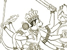

  
[Intangible Textual Heritage](../../index)  [Hinduism](../index) 
[Index](index)  [Previous](rama07)  [Next](rama09) 

------------------------------------------------------------------------

[Buy this Book at
Amazon.com](https://www.amazon.com/exec/obidos/ASIN/B002B55Q4M/internetsacredte)

------------------------------------------------------------------------

  
*The Ramayana and Mahabharata*, by Romesh C. Dutt, \[1899\], at
Intangible Textual Heritage

------------------------------------------------------------------------

# RAMAYANA BOOK VIII

# SITA-SANDESA

(Sita Discovered)

Among the many chiefs sent by Sugriva in different directions in search
of Sita, Hanuman succeeded in the quest and discovered Sita in Ceylon.
Ceylon is separated from India by a broad channel of the sea, and
Hanuman leaped, or rather flew through the air, across the channel, and
lighted on the island. Sita, scorning the proposals of Ravan, was kept
in confinement in a garden of Asoka trees, surrounded by a terrible
guard of Raksha females; and in this hard confinement she remained true
and faithful to her lord. Hanuman gave her a token from Rama, and
carried back to Rama a token which she sent of her undying affection and
truth.

The portions translated in this Book form the whole of the main portions
of Sections xv., xxxi., xxxvi., and lxvi, of Book v. of the original
text.

## I

## SITA IN THE ASOKA GARDEN

Crossed the ocean's boundless waters, Hanuman in duty brave,  
Lighted on the emerald island girded by the sapphire wave,

And in tireless quest of Sita searched the margin of the sea,  
In a dark Asoka garden hid himself within a tree.

Creepers threw their clasping tendrils round the trees of ample
height,  
Stately palm and feathered cocoa, fruit and blossom pleased the sight,

Herds of tame and gentle creatures in the grassy meadow strayed,  
*Kokils* sang in leafy thicket, birds of plumage lit the shade,

Limpid lakes of scented lotus with their fragrance filled the air,  
Homes and huts of rustic beauty peeped through bushes green and fair,

Blossoms rich in tint and fragrance in the checkered shadow gleamed,  
Clustering fruits of golden beauty in the yellow sunlight beamed!

Brightly shone the red *Asoka* with the morning's golden ray,  
*Karnikara* and *Kinsuka* dazzling as the light of day,

Brightly grew the flower of *Champak* in the vale and on the reef,  
*Punnaga* and *Saptaparna* with its seven-fold scented leaf,

Rich in blossoms many tinted, grateful to the ravished eye,  
Gay and green and glorious Kanka was like garden of the sky,

Rich in fruit and laden creeper and in beauteous bush and trep.  
Flower-bespangled golden Lanka was like gem-bespangled sea!

Rose a palace in the woodlands girt by pillars strong and high.  
Snowy-white like fair Kailasa cleaving through the azure sky,

And its steps were ocean coral and its pavement yellow gold.  
White and gay and heaven-aspiring rose the structure high and bold!

By the rich and royal mansion Hanuman his eyes did rest,  
On a woman sad and sorrowing in her sylvan garments drest,

Like the moon obscured and clouded, dim with shadows deep and dark,  
Like the smoke-enshrouded red fire, dying with a feeble spark,

Like the tempest-pelted lotus by the wind and torrent shaken,  
Like the beauteous star Rohini by a *graha* overtaken!

Fasts and vigils paled her beauty, tears bedimmed her tender grace,  
Anguish dwelt within her bosom, sorrow darkened on her face,

And she lived by Rakshas guarded, as a faint and timid deer,  
Severed from her herd and kindred when the prowling wolves are near,

And her raven locks ungathered hung behind in single braid,  
And her gentle eye was lightless, and her brow was hid in shade!

"This is she! the peerless princess, Rama's consort loved and lost,  
This is she! the saintly Sita, by a cruel fortune crost,"

Hanuman thus thought and pondered: "On her graceful form I spy,  
Gems and gold by sorrowing Rama oft depicted with it sigh,

On her ears the golden pendants and the tiger's sharpened tooth,  
On her arms the jewelled bracelets, tokens of unchanging truth,

On her pallid brow and bosom still the radiant jewels shine,  
Rama with a sweet affection did in early days entwine!

Hermit's garments clothe her person, braided is her raven hair,  
Matted bark of trees of forest drape her neck and bosom fair,

And a dower of dazzling beauty still bedecks her peerless face.  
Though the shadowing tinge of sorrow darkens all her earlier grace!

This is she! the soft-eyed Sita, wept with unavailing tear,  
This is she! the faithful consort, unto Rama ever dear,

Unforgetting and unchanging, truthful still in deed and word,  
Sita, in her silent suffering sorrows for her absent lord,

Still for Rama lost but cherished, Sita heaves the choking sigh,  
Sita lives for righteous Rama, for her Rama she would die!"

## II

## THE VOICE OF HOPE

Hanuman from leafy shelters lifts his voice in sacred song,  
Till the tale of Rama's glory Lanka's woods and vales prolong:

"Listen, Lady, to my story;--Dasa-ratha famed in war,  
Rich in steeds and royal tuskers, arméd men and battle car,

Ruled his realm in truth and virtue, in his bounty ever free,  
Of the mighty race of Raghu mightiest king and monarch he,

Robed in every royal virtue, great in peace in battle brave,  
Blest in bliss of grateful nations, blest in blessings which he gave

And his eldest-born and dearest, Rama soul of righteous might,  
Shone, as mid the stars resplendent shines the radiant Lord of Night,

True unto his sacred duty, true unto his kith and kin,  
Friend of piety and virtue, punisher of crime and sin,

Loved in all his spacious empire, peopled mart and hermit's den,  
With a truer deeper kindness Rama loved his subject men!

Dasa-ratha, promise-fettered, then his cruel mandate gave,  
Rama with his wife and brother lived in woods and rocky cave,

And he slayed the deer of jungle and he slept in leafy shade,  
Stem destroyer of the Rakshas in the pathless forests strayed,

Till the monarch of the Rakshas,-fraudful is his impious life,  
Cheated Rama in the jungle, from his cottage stole his wife

Long lamenting lone and weary Rama wandered in the wood,  
Searched for Sita, in the jungle where his humble cottage stood,

Godavari's gloomy gorges, Krishna's dark and wooded shore,  
And the ravine, rock and valley, and the cloud-capped mountain hoar!

Then he met the sad Sugriva in wild Malya's dark retreat,  
Won for him his father's empire and his father's royal seat,

Now Sagriva's countless forces wander far and wander near,  
In the search of stolen Sita still unto his Rama dear!

I am henchman of Sugriva and the mighty sea have crost,  
In the quest of hidden Sita, Rama's consort loved and lost,

And methinks that form of beauty, peerless shape of woman's grace,  
Is my Rama's dear-loved consort, Rama's dear-remembered face!"

Hushed the voice: the ravished Sita cast her wond'ring eyes around,  
Whence that song of sudden gladness, whence that soul-entrancing sound?

Dawning hope and rising rapture overflowed her widowed heart,  
Is it dream's deceitful whisper which the cruel Fates impart?

## III

## RAMA'S TOKEN

"'Tis no dream's deceitful whisper!" Hantiman spake to the dame,  
As from darksome leafy shelter he to Rama's consort came,

"Rama's messenger and vassal, token from thy lord I bring,  
Mark this bright ring, jewel-lettered with the dear name of thy king,

For the loved and cherished Sita, is to Rama ever dear,  
And he sends his loving message and his force is drawing near!

Sita, held that tender token from her loved and cherished lord,  
And once more herself she fancied to his loving arms restored,

And her pallid face was lighted and her soft eve sent a spark,  
As the Moon regains her lustre freed from *Rahu's* shadows dark!

And with voice of deep emotion in each softly whispered word,  
Spake her thoughts in gentle accents of her consort and her lord:

"Messenger of love of Rama! Dauntless is thy deed and bold,  
Thou hast crossed the boundless ocean to the Raksha's castled hold,

Thou hast crossed the angry billows which confess no monarch's sway,  
O'er the face of rolling waters found thy unresisted way,

Thou hast done what living mortal never sought to do before,  
Dared the Raksha in his island, Ravan in his sea-girt shore!

Speak, if Rama lives in safety in the woods or by the hill,  
And if young and gallant Lakshman faithful serves his brother still,

Speak, if Rama in his anger and his unforgiving ire,  
Hurls destruction on my captor like the world-consuming fire,

Speak, if Rama in his sorrow wets his pale and drooping eye,  
If the thought of absent Sita wakes within his heart a sigh!

Doth my husband seek alliance with each wild and warlike chief,  
Striving for a speedy vengeance and for Sita's quick relief,

Doth he stir the warlike races to a fierce and veng-eful strife,  
Dealing death to ruthless Rakshas for this insult on his wife,

Doth he still in fond remembrance cherish Sita loved of yore,  
Nursing in his hero-bosom tender sorrows evermore!

Didst thou hear from far Ayodhya, from Kausalya royal dame,  
From the true and tender Bharat prince of proud and peerless fame,

Didst thou hear if royal Bharat leads his forces to the fight,  
Conquering Ravan's scattered army in his all-resistless might,

Didst thou hear if brave Sugriva marshals Vanars in his wrath  
And the young and gallant Lakshman seeks to cross the ocean path?"

Hanuman with due obeisance placed his hand upon his head,  
Bowed unto the queenly Sita and in gentle accents said:

"Trust me, Lady, valiant Rama soon will greet his saintly wife,  
E'en as INDRA greets his goddess, SACHI dearer than his life,

Trust me, Sita, conquering Rama comes with panoply of war,  
Shaking Lanka's sea-girt mountains . slaying Rakshas near and far!

He shall cross the boundless ocean with the battle's dread array,  
He shall smite the impious Ravan and the cruel Rakshas slay,

Mighty Gods and strong Asuras shall not hinder Rama's path,  
When at Lanka's gates he thunders with his more than godlike wrath,

Deadly YAMA, all-destroying, pales before his peerless might  
When his red right arm of vengeance wrathful Rama lifts to smite!

By the lofty Mandar mountains, by the fruit and root I seek,  
By the cloud-obstructing Vindhyas, and by Malya's towering peak,

I will swear, my gentle Lady, Rama's vengeance draweth nigh,  
Thou shalt see his beaming visage like the Lord of Midnight Sky,

Firm in purpose Rama waiteth on the Prasra-vana hill,  
As upon the huge Airavat, INDRA, motionless and still!

Flesh of deer nor forest honey tasteth Rama true and bold,  
Till he rescues cherished Sita from the Raksha's castled hold,

Thoughts of Sita leave not Rama dreary day or darksome night,  
Till his vengeance deep and dreadful crushes Ravan in his might,

Forest flower nor scented creeper pleases Rama's anguished heart,  
Till he, wins his wedded consort by his death-compelling dart!"

## IV

## SITA'S TOKEN

Token from her raven tresses Sita to the Vanar gave,  
Hanuman with dauntless valour crossed once more the ocean wave,

Where in Prasra-vana's mountain Rama with his brother stayed,  
Jewel from the brow of Sita by her sorrowing consort laid,

Spake of Ravan's foul endearment and his loathsome loving word,  
Spake of Sita's scorn and anger and her truth unto her lord,

Tears of sorrow and affection from the warrior's eyelids start,  
As his consort's loving token Rama presses to his heart!

"As the mother-cow, Sugriva, yields her milk beside her young,  
Welling tears upon this token yields my heart by anguish wrung,

Well I know this dear-loved jewel sparkling with the ray of heaven,  
Born in sea, by mighty INDRA to my Sita's father given,

Well I know this tender token, Janak placed it on her hair,  
When she came my bride and consort decked in beauty rich and rare,

Well I know this sweet memorial, Sita wore it on her head,  
And her proud and peerless beauty on the gem a lustre shed!

Ah, methink the gracious Janak stands again before my eye,  
With a father's fond affection, with a monarch's stature high,

Ah, methinks my bride and consort, she who wore it on her brow,  
Stands again before the altar, speaks again her loving row,

Ah, the sad, the sweet remembrance! ah, the happy days gone by,  
Once again, O loving vision, wilt thou gladden Rama's eye!

Speak again, my faithful vassal, how my Sita wept and prayed,  
Like the water to the thirsty, dear to me what Sita said,

Did she send this sweet remembrance as a blessing from above,  
As a true and tender token of a woman's changeless love,

Did she waft her heart's affection o'er the billows of the sea,  
Wherefore came she not in person from her foes and fetters free?

llanuman, iny friend and comrade, lead me to the distant isle,  
Where my soft-eyed Sita lingers midst the Rakshas dark and vile,

Where my true and tender consort like a lone and stricken deer,  
Girt by Rakshas stern and ruthless sheds the unavailing tear,

Where she weeps in ceaseless anguish, sorrow-stricken, sad and pale,  
Like the Moon by dark clouds shrouded then her light and lustre fail!

Speak again, my faithful henchman, loving message of my wife,  
Like some potent drug her accents renovate my fainting life,

Arm thy forces, friend Sugriva, Rama shall not brook delay,  
While in distant Lanka's confines Sita weeps the livelong day,

Marshal forth thy bannered forces, cross the ocean in thy might  
Rama speeds on wings of vengeance Lanka's impious lord to smite!"

------------------------------------------------------------------------

[Next: Book IX: The Council of War](rama09)
