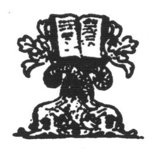

  
[Intangible Textual Heritage](../../index)  [Hinduism](../index) 
[Index](index)  [Next](ftu01) 

------------------------------------------------------------------------

  
*From the Upanishads*, by Charles Johnston, \[1899\], at Intangible
Textual Heritage

------------------------------------------------------------------------

p. i

From the Upanishads

p. ii

Wilt thou not ope thy heart to know  
What rainbows teach, and sunsets show?  
Verdict which accumulates  
From lengthening scroll of human fates,  
Voice of earth to earth returned,  
Prayers of saints that inly burned,—  
Saying, *What is excellent;  
As God lives, is permanent  
Hearts are dust, Hearts’ loves remain;  
Heart's love will meet thee again*.  
      .      .      .      .  
House and tenant go to ground,  
Lost in God, in Godhead found.

p. iii

# FROM THE UPANISHADS

##### BY

## CHARLES JOHNSTON

 

#### Portland, Maine

#### Thomas R. Mosher

#### \[1899\]

Scanned, proofed and formatted at Intangible Textual Heritage, May 2009.
This text is in the public domain in the US because it was published
prior to 1923.

R. W. EMERSON.

p. iv

*Copyright  
Thomas B. Mosher  
1897*

------------------------------------------------------------------------

[Next: Contents](ftu01)
