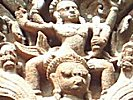

  
[Intangible Textual Heritage](../../index)  [Hinduism](../index) 
[Index](index)  [Previous](gpu06)  [Next](gpu08) 

------------------------------------------------------------------------

[Buy this Book on
Kindle](https://www.amazon.com/exec/obidos/ASIN/B002L16PNW/internetsacredte)

------------------------------------------------------------------------

  
*The Garuda Purana*, by Ernest Wood and S.V. Subrahmanyam, \[1911\], at
Intangible Textual Heritage

------------------------------------------------------------------------

p. 38

### CHAPTER V

#### An Account of the Signs of Sins.

1\. Garuḍa said: Tell me, O Keśava, by what sins particular signs are
produced, and to what sorts of birth such sins lead?

2\. The Blessed Lord said: The sins on account of which the sinful
returning from hell come to particular births, and the signs produced by
particular sins,--these hear from me.

3\. The murderer of a Brāhmaṇ becomes consumptive, the killer of a cow
becomes hump-backed and imbecile, the murderer of a virgin becomes
leprous,--all three born as outcastes.

4\. The slayer of a woman and the destroyer of embryos becomes a savage
full of diseases; who commits illicit intercourse, a eunuch; who goes
with his teacher's wife, diseased-skinned.

5\. The eater of flesh becomes very red; the drinker of intoxicants, one
with discoloured teeth; the Brāhmaṇ who, on account of greed, eats what
should not be eaten, becomes big-bellied.

6\. He who eats sweet foods, without giving to others, becomes
swollen-necked; who gives impure food at a Śrāddha ceremony is born a
spotted leper.

7\. The man who, through pride, insults his teacher, becomes an

p. 39

epileptic; who despises the Vedas and the Śāstras certainly becomes
jaundiced.

8\. Who bears false witness becomes dumb; who breaks the meal-row [1](#fn_54) becomes one-eyed; who interferes with
marriage becomes lipless; who steals a book-is born blind.

9\. Who strikes a cow or a Brāhmaṇ with his foot is born lame and
deformed; who speaks lies becomes a stammerer, and who listens to them
becomes deaf.

10\. A poisoner becomes insane; an incendiary becomes bald; who sells
flesh becomes unlucky; who eats fled of other beings becomes diseased.

11\. Who steals jewels is born in a low caste; who steals gold gets
diseased nails; who steals any metal becomes poverty-stricken.

12\. Who steals food becomes a rat; who steals grain becomes a locust;
who steals water becomes a Chātaka-bird [2](#fn_55); and who steals poison, a scorpion.

13\. Who steals vegetables and leaves becomes a peacock; perfumes, a
musk-rat; honey, a gad-fly; flesh, a vulture; and salt, an ant.

14\. Who steals betel, fruits and flowers becomes a forest-monkey; who
steal shoes, grass and cotton are born from sheeps' wombs.

p. 40

15\. Who lives by violence, who robs caravans on the road, and who is
fond of hunting, certainly becomes a goat in a butcher's house.

16\. Who dies by drinking poison becomes a black serpent on a mountain;
whose feature is unrestrained becomes an elephant in a desolate forest.

17\. Those twice-born who do not make offering to the World-deities, and
who eat all foods without consideration, become tigers in a desolate
forest.

18\. The Brāhmiṇ who does not recite the Gāyatrī [1](#fn_56), who does not meditate at twilight, who is
inwardly wicked while outwardly pious, becomes a crane.

19\. The Brāhmiṇ who officiates for one unfit to perform sacrifice
becomes a village hog, and by too many sacrifices he becomes an ass; by
eating without grace, a crow.

20\. The twice-born who does not impart learning to the deserving
becomes a bull; the pupil who does not serve his teacher becomes an
animal,--an ass or a cow.

21\. Who threatens and spits at his teacher, or browbeats a Brāhmaṇ, is
born as a Brāhmiṇ-fiend in a waterless wilderness.

22\. Who does not give to a twice-born according to his promise becomes
a jackal; who is not hospitable to the goody becomes a howling
Fire-face. [2](#fn_57)

p. 41

23\. Who deceives a friend becomes a mountain-vulture; who cheats in
selling, an owl; who speaks ill of caste and order is born a pigeon in a
wood.

24\. Who destroys hopes and who destroys affection, who through dislike
abandons his wife, becomes a ruddy goose for a long time.

25\. Who hates mother, father and teacher, who quarrels with sister and
brother, is destroyed when an embryo in the womb, even for a thousand
births.

26\. The woman who abuses her mother-in-law and father-in-law, and
causes constant quarrels; becomes a leech; and she who scolds her
husband becomes a louse.

27\. Who, abandoning her own husband, runs after another man, becomes a
flying-fox, a house-lizard, or a kind of female serpent.

28\. He who cuts off his lineage, by embracing a woman of his own
family, having become a hyena and a porcupine, is born from the womb of
a bear.

29\. The lustful man who goes with a female ascetic becomes a desert
fiend; who consorts with an immature girl becomes a huge snake in a
wood.

30\. Who covets his teacher's wife, becomes a chameleon; who goes with
the king's wife becomes corrupt; and with his friend's wife, a donkey.

p. 42

31\. Who commits unnatural vice becomes a village pig; who consorts with
a Śūdra woman becomes bull; who is passionate becomes a lustful horse.

32-33. Who feeds upon the eleventh-day offerings to the dead is born a
dog. The devalaka is born from the womb of a hen.

The wretch among twice-born who worships the deities for the sake of
wealth is called a devalaka and is unfit to offer oblations to ale
deities and forefathers.

34\. Those who are very sinful, having passed through dreadful hells
produced by their great sins, are born here upon the exhaustion of their
karma.

35\. The murderer of a Brāhmaṇ goes into the womb of an ass, a camel and
a she-buffalo; a drinker of intoxicants enters the wombs of a wolf, a
dog and a jackal.

36\. The stealer of gold attains the condition of a worm, an insect and
a bird. Who goes with his teacher's wife, goes to the condition of
grass, bushes and plants.

37\. Who steals another's wife, who misappropriates deposits, who robs a
Brāhmiṇ, is born as a Brāhmiṇ-fiend.

p. 43

38-40. The Brāhmiṇ's possessions acquired by deception, enjoyed even in
friendship, afflict the family even for seven generations,--and by
forcible robbery even as long as the moon and stars exist:

A man may digest even iron filings, powdered stone, and poison; but
where is the person in the three worlds who can digest a Brāhmiṇ's
wealth!

Chariots and troops supported by the wealth of a Brāhmiṇ crumble away in
battle like artificial river-banks of sand.

41-43. By appropriating temple property, by taking a Brāhmiṇ's
possessions, and by neglecting Brāhmiṇs, families become broken up.

He is called a neglector who, instead of making a gift to one who is
well-read in the Vedas and Śāstras and has resorted to him, gives it to
some other,

But it is no neglect if the Brāhmiṇ is without Veda-knowledge; it would
be like offering to ashes instead of to the blazing fire near by.

44\. Having neglected, O Tārkṣya, and having experienced the results in
the successive hells, he is born blind and in poverty, becoming not a
giver but a beggar.

45\. Who takes away a plot of land, which was given by himself for
another, is born for sixty thousand years as a worm in excrement.

46\. The sinner who takes back by force what has been given by himself,
goes into hell until the coming of the deluge.

p. 44

47\. Having given the means of subsistence and a piece of land, he
should then protect it firmly. Who does not protect, but robs, is born
as a lame dog.

48\. Who gives the means of support to Brāhmiṇs obtains fruit equal to
that of a lakh of cows; who robs Brāhmiṇs of their means of sup port
becomes an ape, a dog and a monkey.

49\. These and other signs and births, O Lord of Birds, are seen to be
the karma of the embodied, made by themselves in this world.

50\. Thus the makers of bad karma, having experienced the tortures mf
hell, are born with the residues of their sins, in these stated forms.

51\. Then, obtaining for thousands of lives the bodies of animals, they
suffer from carrying burdens and other miseries.

52\. Having experienced as a bird the misery of cold, rain and heat, he
afterwards reaches the human state, when the good and evil are balanced.

53\. Man and woman having come together, he becomes an embryo in due
course. Having suffered the miseries from conception onwards to death,
he again dies.

54\. Birth and death are the lot of all embodied beings; thus turns the
wheel in the four kingdoms of beings.

55\. As the wheel of time turns, so mortals revolve by my magic. They
revolve at one time of earth, at another in hell, held fast by the noose
of karma.

p. 45

56\. He who does not mike gifts becomes poverty--stricken and through
poverty he commits sin; by the force of sin he goes to hell, and is
again born in poverty and again becomes sinful.

57\. Karma which has been made, whether good or evil, must inevitably be
suffered. Karma not suffered does not fade away even in tens of millions
of ages.

------------------------------------------------------------------------

### Footnotes

[39:1](gpu07.htm#fr_55) This refers to the
custom among Brāhmiṇs of sitting in a row at meals, and rising together.
Whoever gives different food to one than to another is said to break the
row also.

[39:2](gpu07.htm#fr_56) A bird fabled to live
only on rain-drops.

[40:1](gpu07.htm#fr_57) A sacred mantra repeated
every day by the twice-born caste.

[40:2](gpu07.htm#fr_58) A class of evil spirits.

------------------------------------------------------------------------

[Next: Chapter VI. The Miseries of Birth of the Sinful](gpu08)

