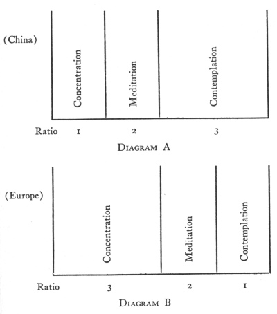

  
[Intangible Textual Heritage](../../index)  [Hinduism](../index) 
[Yoga](../yoga/index)  [Index](index)  [Previous](gsoy09) 
[Next](gsoy11) 

------------------------------------------------------------------------

[Buy this Book at
Amazon.com](https://www.amazon.com/exec/obidos/ASIN/1425482597/internetsacredte)

------------------------------------------------------------------------

*Great Systems of Yoga*, by Ernest Wood, \[1954\], at Intangible Textual
Heritage

------------------------------------------------------------------------

p. 133

# THE CHINESE YOGA

p. 134 p. 135

### CHAPTER EIGHT

#### THE CHINESE YOGA

WHEN the Buddha wished to allude to the final achievement or attainment
of human life he spoke of *nirvāna*, a "blowing-out." This means that in
that experience, there will be an absence of our familiar limitations
known as body and mind. Even the mind is for us an object of knowledge.
The field of our knowledge can be divided into objective and subjective.
Both are within the field—both the knower and the known, the subject and
the object.

Buddha's doctrine was that only in the presence of knowing are "subject
and object" to be seen. Mind with its reasoning activity—its
logic—generally considered as the subject, is in reality only an
instrument. It does not know. [1](#fn_74) Behind
or beyond this mind is

p. 136

what among Chinese Buddhists came to be called Essence of Mind. It is
Bodhi, Wisdom. If a man could put aside the error or delusion of
the-self-as-mind there would be the elimination of object and subject
relation from his experience, and then—*nirvāna*.

It was always held that only man can perform this feat, because he—not
the lower animals—has mind as *reason*. Of course, there was lower mind,
or instinct, in the animals, but this was accumulated
knowledge—recognition and memory. And every idea or mental picture in
this store of knowledge was accompanied by feeling and therefore by
desire. In modern terms we would call this collection the subconscious
mind, instinct. The sub-conscious mind could not be regarded as merely a
matter of bodily habit. The body is always changing its particles. The
incoming particles cannot be regarded as possessing the habits which
have been learned by the outgoing particles. So even the continuity of
its form is carried on by the "sub-conscious mind"—not by any powers of
the body. This continuity governs not only the bodily reactions to
environmental impacts, but also the emotions and flow of mental
pictures, or association of ideas. So there is instinct. Buddha called
this complex of continuity the *skandhas*.

Man has something more than instinct. He has reason,

p. 137

although it must be admitted that very often he acts by instinct, and
reason is often if not generally far from its maturity and power.

The height of reasoning or thinking is meditation, called *dhyāna* among
the old psychologists of India. In a boat, instinct would tell us to
row, but reason would tell us to put up a sail, until even the putting
up of a sail passed into the sub-conscious and reason led us further to
install a motor. Whatever our problem, reason will improve our reaction,
but reason demands time—we must think the matter over, consider the
nature of water, of boats, of many things involved, study their
relations in mental pictures, and then, after this process, which takes
time, the problem is solved. Meditation is the complete mental review of
the materials of the problem and the study of their combination. It is
applied to ordinary material problems and to the most abstruse
psychological and philosophical ones.

But this does not tell the whole story of meditation. If properly
carried out it ends up with intuition—something you did not know before,
and have not found in the world. This is sometimes called *prajnā*. This
intuition is not reason, but is direct perception, and the state of the
mind in which this *prajnā* or intuition is in power is called
*samādhi*, which literally taken means completely in agreement or order.

p. 138

\[paragraph continues\] This experience by
direct perception is called in China and Japan a *satori*. But I am
running ahead. Let us first look at the way in which the mind gets
knowledge for us.

Mind is called "sixth sense." By mind we get to know things not
available to the senses of hearing, touching, seeing, tasting and
smelling. It can operate in three stages, and usually does—through
testimony, reasoning and seeing for ourselves. Someone comes into the
house and says there is a fire on the mountain; this is supported by
reason, because there is smoke; then we can go and find the fire—and
perhaps put it out. So there is testimony and then reasoning and then
direct perception. This applies in religious matters. Buddha says he has
found joy and knowledge; it is reasonable; we are to go and find it.

When the *dhyāna* or meditation process was carried into China by the
famous Indian "missionary" Bodhidharma, it came to be known as *Chan*,
and a little later when it had found its way to Japan the word was
further modified and became *Zen*. *Zen* is Japanese meditation-yoga.

It is not to be thought that in either India or China the results of
*dhyāna* were merely improved subjective experience. In India the fruit
of *samādhi* was *viveka* or discrimination, which means a *new
valuation*. This is stated emphatically by Patanjali in his

p. 139

aphorism no. ii 28, which describes the final effect of the performance
of the eight Limbs of Yoga, culminating in *samādhi*. [2](#fn_75) This is not a perfection of the
subjective, but a transcendence of the subjective conception of the
subject-object relation. Subject and object now live together in the
Knowing or Consciousness in a new way. Subject-self is overcome. It was
a piece of Ignorance, a five-branched tree of ignorance.

In the case of Buddha we have exactly the same teaching, when *avidyā*,
ignorance, is given as the final "fetter" to be cast off, as shown in
our previous chapter. This was essentially ignorance or error about self
or the subjective entity.

It is natural that the method of practice of the *Chan* and the *Zen*
should be somewhat different from that in India, as befits the racial
types of China and Japan. The method is well described in *The Sūtra of
Wei Lang*, translated by Wong Mou-Lam, [3](#fn_76) and in Christmas Humphreys' *Zen
Buddhism*, [4](#fn_77) and in several books by
Professor D. T. Suzuki.

p. 140

Before we turn to the practices of *Zen* it is necessary to say that the
fundamental conceptions associated with it are also found in the old
Tao-ism of China, coming down even from Lao Tsu, who lived about the
same time as Buddha. Buddhism became blended with this. The difference
was that Buddha desired not to give a name to *nirvāna*, as that would
almost inevitably lead to some mental idea of it, which would then stand
in the way of the transcendental experience. Even the idea of
transcendence does so.

In the old teaching there was *Tao*, the motionless, master of all, both
the subjective and objective sides of Nature, including man. It could
equally be called the absolute motion, which, passing through every
point of space in every direction in every moment of time, becomes the
ever-present soul of all motions, but is motionless from the standpoint
of the subject-object world. [5](#fn_78)

From *Tao* come *yang* and *yin*, the active and passive sides of
Nature, light and shadow. In man the two elements appear as intellect
and instinct. The instinct-flow is natural, outward-going, but the
intellect-flow, which is "backward-going, reversed, turned round," can
become so pure that it gains release, when things are recognized but not
desired. *The Secret of*

p. 141

*the Golden Flower*, translated by Richard Wilhelm, gives the lay-out of
principles, and is a splendid source-book for this study.

Introspectively, all can see that knowledge and desire go opposite ways.
Desire draws man into complicated experiences, bringing problems which
can be solved only by the intellect seeing things as they are, untainted
by desires concerning them. The path of yoga, in this field, thus means
knowing or seeing without desire. There is, of course, knowing, or
consciousness, in both cases. The animal is highly conscious, but
instinctual; in man the consciousness is becoming intellectual; in the
*bodhisattwa* (which means one whose intellect is pure, or whose very
nature is intellect) we have man on the verge of *nirvāna*, or *Tao*. In
all three cases feeling and knowledge go hand in hand. Where there is
pure knowledge, the feeling is love—love without desire, full
consciousness and approach completely without antagonism. This is the
*Zen* outlook, whatever terminology of China or India, of *Tao* or
Buddhism may be used. The practice of meditation in this field is
"seeing without desire." And the height of it is reached when there is
direct perception, intuition in which reasoning stops. There is no
*desire* for logic to stop; it does so naturally when its function is
fulfilled; then intuition appears.

If we compare the art of China with that of Greece

p. 142

we find that one is more the product of imaginative observation, the
other of introspectional observation. The word imaginative here means
image-making. It is less creative and more contemplative. If the poise
of the Chinese has the relative proportions shown in diagram A, that of
the Indo-European is relatively somewhat as in diagram B.

It is to be understood, of course, that while this
rotary motion is the same for all sane minds, the standard or
evolutionary status is individual. In the individual there is growth
through use or exercise, whereby each of the three elements is advanced
in ability. Taking this into consideration, it will be seen that the
movement is spiral as well as rotary.

The difference of different minds, and races of men, is a difference in
the proportions and status of these three. I have cited art here because
art is yoga in action, action free from the taint of desire and utility
or use. It gives us a peep-hole into the mind. So the meditation-systems
of China did not develop on very introspectional lines, as meditation in
Europe has done.

In *The Secret of the Golden Flower* a form of meditation is given in
which a superphysical self is built. Intellect or the light of seeing is
to be freed from the instinctual, is to build a body of its own. This is
done by stopping the flight of thoughts—concentrate, but quickly pass
into contemplation; when contemplation

p. 143

 

It is to be understood, of course, that while this
rotary motion is the same for all sane minds, the standard or
evolutionary status is individual. In the individual there is growth
through use of exercise, whereby each of the three elements is advanced
in ability. Taking this into consideration, it will be seen that the
movement is spiral as well as rotary.

p. 144

falls into flights again, renew the concentration. This "circulates" the
process—brings it into circle, not *drives* it round, but puts an end to
wandering off. As in India, attention is to be given at first to the
body—body comfortable, breathing rhythmic, senses quiet. Then one
listens within, to the no-sound, listens to the silence. Thus within the
heart another "body" is gradually built up, which is a spiritual body.

Though many details are given in *The Secret of the Golden Flower* there
is no room for them here; besides, the serious student will supply his
own details. It is the body or focus of knowing (Confucius), of the
heart-view (Buddha), of inward vision (Lao Tsu). The intuition will
come; one must hardly ask for it, and certainly not presuppose its
nature. The magical material side of it will be that the new "body" will
be the intuition-vehicle for living free from the space-limitation of
the body, and so, being concerned with seeing and doing remote from the
body, giving what may be called a practical or objective side also to
the intuition, which is not one-sided but concerns object as well as
subject.

Buddha said: "Nor sink the string of thought into the Fathomless." But
men cannot leave it at that; they strive to realize the truth. Buddha
does not object to that, but says it will not be done by thought.
Intuition which is not thought will do it. But intuition comes to

p. 145

us; we do not make it. Is it different from the objective, or different
from the subjective? We must answer, "No," because difference is a
thought, a comparison, an attribute. So not by the suppression of the
world or the mind is intuition to be sought. Without their absence comes
this something which they as such cannot present. They would not be
themselves without it. Ordinarily the mind is taken up with objective or
subjective interests and activities, leaving no opening for the third.
When people seek that third, intellectual desire is usually present,
even if instinctual desire has been overcome. The first point of *Zen*
meditation is therefore, "Drop it!" Any means which will start the
process and thwart the intellectual desire will be permissible, provided
it does not prevent the "Go on" or, if there is a teacher, the "Come
on!" which is like that of a mother calling a young child to walk,
without a word about the mechanism of walking.

Three techniques have been specially prominent in the schools of
*Zen*—the wall-gazing, the sudden question (*mondo*) and the enigmatic
statement (*koan*). The first is not gazing at a wall, as one might
think, but gazing like a wall. You are the wall, upright to the world,
set by the plumb-line of your own nose, unaffected, intent on the
Essence of Mind. Bodhidharma is said to have practiced this for nine
years, avoiding commitments and desires, like an upright

p. 146

wall. He taught for fifty years in China. The sixth Patriarch in his
succession was Hui-neng, or Wei-Lang, through whom Chinese Buddhism,
harmonized with the *Tao*, emerged as a definite way of life, allowing
no dogmas, requiring an enquiring mind, searching within, demanding
humble faith in the coming of sudden enlightenment, and—materially—a
simple life of self-restraint, industry and sympathy.

Teachings of Buddha much used by the founders of the *Zen* sect were:
the *Lankavatara Sūtra*, the *Avatansaka Sūtra*, the *Surangama Sūtra*,
the *Mahayana Shraddhotpāda Shastra* and the *Diamond Sūtra*. To these
were added the *Sūtra* of Wei-Lang. The whole collection is very
conveniently gathered together and presented in Goddard's *Buddhist
Bible*. [6](#fn_79)

The teaching of meditation in the *Diamond Sūtra* prescribes sitting
alone, erect, motionless, quieting the mind, with attention on no
definite thing, excluding recollection and imagination, abandoning all
notions of an external world, turning to inner intuitive consciousness,
gradually entering *samādhi*, ideal tranquility, and thus passing from
vagrant thinking and even intellectual activity into the realization of
insight.

It was especially among the Chinese and Japanese that the sudden
enlightenment was brought about by

p. 147

sudden means. Intuition is by its very nature always sudden—not built
up—but sudden means or methods were also now brought in, in the shape of
*koans* and *mondos*.

The *koan* is a mind-baffling statement to be meditated upon. The
teacher requires an answer; there is no hurry about it, but you are
expected to tackle it, and to stick at it until you have a solution. The
statement is of such a nature that the intellect cannot understand it,
and all its efforts to do so are in vain. It is thus thwarted and
nullified, and the yogī must therefore sweat and strain, so to speak,
with great will power until an intuitive answer comes. It is very
strenuous, and dangerous unless the *koan* is given by a competent
teacher to an appropriate student. The intuition is such that it cannot
be expressed in words, but when it comes there will be a lighting-up of
the mind which will cause an involuntary exclamation or action, such as
the laugh or the slap of the thigh which one gives when there is a
sudden seeing of the point of a joke or the solution of a conundrum, and
one says, "I never thought of *that*."

As an example, the teacher may say: "You have knees, you have feet.
Come, let us fly." Or, a classical one, "The two hands clap with a
noise; listen to the clap of one hand." There should be no agreed upon,

p. 148

traditional or conventional meaning to these *koans*. They may be
invented *ad lib*. A good example occurs accidentally, as it were, in
the *Glorious Presence* where, after expounding the Vedāntic doctrine of
"Not thus, not thus" from the commentary on the *Mūndūkya Upanishad*
where Gaudapāda says: "There is no limitation, no creation, no bondage,
no maker, no aspirant, nobody freed—this is the correct knowledge," the
continuation is: "And no 'no,' and there we are." Another example
occurred when the Sixth Patriarch wrote his first statement: in reply
to:

Our body is the Bodhi-tree,  
And our mind a mirror bright.  
Carefully we wipe them hour by hour,  
And let no dust alight.

His stanza said:

There is no Bodhi-tree,  
Nor stand of a mirror bright.  
Since all is void,  
Where can the dust alight?

The last two lines form a perfect *koan*.

The resulting enlightenment is called a *satori*. This "goal" as well as
the method is called *Zen*, just as in India yoga means both the
practice and the attainment. Mr. Christmas Humphreys thus explains it:
"Zen is not an escape from things but a new way of

p. 149

looking at things, whereby they are seen to be already in
Nirvana." [7](#fn_80) We are denying ourselves,
which is the great Error. Still, one must take care not to call *Zen* or
*Nirvāna* a state; for that conception, or any conception, is within the
*māyā* or error. Nor "looking."

The *mondo* is question and answer. Here there is no continued wrestling
as it were in terrible unmental attentiveness, as in the case of the
*koan*. An immediate answer is required, without thought. It will be
noticed that this is another way of side-stepping the thought process
while maintaining the attentiveness. For example, a *Zen* master once
held out a stick and said, "Call it not a stick; if you do you assert.
Nor deny that it is a stick; if you do, you negate. Without affirmation
or denial, speak, speak!" It is not recorded what the pupils said, but I
tried this on myself and out came "On, on!" And this carried knowledge,
like a dream.

Life sets us *koans* and *mondos* all the time, for never do we know
enough to act with full intelligence. As far as we ourselves are
concerned:

All things are rushing to their doom;  
Trying to slow the rush  
The mind preserves their death.

------------------------------------------------------------------------

### Footnotes

[135:1](gsoy10.htm#fr_74) In my own terms: there
is no such thing as body-consciousness, and no such thing as
mind-consciousness, but only, in these cases, consciousness of the body
and consciousness of the mind.

[139:2](gsoy10.htm#fr_75) For the whole subject
see my *Practical Yoga: Ancient and Modern*. This book gives a full
translation of all the Patanjali Aphorisms with an explanation in modern
terms. Published by E. P. Dutton and Co., Inc., New York, Rider and Co.,
Ltd., London, Messrs. Payot, Paris, Editorial Orion, Mexico City.

[139:3](gsoy10.htm#fr_76) Published for the
Buddhist Society, London, by Luzac & Co., Ltd.

[139:4](gsoy10.htm#fr_77) Published by William
Heinemann Ltd., London.

[140:5](gsoy10.htm#fr_78) See Prof. Wood's
writings on *The Secret Doctrine*.

[146:6](gsoy10.htm#fr_79) Published by E. P.
Dutton and Co., New York.

[149:7](gsoy10.htm#fr_80) *Zen Buddhism*, by
Christmas Humphreys, p. 95.

------------------------------------------------------------------------

[Next: Chapter Nine. The Sufi Yogis](gsoy11)
