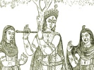
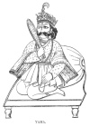

  
[Intangible Textual Heritage](../../index)  [Hinduism](../index) 
[Index](index)  [Previous](hmvp13)  [Next](hmvp15) 

------------------------------------------------------------------------

  
*Hindu Mythology, Vedic and Puranic*, by W.J. Wilkins, \[1900\], at
Intangible Textual Heritage

------------------------------------------------------------------------

p. 78

### CHAPTER X.

#### YAMA.

Yama, the judge of men and king of the
unseen world, was the son of Vivasvat (the sun) and Saranya, the
daughter of Tvastri. He was born before his mother

 
[  
Click to enlarge](img/07800.jpg)  
YAMA.  

had become afraid of her glorious husband. He was twin-brother of Yami,
and, in the opinion of Professor Roth, they were regarded as the
primeval pair from

p. 79

whom the human family has sprung. In another verse of the Rig-Veda they
are described as the offspring of the heavenly choristers, the
Gandharvas. As there were no others to perpetuate the race, Yami
entreated Yama to become her husband. She urged the fact that Tvastri
had formed them as man and wife in the womb; and therefore it was
useless for him to refuse her request, as none can act contrary to the
ordinances of Tvastri. But Yama was firm, and resisted her overtures on
the ground that it was monstrous for those who are preachers of
righteousness to act unrighteously. [\*](#fn_81)
It is not at all easy to determine what was intended to be represented
by these deities. Max-Müller understands Vivasvat to be the sky, Saranya
the dawn, Yama the day, and Yami the night. Others suggest that Yama may
be the hot air current caused by the rising sun, and Yami the cooler air
of the night, and their antagonism would be represented by Yama
repelling the advances of Yami.

Yama was the first of mortals who died, and, having discovered the way
to the other world, is the guide of those who depart this life, and is
said to conduct them to a home which is made secure for them for ever.
He is a king, and dwells in celestial light in the innermost sanctuary
of heaven. He grants bright homes to the pious who dwell with him. [†](#fn_82)

"In the Rig-Veda, Yama is nowhere represented (as he is in the later
mythology) as having anything to do with the punishment of the wicked.
Nevertheless he is still to some an object of terror. He is said to have
two insatiable dogs, with four eyes and wide nostrils, which guard the
road to his abode, and which the departed are advised to hurry past with
all possible

p. 80

speed. These dogs are said to wander about among men as messengers, no
doubt for the purpose of summoning them to the presence of their master,
who in another place is identified with; death, and is described as
sending a bird as the herald of doom." [\*](#fn_83)

"When the remains of the deceased have been placed upon the funeral
pile, and the process of cremation has commenced, Agni, the god of Fire,
is prayed not to scorch or consume the departed, not to tear asunder his
skin or his limbs, but, after the flames have done their work, to convey
to the fathers the mortal who has been presented to him as an offering.
Leaving behind on earth all that is evil and imperfect, and proceeding
by the paths which the fathers trod, invested with a lustre like that of
the gods, it soars to the realms of eternal light in a car, or on wings,
and recovers there its ancient body in a complete and glorified form;
meets with the forefathers who are living in festivity with Yama;
obtains from him, when recognized by him as one of his own, a delectable
abode, and enters upon more perfect life, which is crowned with the
fulfilment of all desires, is passed in the presence of the gods, and
employed in the fulfilment of their pleasure." [†](#fn_84)

In this kingdom, over which Yama reigns, friends meet with their
departed friends—husband with wife, children with parents—and together
live in a state of blessedness, free from the evils and infirmities that
belong to the present life. As the gods are described as enjoying the
pleasures common to men on earth, the kingdom of Yama, the abode of the
departed, is not at all less sensual than the present world; and when
mortals have been privileged to enter this happy land, they become
objects of veneration to their descendants

p. 81

still living, and joyfully partake of the oblations they offer to them.

In the following lines Dr. Muir [\*](#fn_85) has
given an epitome of the teaching of the Vedas respecting Yama:—

"To great King Yama homage pay,  
   Who was the first of men that died,  
   That crossed the mighty gulf and spied  
 For mortals out the heavenward way.

   \*           \*           \*           \*

 "By it our fathers all have passed;  
   And that same path we too shall trace,  
   And every new succeeding race,  
 Of mortal men, while time shall last.

"The god assembles round his throne  
   A growing throng, the good and wise  
   All those whom, scanned with searching eyes,  
 He recognizes as his own.

"Departed mortal, speed from earth  
   By those old ways thy sires have trod;  
   Ascend, behold the expectant god  
 Who calls thee to a higher birth.

   \*           \*           \*           \*

"And calmly pass without alarm  
   The four-eyed hounds that guard the road  
   Which leads to Yama's bright abode;  
 Their master's friends they dare not harm.

"All imperfections leave behind:  
   Assume thine ancient frame once more—  
   Each limb and sense thou hadst before,  
 From every earthly taint refined.

"And now with heavenly glory bright,  
   With life intenser, nobler, blest,  
   With large capacity to taste  
 A fuller measure of delight,

p. 82

"Thou there once more each well-known face  
   Shalt see of those thou lovedst here;  
   Thy parents, wife, and children dear,  
 With rapture shalt thou soon embrace

"The father, too, shalt thou behold,  
   The heroes who in battle died,  
   The saints and sages glorified,  
 The pious, bounteous kings of old.

"The gods whom here in humble wise  
   Thou worshippedst with doubt and awe,  
   Shall there the impervious veil withdraw  
 Which hid their glory from thine eyes.

"The good which thou on earth hast wrought.  
   Each sacrifice, each pious deed,  
   Shall there receive its ample meed;  
 No worthy act shall be forgot.

"In those fair realms of cloudless day,  
   Where Yama every joy supplies,  
   And every longing satisfies,  
 Thy bliss shall never know decay."

In the Purānas Yama is called the judge of men, and is said to rule over
the many hells in which the wicked are made to suffer. Thus the "Padma
Purāna" says: "Yama fulfils the office of judge of the dead, as well as
sovereign of the damned; all that die appearing before him, and being
confronted with Chitragupta the recorder, by whom their actions have
been registered. The virtuous are then conveyed to Swarga (Indra's
heaven), whilst the wicked are driven to the different regions of Naraka
(hell)." [\*](#fn_86) In the "Vishnu Purāna" the
names of the different hells are given, and it is there stated that "
there are many other fearful hells which are the awful provinces of
Yama, terrible with instruments of torture and fire." In the same
Purāna [†](#fn_87) it is said that

p. 83

\[paragraph continues\] "all men at the
end of their existence (life) become slaves to the power of Yama, by
whom they are sentenced to painful punishments." Inquiry is then made as
to how men can be free from his authority. The answer is that "Yama is
the lord of all men, excepting the worshippers of Madhusūdan (Vishnu).
Worship him in one of his many forms, and Yama can exert no authority
over you."

According to the popular ideas now prevailing, Yama is represented as a
green man, clothed in red garments. He has a crown on his head, and a
flower in his hair; is armed with a club, and rides upon a buffalo. He
is regularly worshipped once a year; and daily a little water is poured
out to him. For a whole month each year unmarried girls present
offerings to him in the hope that he will provide them with a husband;
and that, having granted this boon, he will not recall his gift, and
leave them widows. In his presence the good and evil deeds of the
departed are weighed: according to the turn of the scale, the soul goes
to heaven or hell. The soul is believed to reach Yama's abode in four
hours and forty minutes; consequently a dead body cannot be burned until
that time has passed after death.

In the "Bhavishya Purāna" the following legend of Yama's marriage is
found. He was exceedingly pleased with a girl named Vijaya, a Brāhman's
daughter. When first she saw him she was greatly alarmed, alike at his
appearance and on learning who he was. At length he allayed her fears;
and, although her brother tried to dissuade her, she consented to become
his wife. On her arrival at Yama's abode, he particularly cautioned her
against going into the southern quarter of his kingdom. After a time,
thinking he must have another wife there, her curiosity overpowered her,
and going into the

p. 84

forbidden region, she was greatly distressed, as she saw the wicked in
torment: Amongst other sufferers was her own mother. Meeting Yama there,
she tried to obtain her release. Yama declared that this could not be
granted unless some one then living on earth would perform a certain
sacrifice, and transfer the merit of the act to the poor woman then
suffering. After some difficulty, one was found willing to perform this
act of kindness, and Yama's mother-in-law obtained release.

Stories are told in the Purānas to show how the power of Vishnu is
exercised on behalf of his worshippers in rescuing them from Yama's
bonds. If a man repeat his name in teaching it to his parrot, or utter
it in death without any intention of asking his help, his messengers
will be sent to snatch him from the punishments of hell and conduct him
to his blest abode.

It is very strange to notice how the character of Yama's rule and
kingdom has entirely changed in the conceptions of the Hindus. According
to the Vedas, the pure and good went with gladness to Yama's realm of
light; now, as taught in the Purānas, it is the wicked who are sent to
him for punishment.

In the Mahābhārata [\*](#fn_88) is a most
interesting story, showing that sometimes Yama is propitious to prayer,
and will allow those who have entered his abode to return to earth.

A princess named Savitri loved Satyavān, the son of an old hermit, but
was warned by a seer to overcome her attachment, as Satyavān was a
doomed man, having only one year to live. Savitri replies:

"Whether his years be few or many, be he gifted with
all grace  
 Or graceless, him my heart hath chosen, and it chooseth not
again."

p. 85

They were married, and the bride strove to forget the prophecy; but, as
the last day of the year approached, her anxiety became irrepressible.
She exhausted herself in prayers and penances, hoping to stay the hand
of the destroyer, yet all the while dared not reveal the fatal secret to
her husband. At last the dreaded day arrived, and Satyavān set out to
cut wood in the forest. His wife asked leave to accompany him, and
walked behind him, smiling, but with a heavy heart. Satyavān soon made
the wood resound with his hatchet, when suddenly a thrill of agony shot
through his temples, and, feeling himself falling, called his wife to
support him.

"Then she received her fainting husband in her arms,
and sat herself  
 On the cold ground, and gently laid his drooping head upon her lap:  
 Sorrowing, she called to mind the sage's prophecy, and reckoned up  
 The days and hours. All in an instant she beheld an awful shape  
 Standing before her, dressed in blood-red garments, with a glittering
crown  
 Upon his head; his form, though. glowing like the Sun, was yet
obscure,  
 And eyes lie had like flames, a noose depended from his hand; and he  
 Was terrible to look upon, as by her husband's side he stood  
 And gazed upon him with a fiery glance. Shuddering she started up,  
 And laid her dying Satyavān upon the ground, and, with her hands  
 Joined reverently, she thus with beating heart addressed the shape:  
 Surely thou art a god; such form as thine must more than mortal be!  
 Tell me, thou god-like being, who thou art, and wherefore art thou
here?'"

The figure replied that he was Yama, king of the dead; that her
husband's time was come, and that he must bind and take his spirit.

"Then from her husband's body forced he out, and
firmly with his cord  
 Bound and detained the spirit, clothed in form no larger than a
thumb.  
 Forthwith the body, reft of vital being and deprived of breath,  
 Lost all its grace and beauty, and became ghastly and
motionless."

p. 86

After binding the spirit, Yama proceeds with it towards the quarter of
which he is guardian—the south.

The faithful wife follows him closely. Yama bids her go home and perform
the funeral rites; but she persists in following, till Yama, pleased
with her devotion, grants her any boon she pleases, except the life of
her husband. She chooses that her husband's father, who is now blind,
may recover his sight. Yama consents, and bids her now return home.
Still she persists in following. Two other boons are granted in the same
way, and still Savitri follows closely on the heels of the king of
death. At last, overcome by her constancy, Yama grants a boon without
exception. The delighted Savitri exclaims:

"Nought, mighty king, this time hast thou excepted:
let my husband live;  
 Without him I desire not happiness, nor even heaven itself;  
 Without him I must die.' 'So be it, faithful wife,' replied the king of
death:  
 Thus I release him;' and with that he loosed the cord that bound his
soul."

Amongst the many names by which Yama is known, the following are the
most common:—

Dharmarāja, "King of righteousness."

Pitripati, "Lord of the fathers."

Samavurti, "He who judges impartially."

Kritānta, "The finisher."

Samana, "The leveller."

Kāla, "Time."

Dandadhara, "He who carries the rod."

Srāddhadeva, "The god of funeral ceremonies."

Vaivasvata, "The son of Vivasvata."

Antaka, "He who puts an end to life."

------------------------------------------------------------------------

### Footnotes

[79:\*](hmvp14.htm#fr_81) Muir, O. S. T., v.
289.

[79:†](hmvp14.htm#fr_82) Ibid., v. 284.

[80:\*](hmvp14.htm#fr_83) Muir, O. S. T., v.
302.

[80:†](hmvp14.htm#fr_84) Ibid., v. 302 ff.

[81:\*](hmvp14.htm#fr_85) Muir, O. S. T., v.
327.

[82:\*](hmvp14.htm#fr_86) "Vishnu Purāna," p.
207, note.

[82:†](hmvp14.htm#fr_87) Ibid., p. 286.

[84:\*](hmvp14.htm#fr_88) "Indian Wisdom," p.
395.

------------------------------------------------------------------------

[Next: Chapter I. The Purānas](hmvp15)
