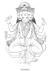
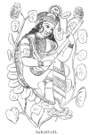

  
[Intangible Textual Heritage](../../index)  [Hinduism](../index) 
[Index](index)  [Previous](hmvp16)  [Next](hmvp18) 

------------------------------------------------------------------------

  
*Hindu Mythology, Vedic and Puranic*, by W.J. Wilkins, \[1900\], at
Intangible Textual Heritage

------------------------------------------------------------------------

p. 98

### CHAPTER III.

#### BRAHMĀ AND SARASVATI.

##### BRAHMĀ.

Brahmā, the first of the three great
Hindu gods, is called the Creator; he is the father of gods and men, the

 
[  
Click to enlarge](img/09800.jpg)  
BRAHMĀ.  

\[paragraph continues\] Vedic Prajāpati,
the lord of creatures. As nearly all the writers of the Purānas seem to
regard it a duty to describe

p. 99

the work of creation as performed by this god, and as each account
differs in detail from the others, it is a perfectly hopeless task to
attempt to give a harmonized statement of this great event. I shall
therefore give Manu's [\*](#fn_100) account of
it, which is largely founded upon the teaching of the Vedas, though
considerably mixed up with more modern views.

"This universe was enveloped in darkness—unperceived, undistinguishable,
undiscoverable, unknowable, as it were, entirely sunk in sleep. The
irresistible self-existent lord, undiscerned, creating this universe
with the five elements, and all other things, was manifested dispelling
the gloom. He who is beyond the cognizance of the senses, subtile,
undiscernible, eternal, who is the essence of all things, and
inconceivable, himself shone forth. He, desiring, seeking to produce
various creatures from his own body, first created the waters, and
deposited in them a seed. This (seed) became a golden egg, resplendent
as the sun, in which he himself was born as Brahmā, the progenitor of
all worlds. The waters are called *nārāh*, because they are the
offspring of Nara; and since they were formerly the place of his
movement (*ayana*), he is therefore called Nārāyana. [†](#fn_101) Being formed by that First Cause,
undiscernible, eternal, which is both existent and non-existent, that
male is

p. 100

known in the world as Brahmā. That lord having continued a year in the
egg, divided it into two parts by his mere thought." [\*](#fn_102) In the Mahābhārata, and some of the
Purānas, Brahmā is said to have issued from a lotus that sprang from the
navel of Vishnu.

The egg referred to above is thus described in the "Vishnu Purāna" [†](#fn_103):—"Its womb, vast as the mountain Meru,
was composed of the mountains, and the mighty oceans were the waters
which filled its cavity. In that egg were the continents, seas, and
mountains; the planets and divisions of the universe; the gods, the
demons and mankind. Brahmā is said to be born; a familiar phrase to
signify his manifestation." This wonderful egg, after the Creator had
inhabited it for a thousand years, burst open, and Brahmā issuing forth
by meditation commenced the work of creation. Seeing that the earth was
sunk beneath the waters, he assumed the form of a boar, [‡](#fn_104) and, diving, raised it upon his tusks.
After this, he continued the work of creation.

In pictures Brahmā is represented as a red man with four heads, though
in the Purānas he is said to have had originally five. He is dressed in
white raiment, and rides upon a goose. In one hand he carries a staff,
in the other a dish for receiving alms. A legend in the "Matsya
Purāna" [§](#fn_105) gives the following
account of the formation of his numerous heads:—"Brahmā formed from his
own immaculate substance a female who is celebrated under the names of
Satarupā, Savitri, Sarasvati, Gāyatri, and Brāhmani. Beholding his
daughter, born from his body, Brahmā became wounded with the

p. 101

arrows of love, and exclaimed, How surpassingly lovely she is!' Satarupā
turned to the right side from his gaze; but as Brahmā wished to look
after her, a second head issued from his body. As she passed to the
left, and behind him, to avoid his amorous glances, two other heads
successively appeared. At length she sprang into the sky; and as Brahmā
was anxious to gaze after her there, a fifth head was immediately
formed. Brahmā then said to his daughter, 'Let us produce all kinds of
animated beings, men, suras (gods), and asuras (demons). Hearing this,
she descended, and Brahmā having espoused her, they withdrew to a
secluded spot where they dwelt together for one hundred divine
years; [\*](#fn_106) at the expiration of which
time was born Manu, who is also called Swayambhuva and Virāj." [†](#fn_107)

The following legend [‡](#fn_108) occurs, with
some variations, in several Purānas, showing why Brahmā was deprived of
his fifth head:—

"Once when they were assembled on the top of Meru, the holy sages,
having saluted Brahmā, requested him to declare the true nature of the
godhead; but the Creator, influenced by the delusion of Mahesha (a
demon), and his mind obscured by spiritual darkness, asserted his own
pre-eminence, and said: 'I am the womb of the universe, without
beginning or end, and the sole and self-existent lord; and he who does
not worship me

p. 102

shall never obtain beatitude.' On hearing this, Kratu, a form of
Nārāyana (Vishnu), smiled and said: ' Hadst thou not been misled by
ignorance, thou wouldst not have made an assertion so contrary to truth;
for I am the framer of the universe, the source of life, the unborn,
eternal and supreme Nārāyana; and, had I not willed it, creation would
not have taken place.'

"Thus Vishnu and Brahmā disputed, and at length they agreed to allow the
matter to be decided by the Vedas. The Vedas declared that Siva was
creator, preserver, destroyer. Having heard these words, Vishnu and
Brahmā, still bewildered by the darkness of delusion, said, 'How can the
lord of goblins, the delighter in graveyards, the naked devotee covered
with ashes, haggard in appearance, wearing twisted locks ornamented with
snakes, be the supreme being? ' The incorporeal Prāna (Life), then
assuming a form, said, 'This is not the real form of Siva; but when
united to his energy, he sometimes, under the figure of Rudra, delights
himself in various illusive sports.' But even these words dispelled not
the spiritual darkness of Vishnu and Brahmā; when suddenly appeared
between them a wondrous effulgence filling the heavens, earth, and
mid-air. In the midst of this they beheld a human form, vast, uncreated,
of a dark hue, holding in his hand a trident and a rosary, and wearing a
serpent for a Brāhmanical thread. On seeing whom, the fifth head of
Brahmā glowed with anger and said, 'I know thee well, O Chandra Shekera,
for from my forehead didst thou spring, and because thou didst weep I
called thee Rudra. Hasten then to seek the refuge of my feet, and I will
protect thee, O my son! ' At these proud words of Brahmā, Siva was
incensed; and from his anger sprang into existence a terrific form
(Bhairava), whom he thus addressed:

p. 103

\[paragraph continues\] 'Chastise this
lotus-born!' No sooner did Bhairava receive this order, than instantly
he cut off the head of Brahmā with the thumb of his left hand. That
member which had committed the fault received punishment; and therefore
Brahmā was deprived of his fifth head." Upon this Vishnu and Brahmā
praised Siva.

In another part of the same Purāna [\*](#fn_109) is another legend, giving a somewhat
different account of this circumstance:—

"Formerly all things movable and immovable having been destroyed, nought
remained but one boundless ocean; nor fire, nor air, nor sun, nor
atmosphere, nor stars, nor planets, nor light, nor earth, nor heaven,
nor gods nor demons existed then; and all was involved in impenetrable
darkness. One being alone, Mahā Kāla (Siva), pervaded all space; who
being desirous of creation, churned his left arm with his right
forefinger; whence issued a bubble, which increasing in size became an
egg resembling gold. This egg Mahā Kāla divided with his hand; of the
upper part he formed the heavens, and of the lower half the earth, and
in the centre of it appeared Brahmā with five hands and four arms, to
whom Mahā Kāla thus said, 'Through my favour effect creation.' Having
thus spoken, he disappeared.

"Brahmā having then considered in what manner he could accomplish this
object, propitiated his lord Bhava with a severe *tapas* (meditation),
and in consequence received from him the four Vedas, and was thus
enabled to become the Creator. But as Siva had not revealed himself,
Brahmā continued his meditation in order that he might behold that god.
Siva was propitiated; but, still invisible, thus said, 'O Brahmā, choose
whatever boon thou choosest!' Brahmā craved that Siva would

p. 104

become his son. Siva replied: 'Propitiated by thy piety, I will become
thy son under the form of Rudra; but as thou hast craved a boon which
ought not to have been asked, I shall on this account hereafter cut off
one of thy heads. Nevertheless, though thou shalt afterwards possess but
four heads, yet as thou hast been formed by me, from my own substance
which is that Brahmā, thou shalt in remembrance of this circumstance be
denominated Brahmā. Also from my becoming thy son, shalt thou be called
Pitāmāha (the great father).'

"Brahmā having obtained both a boon and a curse, proceeded, in order to
effect creation, to sacrifice to that fire which had sprung from his own
effulgence; and from the heat, perspiration collected on his forehead.
In wiping this off with a small piece of wood, a drop of blood fell into
the fire, from which by the will of Siva sprang Rudra, of a dark hue,
with five heads, ten hands, and fifteen eyes; having a serpent for his
Brāhmanical thread, wearing twisted locks, and the moon on his head, and
clothed in the skin of a lion. Having seen such a son, Brahmā was
delighted, and bestowed on him various appellations. Brahmā having
created various classes of beings, they all adored him, except Rudra; to
whom Brahmā said, 'Why dost thou not also adore me?' Rudra replied, 'I
worship none other than that effulgence from which I sprang! ' Having
thus spoken, he departed to Siva's abode. But Brahmā from the impurity
of his nature became immersed in spiritual darkness, and thought that it
was by his own power alone that he had effected creation, and there was
no other god equal to him. His fifth head also having read the Vedas,
which the other four heads had delivered, acquired a splendour which
neither suras (gods) nor asuras (demons) could endure."

p. 105

The "Padma Purāna" [\*](#fn_110) thus concludes
this story: "Unable therefore to approach or behold it, they determined
to apply to Siva for relief. Being propitiated by them, Siva granted
their request, and proceeded with them to where Brahmā remained inflated
with pride. On seeing Siva, Brahmā did not pay him the customary
honours. Siva, seeing Brahmā's fifth head inflicting distress on the
universe by its effulgent beams, brighter than a thousand suns,
approached him and said, 'Oh! this head shines with too much splendour,'
and immediately cut it off with the nail of his left thumb, with as much
ease as a man cuts off the stem of a plantain tree."

The Mahābhārata says that Siva did not actually cut off Brahmā's head on
this occasion, but was only prevented from doing so through the
intercession of the gods. It was because of his attempting to seduce his
own daughter that Siva decapitated him. This crime was attempted when in
a fit of intoxication; hence Brahmā pronounced a curse upon the gods who
should hereafter drink spirits.

In the passages just quoted, Brahmā is represented as worshipping Siva
for his own personal benefit; in the Vishnu Purāna," [†](#fn_111) he is described as joining with gods and
men in the worship of this same deity, and as officiating as priest on
that occasion. And in another part of the Purāna [‡](#fn_112) is the following hymn addressed to
Vishnu by Brahmā:—"Thou art the common centre of all, the protector of
the world, and all things exist in thee. All that has been, or will be,
thou art. There is nothing else but thee, O lord; nothing else has been,
or will be. Thou art independent, and without beginning." The object of
this laudation was to induce

p. 106

\[paragraph continues\] Vishnu to save the
earth from its load of sorrow; in answer to it, Vishnu appeared here as
Krishna.

At the present time Brahmā is not largely worshipped by the Hindus. "The
Brāhmans in their morning and evening worship repeat an incantation
containing a description of the image of Brahmā; at noon they present to
him a single flower; at the time of burnt-offering, *ghī* is presented
to him. In the month of Māgh, at the full moon, an earthen image of him
is worshipped, with that of Siva on his right hand, and Vishnu on his
left." [\*](#fn_113) Brahmā as Creator is
supposed to have finished his work; hence, excepting in one place, viz.
at Pushkara in Ājmir, there is no temple to him now existing. It is
evident that for centuries the worship of Brahmā has not been common,
for in the "Skanda Purāna " [†](#fn_114) is an
indelicate legend, in which the charge of falsehood is proved against
him, and this fact is given to account for the fact that his worship had
ceased. It concludes as follows:—"Since thou hast childishly and with
weak understanding asserted a falsehood, let no one henceforth perform
worship to thee."

The Mahābhārata says that Brahmā's heaven is eight hundred miles long,
four hundred wide, and forty high. Nārada declared himself incompetent
to describe it. In two hundred years he could not mention all its
excellences. He said that it contained in a superior degree all the
excellences of the other heavens; and that whatever existed in the
creation of Brahmā' on earth, from the smallest insect to the largest
animal, was to be found there.

In the later mythology, a deity named Dhātā (the Creator), who in the
Rig-Veda has no very clearly-defined powers, but is there said to
operate in the

p. 107

production of life and the preservation of health, is identified with
Prajāpati, or Brahmā; and in the sense of "maker " the term is also
applied to Vishnu and Krishna. Sometimes he is said to be a son of
Brahmā. [\*](#fn_115)

In addition to the names of Brahmā already referred to, the following
are those most commonly known:—

Ātmabhu, "The self-existent."

Paramesthi, "The chief sacrificer." He as the first Brāhman performed
all the great sacrifices of the Hindu religion.

Lokesha, "The god of the world."

Hiranyagarbha, "He who came from the golden egg."

Savitripati, "The husband of Savitri."

Adikavi, The first poet."

##### SARASVATI.

Brahmā's wife is Sarasvati, the goddess of wisdom and science, the
mother of the Vedas, and the inventor of the Devanagari letters. She is
represented as a fair young woman, with four arms. With one of her right
hands she is presenting a flower to her husband, by whose side she
continually stands; and in the other she holds a book of palm-leaves,
indicating that she is fond of learning. In one of her left hands she
has a string of pearls, called Sivamāla (Siva's garland), which serves
as a rosary; and in the other is a *damaru*, or small drum. At other
times she is represented with two arms only, seated on a lotus, playing
a kind of banjo. She dwells on earth amongst men, but her special abode
is with her husband in Brahmāloka.

Sarasvati having been produced from Brahmā, was regarded as his
daughter; hence her union with him

p. 108

was said to be criminal by the other gods. Sometimes she is called the
wife of Vishnu, but this difficulty is explained by a legend. [\*](#fn_116) "Sarasvati, by the standard
mythological authorities, is the wife of Brahmā. The Vaishnavas of
Bengal have a popular legend that she was the wife of Vishnu, as were
also Lakshmi and Gangā. The ladies disagreed, Sarasvati, like the other

 
[  
Click to enlarge](img/10800.jpg)  
SARASVATI.  

type of learned ladies, Minerva, being something of a termagant; and
Vishnu, finding that one wife was as much as even a god could manage,
transferred Sarasvati to Brahmā and Gangā to Siva, and contented himself
with Lakshmi alone.

"Sarasvati is a goddess of some, though not of very great, importance in
the Vedas. . . . She is celebrated

p. 109

both as a river and a goddess. She was primarily a river deity, as her
name, 'the watery,' clearly denotes; and in this capacity she is
celebrated in a few separate passages. Allusion is made in the hymns, as
well as in the Brāhmanas, to sacrifices being performed on the banks of
this river, and of the adjoining Drishadvati; and the Sarasvati in
particular seems to have been associated with the reputation for
sanctity which . . . was ascribed to the whole region called
Brahmāvartta, lying between these two small streams, and situated
immediately to the westward of the Jumnā. The Sarasvati thus appears to
have been to the early Indians what the Ganges (which is only twice
named in the Rig-Veda) is to their descendants. . . . When once the
river had acquired a divine character, it was quite natural that she
should be regarded as the patroness of ceremonies which were celebrated
on the margin of her holy waters, and that her direction and blessing
should be invoked as essential to their proper performance and success.
The connection into which she was thus brought with sacred rites may
have led to the further step of imagining her to have an influence on
the composition of the hymns which formed so important a part of the
proceedings, and of identifying her with Vāch, the goddess of speech. At
least I have no other explanation to offer to this double character and
identification. [\*](#fn_117)

"Sarasvati is frequently invited to the sacrifices along with several
other goddesses, who, however, were never, like her, river nymphs, but
personifications of some department of religious worship, or sacred
science. She is frequently invoked along with other deities.

"In many passages where she is celebrated, her original character is, as
I have intimated, distinctly

p. 110

preserved. Thus in two places she is mentioned along with rivers, or
fertilizing waters: 'Ye opulent waters, command riches; ye possess
excellent power and immortality; ye are mistresses of wealth and
progeny; may Sarasvati bestow this vitality on her worshipper.' And she
is mentioned with the other well-known streams which are there named,
the Sindhu, the Ganges, &c. In another place she is said to 'surpass all
other rivers, and to flow pure from the mountains to the sea.' In other
verses she is called upon to 'descend from the sky, from the great
mountain, to the sacrifice;' and is supplicated to combine with the
spouses of the other gods to afford secure protection to the
worshippers. . . . It is difficult to say whether in any of the passages
in which Sarasvati is invoked, even in those where she appears as the
patroness of holy rites, her character as a river goddess is entirely
left out of sight. . . .

"In the later mythology, as is well known, Sarasvati was identified with
Vāch, and became under various names the spouse of Brahmā, and the
goddess of wisdom and eloquence, and is invoked as a Muse. In the
Mahābhārata she is called the mother of the Vedas, and the same is said
of Vāch in the Taittariya Brāhmana where she is said to be the wife of
Indra, to contain within herself all worlds, and to have been sought
after by the Rishis who composed the Vedic hymns, as well as by the gods
through austerity." [\*](#fn_118)

In the Purānas, Sarasvati is spoken of under other titles. A verse in
the "Matsya Purāna" gives authority for the belief that one goddess only
is intended, though she is called by several names: "Brahmā next formed
from his own immaculate substance a female, who is celebrated under the
names of Satarupā, Savitri,

p. 111

\[paragraph continues\] Sarasvati,
Gāyatri, and Brāhmani." In the following legend from the "Skanda
Purāna," [\*](#fn_119) though by Savitri
Sarasvati is intended, Gāyatri represents some other person who became a
*second* wife of Brahmā. Iswara (Siva) is addressing Devi (Parvati):—

"Listen, O Devi, and I will tell you how Savitri forsook Brahmā, and he
in consequence espoused Gāyatri. The Vedas have declared the great
advantages which are derived from sacrifice, by which the gods are
delighted, and therefore bestow rain upon the earth. . . . To secure
therefore the verdure and vitality of the three worlds, I perform
sacrifices; and, in imitation of me, sacrifices are performed by gods
and men. For the same purpose Brahmā and his wife Savitri, the
immortals, and the holy sages repaired to Pushkara; but when all the
preparations had been made, with all due rites and ceremonies, for
performing the sacrifices, Savitri, detained by some household affairs,
was not in attendance. A priest accordingly went to call her; but she
replied, I have not yet completed my dress, nor arranged several
affairs. Lakshmi, and Bhavāni, and Gangā, and Svāha, and Indrāni, and
the wives of the other gods and of the holy sages, have not yet arrived,
and how therefore can I enter the assembly alone?'

"The priest returned, and thus addressed Brahmā: 'Savitri is engaged and
will not come; but without a wife what advantage can be derived from
these rites?' The god, incensed at the conduct of Savitri, thus spoke to
Indra: 'Hasten, and, in obedience to my order, bring a wife from
wherever you can find one.' Indra proceeded accordingly; and as he
passed hastily along, saw a milkmaid, young, beautiful, and of a smiling
countenance, carrying a jar of butter. He seized her and

p. 112

brought her to the assembly, when Brahmā thus spoke: 'O gods and holy
sages, if it seem good unto you I will espouse this Gāyatri, and she
shall become the mother of the Vedas, and the cause of purity to these
worlds!' Upon this Brahmā was united to Gāyatri, who was led into the
bower of the bride, and there arrayed in silken garments, and adorned
with the costliest ornaments.

"At this time Savitri, accompanied by the wives of Vishnu, Rudra, and
the other gods, came to the place of sacrifice. Seeing the milkmaid in
the bride's bower, and the priests engaged in the performance of the
sacred rites, incensed with anger, she thus addressed Pitāmāha: 'O
Brahmā! hast thou conceived so sinful an intention as to reject me, who
am thy wedded wife? Hast thou no sense of shame, that thus, influenced
by love, thou committest so reprehensible an act? Thou art called the
great father of gods and holy sages, and yet thou here publicly actest
in a manner which must excite the derision of the three worlds. But how
can I now show my face; or, deserted by my husband, call myself a wife?'
Brahmā replied: 'The priests informed me that the time for the sacrifice
was passing away, and that it could not profitably be performed unless
my wife were present, . . . and Indra having brought Gāyatri, Vishnu and
Rudra gave her in marriage to me. Forgive, therefore, this one act, and
I will never again offend thee!'

"On hearing these words, Savitri exclaimed, 'By the powers which I have
obtained by the performance of tapas, may Brahmā never be worshipped in
temple or sacred place, except one day in each year. . . . And, Indra,
since thou didst bring that milkmaid to Brahmā, thou shalt be bound in
chains by thine enemies, and confined in a strange country; and thy city
and station shall be occupied by thine enemies.' Addressing Vishnu,

p. 113

she said, 'Since thou gayest her in marriage to Brahmā, shalt thou, in
consequence of Bhrigu's curse, be born amongst men, and shalt endure the
agony of having thy wife ravished from thee by thine enemy; and long
also shalt thou wander, the humble keeper of cattle!' To Rudra she said:
'By the curse of the holy sages, shalt thou be deprived of thy manhood!'
To Agni: 'Mayest thou be a devourer of all things, clean and unclean!'
To the priests and Brāhmans: 'Henceforth shall ye perform sacrifices
solely from the desire of obtaining the usual gifts: and from
covetousness alone shall ye attend temples and holy places; satisfied
only shall ye be with the food of others, and dissatisfied with that of
your own houses; and in quest of riches shall ye unduly perform holy
rites and ceremonies! '

"Having pronounced these curses, Savitri left the assembly, and was
accompanied for a short distance by Lakshmi and the other goddesses,
when they all declared their intention of returning. On hearing this,
Savitri was incensed, and thus addressed them: 'Since you now forsake
me, O Lakshmi! mayest thou never remain stationary in one place; [\*](#fn_120) and mayest thou always abide with the
vile, the inconstant, the contemptible, the sinful, the cruel, the
foolish, and the barbarian! And, Indrāni, when Indra incurs the guilt of
Brāhmanicide by slaying Tvastri's son, then shall Nahusha acquire his
kingdom, and, desirous of obtaining thee, shall exclaim, "Am I not
Indra? why then does not the young and lovely Indrāni wait upon me? If I
do not obtain her, I will slay all the gods." Thou on learning his
wishes shalt remain in thy house immersed in grief, and borne down by
the weight of my curse!' Savitri then pronounced this curse on the wives
of the gods collectively: 'May

p. 114

you all remain barren; and may you never enjoy the pleasure of having
children!' Vishnu then tried in vain to appease her."

After Savitri's angry departure from the assembly, Gāyatri modified the
curses that had been pronounced. She promised all kinds of blessing,
including final absorption into him, to all the worshippers of Brahmā.
Though Indra be bound, his son should release him. Though Vishnu lost
his wife, he should regain her. Though Rudra be deprived of his manhood,
the Linga as his representative should be universally worshipped. Though
men made gifts to the Brāhmans, it would be because they reverenced them
as gods. And though the goddesses could not have children of their own,
this would not cause them regret.

The "Padma Purāna" gives a happier termination to the story. Vishnu and
Lakshmi, at Brahmā's request, followed Savitri when she left the
assembly, and induced her to return. On re-entering, Brahmā asked what
she wished him to do with Gāyatri. Savitri was too bashful to speak;
whereupon Gāyatri threw herself at her feet. Savitri raised her, and
embracing her said: "A wife ought to obey the wishes and orders of her
husband; for that wife who reproaches her husband, who is complaining
and quarrelsome, and instead of being his life, deprives him by her
conduct of length of years, shall, when she dies, most assuredly go to
hell. Considering this, the virtuous wife will do nothing displeasing to
her husband; therefore let us both be attached to Brahmā." "So be it,"
said Gāyatri; "thy orders will I always obey, and esteem thy friendship
precious as my life. Thy daughter am I, O goddess! Deign to protect me!"
It would appear that between the time when the "Matsya Purāna" was
composed and the date of the Padma,

p. 115

considerable change had come in the character of the ideal woman. Or it
may be that the writer of the Padma wished to give a better ideal to the
wives of his day.

In a legend in the "Varāha Purāna," Sarasvati is addressed as Gāyatri,
Sarasvati, Maheshvari (one of the names of Parvati), and also Savitri.
Her most common name is Sarasvati, by which name, as the goddess of
learning, she is regularly worshipped once a year.

------------------------------------------------------------------------

### Footnotes

[99:\*](hmvp17.htm#fr_100) "Dharma Shastra,"
chaps. i.—v.

[99:†](hmvp17.htm#fr_101) According to the
"Brahmā Purāna," another name, Āpava (who sports on the waters), is
given Brahmā, which has a similar, though not identical, application
with Nārāyana. Āpava, according to that Purāna, divided himself into two
parts, male and female, from whom proceeded Vishnu, who in his turn
created Virāj, who brought the first man into the world. Wilson says,
"According to the commentator on this passage, the first stage was the
creation of Āpava, or Vishistha, or Virāj by Vishnu, through the agency
of Brahmā; and the next was the creation of Manu by Virāj."—Dowson,
*s.v.* "Apave."

[100:\*](hmvp17.htm#fr_102) Muir, O. S. T., iv.
31.

[100:†](hmvp17.htm#fr_103) Page 18.

[100:‡](hmvp17.htm#fr_104) In later writings
Vishnu, in a special incarnation, is said to have assumed this form.

[100:§](hmvp17.htm#fr_105) Kennedy's "Hindu
Mythology," p. 317.

[101:\*](hmvp17.htm#fr_106) See Part ii. chap.
x.

[101:†](hmvp17.htm#fr_107) The "Bhāgavata
Purāna" says there was another son from this marriage, named Priyavrata.
Being dissatisfied with the work of the Sun because he illuminated only
one-half of the world at a time, he followed him seven times in a
flaming chariot of equal velocity, like another sun, and thus turned
night into day. Brahmā stopped him. The ruts made by his chariot wheels
became the seven oceans; and thus the seven continents were
made.—Dowson.

[101:‡](hmvp17.htm#fr_108) Kennedy's "Hindu
Mythology," p. 273.

[103:\*](hmvp17.htm#fr_109) Kennedy's "Hindu
Mythology," p. 276.

[105:\*](hmvp17.htm#fr_110) Kennedy's "Hindu
Mythology," p. 276.

[105:†](hmvp17.htm#fr_111) Page 102.

[105:‡](hmvp17.htm#fr_112) Page 496.

[106:\*](hmvp17.htm#fr_113) Ward, ii. 30.

[106:†](hmvp17.htm#fr_114) Kennedy's "Hindu
Mythology," p. 271.

[107:\*](hmvp17.htm#fr_115) Dowson, *s.v.*

[108:\*](hmvp17.htm#fr_116) Wilson's Works, ii.
187.

[109:\*](hmvp17.htm#fr_117) Muir, O. S. T., v.
339.

[110:\*](hmvp17.htm#fr_118) Muir, O. S. T., y.
337 ff.

[111:\*](hmvp17.htm#fr_119) Kennedy, "Hindu
Mythology," p. 320.

[113:\*](hmvp17.htm#fr_120) Lakshmi is the
goddess of fortune.

------------------------------------------------------------------------

[Next: Chapter V. Vishnu and Lakshmi](hmvp18)
