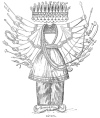

  
[Intangible Textual Heritage](../../index)  [Hinduism](../index) 
[Index](index)  [Previous](hmvp24)  [Next](hmvp26) 

------------------------------------------------------------------------

  
*Hindu Mythology, Vedic and Puranic*, by W.J. Wilkins, \[1900\], at
Intangible Textual Heritage

------------------------------------------------------------------------

##### 7. THE RĀMA CHANDRA AVATĀRA.

In Northern India this is perhaps the most popular of all the
incarnations of Vishnu, and certainly the Rāmāyana, in which his history
is found, contains some of the most beautiful legends in the whole of
the sacred writings of the Hindus. The Rāmāyana is very largely occupied
with the story of Rāma's life, and the poets have found in its legends
subjects for their most attractive poems. A whole volume might easily be
written, giving a biography of this most popular hero; we must, however,
content ourselves with the merest outline of his doings.

Mr. Griffiths, in the preface to his translation of the Rāmāyana, says,
"The great exploit and main subject of the Epic is the war which Rāma
waged with the giant Rāvan, the fierce and mighty King of Lanka or
Ceylon, and the dread oppressor of gods and nymphs, and saints and men."
"The army," to borrow the words of Gorresio, "which Rāma led on this
expedition was, as appears from the poem, gathered in great part from
the region of the Vindhya hills; [\*](#fn_165)
but the races which he

p. 171

assembled are represented in the poem as monkeys, either out of contempt
for their barbarism, or because at that time they were little known to
the Sanskrit-speaking Hindus. The poet calls the people whom

  [  
Click to enlarge](img/17100.jpg)  
THE RĀMA CHANDRA AVATĀRA.  

\[paragraph continues\] Rāma attacked
Rakshasas. Rakshasas, according to the popular Indian belief, are
malignant beings, demons of

p. 172

many shapes, terrible and cruel, who disturb the sacrifices and
religious rites of the Brāhmans. It appears indubitable that the poet of
the Rāmāyana applied the hated name of Rākshasas to an abhorred and
hostile people, and that this denomination is here rather an expression
of hatred and horror than a real historical name." The account of Rāma
which follows is taken from the translation of the Rāmāyana in verse by
Mr. Griffiths.

Dasaratha, the King of Ayodha, being childless, determined to make an
*asvamedh*, or horse sacrifice, to obtain a son. It was necessary, in
order to make an acceptable offering, that the horse destined for
sacrifice be allowed to wander at will for a whole year, as a sign that
the authority of its owner was acknowledged by the neighbouring princes.
The people loved their king, and during his reign were very prosperous;
but, owing to the want of a son, the happiness of king and subjects was
incomplete. The sacrifice therefore was determined on, the holy place
fixed, the horse set free, and the king, encouraged by the Brāhmans,
invited the neighbouring princes to attend the great preparations made.
At length the rite was satisfactorily accomplished and the presiding
Brāhman addressing Dasaratha said:—

"Four sons. O monarch, shall be thine,  
 Upholders of the royal line. [\*](#fn_166)  
   \*         \*         \*         \*  
 Another rite will I begin,  
 Which shall the sons thou cravest win,  
 When all things shall be duly sped  
 And first Atharva texts be read." [†](#fn_167)

The gods having graced the assembly the saint who performed the rite
thus addressed them:—

p. 173

"For you has Dasaratha, slain  
 The votive steed, a son to gain;  
 Stern penance rites the king has tried,  
 And in firm faith on you relied.  
 And now with undiminished care  
 A second rite would now prepare.  
 But, O ye gods, consent to grant  
 The longing of your suppliant." [\*](#fn_168)

The gods, pleased with the Brāhman's prayer, led by Indra, proceeded to
Brahmā, and presented to him their united petition, in which they
mention the great work they wished Rāma, as one of Dasaratha's sons, to
perform:

"O Brahmā, mighty by thy grace,  
 Rāvan, who rules the giant race,  
 Torments us in his senseless pride  
 And penance-loving saints beside.  
 For thou, well-pleased in days of old,  
 Gayest the boon that makes him bold,  
 That gods nor demons e’er should kill  
 His charmed life, for so thy will.  
 We, honouring that high behest,  
 Bear all his rage, though sore distrest.  
 That lord of giants, fierce and fell,  
 Scourges the earth, and heaven and hell.  
 Mad with thy boon, his impious rage  
 Smites saint and bard, and god and sage.  
 The sun himself withholds his glow,  
 The wind, in fear, forbears to blow;  
 The fire restrains his wonted heat  
 Where stands the dreaded Rāvan's feet,  
 And, necklaced with the wandering wave.  
 The sea before him fears to rave.  
 Kuvera's self, in sad defeat,  
 Is driven from his blissful seat.  
 We see, we feel, the giant's might,  
 And woe comes o’er us and affright.

p. 174

To thee, O lord, thy suppliants pray  
To find some cure this plague to stay." [\*](#fn_169)

To this request Brahmā makes answer—

     "One only way I find  
 To slay this fiend of evil mind.  
 He prayed me once his life to guard  
 From demon, god, and heavenly bard,  
 And spirits of the earth and air;  
 And I, consenting, heard his prayer.  
 But the proud giant, in his scorn,  
 Reeked not of man of woman born.  
 None else may take his life away,  
 But only man the fiend may slay." [†](#fn_170)

Upon this Vishnu appears, is gladly welcomed by the assembled gods, and
asks what request they have to make:

"King Dasaratha, thus cried they,  
 Fervent in penance many a day,  
 The sacrificial steed has slain,  
 Longing for sons, but all in vain.  
 Now, at the cry of us forlorn,  
 Incarnate as his seed be born.  
 Three queens has he; each lovely dame  
 Like Beauty, Modesty, or Fame.  
 Divide thyself in four, and be  
 His offspring by these noble three;  
 Man's nature take, and slay in fight  
 Rāvan, who laughs at heavenly might:  
 This common scourge, this rankling thorn,  
 Whom the three worlds too long have borne." [‡](#fn_171)

Vishnu asks why it is necessary for him to effect their deliverance.
Being told of Brahmā's promise to Rāvan, he at length consents to be
born as man, in order to slay the giant and his family.

p. 175

Not long after this, a messenger comes from Vishnu, laden with a golden
vase of nectar, which, as he gives it to the king, instructs him to hand
it to his queens, assuring them that

"They the princely sons shall bear,  
 Long sought by sacrifice and prayer." [\*](#fn_172)

To Queen Kausalya the king gave half the nectar, who through it became
the mother of Rāma; the other half he gave to his other wives, who in
consequence became mothers too—Kaikeya bore Bharat, and Sumitra gave
birth to Lakshman and Satrughna.

Before leaving heaven, Vishnu besought the gods, for whose benefit he
was about to undertake the work, to assist him, and they did so in
various ways, chiefly by begetting powerful sons to enter his army.

"Each god, each sage became a sire,  
 Each minstrel of the heavenly quire,  
 Each faun, of children strong and good." [†](#fn_173)

The names of some of the leaders who assisted Rāma in answer to this
prayer run as follows:—

"Bali, the woodland hosts who led,  
 High as Mahendra's lofty head,  
 Was Indra's child. That noblest fire,  
 The Sun, was great Sugriva's sire.  
 Tārā, the mighty monkey, he  
 Was offspring of Vrihaspati:  
 Tāra, the matchless chieftain, boast  
 For wisdom of the Vānar host.  
 Of Gandhamādan, brave and bold,  
 The father was the Lord of gold.  
 Nala the mighty, dear to fame,  
 Of skilful Visvakarma came.  
 From Agni, Nila bright as flame,

p. 176

\[paragraph
continues\]  Who in his splendour, might, and worth,  
 Surpassed the sire who gave him birth.  
 The heavenly Asvins, swift and fair,  
 Were fathers of a noble pair,  
 Who, Dwivida and Mainda named,  
 For beauty like their sires were famed.  
 Varun was father of Sushen;  
 Of Sarabh, he who sends the rain \[Parjanya\].  
 Hanumān, best of monkey kind,  
 Was son of him who breathes the wind;  
 Like thunderbolt in frame was he,  
 And swift as Garud's self could flee.  
 These thousands did the gods create,  
 Endowed with might which none could mate,  
 In monkey forms that changed at will,  
 So strong their wish the fiend to kill." [\*](#fn_174)

In due time the four sons of Dasaratha were born; and from infancy the
strongest affection existed between Rāma the firstborn and Lakshman, and
between Bharat and Satrughna.

When Rāma was about sixteen years of age, a saint named Visvamitra came
to Dasaratha's court, asking his assistance against two demons, named
Maricha and Suvahu, who were commanded by Rāvana to annoy him, and
prevent the completion of his sacrifices. At first the king pleaded the
youthfulness of his son as an excuse for refusing to allow him to
undertake a work so arduous; but at length his scruples were overcome,
and Rāma with the faithful Lakshman set out for the hermitage. When the
travellers reached the banks of the Sarju, the saint gave Rāma two
spells which he was to employ whilst bathing, and which were so to
affect him that he should have no equal in heaven or hell:

"None in the world with thee shall vie,  
 O sinless one, in apt reply,

p. 177

\[paragraph
continues\]  In knowledge, fortune, wit, and tact,  
 Wisdom to plan, and skill to act." [\*](#fn_175)

On their journey to the hermitage they visit several places of
importance, and Visvamitra beguiles the time with numerous legends; he
also bestows on Rāma various arms and powers. On reaching the end of
their journey, for six days and nights they have to watch for the
demons; just as the sacrifice was about to end, these disturbers of the
hermitage appear, are conquered by Rāma, and their attendants by
Lakshman. The saint, addressing Rāma, says—

"My joy, O prince, is now complete:  
 Thou hast obeyed my will;  
 Perfect before, this calm retreat  
 Is now more perfect still." [†](#fn_176)

Next morning the hermits tell Rāma that King Janaka of Mithila [‡](#fn_177) had arranged for a sacrifice to which
they are invited. Rāma is asked to accompany them, and is induced to do
so by the mention of a wonderful bow in possession of the king, which no
one was able to bend. The bow was a gift from Siva, as a reward for
sacrifice. On the way to Mithila they pass through a grove, in which,
unseen by gods and men, Ahalyā, the wife of Gautama the sage, had been
undergoing penance for countless ages, on account of her adultery with
Indra. Though the god came to her in the form of her husband, she saw
through his disguise, yet did not resist his overtures. Her husband
condemned her to live unknown in the forest until Rāma should liberate
her. Her hour of release had now come: Rāma sees her, touches her feet,
and, the curse being at an end, her husband receives her back.

p. 178

In due time they reach Mithila. The princes are introduced to the king,
who gives them a hearty welcome, and narrates the history of the
world-famed bow they have come to see. He tells them it was the bow with
which Siva, when angry at not being invited to Daksha's sacrifice,
wrought such havoc amongst the assembled gods. It was held by successive
monarchs of his line as a mark of sovereignty, and as a means of defence
against their foes.

               "This gem of bows,  
 That freed the God of gods from woes,  
 Stored by our great forefathers, lay  
 A treasure and a pride for aye." [\*](#fn_178)

One day, as Janaka was ploughing, an infant sprang from the ground, whom
he named Sitā (a furrow), on account of her secret birth. In the "Uttara
Kānda," [†](#fn_179) is a legend, the object of
which is to show that Sitā is another form of Lakshmi, and that it was
she who wished to accomplish the death of Rāvana. "Rāvana in the course
of his wanderings comes to the Himalayas, where he meets with a young
woman of marvellous beauty, named Vedāvati, dressed in ascetic garments,
and living the life of a devotee. He speaks of love; but she indignantly
rejects his overtures, saying that it was her father's wish she should
wed Vishnu, and that she had already wedded him with her heart. Rāvana
presses his suit, assuring her that he is superior to Vishnu. She says
that none but he would contemn that deity. Rāvana replies by touching
her hair. Being very indignant at this, she declares that she will enter
the fire (die) before his eyes. Before doing so, she says, 'Since I have
been insulted in the forest by thee, who art wicked-hearted, I

p. 179

shall be born again for thy destruction. For a man of evil design cannot
be slain by a woman; and the merit of my austerity would be lost if I
were to launch a curse against you. But if I have performed, or
bestowed, or sacrificed aught, may I be born a virtuous daughter—not
produced from the womb—of a righteous man.' She then entered the blazing
fire. It was she who was born as the daughter of King Janaka. The
mountain-like enemy (Rāvana), who was virtually destroyed before by her
wrath, has now been destroyed by her after she had associated herself
with Vishnu's superhuman energy."

Regarding the child thus mysteriously found to be other than of mortal
birth, to all suitors for her hand Janaka gave one reply—

"I give not this my daughter; she  
 Prize of heroic worth shall be." [\*](#fn_180)

She was to be the wife of him who could bend the wonder-working bow.
Many of the neighbouring princes had tried, but failed. And now Janaka
says—

"This heavenly bow, exceeding bright,  
 These youths shall see, O anchorite.  
 Then if young Rāma's hand can string  
 The bow that baffled lord and king,  
 To him I give, as I have sworn,  
 My Sitā, not of woman born." [†](#fn_181)

The bow is brought, and Rāma invited to try his strength. He takes it up
easily in his hand, and as he was drawing the string, it snapped in two,
to the wonder and fright of the beholders. Rāma thus becomes the
successful suitor of Sitā, and messengers are despatched

p. 180

to invite his father to the wedding. His two brothers also come; and not
only Rāma and Sita are united, but his three brothers are wedded to the
three other daughters of Janaka. They then return home and live in
happiness and prosperity.

After a time King Dasaratha wishes to abdicate in favour of Rāma his
firstborn. When he had fixed upon a suitable time, the old man sends for
his son, and enjoins him to prepare himself for the great event, by
passing the night in holy exercises. The people hearing of the king's
intention are delighted; the city is illuminated, and they spend the
night in festivities. In the mean time a servant goes to Kaikeya, the
mother of Bharata, and succeeds in exciting her jealousy of Rāma to such
an extent, that she secludes herself in the room of discontent in the
palace. The king visits her, when she says to him—

"Now pledge thy word, if thou incline  
 To listen to this prayer of mine." [\*](#fn_182)

Ignorant of what her petition is, the king foolishly promises to grant
it, before it is expressed. She, calling the gods to witness the promise
and oath of her husband, reminds him that on an occasion of great danger
she alone had stood by him, and that he then promised her a boon.. She
now requested the fulfilment of that vow; or,

"If thou refuse thy promise sworn,  
 I die despised before the morn," [†](#fn_183)

and concludes her address by asking that her son be installed as Prince
Regent, and Rāma be sent to live a hermit's life in the forest for
fourteen years.

p. 181

The king, almost mad with grief at this request, being bound by word and
oath, is compelled to comply. The city is in tears that but yesterday
was bright with joy; and the ceremony that was arranged for Rāma is
performed in favour of Bharata, much against his will. Rāma tried to
persuade Sitā to allow him to proceed to the forest alone; but to this
she will not for a moment consent. The interview between them on this
occasion is one of the most beautiful and touching incidents in the
whole story. She despises difficulties, dangers and discomforts, if she
is with her husband; and avers that death would be preferable to
separation. Lakshman's entreaty to accompany them is very touching too:

"I need not homes of god on high,  
 I need not life that cannot die;  
 Nor would I wish, with thee away,  
 O’er the three worlds to stretch my sway." [\*](#fn_184)

At length Rāma, Sitā, and Lakshman depart, amidst the tears of the whole
city. When they reach the forest Dandaka, they seek a quiet spot, and at
last settle down at. Chitrakuta.

Dasaratha dies of grief a short time after their departure, and the city
is again flooded with tears. Bharata visits the exiles, with the
intention of bringing his brother home to occupy the throne, but to this
Rāma will not consent. Bharata therefore continues to rule in his stead,
but always regards him as the rightful king, and keeps a pair of his
shoes, which are exposed to view on state occasions, to indicate that
Bharata is acting only as Viceroy.

The three meet with many adventures in the forest, where they live the
life of ascetics. One day they see

p. 182

an immense giant, named Viradha, clothed in a tiger's skin, and

"Three lions, tigers four, ten deer,  
 He carried on his iron spear." [\*](#fn_185)

This giant, taking Sitā aside, threatens to kill and eat her; but after
a time, changing his mind, proposes to keep her; and, thinking that he
is acting generously towards Rāma, offers to allow him to go off
unharmed. At length they fight; but as the giant is proof against their
weapons, they do not make much progress. After a time he takes up Rāma
and Lakshman on his shoulders, and runs away with them. As they are
being carried each succeeds in cutting off one of his arms. The giant
falls, weak from loss of blood; and, seeing that their weapons cannot
deprive hire of life, they bury him alive. After this adventure, they
reach the hermitage, and Rāma becomes the protector of hermits
throughout the district.

When ten years of his forest life were past, Rāma sets off for the
hermitage of Agastya, a man who had gained great merit by his
austerities. There they build a cottage, but are not able to live in
peace very long. As Rāma and Sitā are sitting together under a tree, a
giantess named Suparnakhā, the sister of Rāvana, passes by, and falls
madly in love with Rāma.

"She, grim of eye and foul of face,  
 Loved his sweet glance and forehead's grace;  
 She of unlovely figure, him  
 Of stately form and shapely limb;  
 She whose dim locks disordered hung,  
 Him whose bright hair on high brows clung." [†](#fn_186)

The giantess questions Rāma as to the reason of his being in the forest.
After giving a full account of himself

p. 183

and Sitā, he inquires who she may be. She says she is Rāvanā's sister,
and openly avows her love:

"This poor misshapen Sitā leave,  
 And me, thy worthier bride, receive.  
 Look on my beauty, and prefer  
 A spouse more meet than one like her;  
 I'll eat that ill-formed woman there;  
 Thy brother, too, her fate shall share.  
 But come, beloved, thou shalt roam  
 With me through all our woodland home." [\*](#fn_187)

Rāma, smiling, told her that as he was married he could not accept her
kind offer, but advised her to try his brother. She acts upon this
advice; but Lakshman sends her back to Rāma. Thinking that Sitā was the
obstacle to the attainment of her wishes, she was about to slay her;
Rāma prevented her from doing this, and Lakshman cut off her nose and
ears. She fled to her brother Khara, whose anger she roused by the tale
of her mutilation, who sent fourteen giants, giving them strict orders
to kill Rāma, Sitā, and Lakshman. These giants are easily slain. Khara
is terribly angry when he hears of their death; and, quickly raising an
army of 14,000 warriors, goes against his foes. Rāma, single-handed,
destroyed them nearly all.

One of the giants, named Akampan, rushed away to inform Rāvana of the
catastrophe. Rāvana, intensely angry, asks—

"Who is the wretch shall vainly try  
 In earth, heaven, hell, from me to fly?  
 Vaisravan, Indra, Vishnu, He  
 A Who rules the dead, must reverence me;  
 For not the mightiest lord of these  
 Can brave my will, and live at ease. . . .  
 With unresisted influence, I  
 Can force e’en Death himself to die." [†](#fn_188)

p. 184

He then asks particulars of the fight, and determines to avenge his
sister. The messenger informs him that it is useless for him to attempt
to conquer Rāma by force, and advises him rather to carry off Sitā; for,

"Reft of his darling wife, be sure  
 Brief days the mourner will endure." [\*](#fn_189)

Rāvana orders his chariot, starts off alone to Maricha, and asks his
assistance, who dissuades him from attempting to fight with Rāma; but
soon afterwards, when Suparnakhā, with her mutilated face, appears
before Rāvana, she arouses his indignation. As he sat on his throne he
is thus described:—

"A score of arms, ten necks, had he,  
 His royal gear was brave to see;  
 His stature like a mountain height,  
 His arms were strong, his teeth were white.  
    \*          \*          \*          \*  
"Ten thousand years the giant spent  
 On dire austerities intent;  
 And of his heads an offering, laid  
 Before the Self-existent, made." [†](#fn_190)

The giantess retells her tale, exciting her brother's anger afresh. He
immediately sets off again for the hermitage of the fiend Maricha, and
asks him to assist in his exploit by assuming the form of a golden deer
with silver spots, by which Sita's attention would be attracted.

"Doubt not the lady, when she sees  
 The wondrous deer among the trees,  
 Will bid her lord and Lakshman take  
 The creature for its beauty's sake."

Maricha, remembering the power of Rāma when as a mere boy he went to
assist the hermit Visvamitra, and

p. 185

how he himself was wounded by him, again tries to dissuade Rāvana. But
this time he cannot prevail, and there is not much choice left him, for
Rāvana declares—

"Thy life, if thou the task essay,  
   In jeopardy may stand;  
 Oppose me, and this very day  
   Thou diest by this hand." [\*](#fn_191)

 
[  
Click to enlarge](img/18500.jpg)  
RĀVANA.  

Maricha assumes the form of a deer, and, proceeding to the vicinity of
the hermitage, attracts the attention

p. 186

of Sitā, who becomes anxious to possess it. Rāma, leaving Lakshman to
guard the home, goes in pursuit, and shoots it. As the fiend was dying,
assuming Rāma's voice, he cried out loudly enough to be heard by the
wife and brother, "Ho, Sitā! Ho, Lakshman!" They imagining that some
evil had come to Rāma, Lakshman hurried towards the spot whence the cry
proceeded; whilst Rāvana, who was waiting near, seized the opportunity
to carry off the defenceless Sitā. The demon did his best to induce her
to yield herself an easy prey; but though she struggled hard, and cried
for help to all who came near, none were able to deliver her. Held in
his magical car, they reached Lanka, where she was placed in one of
Rāvana's palaces. He tried both by kind words and fearful threatenings
to win her love; but kindness and cruelty were equally ineffective. To
comfort her, Brahmā sent Indra, who managed to elude the vigilance of
her guards, and assured her of the sympathy of the gods, and of the fact
that all would yet be well with her husband and herself.

Whilst this was happening at Lanka, Rāma was almost mad with grief. When
Lakshman came to him after the deer was slain, he feared some evil had
happened; and on their return to the cottage, as Sitā was not to be
found, his anguish was intolerable. He wandered about calling upon the
trees, mountains, and rivers to tell him what had happened to his loved
one; but they were silent as the grave. A vulture at the point of death,
who had fought with Rāvana on Sitā's behalf, informs him of her capture
by the great fiend. (See part iii. chap. vii.)

In their wanderings, the brothers meet with a giant named Kabandha, who,
owing to a curse, had to wear the hideous form in which he appeared,
until his arms

p. 187

should be cut off by Rāma. As he was running away with the brothers on
his shoulders, they fulfilled this condition, there being no other way
of escape for them. On learning who they were, he was delighted, and
asked them, as a favour, to burn his body in order that he might regain
his proper form, and ascend to heaven. As the flames encircled him, he
assumed a heavenly shape, and when in mid-air, told them where Sitā was
taken, and advised them to seek the help of Sugriva, the King of the
Vānar [\*](#fn_192) (Monkey) tribes, as only
through his aid could they recover her. Acting upon this advice, they
proceed to Pampa, Sugriva's home; where the sight of the beauty of the
lake causes Rāma's lamentations to burst forth afresh:

"By sights like these of joy and peace,  
 My pangs of hopeless love increase." [†](#fn_193)

When Sugriva saw the brothers, imagining them to be friends of his
brother Bāli, by whom he had been deprived of his throne, he was greatly
alarmed, and sent Hanumān, his commander-in-chief, to learn who they

p. 188

were, and why they had come. When Hanumān learns the object of their
visit, thinking they might be induced to assist his master to regain his
kingdom, he promises Sugriva's help, and, taking them upon his
shoulders, hurries off with them into the presence of the Vānar king. A
league is made immediately, and after Rāma had promised that the usurper
Bāli should fall that day, Sugriva says of Sitā—

"Yea, though in heaven the lady dwell,  
 Or prisoned in the depths of hell,  
 My friendly care her way shall track,  
 And bring thy ransomed darling back." [\*](#fn_194)

Sugriva produces a robe, bracelets, and anklets that fell from Sitā as
she was being carried off by Rāvana; the anklets Rāma recognizes at
once, and is greatly comforted as Sugriva tells him that though at
present unable to inform him where Sitā has been taken, he will be able
to obtain this information, and assist him in his attempt to rescue her.
Sugriva then narrates the story of his quarrel with his brother, but,
ere he believes that Rāma can materially assist him, wished to test the
wonderful bow of the hero. He was greatly astonished as he saw an arrow
Rāma discharged pierce seven palm-trees in line, pass through a hill
behind them, and, after traversing six subterranean worlds, return to
the quiver. The Vānar king, seeing he has secured no common ally, goes
forth fearlessly against his brother; and in the fight, when Sugriva was
getting worsted, Rāma sends an arrow which slays his brother. This was
regarded by the dying man as an act of gross injustice, because Rāma
slew him without informing him who he was; had

p. 189

he only known he would gladly have assisted him in his quest for Sitā.

Sugriva, on the fall of his brother, re-ascends the throne, but is so
fully occupied with the pleasures of his position as to forget the
promise of help he had given Rāma, by whose prowess his dominion had
been regained. Hanumān, ever faithful to Rāma's cause, reminds him—

"The realm is won, thy name advanced,  
 The glory of thy house enhanced;  
 And now thy foremost care should be  
 To aid the friends who succoured thee." [\*](#fn_195)

But this reminder of his duty is insufficient to arouse the king from
his selfish enjoyment; it was not until Rāma sends a strong message by
Lakshman that he is alive to his duty. When, however, he does move, it
is to collect a mighty army. Of the troops collected for this enterprise
it is said—

"Thousands, yea, millions shall there be  
 Obedient to their king's decree.  
        \*        \*        \*        \*  
 Fierce bears and monkey troops combined,  
 And apes of every varied kind,  
 Terrific in their forms, who dwell  
 In grove and wood and bosky dell." [†](#fn_196)

The king gave instructions to each leader of a division, as to the
limits of the district he was to search for the lost princess; but as
Rāvana was believed to have gone towards the south, Hanumān's district,
special instruction was given to him; and Rāma entrusted him with a ring
which, if successful in discovering Sitā, he could show her as a proof
that he was a messenger from her husband. For a long time the search was
fruitless, and would have been given up as

p. 190

hopeless, but for Hanumān's perseverance. When they were about to
relinquish the search, they met the vulture Sampati, brother of Jatayus,
whom Rāvana had slain as he attempted to prevent him from carrying off
Sitā. This bird was the first to put Rāma on the right track for
obtaining his wife. Sampati, hearing that Rāvana had slain his brother,
was most anxious to avenge his death, and willingly rendered all the
assistance he could. He informs the seekers that Sitā is at Lanka.

"A hunched leagues your course must be,  
 Beyond this margin of the sea;  
 Still to the south your way pursue,  
 And there the giant Rāvan view." [\*](#fn_197)

But here a difficulty occurred: there were a hundred leagues of water to
be crossed; who could make the leap? Hanumān again comes to the front
and declares—

"Swift as a shaft from Rāma's bow,  
 To Rāvan's city I will go." [†](#fn_198)

According to his promise, Hanumān made the marvellous spring. After
meeting with various adventures, at length he reaches the capital of
Lanka, and, diminishing in size until he is no bigger than a cat, passes
through the city unnoticed, and finally enters the Asoka grove where
Sitā was confined. He was just in time to witness an unsuccessful
attempt of Rāvana to induce his lovely captive to forget her husband,
and become his bride. Rāvana's parting words to Sitā on this occasion
were not very love-inspiring; he declared that unless within two months
she consented to become his bride,

"My cooks shall mince thy limbs with steel,  
 And serve thee for my morning meal." [‡](#fn_199)

p. 191

When she is alone, Hanumān addresses her. At first, on hearing a monkey
speak, she imagines herself dreaming; but the sight of her husband's
ring convinces her that the strange messenger is a friend, and she is
delighted to hear all he has to tell:

"'Thou bringest me,' she cried again,  
 'A mingled draught of bliss and pain:  
 Bliss that he wears me in his heart,  
 Pain that he wakes and weeps apart.'" [\*](#fn_200)

Though Hanumān had found Sitā, and offered to carry her on his shoulders
to her long-lost husband, a difficulty arose; she feared that in rising
to the height which so long a leap necessitated, she might be giddy, and
find it necessary to lay hold of him; but of her own free will she would
on no account so much as touch the limbs of living man except those of
her husband. Instead, then, of availing herself of the monkey's offer,
she prefers to remain where she is for the present, and simply sends
back a kind message to Rāma, with a gem to assure him that she has
received his. Hanumān does not care to return without having effected
some injury on his foe; he therefore destroys the grove and temple, and
slays several of Rāvana's heroes. At length he is made captive. When
taken before Rāvana, he confesses that he is a messenger from Rāma to
Sitā, and earnestly advises her restoration. This so exasperates the
giant that he would have slain him at once had he not been an envoy—and
an envoy's life is sacred. Some of Rāvana's people, however, set fire to
his tail, and though he does not experience much pain, he manages to set
fire to the city in several places.

When Hanumān had completed his work in Lanka, he made a return leap to
India, placed Sitā's gem in

p. 192

\[paragraph continues\] Rāma's hand, and
told him all that had transpired in Rāvana's capital. The prince was
delighted to hear of his wife's constancy; but as the difficulty of
transferring an army from the mainland over a hundred leagues of sea
seemed impossible to surmount, he despaired of seeing her again.
Sugriva, more practical and fuller of resource, says—

                     "Thy task must be  
 To cast a bridge across the sea,  
 The city of our foe to reach,  
 That crowns the mountain by the beach;  
 And when our feet that isle shall tread,  
 Rejoice and deem thy foeman dead." [\*](#fn_201)

The army, which had remained some distance away, now marches to the
seashore, and Rāma is very curious to learn by what means so vast a
bridge can be built. He in his anguish calls upon the sea to withdraw
and allow his followers to march across as on dry land; but although the
Ocean will not grant this prayer, he does assist with his advice, as he
tells him to enlist the services of a tribe of Dasyas (servants), who,
together with the monkey host, construct a bridge in five days. No
sooner is this completed than the troops march across, Rāma being
carried by Hanumān, and Lakshman by Angad; and though Rāvana hears of
their approach, and his spies, terrified at the appearance of the
invading army, counsel him to yield, he obstinately refuses, and at last
the attack upon his city is made.

After fierce fighting, with considerable loss on both sides, Rāma and
Lakshman are dangerously wounded by Indrajit, a son of Rāvana; but on
some wonderful herbs being applied to them by Garuda, the marvellous
bird of Vishnu, they are restored. A second time they

p. 193

fall, and are again restored by herbs which Hanumān fetched in an
incredibly short space of time from the Himalayas. At last Rāma and
Rāvana meet face to face. Rāma's destructive arrows seem at first to
have met with a foe as wonderful as themselves:

"Straight to its mark the arrow sprang,  
 And from the giant's body shred,  
 With trenchant steel, the monstrous head.  
 There might the triple world behold  
 The severed head adorned with gold.  
 But when all eyes were bent to view,  
 Swift in its stead another grew." [\*](#fn_202)

Acting on the advice of Mātali, Rāma, tired of this fruitless toil,
launched an arrow " whose fire was kindled by the Almighty Sire," which
pierced the giant's heart and laid him dead at his feet. Hanumān is
despatched to assure Sitā of the death of her captor, and in a few hours
she is carefully sent in a litter by Vibhishan, the brother and
successor of Rāvana. This litter Rāma causes to be opened, that the
monkeys may see his wife's face, as he says—

"A woman's guard is not her bower,  
 The lofty wall, the fenced tower:  
 Her conduct is her best defence,  
 And not a king's magnificence." [†](#fn_203)

This speech struck terror in the hearts of all around, and Sitā
especially is almost heartbroken as, instead of the warm and loving
welcome she had anticipated, he coolly tells her—

"Lady, at length my task is done,  
 And thou, the prize of war, art won.  
        \*       \*       \*       \*

p. 194

"If from my home my queen was reft,  
 This arm hath well avenged the theft;  
 And in the field has wiped away  
 The blot that on my honour lay.  
         \*       \*       \*       \*  
"But, lady, ’twas not love for thee  
 That led mine army o’er the sea.  
         \*       \*       \*       \*  
"I battled to avenge the cause  
 Of honour and insulted laws.  
 My love is fled, for on thy fame  
 Lies the dark blot of sin and shame;  
 And thou art hateful as the light  
 That flashes on the injured sight.  
 The world is all before thee: flee:  
 Go where thou wilt, but not with me.  
         \*       \*       \*       \*  
"For Rāvan bore thee through the sky,  
 And fixed on thine his evil eye;  
 About thy waist his arms he threw,  
 Close to his breast his captive drew;  
 And kept thee, vassal of his power,  
 An inmate of his ladies’ bower." [\*](#fn_204)

Hearing these cruel and unexpected words, Sitā makes a most pathetic
appeal, in which she vehemently asserts her innocence; but as there are
no signs of relenting in her husband, she wishes to die, or to prove her
innocence by the fire-ordeal, and asks Lakshman to prepare a funeral
pile:

"I will not live to bear this weight  
 Of shame, forlorn and desolate.  
 The kindled fire my woes shall end,  
 And be my best and surest friend." [†](#fn_205)

Lakshman performs this sad office; and when all is ready, she walks
round it, and, before entering the fire, addresses Agni:

p. 195

"As this fond heart, by virtue swayed,  
 From Raghu's son has never strayed,  
 So universal witness, Fire,  
 Protect my body on the pyre.  
 As Raghu's son has idly laid  
 This charge on Sitā, hear and aid." [\*](#fn_206)

Having made this appeal to Agni to proclaim her innocence, she enters
the fire. The gods, descending from heaven in their glory, address Rāma,
saying:

"Couldst thou, the Lord of all, couldst thou,  
 Creator of the worlds, allow  
 Thy queen, thy spouse to brave the fire,  
 And give her body to the pyre?  
 Dost thou not yet, Supremely Wise,  
 Thy heavenly nature recognize?" [†](#fn_207)

Rāma frankly confesses that he believes himself to be only a mortal;
Brahmā tries to enlighten him, as he assures him that he is Vishnu
incarnate for the purpose of slaying Rāvana, and that Sitā, whom his
cruel conduct had driven into the fire, was no other than Lakshmi, his
celestial spouse. In confirmation of this, Agni appears in the fire,
and, taking Sitā by the hand, conducts her to her husband, and declares
her to be pure and spotless. Rāma receives her with the greatest joy,
and states that he was certain of her innocence all along, but that as
others might have doubted her, he had caused her to pass through this
ordeal.

Dasaratha, the father of Rāma, now descends from heaven, and tells him
that even in that happy place he had been sad to witness the sorrows of
his beloved son. Indra next appears, and, at Rāma's request, brings back
to life the many Vānars who had perished in his cause; and then other
gods thank Rāma for the relief he has

p. 196

given them by the death of Rāvana. When these congratulations are over,
Rāma, Sitā, and Lakshman mount a magic car, lent him by Vibhishan, in
which in a single day they travel from Lanka to his own city. On
arriving near it, Hanumān is sent to inform Bharat of their return; and
the joy this intelligence gives to the faithful Bharat, and to the
citizens generally, is indescribable. Rāma quickly assumes his position
as king and the people enjoy unexampled prosperity:

"Ten thousand years Ayodha, blest  
 With Rāma's rule, had peace and rest.  
 No widow mourned her murdered mate,  
 No house was ever desolate.  
 The happy land no murrain knew,  
 The flocks and herds increased and grew,  
 The earth her kindly fruits supplied,  
 No harvest failed, no children died.  
 Unknown were want, disease, and crime,  
 So calm, so happy was the time." [\*](#fn_208)

This state of universal happiness does not continue for ever. People in
the city have doubts regarding the purity of their queen, which at
length reach the ears of Rāma, who, taking advantage of a wish of Sitā
once again to see a hermitage, leaves her to live an ascetic life. When
her twin sons, born in her forest home, come of age, she sends them to
their father's court. The king on seeing them, deeply feels the
injustice he had done their mother, and determines at any cost to
reinstate her as his queen. On her arrival he asks her to assert her
innocence before the assembled court; but even Situ could not bear this.
She calls to the earth which gave her birth now to give her a home; the
earth opened and received her into her bosom. After this Rāma grows

p. 197

tired of life, and Time comes to inform him that his work is done.
Hearing this, the good king goes to the banks of the sacred stream, and
forsaking his body ascends to his home in heaven.

Rāma, to a vast number of Hindus, is not merely the King of Ayodha,
whose history is so pathetically told in the Rāmāyana; nor the
benefactor of gods, as he slew their enemy, Rāvana; but their saviour
and friend. As the dead are carried to the river-side to be burned, the
friends repeatedly cry, "Rāma, Rāma, Satya Nāma," *i.e.* " Rāma, Rāma,
the true name." Probably this is owing to the fact that in life his
power of intercession for the dead was great; whilst his kindness to and
care for his followers were such as to encourage men's trust. He is said
to have taken the whole of the inhabitants of his beloved city Ayodha to
Brahmā's heaven without their suffering death. At his intercession
Rāvana's spies were saved; and the Vānar hosts that had fallen in battle
were restored to life. He entreated his father Dasaratha to remove the
curse which he had pronounced upon Kaikeya, the mother of Bharata,
through whose unkindness Rāma had been exiled.

------------------------------------------------------------------------

### Footnotes

[170:\*](hmvp25.htm#fr_165) It is a strange
though real confirmation of the truth of the underlying history of the
hero that to this day the aboriginal tribes inhabiting the Vindhya hills
have many legends relating to the life of Rāma and Sita, although they
are not Hindus, and know but little of p. 171
Hinduism. These people are not at all like the Hindus in appearance.
They are black, have curly hair and thick lips, not very unlike some
African races.

[172:\*](hmvp25.htm#fr_166) Griffiths's
"Rāmāyana," i. 81.

[172:†](hmvp25.htm#fr_167) Ibid. i. 82.

[173:\*](hmvp25.htm#fr_168) Griffiths's
"Rāmāyana," i. 83.

[174:\*](hmvp25.htm#fr_169) Griffiths's
"Rāmāyana," i. 83.

[174:†](hmvp25.htm#fr_170) Ibid. i. 84.

[174:‡](hmvp25.htm#fr_171) Ibid. i. 85.

[175:\*](hmvp25.htm#fr_172) Griffiths's
"Rāmāyana," i. 89.

[175:†](hmvp25.htm#fr_173) Ibid. i. 93.

[176:\*](hmvp25.htm#fr_174) Griffiths's
"Rāmāyana," i. 93.

[177:\*](hmvp25.htm#fr_175) Griffiths's
"Rāmāyana," i. 125.

[177:†](hmvp25.htm#fr_176) Ibid. i. 156.

[177:‡](hmvp25.htm#fr_177) Tirhoot.

[178:\*](hmvp25.htm#fr_178) Griffiths's
"Rāmāyana," i. 278.

[178:†](hmvp25.htm#fr_179) Muir, O. S. T., iv.
458.

[179:\*](hmvp25.htm#fr_180) Griffiths's
"Rāmāyana," i. 279.

[179:†](hmvp25.htm#fr_181) Ibid. i. 280.

[180:\*](hmvp25.htm#fr_182) "Griffiths's
"Rāmāyana," i. 373.

[180:†](hmvp25.htm#fr_183) Ibid.

[181:\*](hmvp25.htm#fr_184) Griffiths's
"Rāmāyana," ii. 94.

[182:\*](hmvp25.htm#fr_185) Griffiths's
"Rāmāyana," iii. 5.

[182:†](hmvp25.htm#fr_186) Ibid. iii. 80.

[183:\*](hmvp25.htm#fr_187) Griffiths's
"Rāmāyana," iii. 82.

[183:†](hmvp25.htm#fr_188) Ibid. iii. 143.

[184:\*](hmvp25.htm#fr_189) Griffiths's
"Rāmāyana," iii. 143.

[184:†](hmvp25.htm#fr_190) Ibid. iii. 148.

[185:\*](hmvp25.htm#fr_191) Griffiths's
"Rāmāyana," iii. 185.

[187:\*](hmvp25.htm#fr_192) Siva had foretold
that Rāma would obtain the aid of the monkeys for the destruction of
Rāvana, when the demon was travelling in the Himālayas. Siva appeared to
him as a dwarf, and tried to prevent him from going along a certain
road, Rāvana disregarded the prohibition, and contemptuously asked who
Siva was, to give an order that no one should pass that way; he also
ridiculed the monkey-like appearance of the dwarf. Nandeshwara (Siva)
replied that monkeys in appearance and power would be produced to
destroy Rāvana and his family. In order to show his power, Rāvana raised
the mountain in his arms; but Siva pressed it down with his toe, and
crushed Rāvana in his arms, until he cried out with pain; and not until
he had propitiated Siva for a thousand years did he release him. When he
released him, he said that his name should be Rāvana, from the cry
(Rāva) which he uttered.

[187:†](hmvp25.htm#fr_193) Griffiths's
"Rāmāyana," iv. 6.

[188:\*](hmvp25.htm#fr_194) Griffiths's
"Rāmāyana," iv. 37.

[189:\*](hmvp25.htm#fr_195) Griffiths's
"Rāmāyana," iv. 149.

[189:†](hmvp25.htm#fr_196) Ibid. iv. 188.

[190:\*](hmvp25.htm#fr_197) Griffiths's
"Rāmāyana," iv. 254.

[190:†](hmvp25.htm#fr_198) Ibid. iv. 280.

[190:‡](hmvp25.htm#fr_199) Ibid. iv. 334.

[191:\*](hmvp25.htm#fr_200) Griffiths's
"Rāmāyana," iv. 365.

[192:\*](hmvp25.htm#fr_201) Griffiths's
"Rāmāyana," v. 3.

[193:\*](hmvp25.htm#fr_202) Griffiths's
"Rāmāyana," v. 254.

[193:†](hmvp25.htm#fr_203) Ibid. v. 271.

[194:\*](hmvp25.htm#fr_204) Griffiths's
"Rāmāyana," v. 273.

[194:†](hmvp25.htm#fr_205) Ibid. v. 276.

[195:\*](hmvp25.htm#fr_206) Griffiths's
"Rāmāyana," v. 277.

[195:†](hmvp25.htm#fr_207) Ibid. v. 278.

[196:\*](hmvp25.htm#fr_208) Griffiths's
"Rāmāyana," v. 314.

------------------------------------------------------------------------

[Next: 8. The Krishna Avatāra](hmvp26)
