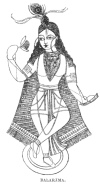

  
[Intangible Textual Heritage](../../index)  [Hinduism](../index) 
[Index](index)  [Previous](hmvp26)  [Next](hmvp28) 

------------------------------------------------------------------------

  
*Hindu Mythology, Vedic and Puranic*, by W.J. Wilkins, \[1900\], at
Intangible Textual Heritage

------------------------------------------------------------------------

##### 8A. THE BALARĀMA AVATĀRA.

According to some accounts of Vishnu's incarnations, Balarāma is the
*eighth;* Krishna in that case not being called an incarnation, but an
appearance of the deity himself; whilst, according to others, the two
brothers together form the eighth, Krishna having been produced from a
black and Balarāma from a white hair of Vishnu: As they were constant
companions during their stay on earth, many of the exploits in which
Balarāma shared have already been narrated in speaking of Krishna. There
are a few legends, [\*](#fn_214) however,
referring chiefly to Balarāma.

p. 221

Balarāma is an incarnation of the serpent Sesha, [\*](#fn_215) who himself was part of Vishnu, and
thus is said to be "a part of a part" of that deity. When appealed to by
the

 
[  
Click to enlarge](img/22100.jpg)  
BALARĀMA.  

distressed gods to appear on earth to save them from their oppressor
Kansa, Vishnu, a year before his own birth, transferred by means of
Yoganindra, the embryo

p. 222

of Balarāma from Devaki to Rohini, another wife of Vasudeva, residing at
Gokula, to save it from the cruel anger of Kansa, who had ordered the
destruction of Devaki's children as soon as they were born. When about a
year old, this child was placed under the care of a herdsman named Nanda
and his wife Yasodà, the reputed parents of Krishna, that the two boys
might be brought up together; Vasudeva, on the night of Krishna's birth,
having carried him to the house of Nanda, and substituted him for the
infant daughter of these people.

Balarāma was second only to Krishna in the possession of miraculous
powers. One day, as he was with the young cow-keepers in a wood, his
companions asked him to shake some fruit trees belonging to a demon
called Dhenuka, that they might enjoy the fruit. As he was complying
with their request, the demon, in the form of a monster ass, appeared.
As he tried to kick Balarāma, the hero seized him by his hind legs,
swung him round his head, and threw him to the ground with such force
that he died immediately: the dead body Balarāma threw to the top of a
palm tree, and the demon's relatives who came to his rescue received
similar treatment at his hands. After Dhenuka's death, his orchard
became a favourite spot of the cowherds. Whilst they were playing there,
a demon named Pralamba came in the form of a boy, and joining them in
their game, persuaded Balarāma to get up on his shoulders. No sooner had
he mounted than the demon ran off with him, and, feeling the hero to be
heavy, he increased his bulk until he became like a mountain in size,
causing Balarāma to tremble with fear, and to call upon Krishna for
help. Krishna reminding him of his divine nature says, "Calling to
memory who thou art, O being of illimitable might, destroy the demon
yourself. Suspending

p. 223

awhile your mortal character, do what is right." Balarāma acting upon
this advice, squeezed the demon with his knees, and pommelled him with
his fists so fiercely that he fell down dead. When boxing with Kansa's
wrestler in the lists at Mathura he easily managed to slay his
antagonist.

After Balarāma had dwelt for some time in Dwaraka, a city Krishna had
provided for the safety of the people of Mathura, Krishna sent him to
Vraja to see their old friends the herdsmen, with whom they had been
brought up as boys. During his stay there, Varuna, addressing Varuni his
wife, said, "Thou, Madira, art ever acceptable to the powerful Ananta
(Sesha); go therefore and promote his enjoyments." Thus ordered by her
husband, she took up her abode in a Kadamba tree in the forest of
Vrindāvana. Balarāma, in his walks smelling the pleasant fragrance of
the liquor produced from that tree, resumed his ancient passion for
strong drink. Whilst in a state of intoxication caused by this juice he
ordered the river Yamuna to come to him that he might bathe in her. As
she refused, he threw his ploughshare into the stream, and dragging her
towards him, made her follow him wherever he went, until, his anger
being appeased, he set her free.

On his return to Dwaraka, after this visit to his friends, he married
Revati, daughter of King Raivata. This king wishing to obtain a suitable
husband for his daughter repaired to Brahmā for advice, who, expatiating
on the glories of Vishnu, detained his suppliant in heaven for ages. On
his return, he was surprised to find that during his long absence men
had deteriorated in goodness, size, and strength; but following Brahmā's
counsel, he went to Dwaraka, and offered his daughter to Balarāma, who
accepted the offer. Balarāma was

p. 224

astonished at her immense height, but by the use of his ploughshare,
however, managed to reduce her to a proper size. On one occasion, as
Balarāma and Devaki were together, they were greatly annoyed by a demon
named Dwivida, who had the power to assume various forms. He came as a
monkey, and being a source of annoyance to gods and men, chiefly through
interrupting the sacrifices, was felled by a blow of Balarāma's heavy
fist.

Though the brothers Krishna and Balarāma were generally the best of
friends, there was once a most violent quarrel between them. A man named
Satadhanwan was suspected of stealing a most valuable jewel. [\*](#fn_216) Krishna and Balarāma pursuing him, came
to a part of the country where the roads were so bad that the horses
could not drag their chariot. Balarāma therefore remained behind, whilst
Krishna followed the supposed thief on foot. When within reach, the
never-missing discus was thrown, and the man fell headless, but the gem
was not to be found. On Krishna's return to his brother without the
jewel, Balarāma, believing he had stolen it, "flew into a violent rage,
and said to Vāsudeva: 'Shame light upon you to be thus greedy of wealth!
I acknowledge no brotherhood with you. Here lies my path; go whither you
please, I have done with you, with Dwaraka, with all our house. It is of
no use to seek to impose on me with your perjuries." Balarāma proceeded
to Videha, where for three years he remained the guest of King Janaka;
then, his anger being appeased, he acknowledged that he had misjudged
his brother, and returned to his home at Dwaraka.

As the two brothers died about the same time an account of Balarāma's
end will be found in the chapter descriptive of Krishna.

------------------------------------------------------------------------

### Footnotes

[220:\*](hmvp27.htm#fr_214) "Vishnu Purāna,"
book v.

[221:\*](hmvp27.htm#fr_215) Sesha (the end), or
Ananta (endless), the serpent deity, has a thousand heads, and forms the
couch on which Vishnu reposes during the intervals of creation. The
world is said to rest on the head of Sesha, who stands upon a tortoise;
when, therefore, the tortoise moves his feet, or Sesha yawns,
earthquakes result. It was this serpent that formed the rope at the
churning of the ocean; and by fires that issue from his body the world
is destroyed at the end of each age, or Kalpa. He is sometimes called a
son of Kasyapa and Kadru, a daughter of Daksha.

[224:\*](hmvp27.htm#fr_216) For a fuller
account of this jewel, see [p. 207](hmvp26.htm#page_207).

------------------------------------------------------------------------

[Next: 9. The Buddha Avatāra](hmvp28)
