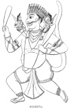
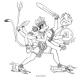
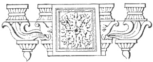

  
[Intangible Textual Heritage](../../index)  [Hinduism](../index) 
[Index](index)  [Previous](hmvp39)  [Next](hmvp41) 

------------------------------------------------------------------------

  
*Hindu Mythology, Vedic and Puranic*, by W.J. Wilkins, \[1900\], at
Intangible Textual Heritage

------------------------------------------------------------------------

p. 394

### CHAPTER III.

#### THE DEMIGODS OF THE RĀMĀYANA.

##### 1. SUGRIVA.

Over the mighty leaders of the Monkey
army associated with Rāma in the destruction of Rāvana was King

 
[  
Click to enlarge](img/39400.jpg)  
SUGRIVA.  

\[paragraph continues\] Sugriva. When
Vishnu, before leaving heaven to become incarnate as Rāma, asked the
gods to—

p. 395

"Make helps, in war to lend him aid,  
 In forms that change at will arrayed,  
 Of wizard skill and hero might,  
 Outstrippers of the wind in flight," [\*](#fn_362)

they consented, and "begot in countless swarms brave sons disguised in
sylvan forms." Of Sugriva it is said—

               "That noblest fire,  
The Sun, was great Sugriva's sire." [†](#fn_363)

When Rāma finds this King of the Monkeys, he was an exile, having been
driven from his throne by his brother Bāli. Kabandha, a giant slain by
Rāma, gives the following description of the king to the wandering
hero:—

"O Rāma, hear my words and seek  
 Sugriva, for of him I speak.  
 His brother Bāli, Indra's son,  
 Expelled him, when the fight he won.  
 With four great chieftains, faithful still,  
 He dwells on Rishyanuka's hill.  
      \*       \*       \*       \*  
 Lord of the Vānars, just and true,  
 Strong, very glorious, bright to view,  
 Unmatched in counsel, firm and meek,  
 Bound by each word his lips may speak,  
 Good, splendid, mighty, bold and brave,  
 Wise in each plan to guide and save.  
 His brother, fired by lust of sway,  
 Drove forth the king in woods to stray;  
 In all thy search for Sitā, he  
 Thy ready friend and help will be." [‡](#fn_364)

Rāma discovers his retreat, hears the story of his wrongs, promises to
slay [Bāli](errata.htm#2), the usurper, and assist Sugriva to regain his
throne; Sugriva on his part

p. 396

solemnly promises to aid Rāma in his search and to enable him to release
Sitā from Rāvana's bonds. Rāma very soon fulfils his part of the
compact. He marches with Sugriva and the others to Bāli's city; Sugriva
challenges [Bāli](errata.htm#3) to fight, and just as he is getting the
worst of it, Rāma lets fly his arrow, which gives Bāli his mortal wound.
Ere this chief dies, he strongly reproves Rāma for slaying one who had
never harmed him and for slaying him too in a secret and cowardly
manner. He asks—

"What fame, from one thon hast not slain  
 In front of battle, canst thou gain,  
 Whose secret hand has laid me low,  
 When madly fighting with my foe?  
      \*       \*       \*       \*  
 I held that thou wouldst surely scorn  
 To strike me as I fought my foe,  
 And thought not of a stranger's blow.  
 But now thine evil heart is shown,  
 A yawning well, with grass o’ergrown.  
 Thou wearest virtue's badge, [\*](#fn_365) but
guile  
 And meanest sin thy soul defile." [†](#fn_366)

Rāma reminds Bāli that Fate had ordained his death, against which it was
useless to contend, with which statement Bāli agrees, and, withdrawing
his unkind words, asks for Rāma's forgiveness.

On the death of Bāli, Sugriva is again installed as King of the Vānars,
and Rāma gives him four months for the enjoyment of his long-lost wife
and kingdom. At its expiration, as Sugriva appeared to be so absorbed
with pleasure as to forget his engagement to assist Rāma, Lakshman
reminds him of his duty in no measured terms. At length the order is
given to collect the forces. An army of monkeys, bears, etc., goes forth
in search of Sita,

p. 397

  [  
Click to enlarge](img/39700.jpg)  
MONKEYS CONSTRUCTING THE BRIDGE AT LANKA.  

p. 398

who, it is discovered, is somewhere in the southern district over which
Hanumān is supposed to rule, who after diligent inquiry learns her
whereabouts. The army marches to the seashore; a bridge connecting the
island of Lanka (Ceylon) with the mainland is erected by Nala, and the
attacking army surrounds the city. No sooner were they in sight of the
city of the foe than

"Up sprang Sugriva from the ground,  
 And reached the turret at a bound.  
 Unterrified the Vānar stood,  
 And wroth, with wondrous hardihood,  
 The king in bitter words addressed,  
 And thus his scorn and hate expressed:  
 'King of the giant race, in me  
 The friend and slave of Rāma see.  
 Lord of the world, he gives me power  
 To smite thee in thy fenced tower.'  
 While through the air his challenge rang,  
 At Rāvan's face the Vānar sprang,  
 Snatched from his head the kingly crown,  
 And dashed it in his fury down.  
 Straight at his foe the giant flew,  
 His mighty arms around him threw,  
 With strength resistless swung him round,  
 And dashed him panting to the ground.  
 Unharmed amid the storm of blows,  
 Swift to his feet Sugriva rose.  
 Again in furious fight they met;  
 With streams of blood their limbs were wet,  
 Each grasping his opponent's waist." [\*](#fn_367)

\[paragraph continues\] They continue to
fight with uncertain result until Rāvana calls to his aid his magical
arts—

"But brave Sugriva, swift to know  
 The guileful purpose of his foe,

p. 399

\[paragraph
continues\]  Gained with light leap the upper air,  
 And breath, and strength, and spirit there;  
 Then, joyous as for victory won,  
 Returned to Raghu's royal son." [\*](#fn_368)

In the course of the great fight, a giant named Kumbhakarna, a brother
of Rāvana, came forth from the city and did great execution amongst the
Vānar host, devouring his victims as fast as they were slain, though
they were numbered by thousands. Some idea of the size of this monster
may be gained from the fact that

"There was no respite then, no pause:  
 Fast gaped and closed his hell-like jaws:  
 Yet prisoned in that gloomy cave,  
 Some Vānars still their lives could save;  
 Some through his nostrils found a way,  
 Some through his ears resought the day." [†](#fn_369)

\[paragraph continues\] Bāli's son Angad
tried to rally the Vānar host, but he was soon dashed senseless on the
ground." Hanumān had already been severely wounded by the monster. And
now he attacks Sugriva, who hurled a hill at him, but

"The giant's chest the stroke repelled." [‡](#fn_370)

\[paragraph continues\] This compliment
the monster returns by throwing his spear, which Hanumān caught as it
flew, and broke it across his knee. Then

"At Sugriva's head he sent  
 A peak from Lanka's mountain rent.  
 The rushing mass no might could stay:  
 Sugriva fell, and senseless lay.  
 The giant stooped his foe to seize,  
 And bore him thence, as bears the breeze  
 A cloud in autumn through the sky." [§](#fn_371)

p. 400

\[paragraph continues\] The giant enters
Lanka with his captive, and is greatly lauded by the people; but his
triumph was of short duration, for

"By slow degrees the Vānars' lord  
 Felt life, and sense, and strength restored.  
 He heard the giant's joyful boast:  
 He thought upon his Vānar host.  
 His teeth and feet he fiercely plied,  
 And bit and rent the giant's side,  
 Who, mad with pain and smeared with gore,  
 Hurled to the ground the load he bore.  
 Regardless of a storm of blows,  
 Swift to the sky the Vānar rose,  
 Then lightly, like a flying ball,  
 High overleapt the city wall." [\*](#fn_372)

Lakshman tried to slay this monster; but it was left for Rāma to finish
the work, whose arrows cut off limb after limb, and at last severed head
from body. After his death, two brothers, Nikumbha and Kumbha, came
forth to do battle for their chief. Sugriva seized Kumbha and hurled him
into the sea; on his reaching the shore he struck Sugriva such a blow on
his chest that he broke his own wrist with the shock. Sugriva returned
the blow by another beneath the neck, which proved fatal. His brother
now attacked Sugriva;

"And red with fury flashed his eye.  
 He dashed with mighty sway and swing  
 His axe against the Vānar king;  
 But shattered on that living rock,  
 It split in fragments at the shock.  
 Sugriva, rising to the blow,  
 Raised his huge hand and smote his foe,  
 And in the dust the giant lay,  
 Gasping in blood his soul away." [†](#fn_373)

p. 401

Sugriva and his heroic army continued faithful to their king's promise
until Rāma's victory was won, though death had considerably thinned
their ranks; but this loss was made good as, in answer to Rāma's prayer,
Yama gave up the whole of the Vānars who had died in the struggle. When
Rāma was about to return home in the magic car, Sugriva asked that he
and the Vānar chiefs might accompany him to his capital. Their request
being granted, they took part in the installation of Rāma as king, and
received from that grateful monarch rich presents as a reward for their
faithful service.

##### 2. HANUMĀN.

Hanumān, on the whole the most useful of the Monkey leaders of the
expedition to Ceylon, was the son of Vāyu, by a Vānar or monkey mother.
"His birth is thus described—

"An Apsaras, the fairest found  
 Of nymphs, for heavenly charms renowned,  
 Sweet Punjikasthalā, became  
 A noble Vānar's wedded dame.  
 Her heavenly title heard no more,  
 Anjanā was the name she bore,  
 When, cursed by gods, from heaven she fell,  
 In Vānar form on earth to dwell.  
     \*       \*       \*       \*       \*  
 In youthful beauty wondrous fair,  
 A crown of flowers about her hair.  
 In silken robes of richest dye,  
 She roamed the hills that kiss the sky.  
 Once in her tinted garments dressed,  
 She stood upon the mountain crest.  
 The god of wind beside her came,  
 And breathed upon the lovely dame;  
 And as he fanned her robe aside,  
 The wondrous beauty that he eyed,

p. 402

 In rounded lines of breast and limb,  
 And neck and shoulders, ravished him,  
 And captured by her peerless charms,  
 He strained her in his amorous arms.  
 Then to the eager god she cried,  
 In trembling accents, terrified,  
 'Whose impious love has wronged a spouse  
 So constant to her nuptial vows?'

 
[  
Click to enlarge](img/40200.jpg)  
HANUMAN.  

 He heard, and thus his answer made:  
 'Oh, be not troubled, nor afraid,  
 But trust, and thou shalt know ere long  
 My love has done thee, sweet, no wrong.  
 So strong, and brave, and wise shall be  
 The glorious son I give to thee;  
 Might shall be his, that nought can tire,  
 And limbs to spring as springs his sire.'

p. 403

\[paragraph
continues\]  Thus spoke the god: the conquered dame  
 Rejoiced in heart, nor feared the shame." [\*](#fn_374)

At length the son was born. When a child, seeing the sun rising, and
thinking it to be the fruit of a tree, he sprang up three hundred
leagues to clutch it. On another occasion Indra let a bolt fly at him
which caused him to fall violently on a rock. The fall shattered his
cheek, and hence the name Hanumān, the long-jawed one, was given to him.
His father seeing this became angry, and the breezes ceased to blow,
until the gods in terror came to appease Vāyu: Brahmā promised that this
boy should not be slain in battle, and Indra declared that his bolts
should never injure him in the future.

The Monkey leader rendered most valuable service to Rāma. It was he who
discovered Sita's abode, and carried a message to her from Rāma. It was
he who set fire to Lanka and caused fear to enter the hearts of the
Rākshasas dwelling there. It was he who bore Rāma on his shoulders as he
crossed over from India to Lanka. Hanumān thus speaks of his wondrous
power:

"Sprung from that glorious Father, I  
 In power and speed with him may vie.  
 A thousand times, with airy leap,  
 Can circle loftiest Meru's steep:  
 With my fierce arms can stir the sea  
 Till from their beds the waters flee,  
 And rush at my command to drown  
 This land with grove and tower and town.  
 I through the fields of air can spring  
 Far swifter than the feathered king,  
 And leap before him as he flies  
 On sounding pinions through the skies.  
 I can pursue the Lord of Light  
 Uprising from the eastern height,

p. 404

\[paragraph
continues\]  And reach him ere his course be sped,  
 With burning beams engarlanded." [\*](#fn_375)

All these powers he devoted to the service of Rāma; for, when that hero
and his brother were wounded in the fight, and nothing else could
restore them, Hanumān fled to the Himalayas from Ceylon, and returned
almost immediately with the medicinal herbs that grew there, though, on
reaching the hills, he had some difficulty [†](#fn_376) in finding them:

"But when he thought to seize the prize,  
 They hid them from his eager eyes.  
 Then to the hill in wrath he spake:  
 Mine arm this day shall vengeance take  
 If thou wilt feel no pity, none,  
 In this great need of Raghu's son.'  
 He ceased: his mighty arms he bent,  
 And from the trembling mountain rent  
 His huge head, with the life it bore,  
 Snakes, elephants, and golden ore.  
 O’er hill and plain and watery waste  
 His rapid way again he traced,  
 And mid the wondering Vānars laid  
 His burden, through the air conveyed.

p. 405

 The wondrous herbs’ delightful scent  
 To all the host new vigour lent.  
 Free from all darts, and wounds, and pain,  
 The sons of Raghu lived again;  
 And dead and dying Vānars, healed,  
 Rose vigorous from the battle-field." [\*](#fn_377)

\[paragraph continues\] Hanumān is
described in the "Uttara Kānda" of the Rāmāyana, [†](#fn_378) as a being possessed of great learning.
"The chief of the monkeys, measureless, seeking to acquire grammar,
looking up to the sun, bent on inquiry, go went from the mountain where
the sun rises to that where he sets, apprehending the mighty collection.
The chief of the monkeys is perfect: no one equals him in the Sāstras,
in learning, and in ascertaining the sense of the Scriptures. In all
sciences, in the rules of austerity, he rivals the preceptor of the
gods."

Rāma himself thus speaks of Hanumān's knowledge of the Scriptures, when
he came to the exile as Sugriva's envoy:

        "One whose words so sweetly flow,  
 The whole Rig-Veda needs must know,  
 And in his well-trained memory store  
 The Yajush and the Sāman's lore.  
 He must have bent his faithful ear  
 All grammar's varied rules to hear.  
 For his long speech how well he spoke!  
 In all its length no rule he broke." [‡](#fn_379)

To this day Hanumān is regarded as divine, and in some parts of India is
largely worshipped. Living monkeys are regarded as his representatives:
hence many temples swarm with them, and it is regarded a meritorious act
to feed them, and a sacrilegious act to injure them.

p. 406

##### 3. NALA. [\*](#fn_380)

Nala, another of the monkey chiefs, was a son of Visvakarma; and as the
son of the architect of the gods, the builder of their beautiful cities,
and the forger of their wonder-working weapons, as might have been
expected, his work was of a similar nature to that for which his
illustrious parent was celebrated. When the army reached the sea, and
the difficulty of crossing to Lanka presented itself, as Rāma was
preparing to shoot one of his mighty arrows to dry up the ocean, the Sea
Deity presented himself, amidst a great commotion of the elements, and
thus addressed him:

"Air, ether, fire, earth, water, true  
 To Nature's will, their course pursue;  
 And I, as ancient laws ordain,  
 Unfordable must still remain.  
 Yet, Raghu's son, my counsel hear:  
 I ne’er for love, or hope, or fear,  
 Will pile my waters of a heap,  
 And leave a pathway through the deep.  
 Still shall my care for thee provide  
 An easy passage o’er the tide,  
 And like a city's paven street  
 Shall be the road beneath thy feet." [†](#fn_381)

His first word of advice was this, that Rāma, instead of shooting at the
sea, should direct his arrow towards the North, to destroy a race of
demons who were hateful to him, and then he went on to say—

"Now let a wondrous task be done  
 By Nala, Visvakarma's son,

p. 407

\[paragraph
continues\]  Who, born of one of Vānar race,  
 Inherits by his father's grace  
 A share of his celestial art.  
 Call Nala to perform his part,  
 And he, divinely taught and skilled,  
 A bridge athwart the sea shall build." [\*](#fn_382)

Nala declares that he has the will and power to accomplish this great
and necessary work; and as an encouragement to Rāma to believe that he
will complete it, said—

"My mother, ere she bore her son,  
 This boon from Visvakarma won:  
 'O Mandarī, this child shall be  
 In skill and glory next to me.'  
 But why unbidden should I fill  
 Thine ear with praises of my skill?  
 Command the Vānar hosts to lay  
 Foundations for the bridge to-day." [†](#fn_383)

Rāma trusts Nala's skill, and orders the Vānars to bring materials for
the bridge:

"Up sprang the Vānars from their rest,  
 The mandate of the king obeyed,  
 And sought the forest's mighty shade.  
 Uprooted trees to earth they threw,  
 And to the sea the timber drew.  
      \*        \*        \*        \*  
 With mighty engines piles of stone  
 And seated hills were overthrown:  
 Imprisoned waters sprang on high,  
 In rain descending from the sky:  
 And ocean with a roar and swell  
 Heaved wildly when the mountains fell.  
 Then the great bridge of wondrous strength  
 Was built, a hundred leagues in length.  
 Rocks, huge as autumn clouds, bound fast  
 With cordage from the shore, were cast,

p. 408

 And fragments of each riven hill,  
 And trees whose flowers adorned them still.  
 Wild was the tumult, loud the din,  
 As ponderous rocks went thundering in.  
 Each set of sun, so toiled each crew,  
 Ten leagues and four the structure grew;  
 The labours of the second day  
 Gave twenty more of ready way,  
 And on the fifth, when sank the sun,  
 The whole stupendous work was done.  
 O’er the broad way the Vānars sped,  
 Nor swayed it with their countless tread." [\*](#fn_384)

##### 4. NĪLA.

This chief is said to have sprung from Agni, and is described as

                     "Bright as flame,  
 Who in his splendour, might, and worth,  
 Surpassed the sire who gave him birth." [†](#fn_385)

Though thus eulogized, no very special feats of his are recorded in the
Rāmāyana. He held a post of honour as the leader of a division of the
army, and his special work appears to have been to provide sentries, and
generally to guard the forces of Sugriva from the sudden attacks of the
enemy. As the son of Agni he was able to see clearly, and by his
watchfulness rendered good service.

##### 5. SUSHENA.

Varuna aided Rāma by the gift of this leader, who was the father of
Tārā, the wife of Bāli, Sugriva's brother and the usurper of his throne.
To him was

p. 409

given the command of the army of the West. Sugriva, addressing him,
said—

"Two hundred thousand of our best  
 With thee, my lord, shall seek the West." [\*](#fn_386)

After searching in vain for traces of the missing princess, he and the
other unsuccessful leaders returned to Rāma and Sugriva, and said—

"On every hill our steps have been,  
 By wood, and cave, and deep ravine;  
 And all the wandering brooks we know,  
 Throughout the land that seaward flow;  
 Our feet by thy command have traced  
 The tangled thicket and the waste,  
 And dens and dingles hard to pass  
 For creeping plants and matted grass." [†](#fn_387)

Though they could not learn the exact spot where Sitā was hidden, they
discovered that she had been carried towards the South, the quarter
under Hanumān's special charge, and thus considerably narrowed the
sphere of the quest. In the great encounter with the foe, Sushena did
good service; for when Rāma and Lakshman were overcome by Indrajit's
magical noose, Sugriva and his comrades were greatly distressed. The
Vānar king, however, being aware that Garuda could release them from the
spell by which they were bound, told Sushena, when they regained their
strength and senses, to fly with them to Kishkindha hermitage, where
they could dwell in safety, whilst he himself fought against Rāvana, and
rescued the royal lady. Then Sushena, as the physician, said—

                      "Hear me yet:  
When gods and fiends in battle met,

p. 410

\[paragraph
continues\]  So fiercely fought the demon crew,  
 So wild a storm of arrows flew,  
 That heavenly warriors, faint with pain,  
 Sank smitten by the ceaseless rain.  
 Vrihaspati, with herb and spell,  
 Cured the sore wounds of those who fell,  
 And, skilled in arts that heal and save,  
 New life and sense and vigour gave.  
 Far, on the milky ocean's shore,  
 Still grow those herbs in boundless store;  
 Let swiftest Vānars thither speed  
 And bring them for our utmost need.  
 Let Panas and Sampati bring,  
 For well the wondrous leaves they know  
 That heal each wound and life bestow.  
 Beside that sea, which, churned of yore,  
 The Amrit on its surface bore,  
 Where the white billows lash the land,  
 Chandra's fair height and Drona stand.  
 Planted by gods, each glittering steep  
 Looks down upon the milky deep.  
 Let fleet Hanumān bring us thence,  
 Those herbs of wondrous influence." [\*](#fn_388)

These plants were brought by Hanumān; the wounded recovered, and fought
with renewed vigour.

 

------------------------------------------------------------------------

### Footnotes

[395:\*](hmvp40.htm#fr_362) Griffiths's
"Rāmāyana," i. 92.

[395:†](hmvp40.htm#fr_363) Ibid., i. 93.

[395:‡](hmvp40.htm#fr_364) Ibid., iii. 337.

[396:\*](hmvp40.htm#fr_365) The dress of a
hermit.

[396:†](hmvp40.htm#fr_366) Griffiths's
"Rāmāyana," iv. 91.

[398:\*](hmvp40.htm#fr_367) Griffiths's
"Rāmāyana," v. 121.

[399:\*](hmvp40.htm#fr_368) Griffiths's
"Rāmāyana," v. 122.

[399:†](hmvp40.htm#fr_369) Ibid., v. 197.

[399:‡](hmvp40.htm#fr_370) Ibid., v. 198.

[399:§](hmvp40.htm#fr_371) Ibid., v. 199.

[400:\*](hmvp40.htm#fr_372) Griffiths's
"Rāmāyana," v. 199.

[400:†](hmvp40.htm#fr_373) Ibid., v. 229.

[403:\*](hmvp40.htm#fr_374) Griffiths's
"Rāmāyana," iv. 272.

[404:\*](hmvp40.htm#fr_375) Griffiths's
"Rāmāyana," iv. 275.

[404:†](hmvp40.htm#fr_376) In seeking for these
leaves, Hanumān was exposed to considerable danger. Kālanemi, an uncle
of Rāvana, was promised the half of the kingdom if he would slay
Hanumān. To effect this, he went to the Himalayas and, disguised as a
devotee, invited Hanumān to eat with him. Hanumān refused; but on
entering a tank near, a crocodile seized his foot. This reptile Hanumān
dragged out of the tank and killed it, from whose body a lovely Apsaras
arose, whom Daksha had cursed to live in that form until her release was
accomplished by Hanumān. This nymph, in gratitude for his kindness,
warned Hanumān of his danger. The monkey god went to Kālanemi, and
telling him that he saw through his disguise, took him by the feet, and
whirled him through the air to Lanka, where he fell before the throne in
Rāvana's palace.

[405:\*](hmvp40.htm#fr_377) Griffiths's
"Rāmāyana," iv. 225.

[405:†](hmvp40.htm#fr_378) Muir, O. S. T., iv.
490.

[405:‡](hmvp40.htm#fr_379) Griffiths's
"Rāmāyana," iv. 25.

[406:\*](hmvp40.htm#fr_380) This Nala must not
be confounded with another person of the same name, whose history is
given in the Mahābhārata. Nala of the Mahābhārata was King of Nishadha,
the husband of Damayanti, whom he obtained in marriage, although Indra,
Agni, Varuna, and Yama were amongst the suitors for her hand.

[406:†](hmvp40.htm#fr_381) Griffiths's
"Rāmāyana," v. 66.

[407:\*](hmvp40.htm#fr_382) Griffiths's
"Rāmāyana," v. 67.

[407:†](hmvp40.htm#fr_383) Ibid., v. 68.

[408:\*](hmvp40.htm#fr_384) Griffiths's
"Rāmāyana," v. 68.

[408:†](hmvp40.htm#fr_385) Ibid., v. 94.

[409:\*](hmvp40.htm#fr_386) Griffiths's
"Rāmāyana," iv. 208.

[409:†](hmvp40.htm#fr_387) Ibid., iv. 224.

[410:\*](hmvp40.htm#fr_388) Griffiths's
"Rāmāyana," v. 152.

------------------------------------------------------------------------

[Next: Chapter IV. The Demigods of the Mahābhārata](hmvp41)
