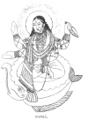

  
[Intangible Textual Heritage](../../index)  [Hinduism](../index) 
[Index](index)  [Previous](hmvp44)  [Next](hmvp46) 

------------------------------------------------------------------------

  
*Hindu Mythology, Vedic and Puranic*, by W.J. Wilkins, \[1900\], at
Intangible Textual Heritage

------------------------------------------------------------------------

p. 460

### CHAPTER VIII.

#### GANGĀ.

Gangā (the Ganges), the chief of the
sacred streams of India, whose waters are said to have the power of
cleansing from all past, present, and future sins, is

 
[  
Click to enlarge](img/46000.jpg)  
GANGĀ.  

believed to be divine, and the account of her birth and appearance on
earth forms an interesting episode in the Rāmāyana. The story is told to
Rāma by the hermit

p. 461

\[paragraph continues\] Visvamitra, as he
was travelling with Rāma and his brother Lakshman. As soon as they reach
the banks of the sacred stream,

"They bathed, as Scripture bids, and paid  
 Oblations due to god and shade."

As soon as they were seated, Rāma said-

            "'O saint, I yearn  
 The three-pathed Gangā's tale to learn.  
 Thus urged, the saint recounted both  
 The birth of Gangā and her growth:  
 The mighty hill with metals stored,  
 Himālaya, is, the mountains’ lord,  
 The father of a lovely pair  
 Of daughters, fairest of the fair.  
 Their mother, offspring of the will  
 Of Meru, everlasting hill,  
 Mena, Himālaya's darling, graced  
 With beauty of her dainty waist.  
 Gangā was elder-born; then came  
 The fair one known by Umā's name.  
 Then all the gods of heaven, in need  
 Of Gangā's help their vows to speed,  
 To great Himālaya came and prayed  
 The mountain king to yield the maid.  
 He, not regardless of the weal  
 Of the three worlds, with holy zeal  
 His daughter to the Immortals gave—  
 Gangā, whose waters cleanse and save,  
 Who roams at pleasure, fair and free,  
 Purging all sinners, to the sea.  
 The three-pathed Gangā thus obtained,  
 The gods their heavenly homes regained.'" [\*](#fn_426)

The sage next tells Rāma that there was a mighty King of Ayodha named
Sāgara [†](#fn_427) who, being childless,

p. 462

and most anxious to have a son, propitiated the saint Bhrigu (or,
according to other accounts, his grandson) by penances extending over a
hundred years. At length the saint, pleased with Sāgara's worship, said—

"From thee, O Sāgar, blameless king,  
 A mighty host of sons shall spring,  
 And thou shalt win a glorious name,  
 Which none, O chief, but thou shalt claim;  
 One of thy queens a son shall bear,  
 Maintainer of thy race and heir;  
 And of the other there shall be  
 Some sixty thousand born to thee." [\*](#fn_428)

Hearing this, the wives are anxious to know which of them is to have the
one son, and which the multitude; but this the Brāhman leaves them to
decide. Kesini wishes for the one; and Sumati is pleased with the
prospect of having sixty thousand.

"Time passed. The elder consort bare  
 A son called Ansumān, the heir.

p. 463

\[paragraph
continues\]  Then Sumati, the younger, gave  
 Birth to a gourd, O hero brave,  
 Whose rind, when burst and cleft in two,  
 Gave sixty thousand babes to view.  
 All these with care the nurses laid  
 In jars of oil; and there they stayed,  
 Till, youthful age and strength complete,  
 Forth speeding from each dark retreat,  
 All peers in valour, years, and might,  
 The sixty thousand came to light." [\*](#fn_429)

After a time King Sāgara determined to make an Asvamedha, or horse
sacrifice, with the object of becoming the reigning Indra, or king of
the gods. Preparations for this are accordingly made, and Prince
Ansumān, the son of the elder wife, is appointed by the king to follow
the horse set apart for the sacrifice; for, according to the ritual, it
was to be set free, and allowed to wander for a whole year wherever it
would. Indra, knowing the great merit that Sāgar would obtain by this
sacrifice, and fearing that he might even lose his crown,

"Veiling his form in demon guise,  
 Came down upon the appointed day,  
 And drove the victim horse away." [†](#fn_430)

The officiating priest, being aware of this, cries out—

"Haste, king! now let the thief be slain;  
 Bring thou the charger back again;  
 The sacred rite prevented thus  
 Brings scathe and woe to all of us."

King Sāgara, incited by the Brāhman, urges his sons to search until they
find the stolen horse:

"Brave sons of mine, I know not how  
 These demons are so mighty now;

p. 464

\[paragraph
continues\]  The priests began the rites so well,  
 All sanctified with prayer and spell.  
 If in the depths of earth he hide,  
 Or lurk beneath the ocean's tide,  
 Pursue, dear sons, the robber's track;  
 Slay him and bring the charger back.  
 The whole of this broad earth explore,  
 Sea-garlanded from shore to shore;  
 Yea, dig her up with might and main,  
 Until you see the horse again." [\*](#fn_431)

The sons commence their search. Each digs a league in depth, and by this
means they reach the centre of the earth; but cannot see the horse.
Alarmed at their destructive work, the gods repair to Brahmā, and tell
him what is happening. He cheers them with the information that Vishnu,
in the form of Kapila, will protect the Earth, his bride, and that these
sons of Sāgara will be consumed to ashes. The gods, encouraged by these
words, repair to their home and patiently wait for deliverance.

After digging sixty thousand leagues into the earth without obtaining
any tidings of the horse, the princes return to their father, asking
what can be done. Sāgara commands them to dig on, and continue their
search until the horse is found. At length they

"Saw Vāsudeva (Vishnu) standing there.  
 In Kapil's form he loved to wear;  
 And near the everlasting God  
 The victim charger cropped the sod.  
 They saw with joy and eager eyes  
 The fancied robber and the prize,  
 And on him rushed the furious band,  
 Crying aloud, 'Stand, villain! Stand!'

p. 465

'Avaunt! avaunt!' great Kapil cried,  
 His bosom flusht with passion's tide;  
 Then, by his might, that proud array  
 All scorched to heaps of ashes lay." [\*](#fn_432),

Hearing no news of his sons, the king became anxious, and sent his
grandson Ansumān to look after them. He inquires of all he meets on the
earth, and is encouraged by the information that he shall certainly
bring back the stolen horse. At length he reaches the spot where his
brothers were consumed, and is overwhelmed with grief at their fate. At
this moment his uncle Garuda appears and consoles him, saying—

"Grieve not, O hero, for their fall,  
 Who died a death approved of all.  
 Of mighty strength they met their fate  
 By Kapil's hand, whom none can mate.  
 Pour forth for them no earthly wave,  
 A holier flood their spirits crave.  
 If, daughter of the Lord of Snow,  
 Gangā would turn her stream below,  
 Her waves, that cleanse all mortal stain,  
 Would wash their ashes pure again.  
 Yea, when her flood, whom all revere,  
 Rolls o’er the dust that moulders here,  
 The sixty thousand, freed from sin,  
 A home in Indra's heaven shall win.  
 Go, and with ceaseless labours try  
 To draw the goddess from the sky.  
 Return, and with thee take the steed;  
 So shall thy grandsire's rite succeed." [†](#fn_433)

The prince takes the steed; the sacrifice is completed, and for 30,000
years King Sāgara was thinking how he could induce Gangā to come down
from heaven. At length, not having succeeded in forming a successful
plan, the monarch himself went to heaven. Ansumān

p. 466

reigned in his stead, who, in his turn, tried to find some means of
liberating his brothers. His son Dilipa also made a similar, but equally
unsuccessful, effort. It was given to Dilipa's son Bhagirath to
accomplish this work. Bhagirath had no son. He, in order to obtain this
boon, and also to free his kinsmen from their sad fate, practised most
severe austerities, until at length Brahmā said—

"Blest monarch, of a glorious race,  
 Thy fervent rites have won my grace.  
 Well hast thou wrought thine awful task:  
 Some boon in turn, O hermit, ask." [\*](#fn_434)

To which Bhagirath replies as follows—

"Let Sāgar's sons receive from me  
 Libations that they long to see.  
 Let Gangā with her holy wave  
 The ashes of the heroes lave,  
 That so my kinsmen may ascend  
 To heavenly bliss that ne’er shall end.  
 And give, I pray, O god, a son,  
 Nor let my house be all undone."

To this the god replies—

       "As thou prayest, it shall be.  
 Gangā, whose waves in Swarga (Heaven) flow,  
 Is daughter of the Lord of Snow.  
 Win Siva, that his aid be lent  
 To hold her in her mid descent,  
 For earth alone will never bear  
 These torrents hurled from upper air." [†](#fn_435)

Brahmā then re-ascended to the skies; but Bhagirath remained for a whole
year—

"With arms upraised, refusing rest,  
 While with one toe the earth he prest."

p. 467

Siva, pleased with this devotion, promised to sustain the shock of the
descent of the waters on his head; but Gangā was not at all pleased when
commanded to descend to earth:

"'He calls me,' in her wrath she cried,  
 'And all my flood shall sweep  
 And whirl him in its whelming tide  
 To hell's profoundest deep.'" [\*](#fn_436)

Siva, however, was a match for the wrathful deity. He held her in the
coils of his hair until her anger abated, and then she fell into the
Vindu lake, from whence proceed the seven sacred streams of India. This
lake is not known; and of the seven streams mentioned, two only are
familiar to geographers, the Ganges and the Indus. One branch of this
stream followed Bhagirath wherever he went. On the way the waters
flooded the sacrificial flame of Jahnu, a saint. In his anger he drank
up its waters, and Bhagirath's work seemed to be fruitless. But at the
intercession of the king and Brahmā, the saint allowed the waters to
flow from his ears. From this fact one of the many names of Gangā is
Jāhnavi, or daughter of Jahnu. At length Bhagirath reached the ocean,
and descending to the depths where Sāgara's sons were lying, Gangā
followed until her waters touched the ashes, when—

"Soon as the flood their dust bedewed,  
 Their spirits gained beatitude,  
 And all in heavenly bodies dressed  
 Rose to the skies’ eternal rest." [†](#fn_437)

As a reward for his meritorious work, Brahmā' said to him—

"Long as the ocean's flood shall stand  
 Upon the border of the land,

p. 468

So long shall Sāgar's sons remain,  
 And, god-like, rank in heaven retain.  
 Gangā thine eldest child shall be,  
 Called from thy name Bhagirathi." [\*](#fn_438)

As a consequence of faith in this legend, one of the most frequented
places of pilgrimage in India is Sāgar Island, the place where the river
Ganges and ocean meet.

In addition to the Ganges, there are many other rivers regarded as
sacred by the Hindus; the worship of these, and bathing in them, being
productive of almost as great blessings as are to be obtained from Gangā
herself. Some of these are considered as males and some as females. The
following is not a complete list, but it contains the names of the
rivers most generally worshipped.

Male rivers:—The Sona and the Brahmaputra.

Female rivers:—The Godāvarī, the Kāveri, the Atreyī, the Karaloyā, the
Bahudā, the Gomati, the Sarayu, the Gandakī, the Varahī, the
Charmanwatī, the Shatadru, the Vipāshā, the Goutamī, the Karmanāshā, the
Airāvatī, the Chandrabhāgā, the Vitastā, the Sindhu, the Krishnā, the
Vetravatī, the Bhairavā. [†](#fn_439)

------------------------------------------------------------------------

### Footnotes

[461:\*](hmvp45.htm#fr_426) Griffiths's
"Rāmāyana," i. 171.

[461:†](hmvp45.htm#fr_427) Sāgara's birth was
supernatural. His father Bāhu, King of Ayodha, was expelled from his
kingdom. The mother of Sāgara p. 462
accompanied her husband to the forest, but, owing to a poisonous drug
having been given her by a rival wife, she could not bring forth her
son, with whom she had been pregnant for seven years. When her husband
died, she wished to be burned with his body; but this was prevented by a
sage named Aurva, who assured her that her son would yet be born, and
grow up to be a mighty king. When he was born, Aurva gave him the name
Sāgara (*sa*, with, and *gara*, poison). Aurva himself was also born in
an extraordinary manner. A king named Kritavirya was very liberal to the
Bhrigus, and through his liberality they became rich. His descendants
being poor, they asked help of the Bhrigus. On this being refused them,
they made an onslaught on the Brāhmans of this family, slaying all they
could find, even to children in the womb. One woman concealed her unborn
child in her thigh. The Kshattriyas, hearing of this, tried to slay him,
but he issued from his mother's thigh with such lustre that he blinded
his persecutors. And because he was born from the thigh (*uru*) of his
mother, he was called Aurva.

[462:\*](hmvp45.htm#fr_428) Griffiths's "
Rāmāyana," i. 174.

[463:\*](hmvp45.htm#fr_429) Griffiths's
Rāmāyana," i. 175.

[463:†](hmvp45.htm#fr_430) Ibid., 177.

[464:\*](hmvp45.htm#fr_431) Griffiths's "
Rāmāyana," i. 177.

[465:\*](hmvp45.htm#fr_432) Griffiths's
"Rāmāyana," i. 183.

[465:†](hmvp45.htm#fr_433) Ibid., 186.

[466:\*](hmvp45.htm#fr_434) Griffiths's
"Rāmāyana," i. 190.

[466:†](hmvp45.htm#fr_435) Ibid.

[467:\*](hmvp45.htm#fr_436) Griffiths's
"Rāmāyana," i. 193.

[467:†](hmvp45.htm#fr_437) Ibid., 196.

[468:\*](hmvp45.htm#fr_438) Griffiths's
"Rāmāyana," i. 197.

[468:†](hmvp45.htm#fr_439) Ward, ii. 217.

------------------------------------------------------------------------

[Next: Chapter IX. Sacred Trees](hmvp46)
