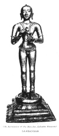

  
[Intangible Textual Heritage](../../index)  [Hinduism](../index) 
[Index](index)  [Previous](htss02)  [Next](htss04) 

------------------------------------------------------------------------

  
*Hymns of the Tamil Saivite Saints*, by F. Kingsbury and G.P. Phillips,
\[1921\], at Intangible Textual Heritage

------------------------------------------------------------------------

p. 9

### SAMBANDAR AND HIS HYMNS

 
[  
Click to enlarge](img/00800.jpg)  
SAMBANDAR  

p. 10

### I

### SAMBANDAR

(Tamil: TIRU JÑĀNA SAMBANDAMŪRTI SWĀMĪ)

In the first half of the seventh century
A.D. the worship of Śiva Was at its lowest ebb, overpowered by the
Jainism and Buddhism which prevailed throughout the Tamil country. But a
few pious Śaivites remained faithful. One of them, whose name means that
his heart was laid at Śiva's foot, and who lived in the town in the
Tanjore District now known as Shiyāli, prayed to the Śiva worshipped in
the Shiyāli temple that he might be given a son who would dispel the
godless dark and win men to Lord Śiva again. Sambandar's birth was the
answer to that prayer. At the tender age of three, so orthodox Śaivites
believe, this child was fed by Sivas spouse with milk from her divine
breast, mingled with divine wisdom, whence he is called in his full
name, "The man connected with wisdom divine," Tiru Jñāna Sambandar.

He grew up to be a pilgrim poet, who visited most of the Śaivite shrines
with which South India abounds, in each place singing the praise of the
Śiva whom there he worshipped. The cause he loved suffered a severe blow
when the great king of Madura, with many of his subjects, went over to
the Jain religion. The queen-consort and her prime minister (see stanzas
20 and 21) remained faithful to Śaivism, and sent for Sambandar.

p. 11

\[paragraph continues\] The lonely saint
faced a vast multitude of Jains in the royal presence, conquered them in
argument, and reconverted the king. Eight thousand of the stubborn
Jains, with Sambandar's consent, were impaled alive. Later on, after a
similar adventure in another of the three great kingdoms of the Tamil
country of his time, Sambandar converted to Śaivism a crowd of Buddhist
opponents.

This is about all that is known of a man who helped to sing Buddhism
right out of Southern India, and who composed the collection of hymns
which stands first among the canonical works of Śaivites. Legends make
him a wonder-worker, but we must draw our knowledge of the man from his
poems themselves. He certainly was skilful in the handling of the many
metres in which Tamil poetry is written, and it is not impossible that
his productions were as effortless as the stories of him tell. That is
their weakness, for there is not very much of heart religion in them.
But they seem to have powerfully helped in that process of eliminating
Jainism and Buddhism from India of which we know so little, though it
was complete enough to be one of the marvels of history. Their author
holds the foremost place among the four great 'Śaivite Preceptors'
(Śivāchāryar), and some call him the incarnation of one of the sons of
Śiva.

His date seems to be one of the few clearly established dates in the
history of the religion of the country. Stanza 19 shews that he was a
contemporary of another great early Śaivite, whose name means "Little
Servant of God," and who is known to have fought in a battle which took
place in 642 A.D.

p. 12 p. 13

We begin with the first verse which the author composed. According to
the legends he uttered it at the age of three, on the banks of the
temple tank at Shiyāli (once Bramāpuram), after Śiva's consort had fed
him with milk from her own breast. The stanza itself of course contains
no allusion to the story, but it is one of the best known verses in the
Śaivite hymnbook.

1\. His ears are beringed, He rideth the bull;  
  His head is adorned with the crescent moon's ray; White is He with ash
from the burning-ground swept;  
And He is the thief who my heal t steals away. Great Brahmā enthroned on
the lotus’ full bloom  
  Erstwhile bowed him down and His glory extolled, And singing received
he the grace of our lore  
Who dwelleth in famèd Bramāpuram old.

------------------------------------------------------------------------

No pilgrimage in South India is more popular than that to Tiruvaṇṇāmalai
in North Arcot, the temple by a hill celebrated in many poems. Śaivism
has tried to express the existence of the 'eternal feminine' in deity by
giving Śiva a lady who not only is His consort, but is actually a part
of Him, and is so represented in many images, which show Śiva as
masculine on one side and feminine on the other.

2\. He is our only Lord, conjoinèd still  
  To her whose breast no sucking lips have known.  
They who in Aṇṇāmalai's holy hill,  
  Where falling waters noisy chatter down,  
And the hill glistens gem-like, bow before  
  Our great one who is lord and lady too,  
Unfailingly for them shall be no more  
  Dread fruit of good and bad deeds they may do.

p. 14 p. 15

One of the first puzzles to a student of Śaivism is the way in which
each of the numerous shrines seems to be spoken of as if it were Śiva's
exclusive abode. The broad river marked on English maps as the Cauvery,
but in Tamil called the Kāviri, which brings so much blessing to a large
part of South India that the respect in which it is held is not
difficult to understand, is fringed throughout its length with shrines
which are believed to confer the blessings of Śiva on all who visit
them. One of these is 'Neyttānam,' 'Place of Ghee.'

3\. So ye but say Neyttānam is the home  
  Of our great Lord who wears in his long hair  
The crescent moon, the river, and the snake,  
  Neyttānam where chaste maidens gather fair,  
On the north bank of Kāviri's loud stream,  
  Your vileness, guiltiness, the sin you dread,  
  Your sorrows many, shall be banishèd.

------------------------------------------------------------------------

This specimen of a hymn connected with Palny in the Madura District
alludes (in stanza 5) to the well-known legend which says in the Śaivite
way that those who love God need not fear death. Mārkandeya was a boy
devoted to Śiva, but over his life hung a terrible cloud, for the fates
had decreed that he would not live beyond his sixteenth year. As the
appointed time drew near his father lived in an agony of dread, but
Mārkandeya, free from fear, spent all his time in the worship of Śiva.
The god of Death came at last. Regardless of the fact that the boy was
at worship he threw over him that noose which pulls out human life from
the body. The boy clung to Śiva's lingam with both his hands. From
within the lingam Śiva burst forth, kicked the terrible death-god and
pierced him with his trident. So Mārkandeya was saved. The scene is
sculptured on many temples.

p. 16 p. 17

4\. Holy Vedas chanting,  
Sacred thread He wears;  
All His hosts surround Him  
Whom the white bull bears.  
Cometh He in splendour,  
Tiger-skin attired.  
'Lord, our naked beggar  
Above all desired,'  
Cry ye in your worship,  
At His feet appeal.  
He who dwells in Palny  
All your sin will heal.

5\. Three eyes hath His forehead,  
Fair moon crowns His hair;  
When Death sought a victim,  
Śiva's foot crashed there;  
Gory streams of blood flowed,  
Death it was that died,  
Such is He, our Father,  
Um a, at His side;  
Dwells He aye in Palny,  
Where bees hum around  
Drunk with honeyed sweetness,  
Till its groves resound.

A multitude of hymns chant the glory of Chidambaram, ancient Tillai,
holiest of all the Śaivite shrines. Pious Śaivites have for it a feeling
not unlike the Jews’ feeling for Jerusalem. The tending of the
sacrificial fire comes down from pre-historic times, being firmly
established when the earliest hymns of the Rig Veda were composed.

6\. Tending as taught of old the sacrificial fire,  
At Tillai Brahmans pure drive out misfortune dire.  
There dwells the First of all, moon-crowned, and  
those who cleave  
For ever to His foot, no cleaving sin will grieve.

p. 18 p. 19

Conjeeveram, the ancient Tamil name of which is given in this stanza,
though more famous as a Vaishṇavite than as a Śaivite shrine, offers in
its temples a remarkable compendium of the religious history of South
India. See the article 'Kānchipuram' in Dr. Hastings’ 'Encyclopædia of
Religion and Ethics.'

7\. He is the pith of holy writ;  
  And in the tangle of His hair  
The spotless crescent's ray is lit;  
  He is both Lord and Lady fair.  
He our great sovereign doth abide  
  In Kachchi Ehambam's fair town.  
My mind can think of naught beside,  
  Naught beside Him, and Him alone.

------------------------------------------------------------------------

The next two stanzas, taken from two separate hymns associated with the
great cities of Trichinopoly and Madura, both sacred places of Śaivism,
are set side by side in order to bring out a point which even the most
sympathetic student may not ignore. Śiva is commonly spoken of as all
good, as in stanza 8, and yet not infrequently He includes, as in stanza
9, both good and its opposite. The pantheistic tendency even in these
hymns causes God to be sometimes depicted as so all-embracing as to
include evil as well as good.

8\. All goodness hath He and no shadow of ill.  
  Grey-white is His bull, fair Umā shares His form.  
His wealth is past searching. Chirāpaḷḷi's hill  
  Is His, whom to praise keeps my heart ever warm.

9\. Thou art right and Thou art wrong,  
  Lord of holy Ālavāy;  
Kinsman, I to Thee belong;  
  Never fades Thy light away.  
Thou the sense of books divine,  
  Thou my wealth, my bliss art Thou,  
Thou my all, and in Thy shrine  
  With what praises can I bow?

p. 20 p. 21

No one can know Śiva unless He chooses to reveal Himself. This thought
constantly recurs with great emphasis. Its favourite expression is in
the first legend of the four told in our introduction. Hymn singers are
fond of contrasting with the vain search of Brahmā and Vishṇu the
revelation of Himself which Śiva has graciously granted to them. Compare
stanzas 25 and 48.

10\. Thou Light whom Brahmā, being's fount, and Vishṇu could not see,  
No righteousness have I, I only speak in praise of Thee.  
Come, Valivalam's Lord, let no dark fruit of deeds, I pray,  
Torment Thy slave who with his song extols Thee day by day.

------------------------------------------------------------------------

Astrology plays a large part in popular Hinduism, and the influence of
baleful or auspicious stars must be reckoned with in daily life. Most
baleful of all is the influence of the eclipse, which is caused by two
dragons Rāhu and Kētu which swallow the moon or the sun. This stanza
enumerates the nine planets, Sun, Moon, Mars, Mercury; Jupiter, Venus,
Saturn, Rāhu and Kētu, and says that to the singer, who has Śiva in his
heart, all of them, even the dragons of eclipse, are auspicious. It is a
powerful and characteristically Hindu way of saying that all things work
together for good to those who love God.

The reference to the bamboo constantly recurs in descriptions of ladies’
beauty. Everyone who has seen a feathery clump of bamboo trees waving in
the breeze will understand it as a symbol of delicate grace.

The vīṇa is the most delicate and beautiful instrument played in South
India.

p. 22 p. 23

11\. She shares His form whose shoulders’ curve vies with the bamboo's
grace.  
  His throat the poison drank, He touched the vīṇa into tune.  
The lustrous moon and Ganges crown His hair, and He a place  
  Hath made Himself within my heart. Wherefore let shine the moon  
Or sun or any star of good or ill, or serpents twain.  
For Śiva's slave all are benign, all work for him great gain.

------------------------------------------------------------------------

White ash from burnt cow-dung must be worn by all true Śaivites. Every
day the worshipper, facing north-east and crying 'Śiva, Śiva,' must dip
in the ash the fingers of his right hand and draw the three middle
fingers from left to right along his forehead, so leaving three
horizontal white lines. The ceremonial side of Śaivism is so prominent
that this one stanza must be given, a specimen of many extolling the
virtues and potencies of the ash.

The Tantras are works inculcating ceremonies, also magic performances
and mystic rites. Some of these are of an immoral nature.

12\. The sacred ash has mystic power,  
’Tis worn by dwellers in the sky.  
The ash bestows true loveliness.  
Praise of the ash ascends on high.  
The ash shows what tile Tantras mean,  
And true religion's essence tells,  
The ash of Him of Ālavāy,  
In whom red-lippèd Umā dwells.

p. 24 p. 25

Equally important with the wearing of the sacred ash is the constant
repetition of the five syllables, or panchākshara, 'Namaśivāya.' This,
which means literally 'a bow to Śiva,' is the chief mantra or mystic
utterance of Śaivism. In Śaivite catechisms a whole chapter is devoted
to its uses.

13\. Those who repeat it while love's tears outpour,  
  It gives them life, and guides them in the way.  
’Tis the true substance of the Vedas four,  
  The Lord's great name, wherefore 'Hail Śiva,' say.

------------------------------------------------------------------------

The next three stanzas are from a hymn written in a very attractive
short-lined metre, and promise light, freedom from rebirth, and bliss,
through devotion to Śiva at Ārūr (now Tiruvaḷḷūr in the Tanjore
District).

14\. For the Father in Ārūr  
  Sprinkle ye the blooms of love;  
In your heart will dawn true light,  
  Every bondage will remove.

15\. Him the holy in Ārūr  
  Ne’er forget to laud and praise;  
Bonds of birth will severed be,  
  Left behind all worldly ways.

16\. In Ārūr, our loved one's gem,  
  Scatter golden blossoms fair.  
Sorrow ye shall wipe away,  
  Yours be bliss beyond compare.

p. 26 p. 27

Associated with the hymn from which our next verse is taken is a story
of the author, Sambandar, helping a sorrowing woman by raising to life
the man she loved, who had been killed by snake-bite. The hymn makes no
allusion to such a miracle, but it does give an example of intercession
on behalf of another, an element which is somewhat rare in these
devotional books.

17\. Prostrate with fear at Thy feet she cries 'Lord with matted hair,
my Refuge, Rider of the bull! Lord of Maruhal where fresh water-lilies
bloom, is it right to leave her in this anguish of heart?

------------------------------------------------------------------------

Our present writer's poems contain such frequent denunciations of
Buddhism or Jainism that it is clear that they were written at a time
when the struggle between Hinduism and these other religions was at its
height. Buddhism and Jainism are scarcely known in South India to-day,
though at one time they were supreme. It is probable that these songs
helped not a little to drive them out of the country.

18\. Those Buddhists and mad Jains may slander speak.  
    Such speech befits the wand’rers from the way.  
But He who came to earth and begged for alms,  
    He is the thief who stole my heart away.  
The raging elephant charged down at Him;  
    O marvel! He but took and wore its hide;  
Madman men think Him, but He is the Lord  
    Who in great Bramāpuram doth abide.

p. 28 p. 29

The "Little Servant of God" mentioned in the next verse is one of the 63
canonized saints of Śaivism. According to the collection of legends
known as the Periya Purāṇam, which is a Tamil Śaivite classic, he fought
at the battle of Vādāpi, the modern Badāmi, which took place in 642 A.D.
There are other indications which strengthen the view that these hymns
date from the seventh century A.D.

In the first three lines of the verse Śiva is conceived as a lover, and
the devotee as the woman whom He loves. In India the pain of absence
from a lover is supposed to cause spots to appear on the skin of the
woman who loves.

19\. Birds in the flowering green-branched puṇṇai tree,  
Love writeth clear its marks on me, for He  
Who cured my grief, yet left unending pain.  
Senkāttankuḍi is His holy fane,  
And there His "Little Servant" dwells, who now  
And ever doth before Lord Śiva bow.  
There in the burning-ground, with fire in hand,  
Sporteth unceasingly our Master grand.

------------------------------------------------------------------------

Another possible indication of date occurs in the next two verses, given
in English prose because the Tamil names will not fit into English
metres. The Mangaiyarkkarasi here mentioned was the wife of a king of
Madura, Kūn Pāṇdiyan, known to history. According to the above-mentioned
collection of stories, this king became a Jain. Then the queen and the
prime minister named in our poem sent for Sambandar, our author, through
whose efforts the king was reconverted, and all Jain teachers were
executed by impaling. Unfortunately the date of Kūn Pāṇdiyan cannot at
present be accurately determined. An able discussion of it can be seen
in "The Tamilian Antiquary, No. 3."

p. 30 p. 31

The explanation of the term 'Fish-eyed maid,' which sounds curiously in
English ears, is that in Madura Śiva's consort is called Mīnākshi, i.e.
fish-eyed. The suggestion of the epithet, frequently applied to
beautiful women, is that the motion of their eyes resembles the
beautiful motion of a fish in water.

20\. This is Alavāy, where dwells the flame-formed lord of hosts, giver
of the four Vedas and their meaning, with the fair fish-eyed maid. Here,
reigning like the goddess of good fortune, Mangaiyarkkarasi the Chōla
king's daughter, braceletted chaste Pāṇdiyan queen, daily serves and
praises God.

------------------------------------------------------------------------

The poem from which 20 and 21 are taken consists of stanzas like these
alternately praising the queen and the king's minister, the last verse
praising them both together.

21\. This is Ālavāy, Śiva's abode. To those who forsake the world He
reveals Himself as world-forsaking too. Head of the heavenly ones, He
rides the one white bull. Praised is He by Kulachchirai, minister of
that monarch who wears white ash, and loves to lay himself bare at the
feet of Śiva's slaves.

------------------------------------------------------------------------

Once, says a story, when Sambandar was about to contend with the Jains,
the queen feared the consequences which might befal him, but he assured
her in this verse that he could dare all when his God of Madura was on
his side.

p. 32 p. 33

22\. O fair one with the deer's glance meek,  
  Pāṇdya's great queen, think not of me  
As of some sucking infant weak,  
  Because such wicked foes there be.  
    If only Hara by me stand,  
    Stronger am I than all their band.

------------------------------------------------------------------------

The story here is that the Janis had set fire to Sambandar's house. He
prayed in this stanza that the fire, transformed into a fever, might go
to the Pāndyan king, then a Jain. It did so, and the king was converted.

23\. O Thou whose form is fiery red,  
  In holy Alavāy, our Sire,  
In grace deliver me from dread.  
  False Jains have lit for me a fire:  
    O, let it to the Pāṇḍiyan ruler go,  
    That he the torture of slow flame may know.

------------------------------------------------------------------------

Our specimens of Sambandar's poetry may end with a verse which is a kind
of benediction, often set as an auspicious word on the front page of a
book.

24\. Blest be the Brahmans pure, the heavenly ones, and kine.  
Cool rain fall on the earth! May the king's glory shine!  
Perish all forms of ill! Let Hara's name resound!  
May sorrow pass away, from earth's remotest bound.

------------------------------------------------------------------------

[Next: Apparswami and his Hymns](htss04)

