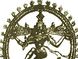

  
[Intangible Textual Heritage](../../index)  [Hinduism](../index) 
[Index](index)  [Previous](htss08) 

------------------------------------------------------------------------

  
*Hymns of the Tamil Saivite Saints*, by F. Kingsbury and G.P. Phillips,
\[1921\], at Intangible Textual Heritage

------------------------------------------------------------------------

p. 131

### INDEX

(The Numbers are those of Pages, not of
Stanzas.)

ĀDIŚESHA, [7](htss02.htm#page_7).

Aiyāṛu, [61](htss04.htm#page_61).

Al̤vār, [4](htss02.htm#page_4).

Aryan, [3](htss02.htm#page_3).

Ash, sacred, [23](htss03.htm#page_23).

Astrology, [21](htss03.htm#page_21).

Asuras, [7](htss02.htm#page_7).

Athikai Virattānam, [39](htss04.htm#page_39), [43](htss04.htm#page_43).

Āvaduturai, [49](htss04.htm#page_49), [65](htss04.htm#page_65).

Avudaiyārkoil (Perundurai), [86](htss06.htm#page_86),
[111](htss06.htm#page_111), [117](htss06.htm#page_117) f.,
[121](htss06.htm#page_121).

BRAHMĀ, [4](htss02.htm#page_4), [6](htss02.htm#page_6),
[13](htss03.htm#page_13), [21](htss03.htm#page_21),
[39](htss04.htm#page_39), [41](htss04.htm#page_41),
[55](htss04.htm#page_55), [89](htss06.htm#page_89).

Brahmans, [17](htss03.htm#page_17). [33](htss03.htm#page_33),
[59](htss04.htm#page_59), [71](htss05.htm#page_71),
[88](htss06.htm#page_88).

Buddhism, [11](htss03.htm#page_11), [27](htss03.htm#page_27),
[86](htss06.htm#page_86).

CAUVERY, [15](htss03.htm#page_15), [55](htss04.htm#page_55).,

Chidambaram (Tillai, Perumpattapuliyūr), [5](htss02.htm#page_5),
[17](htss03.htm#page_17), [65](htss04.htm#page_65),
[86](htss06.htm#page_86), [107](htss06.htm#page_107),
[109](htss06.htm#page_109), [115](htss06.htm#page_115),
[131](#page_131).

Comorin, [57](htss04.htm#page_57).

Conjeeveram, [19](htss03.htm#page_19).

Consecration, [53](htss04.htm#page_53).

Cuckoo as messenger, [107](htss06.htm#page_107).

Cycles of existence, [67](htss04.htm#page_67).

DANCE of Śiva, [5](htss02.htm#page_5), [6](htss02.htm#page_6).

Dēvāram, [2](htss02.htm#page_2).

EMOTION, emphasis upon, [89](htss06.htm#page_89),
[91](htss06.htm#page_91), [125](htss06.htm#page_125).

FAVOURITISM in God, [73](htss05.htm#page_73).

GAMES, songs sung in, [101](htss06.htm#page_101) f.

Ganges, [5](htss02.htm#page_5), [23](htss03.htm#page_23),
[51](htss04.htm#page_51), [79](htss05.htm#page_79).

Grace, divine, [65](htss04.htm#page_65), [89](htss06.htm#page_89),
[127](htss06.htm#page_127).

HARA (Śiva), [33](htss03.htm#page_33).

IDOL, worship of, [111](htss06.htm#page_111).

Indra, [51](htss04.htm#page_51), [89](htss06.htm#page_89),
[113](htss06.htm#page_113).

JAINS, [11](htss03.htm#page_11), [27](htss03.htm#page_27),
[33](htss03.htm#page_33), [59](htss04.htm#page_59),
[61](htss04.htm#page_61).

Joy in God, [47](htss04.htm#page_47)-[51](htss04.htm#page_51),
[75](htss05.htm#page_75), [77](htss05.htm#page_77).

KAILĀSA, [5](htss02.htm#page_5), [39](htss04.htm#page_39). Kāḷī,
[5](htss02.htm#page_5),

Kal̤ukkundu, [119](htss06.htm#page_119).

Katpaha tree, [47](htss04.htm#page_47).

Kedila, [61](htss04.htm#page_61).

Kētāram, [83](htss05.htm#page_83).

Koḍumuḍi, [77](htss05.htm#page_77).

Kōl̤ili, [81](htss05.htm#page_81).

Kondai (cassia flower), [5](htss02.htm#page_5),
[73](htss05.htm#page_73), [121](htss06.htm#page_121).

Kulachchirai, [31](htss03.htm#page_31).

Kūn Pāndiyan, [29](htss03.htm#page_29).

Kundaiyūr, [81](htss05.htm#page_81).

Kuttālam, [125](htss06.htm#page_125).

MADURA (Ālavāy, Uttarakosamangai), [10](htss03.htm#page_10),
[19](htss03.htm#page_19), [31](htss03.htm#page_31),
[33](htss03.htm#page_33), [99](htss06.htm#page_99).

Mahādev (Śiva), [51](htss04.htm#page_51).

Mal̤apādi, [73](htss05.htm#page_73).

Mangaiyarkkarasi, [29](htss03.htm#page_29).

Mārkandeya, [15](htss03.htm#page_15), [79](htss05.htm#page_79).

Maruhal, [27](htss03.htm#page_27).

Meru, [7](htss02.htm#page_7).

Mīnākshi, [31](htss03.htm#page_31).

Muyalahan, [5](htss02.htm#page_5).

NAMASIVĀYA, [25](htss03.htm#page_25), [67](htss04.htm#page_67).

Nandan, [73](htss05.htm#page_73).

Nandi (Śiva's bull), [5](htss02.htm#page_5), [61](htss04.htm#page_61).

p. 132

Natarājan (Śiva), Frontispiece, [5](htss02.htm#page_5).

Neyttānam, [15](htss03.htm#page_15).

PALNY, [15](htss03.htm#page_15).

Pāri, [81](htss05.htm#page_81).

Pārvati (Umā), [5](htss02.htm#page_5), [13](htss03.htm#page_13),
[59](htss04.htm#page_59), [61](htss04.htm#page_61),
[63](htss04.htm#page_63), [65](htss04.htm#page_65),
[75](htss05.htm#page_75), [79](htss05.htm#page_79),
[93](htss06.htm#page_93).

Periya Purāṇam, [29](htss03.htm#page_29).

Pessimism, [51](htss04.htm#page_51), [67](htss04.htm#page_67),
[83](htss05.htm#page_83).

Pilgrimage, no need for, [57](htss04.htm#page_57).

Planets, [21](htss03.htm#page_21),

Puhalūr, [81](htss05.htm#page_81).

Pungūr, [79](htss05.htm#page_79).

Pūnturutti, [47](htss04.htm#page_47).

Purāṇas, [4](htss02.htm#page_4).

Pūvaṇam, [41](htss04.htm#page_41).

RĀMESWARAM, [55](htss04.htm#page_55).

Rāvaṇa, [7](htss02.htm#page_7), [39](htss04.htm#page_39).

Ṛig Veda, [3](htss02.htm#page_3), [17](htss03.htm#page_17),
[59](htss04.htm#page_59),-[115](htss06.htm#page_115).

Rudra, [3](htss02.htm#page_3), [41](htss04.htm#page_41).

SANKARA (Śiva), [51](htss04.htm#page_51).

Shiyāli, [10](htss03.htm#page_10), [11](htss03.htm#page_11).

Sin, sense of, [43](htss04.htm#page_43)-[47](htss04.htm#page_47),
[97](htss06.htm#page_97), [99](htss06.htm#page_99),
[101](htss06.htm#page_101).

Śiva:

   Meaning of name, [3](htss02.htm#page_3).

   Conception of, [4](htss02.htm#page_4) f.

   Blue-throated; [8](htss02.htm#page_8).

   Delivering from death, [15](htss03.htm#page_15),
[79](htss05.htm#page_79).

   Including good and evil, [19](htss03.htm#page_19),
[103](htss06.htm#page_103).

   Unsearchable, [21](htss03.htm#page_21).

   Immanent in all, [91](htss06.htm#page_91).

   His saving grace, [127](htss06.htm#page_127).

Śivāchāryar, [11](htss03.htm#page_11).

TAMILIAN Antiquary, [29](htss03.htm#page_29).

Tantras, [23](htss03.htm#page_23).

Tirukkōvaiyār, [87](htss06.htm#page_87).

Tiruvāchakam, [2](htss02.htm#page_2).

Tiruvaḷḷūr (Ārūr), [25](htss03.htm#page_25), [71](htss05.htm#page_71),
[75](htss05.htm#page_75), [79](htss05.htm#page_79).

Tiruvaṇṇāmalai, [13](htss03.htm#page_13).

Tiruvottiyūr, [45](htss04.htm#page_45), [71](htss05.htm#page_71),
[75](htss05.htm#page_75).

Trichinopoly (Chirāpalḷi), [19](htss03.htm#page_19).

Tungānaimādam, [39](htss04.htm#page_39).

UMĀ (Parvati), [5](htss02.htm#page_5), [13](htss03.htm#page_13),
[59](htss04.htm#page_59), [61](htss04.htm#page_61),
[63](htss04.htm#page_63), [65](htss04.htm#page_65),
[75](htss05.htm#page_75), [79](htss05.htm#page_79),
[93](htss06.htm#page_93).

Unreality of life, [51](htss04.htm#page_51), [83](htss05.htm#page_83).

VĀDĀPI, [29](htss03.htm#page_29).

Vāk, [59](htss04.htm#page_59).

Valivalam, [21](htss03.htm#page_21).

Vāsuki, [8](htss02.htm#page_8).

Vedāraṇiyam, [63](htss04.htm#page_63).

Vedas, [55](htss04.htm#page_55).

Vedāngas, [55](htss04.htm#page_55).

Venneynallūr, [75](htss05.htm#page_75).

Vīṇa, [49](htss04.htm#page_49), [115](htss06.htm#page_115).

Vishṇu, [4](htss02.htm#page_4), [41](htss04.htm#page_41),
[83](htss05.htm#page_83).

YAMA, [79](htss05.htm#page_79).

 

 

 
