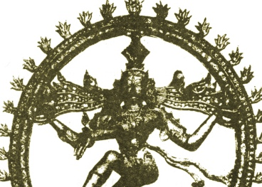

  
[Intangible Textual Heritage](../../index)  [Hinduism](../index) 

------------------------------------------------------------------------

<table width="75%">
<colgroup>
<col style="width: 50%" />
<col style="width: 50%" />
</colgroup>
<tbody>
<tr class="odd">
<td width="50%" data-valign="TOP"></td>
<td width="50%" data-valign="CENTER"><h1 id="hymns-of-the-tamil-saivite-saints" data-align="CENTER">Hymns of the Tamil Saivite Saints</h1>
<h2 id="by-f.-kingsbury-and-g.p.-phillips" data-align="CENTER">by F. Kingsbury and G.P. Phillips</h2>
<h4 id="section" data-align="CENTER">[1921]</h4></td>
</tr>
</tbody>
</table>

------------------------------------------------------------------------

[Contents](#contents)    [Start Reading](htss00)    [Page
Index](pageidx)    [Text \[Zipped\]](htss.txt.gz)

------------------------------------------------------------------------

This is a short collection of translations of Southern Indian devotional
poetry by worshippers of the god Shiva, along with commentary, written
by sympathetic Europeans. These poems, as often happens, have been
integrated into popular litergy and culture. This will make interesting
reading for anyone looking for information about Tamil literature or
southern Indian vernacular Hindu traditions.--J.B.
Hare, Feb. 3rd, 2010.

------------------------------------------------------------------------

 [Title Page](htss00)  
[Contents](htss01)  
[Introduction](htss02)  
[Sambandar And His Hymns](htss03)  
[Apparswami and his Hymns](htss04)  
[Sundaramūrti Swāmi and his Hymns](htss05)  
[Manikka Vāsahar and his Hymns](htss06)  
[Appendix I. Shrines Mentioned in These Poems](htss07)  
[Appendix II. System of Transliteration and Pronunciation of Tamil
Letters](htss08)  
[Index](htss09)  
