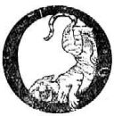

[Intangible Textual Heritage](../../index)  [Hinduism](../index) 
[Buddhism](../../bud/index)  [Index](index)  [Previous](ift09) 
[Next](ift11) 

------------------------------------------------------------------------

# The Tiger, the Brahman and the Jackal

 [  
Click to enlarge](img/31.jpg)

 NCE upon a time, a tiger was
caught in a trap. He tried in vain to get out through the bars, and
rolled and bit with rage and grief when he failed.

By chance a poor Brahman came by.

"Let me out of this cage, oh pious one!" cried the tiger.

"Nay, my friend," replied the Brahman mildly, "you would probably eat me
if I did."

"Not at all!" swore the tiger with many oaths; "on the contrary, I
should be for ever grateful, and serve you as a slave!"

Now when the tiger sobbed and sighed and wept and swore, the pious
Brahman's heart softened, and at last he consented to open the door of
the cage. Out popped the tiger, and, seizing the poor man, cried, "What
a fool you are! What is to prevent my eating you now, for after being
cooped up so long I am just terribly hungry!"

In vain the Brahman pleaded for his life; the most he could gain was a
promise to abide by the decision of the first three things he chose to
question as to the justice of the tiger's action.

So the Brahman first asked a *papal-* tree what it thought of the
matter, but the *papal*-tree replied coldly, "What have you to complain
about? Don't I give shade and shelter to every one who passes by, and
don't they in return tear down my branches to feed their cattle? Don't
whimper--be a man!"

Then the Brahman, sad at heart, went further afield till he saw a
buffalo turning a well-wheel; but he fared no better from it, for it
answered, "You are a fool to expect gratitude! Look at me! Whilst I gave
milk they fed me on cotton-seed and oil-cake, but now I am dry they yoke
me here, and give me refuse as fodder!"

The Brahman, still more sad, asked the road to give him its opinion.

"My dear sir," said the road, "how foolish you are to expect anything
else! Here am I, useful to everybody, yet all, rich and poor, great and
small, trample on me as they go past, giving me nothing but the ashes of
their pipes and the husks of their grain!"

On this the Brahman turned back sorrowfully, and on the way he met a
jackal, who called out, "Why, what's the matter, Mr. Brahman? You look
as miserable as a fish out of water!"

The Brahman told him all that had occurred. "How very confusing!" said
the jackal, when the recital was ended; "would you mind telling me over
again, for everything has got so mixed up?"

The Brahman told it all over again, but the jackal shook his head in a
distracted sort of way, and still could not understand.

"It's very odd," said he, sadly, "but it all seems to go in at one ear
and out at the other! I will go to the place where it all happened, and
then perhaps I shall be able to give a judgment."

So they returned to the cage, by which the tiger was waiting for the
Brahman, and sharpening his teeth and claws;

"You've been away a long time!" growled the savage beast, "but now let
us begin our dinner."

"Our dinner!" thought the wretched Brahman, as his knees knocked
together with fright; "what a remarkably delicate way of putting it!"

"Give me five minutes, my lord!" he pleaded, "in order that I may
explain matters to the jackal here, who is somewhat slow in his wits."

The tiger consented, and the Brahman began the whole story over again,
not missing a single detail, and spinning as long a yarn as possible.

"Oh, my poor brain! oh, my poor brain!" cried the jackal, wringing its
paws. "Let me see! how did it all begin? You were in the cage, and the
tiger came walking by--"

"Pooh!" interrupted the tiger, "what a fool you are! *I* was in the
cage."

"Of course! " cried the jackal, pretending to tremble with fright; "yes!
I was in the cage--no I wasn't--dear! dear! where are my wits? Let me
see--the tiger was in the Brahman, and the cage came walking by--no,
that's not it, either! Well, don't mind me, but begin your dinner, for I
shall never understand!"

"Yes, you shall!" returned the tiger, in a rage at the jackal's
stupidity; "I'll *make* you understand! Look here--I am the tiger--"

"Yes, my lord! "

"And that is the Brahman--"

"Yes, my lord!"

"And that is the cage--"

"Yes, my lord!"

"And I was in the cage--do you understand?"

"Yes--no - Please, my lord--"

"Well? " cried the tiger impatiently.

"Please, my lord!--how did you get in?"

"How!--why in the usual way, of course!"

"Oh, dear me!--my head is beginning to whirl again! Please don't be
angry, my lord, but what is the usual way?"

At this the tiger lost patience, and, jumping into the cage, cried,
"This way! Now do you understand how it was?"

"Perfectly! " grinned the jackal, as he dexterously shut the door, "and
if you will permit me to say so, I think matters will remain as they
were!"

------------------------------------------------------------------------

[Next: The Soothsayers Son](ift11)
