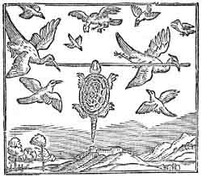

[Intangible Textual Heritage](../../index)  [Hinduism](../index) 
[Buddhism](../../bud/index)  [Index](index)  [Previous](ift31) 

------------------------------------------------------------------------

# Story Notes

I. THE LION AND THE CRANE.

Source.--V. Fausboll, *Five Jatakas,* Copenhagen, 1861, pp. 35--8, text
and translation of the *Javasakuna Jataka.* I have ventured to English
Prof. Fausböll's version, which was only intended as a "crib" to the
Pali. For the omitted Introduction, see

supra.

Parallels.--I have given a rather full collection of parallels, running
to about a hundred numbers, in my Aesop, pp. 232--4. The chief of these
are: (1) for the East, the Midrashic version (" Lion and Egyptian
Partridge "), in the great Rabbinic commentary on Genesis
*(Bereshithrabba,* c. 64); (2) in classical antiquity, Phaedrus, i. 8 ("
Wolf and Crane "), and Babrius, 94 ("Wolf and Heron"), and the Greek
proverb Suidas, ii, 248 (" Out of the Wolf's Mouth"); (3) in the Middle
Ages, the so-called Greek *Aesop.* ed. Halm; 276 *b*, really prose
versions of Babrius and "Romulus," or prose of Phaedrus, i. 8, also the
Romulus of Ademar (fl. 1030), 64; it occurs also on the Bayeux Tapestry,
in Marie de France, 7, and in Benedict of Oxford's *Mishle Shualim*
(Heb.), 8; (4) Stainhöwel took it from the " Romulus" into his German
Aesop (1480), whence all the modern European Aesops are derived.

Remarks.--I have selected *The Wolf and the Crane* as my typical example
in my "History of the Aesopic Fable," and can only give here a rough
summary of the results I there arrived at concerning the fable, merely
premising that these results are at present no more than hypotheses. The
similarity of the Jataka form with that familiar to us, and derived by
us in the last resort from Phaedrus, is so striking that few will deny
some historical relation between them. I conjecture that the Fable
originated in India, and came West, by two different routes. First, it
came by oral tradition to Egypt, as one of the Libyan Fables which the
ancients themselves distinguished from the Aesopic Fables. It was,
however, included by Demetrius Phalereus, tyrant of Athens, and founder
of the Alexandrian library c. 300 B.C., in his *Assemblies of Aesopic
Fables,* which I have shown to be the source of Phaedrus' Fables c. 30
A.D. Besides this, it came from Ceylon in the Fables of Kybises--i.e.,
Kasyapa the Buddha--c. 50 A.D., was adapted into Hebrew, and used for
political purposes, by Rabbi Joshua ben Chananyah in a harangue to the
Jews, c. 120 A.D., begging them to be patient while within the jaws of
Rome. The Hebrew form uses the lion, not the wolf, as the ingrate, which
enables us to decide on the Indian *provenance* of the Midrashic
version. It may be remarked that the use of the lion in this and other
Jatakas is indirectly a testimony to their great age, as the lion has
become rarer and rarer in India during historic times, and is now
confined to the Gir forest of Kathiáwar, where only a dozen specimens
exist, and are strictly preserved.

The verses at the end are the earliest parts of the Jataka, being in
more archaic Pali than the rest: the story is told by the commentator
(c. 400 AD) to illustrate them. It is probable that they were brought
over on the first introduction of Buddhism into Ceylon, c. 241 B.C. This
would give them an age of aver two thousand years, nearly three hundred
years earlier than Phaedrus, from whom comes our

Wolf and Crane.

II\. PRINCESS LABAM.

Source.--Miss Stokes, *Indian Fairy Tales,* No. xxii. pp. 153--63, told
by Mániyá, one of the ayahs. I have left it unaltered, except that I
have replaced" God" by " Khuda," the word originally used (see Notes *l.
c.,* p. 237).

Parallels.--The tabu, as to a particular direction, occurs in other
Indian stories as well as in European folk-tales (see notes on Stokes,
p. 286). The *grateful animals* theme occurs in "The Soothsayer's Son"
*(infra,* No. x.), and frequently in Indian folk-tales (see Temple's
Analysis, III. i. 5--7; *Wideawake Stories,* pp.412--3). The thorn in
the tiger's foot is especially common (Temple, *l. c*., 6, 9), and
recalls the story of Androclus, which occurs in the derivates of
Phaedrus, and may thus be Indian in origin (see Benfey*,Panschatantra,*
i. 211,and the parallels given in my *Aesop,* Ro. iii.-1, p. 243). The
theme is, however, equally frequent in European folk-tales: see my List
of Incidents, *Proc. Folk-Lore Congress,* p. 91, s.v. "Grateful Animals"
and "Gifts by Grateful Animals." Similarly, the " Bride Wager" incident
at the end is common to a large number of Indian and European folk-tales
(Temple, Analysis, p. 430; my List, *l.c. sub voce).* The tasks are also
equally common *(c.f.* "Battle of the Birds " in *Celtic Fairy Tales),*
though the exact forms as given in "Princess Labam" are not known in
Europe.

Remarks.--We have here a concrete instance of the relation of Indian and
European fairy-tales. The human mind may be the same everywhere, but it
is not likely to hit upon the sequence of incidents, *Direction
tabu--Grateful Animals--Bride-Wager--Tasks,* by accident or
independently: Europe must have borrowed from India, or India from
Europe. As this must have occurred within historic times, indeed within
the last thousand years, when even European peasants are not likely to
have *invented,* even if they believed, in the incident of the grateful
animals, the probability is in favour of borrowing from India, possibly
through the intermediation of Arabs at the time of the Crusades. It is
only a probability, but we cannot in any case reach more than
probability in this matter, just at present.

III\. LAMBIKIN.

Source.--Steel-Temple, *Wideawake Stories*, pp*.* 69--72, originally
published in *Indian Antiquary,* xii. 175. The droll is common
throughout the Panjab.

Parallels.--The similarity of the concluding episode with the finish of
the "Three Little Pigs" *(Eng. Fairy Tales,* No. xiv.). In my notes on
that droll I have pointed out that the pigs were once goats or kids with
"hair on their chinny chin chin." This brings the tale a stage nearer to
the Lambikin.

Remarks.--The similarity of Pig No. 3 rolling down hill in the churn and
the Lambikin in the Drumikin can scarcely be accidental; though, it must
be confessed, the tale has undergone considerable modification before it
reached England.

IV\. PUNCHKIN,

Source.--Miss Frere, *Old Deccan Days,* pp. 1--16, from her ayah, Anna
de Souza, of a Lingaet family settled and Christianised at Goa for three
generations. I should perhaps add that a Prudhan is a Prime Minister or
Vizier; Punts are the same, and Sirdars, nobles.

Parallels.--The son of seven mothers is a characteristic Indian
conception, for which see Notes on "The Son of Seven Queens" in this
collection, No. xvi. The mother transformed, envious stepmother, ring
recognition, are all incidents common to East and West; bibliographical
references for parallels may be found under these titles in my List of
Incidents. The external soul of the ogre has been studied by Mr. E.
Clodd in *Folk-Lore Journal,* vol. ii., "The Philosophy of Punchkin,"
and still more elaborately in the section, "The External Soul in
Folk-Tales," in Mr. Frazer's *Golden Bough,* ii. pp. 296--326. See also
'Major Temple's Analysis, II. iii., *Wideawake Stories,* pp. 404 - 5,
who there gives the Indian parallels.

Remarks.--Both Mr. Clodd and Mr. Frazer regard the essence of the tale
to consist in the conception of an external soul or "life-index," and
they both trace in this a 'survival" of savage philosophy, which they
consider occurs among all men at a certain stage of culture. But the
most cursory examination of the sets of tales containing these incidents
in Mr. Frazer's analyses shows that many, indeed the majority, of these
tales cannot be independent of one another; for they contain not alone
the incident of an external materialised soul, but the further point
that this is contained in something else, which is enclosed in another
thing, which is again surrounded by a wrapper. This Chinese ball
arrangement is found in the Deccan (" Punchkin"); in Bengal (Day,
*Folk-Tales of Bengal);* in Russia (Ralston, p. 103 *seq.,* "Koschkei
the Deathless," also in Mr. Lang's *Red Fairy Book);* in Servia
(Mijatovics, *Servian Folk-Lore,* p. 172); in South Slavonia (Wratislaw,
p. 225); in Rome (Miss Busk, p. 164); in Albania (Dozon, p. 132 *seq.);*
in Transylvania (Haltrich, No. 34); in Schleswig-Holstein (Müllenhoff,
p. 404); in Norway (Asbjörnsen, No. 36, *ap*. Dasent, *Pop. Tales,* p.
55, "The Giant who had no Heart in his Body"); and finally, in the
Hebrides (Campbell, *Pop. Tales,* p. 10, *cf. Celtic Fairy Tales,* No.
xvii., "Sea Maiden "). Here we have the track of this remarkable idea of
an external soul enclosed in a succession of wrappings, which we can
trace from Hindostan to the Hebrides.

It is difficult to imagine that we have not here the actual migration of
the tale from East to West. In Bengal we have the soul "in a necklace,
in a box, in the heart of a *boal* fish, in a tank"; in Albania "it is
in a pigeon, in a hare, in the silver tusk of a wild boar"; in Rome it
is "in a stone, in the head of a bird, in the head of a leveret, in the
middle head of a seven-headed hydra"; in Russia "it is in an egg, in a
duck, in a hare, in a casket, in an oak"; in Servia it is "in a board,
in the heart of a fox, in a mountain"; in Transylvania "it is in a
light, in an egg, in a duck, in a pond, in a mountain;"in Norway it is
"in an egg, in a duck, in a well, in a church, on an island, in a lake";
in the Hebrides it is "in an egg, in the belly of a duck, in the belly
of a wether, under a flagstone on the threshold." It is impossible to
imagine the human mind independently imagining such bizarre
convolutions. They were borrowed from one nation to the other, and till
we have reason shown to the contrary, the original lender was a Hindu. I
should add that the mere conception of an external soul occurs in the
oldest Egyptian tale of "The Two Brothers," but the wrappings are
absents

V. THE BROKEN POT.

Source.--Pantschatantra, V. ix,, tr. Benfey, ii. 345--6.

Parallels.--Benfey, in § 209 of his *Einleitung,* gives bibliographical
references to most of those which are given at length in Prof. M.
Müller's brilliant essay on "The Migration of Fables" *(Selected
Essays,* i. 500--76), which is entirely devoted to the travels of the
fable from India to La Fontaine. See also Mr. Clouston, *Pop. Tales,*
ii. 432 *seq.* I have translated the Hebrew version in my essay, "Jewish
Influence on the Diffusion of Folk-Tales," pp. 6--7. Our proverb, "Do
not count your chickens before they are hatched," is ultimately to be
derived from India.

Remarks.--The stories of Alnaschar, the Barber's fifth brother in the
*Arabian Nights,* and of La Perette, who counted her chickens before
they were hatched, in La Fontaine, are demonstrably derived from the
same Indian original from which our story was obtained. The travels of
the "Fables of Bidpai" from India to Europe are well known and
distinctly traceable. I have given a rough summary of the chief critical
results in the introduction to my edition of the earliest English
version of, the *Fables of Bidpai,* by Sir Thomas North, of Plutarch
fame (London, D. Nutt, "Bibliothèque de Carabas," 1888), where I have
given an elaborate genealogical table of the multitudinous versions. La
Fontaine's version, which has rendered the fable so familiar to us all,
comes from Bonaventure des Periers, *Contes et Nouvelles,* who got it
from the *Dialogus Creaturarum* of Nicholaus Pergamenus, who derived it
from the *Sermones* of Jacques de Vitry (see Prof. Crane's edition, No.,
li.), who probably derived it from the *Directorium Humanae Vita* of
John of Capua, a converted Jew, who translated it from the Hebrew
version of the Arabic *Kalilah wa Dimnah,* which was itself derived from
the old Syriac version of a Pehlevi translation of the original Indian
work, probably called after Karataka and Damanaka, the names of two
jackals who figure in the earlier stories of the book. Prof. Rhys-Davids
informs me that these names are more akin to Pali than to Sanskrit,
which makes it still more probable that the whole literature is
ultimately to be derived from a Buddhist source.

The theme of La Perette is of interest as showing the *literary*
transmission of tales from Orient to Occident. It also shows the
possibility of an influence of literary on oral tradition, as is shown
by our proverb, and by the fact, which Benfey mentions, that La
Fontaine's story has had influence on two of Grimm's tales, Nos. 164,
168.

VI\. THE MAGIC FIDDLE.

Source.--A. Campbell, *Santal Folk Tales,* 1892, pp. 52 - 6, with some
verbal alterations. A Bonga is the presiding spirit of a certain kind of
rice land; Doms and Hadis are low-caste aborigines, whose touch is
considered polluting. The Santals are a forest tribe, who live in the
Santal Parganas, 140 miles N.W. of Calcutta (Sir W. W. Hunter, *The
Indian Empire,* 57 - 60).

Parallels.--Another version occurs in Campbell, p. 106 *seq.,* which
shows that the story is popular among the Santals. It is obvious,
however, that neither version contains the real finish of the story,
which must have contained the denunciation of the magic fiddle of the
murderous sisters. This would bring it under the formula of *The Singing
Bone,* which M. Monseur has recently been studying with a remarkable
collection of European variants in the Bulletin of the Wallon Folk-Lore
Society of Liege *(cf Eng. Fairy Tales,* No. ix.). There is a singing
bone in Steel-Temple's *Wideawake Stories,* pp. 127 *seq.* (" Little
Anklebone ").

Remarks.--Here we have another theme of the common store of European
folk-tales found in India. Unfortunately, the form in which it occurs is
mutilated, and we cannot draw any definite conclusion from it.

VII\. THE CRUEL CRANE OUTWITTED.

Source.--The Baka-Jataka, Fausböll, No. 38, tr. Rhys-Davids, pp.
315--21. The Buddha this time is the Genius of the Tree.

 

Parallels.--This Jataka got into the Bidpai literature, and occurs in
all its multitudinous offshoots *(see* Benfey, *Einleilung,* § 6o) among
others in the earliest English translation by North (my edition, pp.
118--22), where the crane becomes "a great Paragone of India (of those
that liue a hundredth yeares and neuer mue their feathers)." The crab,
on hearing the ill news "called to Parliament all the Fishes of the
Lake," and before all are devoured destroys the Paragon, as in the
Jataka, and returned to the remaining fishes, who "all with one consent
give hir many a thanke."

Remarks.--An interesting point, to which I have drawn attention in my
Introduction to North's Bidpai, is the probability that the
illustrations of the tales as well as the tales themselves, were
translated, so to speak, from one, country to another. We can trace them
in Latin, Hebrew, and Arabic MSS., and a few are extant on Buddhist
Stupas. Under these circumstances, it may be of interest to compare with
Mr. Batten's conception of the Crane and the Crab that of the German
artist who illustrated the first edition of the Latin Bidpai, probably
following the traditional representations of the MS., which itself could
probably trace back to India.

VIII\. LOVING LAILI

Source.--Miss Stokes, *Indian* *Fairy Tales,* pp. 73--84. Majnun and
Laili are conventional names for lovers, the Romeo and Juliet of
Hindostan.

Parallels.--Living in animals' bellies occurs elsewhere in Miss Stokes'
book, pp. 66, 124; also in Miss Frere's, 188. The restoration of beauty
by fire occurs as a frequent theme (Temple, Analysis, III. vi. f. p.
418). Readers will be reminded of the *dénouement* of Mr. Rider
Haggard's *She.* Resuscitation from ashes has been used very effectively
by Mr. Lang in his delightful

Prince Prigio.

Remarks.--The white skin and blue eyes of Prince Majnun deserve
attention. They are possibly a relic of the days of Aryan conquest, when
the fair-skinned, fair-haired Aryan conquered the swarthier aboriginals.
The name for caste in Sanskrit is *varna,* "colour"; and one Hindu
cannot insult another more effectually than by calling him a black man.
*Cf.* Stokes, pp. 238--9, who suggests that the red hair is something
solar, and derived from myth's of the solar hero.

IX\. THE TIGER, THE BRAHMAN, AND THE JACKAL

Source.--Steel-Temple, *Wideawake Stories,* pp. 116--20; first published
in *Indian Antiquary,* xii. p. 170

seq.

Parallels.--No less than 94 parallels are given by Prof. K. Krohn in his
elaborate discussion of this fable in his dissertation, *Mann und Fuchs*
(Helsingfors, 1891), pp. 38--60; to which may be added three Indian
variants, omitted by him, but mentioned by Capt Temple, *l.c.*., p. 324
in the *Bhdgavata Purana,* the *Gui Bakaoli* and *Ind. Ant* xii. 177;
and a couple more in my *Aesop,* p. 253: add Smeaton, *Karens,* p. 126.

Remarks.--Prof*.* Krohn comes to the conclusion that the majority of the
oral forms of the tale come from literary versions (p. 47), whereas the
*Reynard* form has only had influence on a single variant. He reduces
the century of variants to three type forms. The first occurs in two
Egyptian versions collected in the present day, as well as in Petrus
Alphonsi in the twelfth century, and the *Fabulae Extravagantes* of the
thirteenth or fourteenth: here the ingrate animal is a crocodile, which
asks to be carried away from a river about to dry up, and there is only
one judge. The second is that current in India and represented by the
story in the present collection: here the judges are three. The third is
that current among Western Europeans, which has spread to S. Africa and
N. and S. America: also three judges. Prof. K. Krohn counts the first
the original form, owing to the single judge and the naturalness of the
opening, by which the critical situation is brought about. The further
question arises, whether this form, though found in Egypt now, is
indigenous there, and if so, how it got to the East. Prof. Krohn grants
the possibility of the Egyptian form having been invented in lndia and
carried to Egypt, and he allows that the European forms have been
influenced by the Indian. The "Egyptian" form is found in Burmah
(Smeaton, *l.c.,* p. 128), as well as the Indian, a fact of which Prof.
H. Krohn was unaware, though it turns his whole argument. The evidence
we have of other folk-tales of the beast-epic emanating from India
improves the chances of this also coming from that source. One thing at
least is certain: all these hundred variants come ultimately from one
source. The incident "Inside again" of the *Arabian Nights* (the Djinn
and the bottle) and European tales is also a secondary derivate.

X. THE SOOTHSAYER'S SON.

Source.--Mrs*.* Kingscote, *Tales of the Sun* (p. 11 *seq.),* from
Pandit Natesa Sastri's *Folk-Lore of Southern India,* pt. ii.,
originally from *Ind. Antiquary.* I have considerably condensed and
modified the somewhat Babu English of the original.

Parallels.--See Benfey, *Pantschatantra,* § 71, i. pp. 193--222, who
quotes the *Kama Jataka* as the ultimate source: it also occurs in the
*Saccankira jataka* (Fausböll, No. 73), trans. Rev. R. Morris,
*Folk-Lore jour.* iii. 348 *seq.* The story of the ingratitude of man
compared with the gratitude of beasts came early to the West, where it
occurs in the *Gesta Romanorum,* c. 119., It was possibly from an early
form of this collection that Richard Coeur de Lion got the story, and
used it to rebuke the ingratitude of the English nobles on his return in
1195. Matthew Paris tells the story, *sub anno* (it is an addition of
his to Ralph *Disset),Hist. Major,ed.* Luard, ii. 413--6, how a lion and
a serpent and a Venetian named Vitalis were saved from a pit by a
woodman, Vitalis promising him half his fortune, fifty talents. The lion
brings his benefactor a leveret, the serpent "gemmam pretiosam,"
probably 'the precious jewel in his head" to which Shakespeare alludes
*(As You Like It,* ii. 1, *cf* Benfey, *I. c.,* p. 214, *n.),* but
Vitalis refuses to have anything to do with him, and altogether
repudiates the fifty talents. "Haec referebat Rex Richardus munificus,
ingratos redarguendo."

Remarks.---Apart from the interest of its wide travels, and its
appearance in the standard mediaeval History of England by Matthew
Paris, the modern story shows the remarkable persistence of folk-tales
in the popular mind. Here we have collected from the Hindu peasant of
today a tale which was probably told before Buddha, over two thousand
years ago, and certainly included among the Jatakas before the Christian
era. The same thing has occurred with *The Tiger, Brahman and jackal*
(No. ix. *supra*).

XI\. HARISARMAN.

Source .--Somadeva*, Kathit-Sarit.-Sagara,* trans. Tawney (Calcutta,
1880), i. pp. 272--4. I have slightly toned down the inflated style of
the original.

Parallels.--Benfey has collected and discussed a number in *Orient and
Occident,* i. 371 *seq.;* see also Tawney, *ad loc.* The most remarkable
of the parallels is that afforded by the Grimms' "Doctor Aliwissend"
(No. 98), which extends even to such a minute point as his exclamation,
"Ach, ich armer Krebs," whereupon a crab is discovered under a dish. The
usual form of discovery of the thieves is for the Dr. Knowall to have so
many days given him to discover the thieves, and at the end of the first
day he calls out, "There's one of them," meaning the days, just as one
of the thieves peeps through at him. Hence the title and the plot of C.
Lever's

One of Them.

XII\. THE CHARMED RING.

Source.--Knowles, *Folk-Tales of Kashmir,* pp. 20-8.

Parallels.--The incident of the Aiding Animals. is frequent in
folk-tales; see bibliographical references, *sub voce,* in my List of
Incidents, *Trans. Folk-Lore Congress,* p. 88; also Knowles, 21, *n.*;
and Temple, *Wideawake Stories,* pp. 401, 412. The Magic Ring is also
"common form" in folk-tales; *cf* Köhler *ap.* Marie de France, *Lais,*
ed. Warncke, p. lxxxiv. And the whole story is to be found very widely
spread from India *(Wideawake Stories,* pp. 196--206) to England *(Eng.
Fairy Tales,* No. xvii., "Jack and his Golden Snuff-box," *cf.* Notes,
*ibid.),* the most familiar form of it being "Aladdin and the Wonderful
Lamp."

Remarks.--M. Cosquin has pointed out *(Contes de Lorraine*,p.xi*. seq.)*
that the incident of the rat's-tail-up-nose to recover the ring from the
stomach of an ogress, is found among Arabs, Albanians, Bretons, and
Russians. It is impossible to imagine that incident--occurring in the
same series of incidents--to have been invented more than once, and if
that part of the story has been borrowed from India, there is no reason
why the whole of it should not have arisen in India, and have been
spread to the West. The English variant was derived from an English
Gipsy, and suggests the possibility that for this particular story the
medium of transmission has been the Gipsies. This contains the incident
of the loss of the ring by the faithful animal, which again could not
have been independently invented.

XIII\. THE TALKATIVE TORTOISE.

 

Source.--The *Kacchapa Jataka,* Fausböll, No. 215 also in his *Five
Jatakas,* pp. 16, 41, tr. Rhys-Davids, pp. viii.--x.

Parallels.--It occurs also in the Bidpai literature, in nearly all its
multitudinous offshoots. See Benfey, *Einleitung,* § 84; also my
*Bidptai,* E, 4. *a;* and North's text, pp. 170 - 5, where it is the
taunts of the other birds that cause the catastrophe: "O here is a brave
sight, looke, here is a goodly ieast, what bugge haue we here," said
some. "See, see, fhe hangeth by the throte, and therefor fhe fpeaketh
not," saide others; "and the beast flieth not like a beast;" so she
opened her mouth and "pafhte hir all to pieces."

Remarks.--I have reproduced in my edition the original illustration of
the first English Bidpai, itself derived from the Italian block. A
replica of it here may serve to show that it could be used equally well
to illustrate the Pali original as its English
great-great-great-great-great-great grand-child.

XIV\. LAC OF RUPEES.

Source--Knowles, *Folk-Tales of Kashmir,* pp. 32--4I. I have reduced the
pieces of advice to three, and curtailed somewhat.

Parallels - See *Celtic Fairy Tales,* No. xxii., "Tale of Ivan," from
the old Cornish, now extinct, and notes *ibid.* Mr. Clouston points out
*(Pop. Tales,* ii. 3:9) that it occurs in Buddhist literature, in
"Buddaghoshas Parables," as "The Story of Kulla Pauthaka."

Remarks.--It is indeed curious to find the story better told in Cornwall
than in the land of its birth, but there can be little doubt that the
Buddhist version is the earliest and original form of the story. The
piece of advice was originally a charm, in which a youth was to say to
himself, "Why are you busy? Why are you busy?" He does so when thieves
are about, and so saves the king's treasures, of which he gets an
appropriate share. It would perhaps be as well if many of us should say
to ourselves, "

Ghatesa, ghatesa, kim karana?"

XV\. THE GOLD-GIVING SERPENT.

Source.--Pantschatantra, III. v., tr. Benfey, ii. 244--7.

Parallels given in my *.Aesop,* Ro. ii. 10, p. 40. The chief points
about them are--(1) though the tale does not exist in either Phaedrus or
Babrius, it occurs in prose derivates from the Latin by Ademar, 65, and
"Romulus," ii. 10, and from Greek, in Gabrias, 45, and the prose
*Aesop,* ed. Halm, 96; Gitlbauer has restored the Babrian form in his
edition of Babrius, No. 160. (2) The fable occurs among folk-tales
Grimm, 105; Woycicki, *Poln. Mähr.* 105; Gering, *Islensk. Aevent.* 59,
possibly derived from La Fontaine, x. 12.

Remarks.--Benfey has proved most ingeniously and conclusively *(Einl.*
i. 359) that the Indian fable is the source of both Latin and Greek
fables. I may borrow from my *Aesop,* p. 93, parallel abstracts of the
three versions, putting Benfey's results in a graphic form, series of
bars indicating the passages where the classical fables have failed to
preserve the original.

Bidpai

A Brahmin once observed a snake in his field, and thinking it the
tutelary spirit of the field, he offered it a libation of milk in a
bowl. Next day he finds a piece of gold in the bowl, and he recieves
this each day after offering the libation. One day he had to go
else-where, and he sent his son with the libation. The son sees the
gold, and thinking the serpent's hole full of treasure determines to
slay the snake. He strikes at its head with a cudgel, and the enraged
serpent stings him to death. The Brahmin mourns his son's death, but
next morning as usual brings the libation of milk (in the hope of
getting the gold as before). The serpent appears after a long delay at
the mouth of the lair, and declares their friendship at an end, as it
could not forget the blow of the Brahmin's son, nor the Brahmin his
son's death, from the bite of the snake.  
*Pants*. III. v. (Benf. 244 - 7)

Phaedrine.

... A good man had become friendly with the snake, who came into his
house and brought luck with it, so that the man became rich through it
... One day he struck the serpent, which disappeared, and with it the
man's riches. The good man tries to make it up, but the serpent declares
their friendship at an end, as it could not forget the blow. ...  
Phaed. Dressl. VII. 28 (Rom. II. xi.)

  
<u>Babrian</u>  
...........  
A serpent stung a farmer's son to death. The father pursued the serpent
with an axe, and struck off part of its tail. Afterwards fearing its
vengence he brought food and honey to its lair, and begged
reconciliation. The serpent, however, declares friendship impossible, as
it could not forget the blow ... nor the farmer his son's death from the
bite of the snake.  
Aesop, Halm 96b (Babrius-Gitlb. 160)

In the Indian fable every step of the action is thoroughly justified
whereas the Latin form does not explain why the snake was friendly in
the first instance, or why the good man was enraged afterwards; and the
Greek form starts abruptly, without explaining why the serpent had
killed the farmer's Son. Make a composite of the Phaedrine and Babrian
forms, and you get the Indian one, which is thus shown to be the
original of both.

XVI\. THE SON OF SEVEN QUEENS.

Source.--Steel-Temple, *Wideawake Stories, pp.* 98--110, originally
published in *Ind. Antiq.* x. 147

seq.

Parallels.--A long variant follows in *Ind. Antiq., l. c.* M. Cosquin
refers to several Oriental variants, *I. c.* p. xxx*. n.* For the
direction tabu, see Note on Princess Labam, *supra,* No. ii. The "letter
to kill bearer" and "letter substituted" are frequent in both European
(see my List, s. *v.)* and Indian Folk-Tales (Temple, Analysis, II. iv.
*b*, 6, p. 410). The idea of a son of seven mothers could only arise in
a polygamous country. It occurs in "Punchkin," *supra,* No. iv.; Day,
*Folk-Tales of Bengal,* 117 *seq.; Ind. Antiq.* i. 170 (Temple, *l. c.,*
398).

Remarks.--M. Cosquin *(Contes de Lorraine,* p. xxx*.)* points out how,
in a Sicilian story, Gonzenbach *(Sizil. Mähr.* No. 80), the seven
co-queens are transformed into seven step-daughters of the envious witch
who causes their eyes to be taken out; It is thus probable, though M.
Cosquin does not point this out, that the "envious stepmother" of
folk-tales (see my List, *s. v.)* was originally an envious co-wife. But
there can be little doubt of what M. Cosquin *does* point out--viz.,
that the Sicilian story is derived from the Indian one.

XVII\. A LESSON FOR KINGS.

Source.--Rajovada Jataka, Fausböll, No. 151, tr. Rhys-Davids, pp*.*
xxii.--vi.

Remarks.--This is one of the earliest of moral allegories in existence.
The moralising tone of the Jatakas must be conspicuous to all reading
them. Why, they can moralise even the Tar Baby (see *infra,* Note on
"Demon with the Matted Hair," No. xxv.).

XVIII\. PRIDE GOETH BEFORE A FALL.

Source.--Kingscote, *Tales of the Sun.* I have changed the Indian
mercantile numerals into those of English "back-slang," which make a
very good parallel.

XIX\. RAJA RASALU.

Source.--Steel-Temple, *Wideawake Stories,* pp. 247 - 80, omitting "How
Raja Rasalu was Born," "How Raja Rasalu's Friends Forsook Him," "How
Raja Rasalu Killed the Giants," and "How Raja Rasalu became a Jogi." A
further version in Temple, *Legends of* *Panjab,* vol. i. *Chaupur,* I
should explain, is a game played by two players with eight men, each on
a board in the shape of a cross, four men to each cross covered with
squares. The moves of the men are decided by the throws of a long form
of dice. The object of the game is to see which of the players can first
move all his men into the black centre square of the cross (Temple, *l.
c.,* p. 344, and *Legends of Panjab,* i. 243--5). It is sometimes said
to be the origin of chess.

Parallels.--Rev*.* C. Swynnerton, "Four Legends about Raja Rasalu," in
*Folk-Lore Journal,* p. 158 *seq.,* also in separate book much enlarged,
*The Adventures of Raja Rasalu,* Calcutta, 1884. Curiously enough, the
real interest of the story comes after the end of our part of it, for
Kokilan, when she grows up, is married to Raja Rasalu, and behaves as
sometimes youthful wives behave to elderly husbands. He gives her her
lover's heart to eat, *á* *la* Decameron, and she dashes herself over
the rocks. For the parallels of this part of the legend see my edition
of Painter's *Palace of Pleasure,* tom. i. Tale 39, or, better, the
*Programm* of H. Patzig, *Zur Geschichte der Herzmare* (Berlin, 1891).
Gambling for life occurs in Celtic and other folk-tales; *cf.* my List
of Incidents, *s.* v. "Gambling for Magic Objects."

Remarks.--Raja Rasalu is possibly an historic personage, according to
Capt. Temple, *Calcutta Review,* 1884, p. 397, flourishing in the eighth
or ninth century. There is a place called Sirikap ka-kila in the
neighbourhood of Sialkot, the traditional seat of Rasalu on the Indus,
not far from Atlock.

Herr Patzig is strongly for the Eastern origin of the romance, and finds
its earliest appearance in the West in the Anglo-Norman troubadour,
Thomas' *Lar Guirun,* where it becomes part of the Tristan cycle. There
is, so far as I know, no proof of the earliest part of the Rasalu legend
*(our* part) coming to Europe, except the existence of the gambling
incidents of the same kind in Celtic and other folk-tales.

XX\. THE ASS IN THE LION'S SKIN.

Source.--The *Siha Camma Jataka,* Fausböll, No. 189, trans. Rhys-Davids,
pp. v. vi.

Parallels.--It also occurs in Somadeva, *Katha .Sarit Sagara,* ed.
Tawney, ii. 65, and *n*. For Aesopic parallels, *cf.* my *Aesop,* Av.
iv. It is in Babrius. ed. Gitlbaur, 218 (from Greek prose Aesop, ed.
HaIm, No. 323), and Avian, ed. Eilis, 5, whence it came into the modern
Aesop.

Remarks.--Avian wrote towards the end of the third century; and put into
Latin mainly those portions of Babrius which are unparalleled by
Phaedrus. Consequently, as I have shown, he has a much larger proportion
of Eastern elements than Phaedrus. There can be little doubt that the
Ass in the Lion's Skin is from India. As Prof. Rhys-Davids remarks, the
Indian form gives a plausible motive for the masquerade which is wanting
in the ordinary Aesopic version.

XXI\. THE FARMER AND THE MONEY-LENDER.

Source.--Steel-Temple, *Wideawake Stories*, pp*.* 215--18.

Parallels enumerated in my *Aesop,* Av. xvii. See also Jacques de Vitry,
*Exempla,* ed. Crane, No. 196 (see notes, p. 212), and Bozon, *Contes
moralisés,* No. 112. It occurs in Avian. ed. Ellis, No. 22. Mr. Kipling
has a very similar tale in his

Life's Handicap.

Remarks.--Here we have collected in modern India what one cannot help
thinking is the Indian original of a fable of Avian. The preceding
number showed one of his fables existing among the Jatakas, probably
before the Christian era. This makes it likely that we shall find an
earlier Indian original of the fable of the Avaricious and Envious,
perhaps among the Jatakas still untranslated.

XXII\. THE BOY WITH MOON ON FOREHEAD.

Source.--Miss Stokes' *Indian Fairy Tales,* No. 20, *pp.* 119 - 137.

Parallels to heroes and heroines in European fairy tales, with stars on
their foreheads, are given with some copiousness in Stokes, *l. c.,* pp.
242--3*.* This is an essentially Indian trait; almost all Hindus have
some tribal or caste mark on their bodies or faces. The choice of the
hero disguised as a menial is also common property of Indian and
European fairy tales: see Stokes, *l.c*., p. 231, and my List of
Incidents *(s. v*. "Mental Disguise").

XXIII\. THE PRINCE AND THE FAKIR.

Source.--Kindly communicated by Mr. .M. L. Dames from his unpublished
collection of Baluchi tales.

Remarks.- Unholy fakirs are rather rare. See Temple, Analysis, I. ii.
*a,* p. 394.

XXIV\. WHY THE FISH LAUGHED.

Source.--Knowles*, Folk-Tales of Kashmir,* pp 484--90.

Parallels.--The latter part is the formula of the Clever Lass who
guesses riddles. She has been bibliographised by Prof. Child, *Eng. and
Scotch' Ballads,* i. 485; see also Benfey, *Kl. Schr.* ii. 156 *seq.*
The sex test at the end is different from any of those enumerated by
Prof. Kohler on Gonzenbach, *Sezil. Mahr.* ii. 216.

Remarks.--Here we have a further example of a whole formula, or series
of incidents, common to most European collections, found in India, and
in a quarter, too, where European influence is little likely to
penetrate. Prof. Benfey, in an elaborate dissertation (" Die Kluge
Dime," in *Ausland,* 1859, Nos. 20--25, now reprinted in *Kl. Sckr.* ii.
156 *seq.),* has shown the wide spread of the theme both in early Indian
literature (though probably there derived from the folk) and in modern
European folk literature.

XXV\. THE DEMON WITH THE MATTED HAIR.

Source.--The *Pancavudha-Jataka,* Fausböll, No. 55*,* kindly translated
for this book by Mr. W. H. D. Rouse, of Christ's College, Cambridge.
There is a brief abstract of the Jataka in Prof. Estlin Carpenter's
sermon, *Three Ways of Salvation,* 1884, p. 27, where my attention was
first called to this Jataka.

Parallels.--Most readers of these Notes will remember the central
episode of Mr. J*.* C. Harris' *Uncle Remus,* in which Brer Fox, annoyed
at Brer Rabbit's depredations, fits up "a contrapshun, what he calls a
Tar Baby." Brer Rabbit coming along that way, passes the time of day
with Tar Baby, and, annoyed at its obstinate silence, hits it with right
fist and with left, with left fist and with right, which successively
stick to the "contrapshun," till at last he butts with his bead, and
that sticks too, whereupon Brer Fox, who all this time had "lain low,"
saunters out, and complains of Brer Rabbit that lie is too stuck up. In
the sequel Brer Rabbit begs Brer Fox that he may "drown me as deep ez
you please, skin me, scratch out my eyeballs, tar out my years by the
roots, en cut off my legs, but don't fling me in dat brier patch;"
which, of course, Brer Fox does, only to be informed by the cunning Brer
Rabbit that he had been "bred en bawn in a brier patch." The story is a
favourite one with the negroes: it occurs in Col. Jones' *Negro Myths of
the Georgia Coast* (Uncle Remus is from S. Carolina), also among those
of Brazil (Romero, *Contos do Brazil),* and in the West Indian Islands
(Mr. Lang, "At the Sign of the Ship, *Longman's Magazine,* Feb. 1889).
We can trace it to Africa, where it occurs in Cape Colony *(South
African Folk-Lore Journal;* vol. i.).

Remarks.--The fivefold attack on the Demon and the Tar Baby is so
preposterously ludicrous that it cannot have been independently
invented, and we must therefore assume that they are casually connected,
and the existence of the variant in South Africa clinches the matter,
and gives us a landing-stage between India and America. There can be
little doubt that the Jataka of Prince Five Weapons came to Africa,
possibly by Buddhist missionaries, spread among the negroes, and then
took ship in the holds of slavers for the New World, where it is to be
found in fuller form than any yet discovered in the home of its birth. I
say Buddhist missionaries, because there is a certain amount of evidence
that the negroes have Buddhistic symbols among them, and we can only
explain the identification of Brer Rabbit with Prince Five Weapons, and
so with Buddha himself, by supposing the change to have originated among
Buddhists, where it would be quite natural. For one of the most
celebrated metempsychoses of Buddha is that detailed in the *Sasa
Jataka* (Fausböll, No. 316, tr. R. Morris, *Folk-Lore Journal,* ii.
336), in which the Buddha, as a hare, performs a sublime piece of
self-sacrifice, and as a reward is translated to the moon, where he can
be seen to this day as "the hare in the moon." Every Buddhist is
reminded of the virtue of self-sacrifice whenever the moon is full, and
it is easy to understand how the Buddha became identified as the Hare or
Rabbit. A striking confirmation of this, in connection with our
immediate subject, is offered by Mr. Harris' sequel volume, *Nights with
Uncle Remus.* Here there is a whole chapter (xxx.) on "Brer Rabbit and
his famous Foot," and it is well known how the worship of Buddha's foot
developed in later Buddhism. No wonder Brer Rabbit is so 'cute: he is
nothing less than an incarnation of Buddha. Among the Karens of Burmah,
where Buddhist influence is still active, the Hare holds exactly the
same place in their folk-lore as Brer Rabbit among the negroes. The
sixth chapter of Mr. Smeaton's book on them is devoted to "Fireside
Stories," and is entirely taken up with adventures of the Hare, all of
which can be paralleled from

Uncle Remus.

Curiously enough, the negro form of the fivefold attack--" fighting with
five fists," Mr. Barr would call it--is probably nearer to the original
legend than that preserved in 'the Jataka, though 2000 years older. For
we may be sure that the thunderbolt of Knowledge did not exist in the
original, but was introduced by some Buddhist Mr. Barlow, who, like
Alice's Duchess, ended all his tales with: "And the moral of that is--"
For no well-bred demon would have been taken in by so simple a "sell" as
that indulged in by Prince Five-Weapons in our Jataka, and it is
probable, therefore, that *Uncle Remus* preserves a reminiscence of the
original Indian reading of the tale. On the other hand, it is probable
that Carlyle's Indian god with the fire in his belly was derived from
Prince Five-Weapons.

The negro variant has also suggested to Mr. Batten an explanation of the
whole story, which is extremely plausible, though it introduces a method
of folk-lore exegesis which has been overdriven to death. The *Sasa
Jataka* identifies the Brer Rabbit Buddha with the hare in the moon. It
is well known that Easterns explain an eclipse of the moon as due to its
being swallowed up by a Dragon or Demon. May not, asks Mr. Batten, the
*Pancavudha-Jataka* be an idealised account of an eclipse of the moon?
This suggestion receives strong confirmation from the Demon's reference
to Rahu, who does, in Indian myth, swallow the moon at times of eclipse.
The Jataka accordingly contains the Buddhist explanation why the
moon--i.e. the hare in the moon, *i.e.* Buddha--is not altogether
swallowed up by the Demon of Eclipse, the Demon with the Matted Hair.
Mr. Batten adds that in imagining what kind of Demon the Eclipse Demon
was, the Jataka writer was probably aided by recollections of some giant
octopus, who has saucer eyes and a kind of hawk's beak, knobs on its
"tusks," and a very variegated belly (gasteropod). It is obviously
unfair of Mr. Batten both to illustrate and also to explain so well the
Tar Baby Jataka--taking the scientific bread, so to speak, out of a poor
folk-lorist's mouth--but his explanations seem to me so convincing that
I cannot avoid including them in these Notes.

I am, however, not so much concerned with the original explanation of
the Jataka as to trace its travels across the continents of Asia,
Africa, and America. I think I have done this satisfactorily, and will
have thereby largely strengthened the case for less extensive travels of
other tales. I have sufficient confidence of the method employed to
venture on that most hazardous of employments, scientific prophecy. I
venture to predict that the Tar Baby story will be found in Madagascar
in a form nearer the Indian than Uncle Remus, and I will go further, and
say that it will *not* be found in the grand Helsingfors collection of
folk-tales, though this includes 12,000, of which 1000 are beast-tales.

XXVI\. THE IVORY PALACE.

Source.--Knowles, *Folk-Tales of Kashmir,* pp. 211--25, with some slight
omissions. Gulizar is Persian for rosy-checked.

Parallels.--Stokes*, Indian Fairy Tales,* No. 27. "Panwpatti Rani," pp.
208--15, is the same story. Another version in the collection *Baital
Pacidsi,* No. 1.

Remarks.--The themes of love by mirror, and the faithful friend, are
common European, though the calm attempt at poisoning is perhaps
characteristically Indian, and reads like a page from Mr. Kipling.

XXVII\. SUN, MOON, AND WIND.

Source.--Miss Frere, *Old Deccan Days,* No. 10, pp. 153--5.

Remarks.--Miss Frere observes that she has not altered the traditional
mode of the Moon's conveyance of dinner to her mother the Star, though
it must, she fears, impair the value of the story as a moral lesson in
the eyes of all instructors of youth.

XXVIII\. HOW WICKED SONS WERE DUPED.

Source.--Knowles*, Folk-Tales of Kashmir,* pp*.* 241--2.

Parallels.--A Gaelic parallel was given by Campbell in *Trans. Ethnol.
Soc.,* ii. p. 336; an Anglo-Latin one from the Middle Ages by T. Wright
in *Latin Stories* (Percy Soc.), No. 26; and for these and points of
anthropological interest in the Celtic variant see Mr. Gomme's article
in *Folk-Lore,* i. pp. 197--206, "A Highland Folk-Tale and its Origin in
Custom."

Remarks.--Mr. Gomme is of opinion that the tale arose from certain
rhyming formulae occurring in the Gaelic and Latin tales as written on a
mallet left by the old man in the box opened after his death. The rhymes
are to the effect that a father who gives up his wealth to his children
in his own lifetime deserves to be put to death with the mallet Mr.
Gomme gives evidence that it was an archaic custom to put oldsters to
death after they had become helpless. He also points out that it was
customary for estates to be divided and surrendered during the owners'
lifetime, and generally he connects a good deal of primitive custom with
our story. I have already pointed out in *Folk-Lore,* p. 403, that the
existence of the tale in Kashmir without any reference to the mallet
makes it impossible for the rhymes on the mallet to be the source of the
story. As a matter of fact, it is a very embarrassing addition to it,
since the rhyme tells against the parent, and the story is intended to
tell against the ungrateful children. The existence of the tale in India
renders it likely enough that it is not indigenous to the British Isles,
but an Oriental importation. It is obvious, therefore, that it cannot be
used as anthropological evidence of the existence of the primitive
customs to be found ip it. The whole incident, indeed, is a striking
example of the dangers of the anthropological met-hod of dealing with
folk-tales before some attempt is made to settle the questions of origin
and diffusion.

XXIX\. THE PIGEON AND THE CROW.

Source.--The *Lola Jataka,* Fausböll, No. 274, kindly translated and
slightly abridged for this book by Mr. W. H. D. Rouse.

Remarks.--We began with an animal Jataka, and may appropriately finish
with one which shows how effectively the writers of the Jatakas could
represent animal folk, and how terribly moral they invariably were in
their tales. I should perhaps add that the Bodhisat is not precisely the
Buddha himself but a character which is on its way to becoming perfectly
enlightened, and so may be called a future Buddha.
