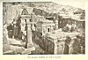
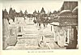

  
[Intangible Textual Heritage](../../index)  [Hinduism](../index) 
[Index](index)  [Previous](iml07)  [Next](iml09) 

------------------------------------------------------------------------

[Buy this Book at
Amazon.com](https://www.amazon.com/exec/obidos/ASIN/1421263637/internetsacredte)

------------------------------------------------------------------------

p. 38 

### CHAPTER III

### Yama, the First Man, and King of the Dead

Burial Customs--Inhumation and Cremation--Yama the First Man--. The
Discoverer of Paradise--His Twin Sister--Persian Twin Deities--Yama and
Mitra--Yama as Judge of the Dead--The "Man in the Eye"--Brahman's Deal
with Dharma-Yama--Sacrifice for a Wife--Story of Princess Savitri--Her
Husband's Fate--How she rescued his Soul from Yama--The Heavens of Yama,
Indra, and Varuna--Teutonic, Greek, and Celtic Heavens--Paradise denied
to Childless Men--Religious Need for a Son--Exposure of Female
Infants--Infanticide in Modern India--A Touching Incident.

IN early Vedic times the dead might be either buried or cremated. These
two customs were obviously based upon divergent beliefs regarding the
future state of existence. A Varuna hymn makes reference to the "house
of clay", which suggests that among some of the Aryan tribes the belief
originally obtained that the spirits of the dead hovered round the place
of sepulture. Indeed, the dread of ghosts is still prevalent in India;
they are supposed to haunt the living until the body is burned.

Those who practised the cremation ceremony in early times appear to have
conceived of an organized Hades, to which souls were transferred through
the medium of fire, which drove away all spirits and demons who
threatened mankind. Homer makes the haunting ghost of Patroklos exclaim,
"Never again will I return from Hades when I have received my meed of
fire". [1](#fn_93) The Vedic worshippers

p. 39

of Agni burned their dead for the same reason as did the ancient Greeks.
"When the remains of the deceased have been placed on the funeral pile,
and the process of cremation has commenced, Agni, the god of fire, is
prayed not to scorch or consume the departed, not to tear asunder his
skin or his limbs, but, after the flames have done their work, to convey
to the fathers the mortal who has been presented to him as an offering.
Leaving behind on earth all that is evil and imperfect, and proceeding
by the paths which the fathers trod, invested with a lustre like that of
the gods, it soars to the realms of eternal light in a car, or on wings,
and recovers there its ancient body in a complete and glorified form;
meets with the forefathers who are living in festivity with Yama;
obtains from him, when recognized by him as one of his own, a delectable
abode, and enters upon more perfect life, which is crowned with the
fulfilment of all desires, is passed in the presence of the gods, and
employed in the fulfilment of their pleasure." [1](#fn_94)

Agni is the god who is invoked by the other deities, "Make straight the
pathways that lead to the gods; be kind to us, and carry the sacrifice
for us". [2](#fn_95)

In this connection, however, Professor Macdonell says, "Some passages of
the *Rigveda* distinguish the path of the fathers or dead ancestors from
the path of the gods, doubtless because cremation appeared as a
different process from sacrifice". [3](#fn_96)

It would appear that prior to the practice of cremation a belief in
Paradise ultimately obtained: the dead walked on foot towards it. Yama,
King of the Dead, was the first man. [4](#fn_97)
Like the Aryan pioneers who discovered the

p. 40

\[paragraph continues\] Punjab, he
explored the hidden regions and discovered the road which became known
as "the path of the fathers".

To Yama, mighty king, be gifts and homage paid.  
He was the first of men that died, the first to brave  
Death's rapid rushing stream, the first to point the road  
To heaven, and welcome others to that bright abode.  
                        *Sir M. Monier Williams' translation*. [1](#fn_98)

Professor Macdonell gives a new rendering of a Vedic hymn [2](#fn_99) in which Yama is referred to as follows:

Him who along the mighty heights departed,  
Him who searched and spied the path for many,  
Son of Vivasvat, gatherer of the people,  
Yama the king, with sacrifices worship.  
                                      *Rigveda*, x, 14. 1.

Yama and his sister Yami, the first human pair, are identical with the
Persian Yima and Yimeh of Avestan literature; they are the primeval
"twins", the children of Vivasvat, or Vivasvant, in the *Rigveda* and of
Vivahvant in the *Avesta*. *Yama* signifies twin, and Dr. Rendel Harris,
in his researches on the Greek Dioscuri cult, shows that among early
peoples the belief obtained widely that one of each pair of twins was
believed to be a child of the sky. "This conjecture is borne out by the
name of Yama's father (Vivasvant), which may well be a cult-epithet of
the bright sky, 'shining abroad' (from the root *vas*, 'to shine')". . .
In the *Avesta* 'Yima, the bright' is referred to: he is the Jamshid of
Fitzgerald's Omar. [3](#fn_100)

Yima, the Iranian ruler of Paradise, is also identical with Mitra
(Mithra), whose cult "obtained from 200-400 A.D. a world-wide diffusion
in the Roman Empire,

 

[  
Click to enlarge](img/04000.jpg)  
THE KAILASA TEMPLE OF SHIVA, ELLORA  

 

p. 41

and came nearer to monotheism than the cult of any other god in
paganism". [1](#fn_101)

Professor Moulton wonders if the Yama myth "owed anything to Babylon?"
It is possible that the worshippers of Agni represented early Iranian
beliefs, and that the worshippers of Mitra, Varuna, and the twins (Yama
and Yima and the twin Aswins) were influenced by Babylonian mythology as
a result of contact, and that these opposing sects were rivals in India
in early Vedic times.

In one of the hymns [2](#fn_102) Yami is the
wooer of her brother Yama. She declares that they were at the beginning
intended by the gods to be husband and wife, but Yama replies:

"Who has sure knowledge of that earliest day? Who has seen it with his
eyes and can tell of it? Lofty is the law of Mitra and Varuna; how canst
thou dare to speak as a temptress?"  
                         Arnold's translation.

In the Vedic "land of the fathers", the shining Paradise, the two kings
Varuna and Yama sit below a tree. Yama, a form of Mitra, plays on a
flute and drinks Soma with the Celestials, because Soma gives
immortality. He gathers his people to him as a shepherd gathers his
flock: indeed he is called the "Noble Shepherd". He gives to the
faithful the draught of Soma; apparently unbelievers were destroyed or
committed to a hell called Put. Yama's messengers were the pigeon and
the owl; he had also two brindled watch-dogs, each with four eyes. The
dead who had faithfully fulfilled religious ordinances were addressed:

                        Fear not to pass the guards--  
The four-eyed brindled dogs--that watch for the departed. p. 42  
Return unto thy home, O soul! Thy sin and shame  
Leave thou behind on earth; assume a shining form--  
Thine ancient shape--refined and from all taint set free.  
                      *Sir M. Monier Williams' translation*. [1](#fn_103)

Yama judged men as Dharma-rajah, "King of righteousness"; he was
Pitripati, "lord of the fathers"; Samavurti, "the impartial judge";
Kritana, "the finisher"; Antaka, "he who ends life"; Samana, "the
leveller", &c.

In post-Vedic times he presided over a complicated system of Hells; he
was Dandadhara, "the wielder of the rod or mace". He had a noose with
which to bind souls; he carried out the decrees of the gods, taking
possession of souls at their appointed time.

In one of the *Brahmanas* death, or the soul which Death claims as his
own, is "the man in the eye". The reflection of a face in the pupil of
the eye was regarded with great awe by the early folk; it was the spirit
looking forth. We read, "Now that man in yonder orb (of the sun) and
that man in the right eye truly are no other than Death; his feet have
stuck fast in the heart, and having pulled them out, he comes forth; and
when he comes forth then that man dies; whence they say of him who has
passed away, '*he has been cut off*' (life or life-string has been
severed)". [2](#fn_104)

Yama might consent to prolong the life of one whose days had run out, on
condition that another individual gave up part of his own life in
compensation; he might even agree to restore a soul which he had bound
to carry away, in response to the appeal of a mortal who had attained to
great piety. The Vedic character of Yama survives sometimes in Epic
narrative even after cremation

p. 43

had become general. The following two touching and beautiful stories,
preserved in *Mahabharata*, are probably very ancient Aryan folk tales
which were cherished by the people and retold by the poets, who attached
to them later religious beliefs and practices.

### THE BRAHMAN AND HIS BRIDE

Once upon a time Menaka, the beautiful Apsara (celestial fairy), who is
without shame or pity, left beside a hermitage her new-born babe, the
daughter of the King of Gandharvas (celestial elves). A pious Rishi,
named Sthula-kesha, found the child and reared her. She was called
Pramadarva, and grew to be the most beautiful and most pious of all
young women. Ruru, the great grandson of Bhrigu, looked upon her with
eyes of love, and at the request of his sire, Pramati, the virgin was
betrothed to the young Brahman.

It chanced that Pramadarva was playing with her companions a few days
before the morning fixed for the nuptials. As her time had come, she
trod upon a serpent, and the death-compelling reptile bit her, whereupon
she fell down in a swoon and expired. She became more beautiful in death
than she had been in life.

Brahmans assembled round the body of Pramadarva and sorrowed greatly.
Ruru stole away alone and went to a solitary place in the forest where
he wept aloud. "Alas!" he cried, "the fair one, whom I love more dearly
than ever, lieth dead upon the bare ground. If I have performed penances
and attained to great ascetic merit, let the power which I have achieved
restore my beloved to life again."

Suddenly there appeared before Ruru an emissary from the Celestial
regions, who spake and said: "Thy

p. 44

prayer is of no avail, O Ruru. That one whose days have been numbered
can never get back her own life again. Thou shouldst not therefore
abandon thine heart to grief. But the gods have decreed a means whereby
thou canst receive back thy beloved."

Said Ruru: "Tell me how I can comply with the will of the Celestials, O
messenger, so that I may be delivered from my grief."

The messenger said: "If thou wilt resign half of thine own life to this
maiden, [Pramadarva](errata.htm#1), she will rise up again."

Said Ruru: "I will resign half of my own life so that my beloved may be
restored unto me."

Then the king of the Gandharvas and the Celestial emissary stood before
Dharma-rajah (Yama) and said: "If it be thy will, O Mighty One, let
Pramadarva rise up endowed with a part of Ruru's life."

Said the Judge of the Dead: "So be it."

When Dharma-rajah had spoken thus, the serpent-bitten maiden rose from
the ground, and Ruru, whose life was curtailed for her sake, obtained
the sweetest wife upon earth. The happy pair spent their days deeply
devoted to each other, awaiting the call of Yama at the appointed
time. [1](#fn_105)

### STORY OF SAVITRI

There was once a fair princess in the country of Madra, and her name was
Savitri. Be it told how she obtained the exalted merit of chaste women
by winning a great boon from Yama.

Savitri was the gift of the goddess Gayatri, [2](#fn_106) wife of

p. 45

\[paragraph continues\] Brahma, the
self-created, who had heard the prayers and received the offerings of
Aswapati, the childless king of Madra, when he practised austere
penances so that he might have issue. The maiden grew to be beautiful
and shapely like to a Celestial; her eyes had burning splendour, and
were fair as lotus leaves; she resembled a golden image; she had
exceeding sweetness and grace.

It came to pass that Savitri looked with eyes of love upon a youth named
Satyavan "the Truthful". Although Satyavan dwelt in a hermitage, he was
of royal birth. His father was a virtuous king, named Dyumatsena, who
became blind, and was then deprived of his kingdom by an old enemy
dwelling nigh to him. The dethroned monarch retired to the forest with
his faithful wife and his only son, who in time grew up to be a comely
youth.

When Savitri confessed her love to her sire, the great sage Narada, who
sat beside him, spoke and said: "Alas! the princess hath done wrong in
choosing for her husband this royal youth Satyavan. He is comely and
courageous, he is truthful and magnanimous and forgiving, he is modest
and patient and without malice; honour is seated upon his forehead; he
is possessed of every virtue. But he hath one defect, and no other. He
is endued with short life; within a year from this day he must die, for
so hath it been decreed; within a year Yama, god of the dead, will come
for him."

Said the king unto his daughter: "O Savitri, thou hast heard the words
of Narada. Go forth, therefore, and choose for thyself another lord, for
the days of Satyavan are numbered."

The beautiful maiden made answer unto her father the king, saying: "The
die is cast; it can fall but once; once only can a daughter be given
away by her sire; once only can a woman say, '*I am thine*'. I have
chosen

p. 46

my lord; once have I chosen, nor can I make choice a second time. Let
his life be brief or be long, I must now wed Satyavan."

Said Narada: "O king, the heart of thy daughter will not waver; she will
not be turned aside from the path she hath selected. I therefore approve
of the bestowal of Savitri upon Satyavan."

The king said: "As thou dost advise, so must I do ever, O Narada,
because that thou art my preceptor. Thee I cannot disobey."

Then said Narada: "Peace be with Savitri! I must now depart. May
blessings attend upon all of you!"

Thereafter Aswapati, the royal sire of Savitri, went to visit
Dyumatsena, the blind sire of Satyavan, in the forest, and his daughter
went with him.

Said Dyumatsena: "Why hast thou come hither?" Aswapati said: "O royal
sage, this is my beautiful daughter Savitri. Take thou her for thy
daughter-in-law."

Said Dyumatsena: "I have lost my kingdom, and with my wife and my son
dwell here in the woods. We live as ascetics and perform great penances.
How will thy daughter endure the hardships of a forest life?"

Aswapati said: "My daughter knoweth well that joy and sorrow come and go
and that nowhere is bliss assured. Accept her therefore from me."

Then Dyumatsena consented that his son should wed Savitri, whereat
Satyavan was made glad because he was given a wife who had every
accomplishment. Savitri rejoiced also because she obtained a husband
after her own heart, and she put off her royal garments and ornaments
and clad herself in bark and red cloth.

So Savitri became a hermit woman. She honoured Satyavan's father and
mother, and she gave great joy to

p. 47

her husband with her sweet speeches, her skill at work, her subdued and
even temper, and especially her love. She lived the life of the ascetics
and practised every austerity. But she never forgot the dread prophecy
of Narada the sage; his sorrowful words were always present in her
secret heart, and she counted the days as they went past.

At length the time drew nigh when Satyavan must cast off his mortal
body. When he had but four days to live, Savitri took the *Tritatra* vow
of three nights of sleepless penance and fast.

Said the blind Dyumatsena: "My heart is grieved for thee, O my daughter,
because the vow is exceedingly hard."

Savitri said: "Be not sorrowful, saintly father, I must observe my vow
without fail."

Said Dyumatsena: "It is not meet that one like me should say, 'Break thy
vow,' rather should I counsel, 'Observe thy vow.'"

Then Savitri began to fast, and she grew pale and was much wasted by
reason of her rigid penance. Three days passed away, and then, believing
that her husband would die on the morrow, Savitri spent a night of
bitter anguish through all the dark and lonely hours.

The sun rose at length on the fateful morning, and she said to herself,
"*To-day is the day*." Her face was bloodless but brave; she prayed in
silence and with fervour and offered oblations at the morning fire; then
she stood before her father-in-law and her mother-in-law in reverent
silence with joined hands, concentrating her senses. All the hermits of
the forest blessed her and said: "Mayest thou never suffer widowhood."

Said Savitri in her secret heart: "So be it." Dyumatsena spoke to her
then, saying: "Now that

p. 48

thy vow hath been completed thou mayest eat the morning meal."

Said Savitri: "I will eat when the sun goes down."

Hearing her words Satyavan rose, and taking his axe upon his shoulder,
turned towards the distant jungle to procure fruits and herbs for his
wife, whom he loved. He was strong and self-possessed and of noble
seeming.

Savitri spoke to him sweetly and said: "Thou must not go forth alone, my
husband. It is my heart's desire to go with thee. I cannot endure to-day
to be parted from thee."

Said Satyavan: "It is not for thee to enter the dark-some jungle; the
way is long and difficult, and thou art weak on account of thy severe
penance. How canst thou walk so far on foot?"

Savitri laid her head upon his bosom and said: "I have not been made
weary by my fast. Indeed I am now stronger than before. I will not feel
tired when thou art by my side. I have resolved to go with thee: do not
therefore seek to thwart my wish--the wish and the longing of a faithful
wife to be with her lord."

Said Satyavan: "If it is thy desire to accompany me I cannot but gratify
it. But thou must ask permission of my parents lest they find fault with
me for taking thee through the trackless jungle."

Then Savitri spoke to the blind sage and her husband's mother and said:
"Satyavan is going towards the deep jungle to procure fruits and herbs
for me, and also fuel for the sacrificial fires. It is my heart's wish
to go also, for to-day I cannot endure to be parted from him. Fain, too,
would I behold the blossoming woods."

Said Dyumatsena: "Since thou hast come to dwell with us in our hermitage
thou hast not before asked

p. 49

anything of us. Have thy desire therefore in this matter, but do not
delay thy husband in his duties."

Having thus received permission to depart from the hermitage, Savitri
turned towards the jungle with Satyavan, her beloved lord. Smiles
covered her face, but her heart was torn with secret sorrow.

Peacocks fluttered in the green woodland through which they walked
together, and the sun shone in all its splendour in the blue heaven.

Said Satyavan with sweet voice: "How beautiful are the bright streams
and the blossoming trees!"

The heart of Savitri was divided into two parts: with one she held
converse with her husband while she watched his face and followed his
moods; with the other she awaited the dread coming of Yama, but she
never uttered her fears.

Birds sang sweetly in the forest, but sweeter to Savitri was the voice
of her beloved. It was very dear to her to walk on in silence, listening
to his words.

Satyavan gathered fruits and stored them in his basket. At length he
began to cut down the branches of trees. The sun was hot and he
perspired. Suddenly he felt weary and he said: "My head aches; my senses
are confused, my limbs have grown weak, and my heart is afflicted
sorely. O silent one, a sickness hath seized me. My body seems to be
pierced by a hundred darts. I would fain lie down and rest, my beloved;
I would fain sleep even now."

Speechless and terror-stricken, the gentle Savitri wound her arms about
her husband's body; she sat upon the ground and she pillowed his head
upon her lap. Remembering the words of Narada, she knew that the dread
hour had come; the very moment of death was at hand. Gently she held her
husband's head with

p. 50

caressing hands; she kissed his panting lips; her heart was beating fast
and loud. Darker grew the forest and it was lonesome indeed.

Suddenly an awful Shape emerged from the shadows. He was of great
stature and sable hue; his raiment was blood-red; on his head he wore a
gleaming diadem; he had red eyes and was fearsome to look upon; he
carried a noose. . . . The Shape was Yama, god of death. He stood in
silence, and gazed upon slumbering Satyavan.

Savitri looked up, and when she perceived that a Celestial had come
nigh, her heart trembled with sorrow and with fear. She laid her
husband's head upon the green sward and rose up quickly: then she spake,
saying, "Who art thou, O divine One, and what is thy mission to me?"

Said Yama: "Thou dost love thy husband; thou art endued also with
ascetic merit. I will therefore hold converse with thee. Know thou that
I am the Monarch of Death. The days of this man, thy husband, are now
spent, and I have come to bind him and take him away."

Savitri said: "Wise sages have told me that thy messengers carry mortals
away. Why, then, O mighty King, hast thou thyself come hither?"

Said Yama: "This prince is of spotless heart; his virtues are without
number; he is, indeed, an ocean of accomplishments. It would not be
fitting to send messengers for him, so I myself have come hither."

The face of Satyavan had grown ashen pale. Yama cast his noose and tore
out from the prince's body the soul-form, which was no larger than a
man's thumb; it was tightly bound and subdued.

So Satyavan lost his life; he ceased to breathe; his body became
unsightly; it was robbed of its lustre and deprived of power to move.

p. 51

Yama fettered the soul with tightness, and turned abruptly towards the
south; silently and speedily he went upon his way. . . .

Savitri followed him. . . . Her heart was drowned in grief. She could
not desert her beloved lord. . . . She followed Yama, the Monarch of
Death.

Said Yama: "Turn back, O Savitri. Do not follow me. Perform the funeral
rites of thy lord. . . . Thine allegiance to Satyavan hath now come to
an end: thou art free from all wifely duties. Dare not to proceed
farther on this path."

Savitri said: "I must follow my husband whither he is carried or whither
he goeth of his own will. I have undergone great penance. I have
observed my vow, and I cannot be turned back. . . . I have already
walked with thee seven paces, and the sages have declared that one who
walketh seven paces with another becometh a companion. Being thus made
thy friend, I must hold converse with thee, I must speak and thou must
listen. . . . I have attained the perfect life upon earth by performing
my vows and by reason of my devotion unto my lord. It is not meet that
thou shouldest part me from my husband now, and prevent me from
attaining bliss by saying that my allegiance to him hath ended and
another mode of life is opened to me."

Said Yama: "Turn back now. . . . Thy words are wise and pleasing indeed;
therefore, ere thou goest, thou canst ask a boon of me and I will grant
it. Except the soul of Satyavan, I will give thee whatsoever thou dost
desire."

Savitri said: "Because my husband's sire became blind, he was deprived
of his kingdom. Restore his eyesight, O mighty One."

Said Yama: "The boon is granted. I will restore the

p. 52

vision of thy father-in-law. . . . But thou hast now grown faint on this
toilsome journey. Turn back, therefore, and thy weariness will pass
away."

Savitri said: "How can I be weary when I am with my husband? The fate of
my husband will be my fate also; I will follow him even unto the place
whither thou dost carry him. . . . Hear me, O mighty One, whose
friendship I cherish! It is a blessed thing to behold a Celestial; still
more blessed is it to hold converse with one; the friendship of a god
must bear great fruit."

Said Yama: "Thy wisdom delighteth my heart. Therefore thou canst ask of
me a second boon, except the life of thy husband, and it will be granted
thee."

Savitri said: "May my wise and saintly father-in-law regain the kingdom
he hath lost. May he become once again the protector of his people."

Said Yama: "The boon is granted. The king will return to his people and
be their wise protector. . . . Turn back now, O princess; thy desire is
fulfilled."

Savitri said: "All people must obey thy decrees; thou dost take away
life in accordance with divine ordinances and not of thine own will.
Therefore thou art called Yama--he that ruleth by decrees. Hear my
words, O divine One. It is the duty of Celestials to love all creatures
and to award them according to their merit. The wicked are without
holiness and devotion, but the saintly protect all creatures and show
mercy even unto their enemies."

Said Yama: "Thy wise words are like water to a thirsty soul. Ask of me
therefore a third boon, except thy husband's life, and it will be
granted unto thee."

Savitri said: "My sire, King Aswapati, hath no son. O grant that a
hundred sons may be born unto him."

Said Yama: "A hundred sons will be born unto thy

 

[  
Click to enlarge](img/05200.jpg)  
YAMA AND SAVITRI  
*From a painting by Nanda Lall Bose*  
(By permission of the Indian Society of Oriental Art, Calcutta  

 

p. 53

royal sire. Thy boon is granted. . . . Turn back, therefore, O princess;
thou canst not come farther. Long is the path thou hast already
travelled."

Savitri said: "I have followed my husband and the way hath not seemed
long. Indeed, my heart desireth to go on much farther. Hear my words, O
Yama, as thou dost proceed on thy journey. Thou art great and wise and
powerful; thou dost deal equally with all human creatures; thou art the
lord of justice. . . . One cannot trust oneself as one can trust a
Celestial; therefore, one seeketh to win the friendship of a Celestial.
It is meet that one who seeketh the friendship of a Celestial should
make answer to his words."

Said Yama: "No mortal hath ever spoken unto me as thou hast spoken. Thy
words are indeed pleasing, O princess. I will grant thee even a fourth
boon, except thy husband's life, ere thou dost depart."

Savitri said: "May a century of sons be born unto my husband and me so
that our race may endure. O grant me this, the fourth boon, thou Mighty
One."

Said Yama: "I grant unto thee a century of sons, O princess; they will
be wise and powerful and thy race will endure. . . . Be without
weariness now, O lady, and turn back; thou hast come too far already."

Savitri said: "Those who are pious must practise eternal morality, O
Yama. The pious uphold the universe. The pious hold communion with the
pious only, and are never weary; the pious do good unto others nor ever
expect any reward. A good deed done unto the righteous is never thrown
away; such an act doth not entail loss of dignity nor is any interest
impaired. Indeed, the doing of good is the chief office of the
righteous, and the righteous therefore are the true protectors of all."

p. 54

Said Yama: "The more thou dost speak, the more I respect thee, O
princess. O thou who art so deeply devoted unto thy husband, thou canst
now ask of me some incomparable boon."

Savitri said: "O mighty One, thou bestower of boons, thou hast already
promised what cannot he fulfilled unless my husband is restored unto me;
thou hast promised me a century of sons. Therefore, I ask thee, O Yama,
to give me back Satyavan, my beloved, my lord. Without him, I am as one
who is dead; without him, I have no desire for happiness; without him I
have no longing even for Heaven; I will have no desire to prosper if my
lord is snatched off; I cannot live without Satyavan. Thou hast promised
me sons, O Yama, yet thou dost take away my husband from mine arms. Hear
me and grant this boon: Let Satyavan be restored to life so that thy
decree may be fulfilled."

Said Yama: "So be it. With cheerful heart I now unbind thy husband. He
is free. . . . Disease cannot afflict him again and he will prosper.
Together you will both have long life; you will live four hundred years;
you will have a century of sons and they will be kings, and their sons
will be kings also."

Having spoken thus, Yama, the lord of death, departed unto his own
place. And Savitri returned to the forest where her husband's body lay
cold and ashen-pale; she sat upon the ground and pillowed his head upon
her lap. Then Satyavan was given back his life. . . . He looked upon
Savitri with eyes of love; he was like to one who had returned from a
long journey in a strange land.

Said Satyavan: "Long was my sleep; why didst thou not awaken me, my
beloved? . . . Where is that dark One who dragged me away?"

p. 55

Savitri said: "Yama hath come and gone, and thou hast slept long,
resting thy head upon my lap, and art now refreshed, O blessed one.
Sleep hath forsaken thee, O son of a king. If thou canst rise up, let us
now depart hence for the night is already dark. . . ."

Satyavan rose up refreshed and strong. He looked round about and
perceived that he was in the midst of the forest. Then he said: "O fair
one, I came hither to gather fruit for thee, and while I cut down
branches from the trees a pain afflicted me. I grew faint, I sank upon
the ground, I laid my head upon thy lap and fell into a deep slumber
even whilst thou didst embrace me. Then it seemed to me that I was
enveloped in darkness, and that I beheld a sable One amidst great
effulgence. . . Was this a vision or a reality, O fairest and dearest?"

Savitri said: "The darkness deepens. . . . I will tell thee all on the
morrow. . . . Let us now find our parents, O prince. The beasts of the
night come forth; I hear their awesome voices; they tread the forest in
glee; the howl of the jackal maketh my heart afraid." [1](#fn_107)

Said Satyavan: "Darkness hath covered the forest with fear; we cannot
discover the path by which to return home."

Savitri said: "A withered tree burneth yonder. I will gather sticks and
make a fire and we will wait here until day."

Said Satyavan: "My sickness hath departed and I would fain behold my
parents again. Never before have I spent a night away from the
hermitage. My mother is old and my father also, and I am their crutch.
They will now be afflicted with sorrow because that we have not
returned."

p. 56

Satyavan lifted up his arms and lamented aloud, but Savitri dried his
tears and said: "I have performed penances, I have given away in
charity, I have offered up sacrifices, I have never uttered a falsehood.
May thy parents be protected by virtue of the power which I have
obtained, and may thou, O my husband, be protected also.

Said Satyavan: "O beautiful one, let us now return to the hermitage."

Savitri raised up her despairing husband. She then placed his left arm
upon her left shoulder and wound her right arm about his body, and they
walked on together. . . . At length the fair moon came out and shone
upon their path.

Meanwhile Dyumatsena, the sire of Satyavan, had regained his sight, and
he went with his wife to search for his lost son, but had to return to
the hermitage sorrowing and in despair. The sages comforted the weeping
parents and said: "Savitri hath practised great austerities, and there
can be no doubt that Satyavan is still alive."

In time Satyavan and Savitri reached the hermitage, and their own hearts
and the hearts of their parents were freed from sorrow.

Then Savitri related all that had taken place, and the sages said: "O
chaste and illustrious lady, thou hast rescued the race of Dyumatsena,
the foremost of kings, from the ocean of darkness and calamity."

On the morning that followed messengers came to Dyumatsena and told that
the monarch who had deprived him of his kingdom was dead, having fallen
by the hand of his chief minister. All the people clamoured for their
legitimate ruler. Said the messengers: "Chariots await thee, O king.
Return, therefore, unto thy kingdom."

p. 57

Great was their wonder to find that Dyumatsena was no longer blind.

So the king was restored to his kingdom, in accordance with the boon
which Savitri had obtained from Yama. And sons were in time born unto
her father. Thus did the gentle Savitri, by reason of her great piety,
raise from misery to high fortune the family of her husband and her own
father also. She was the rescuer of all; the bringer of happiness and
prosperity. . . . He who heareth the story of Savitri will never endure
misery again. . . .

 

The beauties of Yama's heaven are sung by the sage Narada in the great
epic poem *Mahabharata*. [1](#fn_108) "Listen
to me," he says. "In that fair domain it is neither too hot nor too
cold. Life there is devoid of sorrow; age does not bring frailties, and
none ever hunger or thirst; it is without wretchedness, or fatigue, or
evil feelings. Everything, whether celestial or human, that the heart
seeks after is found there. Sweet are the juicy fruits, delicious the
fragrance of flowers and tree blossoms, and waters are there, both cold
and hot, to give refreshment and comfort. Nymphs dance and sing to the
piping of celestial elves, and merry laughter ever blends with the
strains of alluring music.

"The Assembly House of Yama, which was made by Twashtri, hath splendour
equal to the sun; it shines like burnished gold. There the servants of
the Lord of Justice measure out the allotted days of mortals. Great
rishis and ancestors await upon Yama, King of the Pitris (fathers), and
adore him. Sanctified by holiness, their shining bodies are clad in
swan-white garments, and decked with many-coloured bracelets and golden
ear-rings. Sweet sounds, alluring perfumes, and brilliant

p. 58

flower garlands make that building ever pleasant and supremely blest.
Hundreds of thousands of saintly beings worship the illustrious King of
the Pitris.

"The heaven of Indra was constructed by the great artisan-god himself.
Like a chariot it can be moved anywhere at will. The Assembly House has
many rooms and seats, and is adorned by celestial trees. Indra sits
there with his beautiful queen, wearing his crown, with gleaming
bracelets on his upper arms; he is decked with flowers, and attired in
white garments. He is waited upon by brilliant Maruts, and all the gods
and the rishis and saints, whose sins have been washed off their pure
souls, which are resplendent as fire. There is no sorrow, or fear, or
suffering in Indra's abode, which is inhabited by the spirits of wind
and thunder, fire and water, plants and clouds, and planets and stars,
and the spirits also of Prosperity, Religion, Joy, Faith, and
Intelligence. Fairies and elves (Apsaras and Gandharvas) dance and sing
there to sweet music; feats of skill are performed by celestial battle
heroes, auspicious rites are also practised. Divine messengers come and
go in celestial chariots, looking bright as Soma himself.

The heaven of Varuna was constructed by Vishwakarman (Twashtri) within
the sea. Its walls and arches are of pure white, and they are surrounded
by celestial trees, made of sparkling jewels, which always blossom and
always bear fruit. In the many-coloured bowers beautiful and variegated
birds sing delightful melodies. In the Assembly House, which is also of
pure white, there are many rooms and many seats. Varuna, richly decked
with jewels and golden ornaments and flowers, is throned there with his
queen. Adityas [1](#fn_109) wait upon the

 

[  
Click to enlarge](img/05800.jpg)  
THE CITY OF THE GODS, PALITANA  

 

p. 59

lord of the waters, as also do hooded snakes (Nagas) with human heads
and arms, and Daityas and Danavas (giants and demons) who have taken
vows and have been rewarded with immortality. All the holy spirits of
rivers and oceans are there, and the holy spirits of lakes and springs
and pools, and the personified forms of the points of the heavens, the
ends of the earth, and the great mountains. Music and dances provide
entertainment, while sacred hymns are sung in praise of Varuna."

These heavens recall the Grecian "Islands of the Blest" and the Celtic
Otherworld, where eternal summer reigns, trees bear blossoms and fruit
continually, and there is no wasting with age. Indra's Assembly House is
slightly reminiscent of the Teutonic Valhal, but is really more like the
gardens of the underworld Hela. The Indian heroes do not feast on pork
like those of Teutonic and Celtic myth; in the Assembly House of Kuvera,
god of wealth, however, fat and flesh are eaten by fierce sentinel
dwarfs. The fairy-like Apsaras are wooed by Indra's favoured warriors as
well as by the gods.

One of the conditions which secured entry to the heaven of Yama was that
a man should have offspring. A rishi, named Mandapala, devoted himself
to religious vows and the observance of great austerities, but when he
reached the region of the Pitris, he could not obtain "the fruit of his
acts". He asked: "Why is this domain unattainable to me?"

Said the Celestials: "Because thou hast no children. . . . The Vedas
have declared that the son rescueth the father from a hell called Put. O
best of Brahmans, strive thou to beget offspring." [1](#fn_110)

A father could only reach Heaven if his son, after performing the
cremation ceremony, poured forth the

p. 60

oblation and performed other necessary services to the dead.
Consequently, all men showed great anxiety to have sons. In the Vedic
period the exposure of female children was not unknown; indeed, this
practice is referred to in the *Yajurveda*. "It is sorrowful to have a
daughter," exclaims the writer of one of the *Brahmanas*.

One reason for infanticide in modern India is associated with the
practice of exogamy (marriage outside of one's tribe). Raids took place
for the purpose of obtaining wives and these were invariably the cause
of much bloodshed. In 1842, members of the Kandhs tribe told Major
Macpherson "that it was better to destroy girls in their infancy than to
allow them to grow up and become causes of strife afterwards". Colonel
Mac Culloch, Political Agent for Manipur, stamped out infanticide in the
Naga country by assuring the people of a tribe that they would be
protected against the wife-hunting parties of a stronger tribe. "Many
years afterwards a troop of Naga girls from the weaker tribe paid a
visit of ceremony to Colonel Mac Culloch, bearing presents of cloth of
their own weaving in token of their gratitude to the man who had saved
their lives." [1](#fn_111)

------------------------------------------------------------------------

### Footnotes

[38:1](iml08.htm#fr_94) *Iliad*, xxiii, 75.

[39:1](iml08.htm#fr_95) Muir, *Original Sanskrit
Texts*, v. 302.

[39:2](iml08.htm#fr_96) *Rigveda*, x. 51
(Arnold's translation).

[39:3](iml08.htm#fr_97) *A History of Sanskrit
Literature*, p. 117.

[39:4](iml08.htm#fr_98) As was also Manu of a
different or later cult.

[40:1](iml08.htm#fr_99) From *Indian Wisdom*.

[40:2](iml08.htm#fr_100) *A History of Sanskrit
Literature*, p. 117.

[40:3](iml08.htm#fr_101) *Early Religious
Poetry of Persia*, Professor J. H. Moulton, p. 42.

[41:1](iml08.htm#fr_102) *A History of Sanskrit
Literature*, Professor Macdonell, p. 68.

[41:2](iml08.htm#fr_103) *Rigveda*, x, 10.

[42:1](iml08.htm#fr_104) From *Indian Wisdom*.

[42:2](iml08.htm#fr_105) *Satapatha Brahmana*,
translated by Professor Eggeling, Part IV, 1897, p. 371 (*Sacred Books
of the East*).

[44:1](iml08.htm#fr_106) From *Adi Parva*
section of *Mahabharata*.

[44:2](iml08.htm#fr_107) Saraswati's rival.
Brahma took Gayatri, the milkmaid, as a second wife, because his chief
wife, Saraswati, despite her wisdom, arrived late for a certain
important ceremony, at which the spouse of the god was required.

[55:1](iml08.htm#fr_108) Unfaithful wives were
transformed into jackals after death.

[57:1](iml08.htm#fr_109) *Lokapala-Sabhakhyana*
section of *Sabha Parva*.

[58:1](iml08.htm#fr_110) Sons of the goddess
Aditi. They are attendants of Varuna, their chief, as the Maruts are
attendants of India.

[59:1](iml08.htm#fr_111) *Adi Parva* section of
*Mahabharata*, Roy's trans., p. 635.

[60:1](iml08.htm#fr_112) The Tribes and Castes
of Bengal. H. H. Risley (1892), vol. i, lxv, *et seq*.

------------------------------------------------------------------------

[Next: Chapter IV. Demons and Giants and Fairies](iml09)
