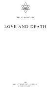
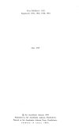

  
[Intangible Textual Heritage](../../index)  [Hinduism](../index) 
[Index](index)  [Next](lad01) 

------------------------------------------------------------------------

*Love and Death*, by Sri Aurobindo, \[1921\], at Intangible Textual
Heritage

------------------------------------------------------------------------

# LOVE AND DEATH

## by SRI AUROBINDO

#### SRI AUROBINDO ASHRAM

#### PONDICHERRY

#### \[1921\]

Scanned at Intangible Textual Heritage, February 2007. Proofed and
formatted by John Bruno Hare. This text is in the public domain in the
US because it was published prior to January 1st, 1923. These files may
be used for any non-commercial purpose provided this notice of
attribution is left intact in all copies.

[  
Click to enlarge](img/title.jpg)  
Title Page  

[  
Click to enlarge](img/verso.jpg)  
Verso  

------------------------------------------------------------------------

[Next: Love and Death](lad01)
