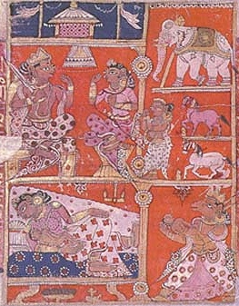

  
[Intangible Textual Heritage](../../index)  [Hinduism](../index) 

------------------------------------------------------------------------

[Buy this Book at
Amazon.com](https://www.amazon.com/exec/obidos/ASIN/1417982012/internetsacredte)

------------------------------------------------------------------------

<table width="75%">
<colgroup>
<col style="width: 50%" />
<col style="width: 50%" />
</colgroup>
<tbody>
<tr class="odd">
<td width="50%" data-valign="TOP"></td>
<td width="50%" data-valign="CENTER"><h1 id="the-little-clay-cart" data-align="CENTER">The Little Clay Cart</h1>
<h2 id="by-shudraka-translated-by-arthur-william-ryder" data-align="CENTER">by Shudraka, translated by Arthur William Ryder</h2>
<h4 id="section" data-align="CENTER">[1905]</h4></td>
</tr>
</tbody>
</table>

------------------------------------------------------------------------

[Contents](#contents)    [Start Reading](lcc00)    [Page
Index](pageidx)    [Text \[Zipped\]](lcctxt.zip)

------------------------------------------------------------------------

|                                                                                                                           |
|---------------------------------------------------------------------------------------------------------------------------|
|  |

The Mricchakatika, or Little Clay Cart, is one of the oldest Indian
plays known, probably written about the 2nd century BCE. This is the
only work by the author King Shudraka, who preceded the more famous
[Kalidasa](../sha/index) by about five centuries. Little else is known
about the author.

The play is a what is today known as a 'screwball comedy.' The central
character, Vasantasena, is a courtesan, involved in a love triangle.
Courtesans were a class of female entertainers, who were skilled in the
[arts of love](../../sex/kama/index). They had long-term relationships
with their clients, and some become wealthy or even formal wives, (as
does Vasantasena), so they had both social mobility and independence.
The characters span society from high to low, including royals,
soldiers, priests and a motley crew of commoners. There is enough
action, hilarity, historical atmosphere, and subplots in the ten (!)
acts for a TV miniseries, including a cliffhanger at the end which is
used to comic effect.

Technical notes: Due to the large number of elaborate paragraph
continuations in this text, the continuations are only noted in HTML
comments instead of marginally as normal.

--J.B. Hare, December 8, 2007

------------------------------------------------------------------------

 [Title Page](lcc00)  
[Contents](lcc01)  
[Note by the Editor](lcc02)  
[Preface](lcc03)  
[Introduction](lcc04)  
[Dramatis Personae](lcc05)  
[Prologue](lcc06)  
[Act the First: The Gems Are Left Behind](lcc07)  
[Act the Second: The Shampooer Who Gambled](lcc08)  
[Act the Third: The Hole in the Wall](lcc09)  
[Act the Fourth: Madanikā and Sharvilaka](lcc10)  
[Act the Fifth: The Storm](lcc11)  
[Act the Sixth: The Swapping of the Bullock-Carts](lcc12)  
[Act the Seventh: Aryaka's Escape](lcc13)  
[Act the Eighth: The Strangling of Vasantasenā](lcc14)  
[Act the Ninth: The Trial](lcc15)  
[Act the Tenth: The End](lcc16)  
[Epilogue](lcc17)  
[A List of Passages in Which the Translation Departs From Parab's
Text](lcc18)  
