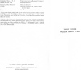

  
[Intangible Textual Heritage](../../index)  [Hinduism](../index) 
[Index](index)  [Next](lcc01) 

------------------------------------------------------------------------

[Buy this Book at
Amazon.com](https://www.amazon.com/exec/obidos/ASIN/1417982012/internetsacredte)

------------------------------------------------------------------------

  
*The Little Clay Cart*, by Shudraka, tr. Arthur William Ryder, \[1905\],
at Intangible Textual Heritage

------------------------------------------------------------------------

p. i p. ii

# HARVARD ORIENTAL SERIES

###### EDITED

##### WITH THE COÖPERATION OF VARIOUS SCHOLARS

###### BY

### CHARLES ROCKWELL LANMAN

##### WALES PROFESSOR OF SANSKRIT IN HARVARD UNIVERSITY

## Volume Nine

#### CAMBRIDGE, MASSACHUSETTS

#### Published by Harvard University

#### 1905

p. iii

# THE LITTLE CLAY CART

### \[MṚCCHAKAṬIKA\]

#### A Hindu Drama

##### ATTRIBUTED TO KING SHŪDRAKA

##### TRANSLATED FROM THE ORIGINAL SANSKRIT AND PRĀKRITS

##### INTO ENGLISH PROSE AND VERSE

###### BY

## ARTHUR WILLIAM RYDER, PHḌ.

###### INSTRUCTOR IN SANSKRIT IN HARVARD UNIVERSITY

 

#### CAMBRIDGE, MASSACHUSETTS

#### Published by Harvard University

#### \[1905\]

Scanned, proofed and formatted at Intangible Textual Heritage, December
2007 by John Bruno Hare. This text is in the public domain in the US
because it was published prior to 1923. These files may be used for any
purpose.

p. iv

COPYRIGHT, 1905, BY HARVARD UNIVERSITY

PRINTED BY D. B. UPDIKE AT THE MERRYMOUNT PRESS

BOSTON, MASSACHUSETTS

  [  
Click to enlarge](img/title.jpg)  
Title Page  

 
[  
Click to enlarge](img/verso.jpg)  
Verso  

 
[  
Click to enlarge](img/spine.jpg)  
Spine  

p. v

TO MY FATHER

WILLIAM HENRY RYDER

------------------------------------------------------------------------

[Next: Contents](lcc01)
