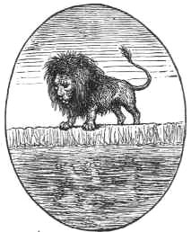

[Intangible Textual Heritage](../../index)  [Hinduism](../index) 
[Index](index)  [Previous](odd14)  [Next](odd16) 

------------------------------------------------------------------------

# XI.

# SINGH RAJAH  [1](#fn_58) AND THE CUNNING LITTLE JACKALS

 

ONCE upon a time, in a great jungle, there lived a great Lion. He was
Rajah of all the country round; and every day he used to leave his den,
in the deepest shadow of the rocks, and roar with a loud, angry voice;
and when he roared, the other animals in the jungle, who were all his
subjects, got very much frightened, and ran here and there; and Singh
Rajab would pounce upon them, and kill them, and gobble them up for his
dinner.

This went on for a long, long time, until, at last, there were no living
creatures left in the jungle but two little jackals,--a Rajah Jackal and
a Ranee Jackal--husband and wife.

A very hard time of it the poor little Jackals had, running this way and
that to escape the terrible Singh Rajah; and every day the little Ranee
Jackal would say to her husband, 'I am afraid he will catch us
to-day,--do you hear how he is roaring? Oh dear oh dear!' And he would
answer her, 'Never fear; I will take care of you. Let us run on a mile
or two. Come, come,--quick, quick, quick!' And they would both run away
as fast as they could.

After some time spent in this way, they found, however, one fine day,
that the Lion was so close upon them that they could not escape. Then
the little Ranee Jackal said, 'Husband, husband! I feel very frightened.
The Singh Rajah is so angry he will certainly kill us at once. What can
we do?' But he answered, 'Cheer up; we can save ourselves yet. Come, and
I'll show you how we may manage it.'

So what did these cunning little Jackals do, but they went to the great
Lion's den; and when he saw them coming, he began to roar and shake his
mane, and he said, 'You little wretches, come and be eaten at once I I
have had no dinner for three whole days, and all that time I have been
running over hill and dale to find you. Ro-a-ar! Ro-a-ar! Come and be
eaten, I say!' and he lashed his tail and gnashed his teeth, and looked
very terrible indeed. Then the Jackal Rajah, creeping quite close up to
him, said, '0 great Singh Rajah, we all know you are our master, and we
would have come at your bidding long ago; but indeed, sir, there is a
much bigger Rajah even than you in this jungle, and he tried to catch
hold of us and eat us up, and frightened us so much that we were obliged
to run away.'

'What do you mean?' growled Singh Rajab. 'There is no King in this
jungle but me!' 'Ah, Sire,' answered the Jackal, 'in truth one would
think so, for you are very dreadful. Your very voice is death. But it is
as we say, for we, with our own eyes, have seen one with whom you could
not compete; whose equal you can no more be than we are yours; whose
face is as flaming fire, his step as thunder, and his power supreme.'
'It is impossible!' interrupted the old Lion; 'but show me this Rajah of
whom you speak so much, that I may destroy him instantly!'

Then the little Jackals ran on before him until they reached a great
well, and, pointing down to his own reflection in the water, they said,
'See, Sire, there lives the terrible King of whom we spoke.' When Singh
Rajah looked down the well he became very angry, for he thought he saw
another Lion there. He roared and shook his great mane, and the shadow
Lion shook his, and looked terribly defiant. At last, beside himself
with rage at the insolence of his opponent, Singh Rajah sprang down to
kill him at once, but no other Lion was there--only the treacherous
reflection; and the sides of the well were so steep that he could not
get out again, to punish the two Jackals, who peeped over the top. After
struggling for some time in the deep water, he sank to rise no more. And
the little Jackals threw stones down upon him from above, and danced
round and round the well, singing, 'Ao! Ao! Ao! Ao! The King of the
Forest is dead, is dead We have killed the great Lion who would have
killed us! Ao! Ao! Ao! Ao! Ring-a-ting--ding-a-ting!
Ring-a-ting--ding-a-ting! Ao! Ao l Ao!' [2](#fn_59)

------------------------------------------------------------------------

### Footnotes

[1](odd15.htm#fr_58) Lion King.

[2](odd15.htm#fr_59) See Notes.

------------------------------------------------------------------------

[Next: XII. The Jackal, the Barber, and the Brahman who had seven
daughters](odd16)
