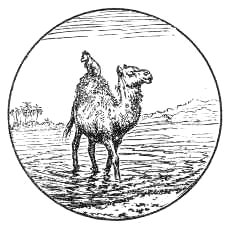

[Intangible Textual Heritage](../../index)  [Hinduism](../index) 
[Index](index)  [Previous](odd16)  [Next](odd18) 

------------------------------------------------------------------------

# XIII

# TIT FOR TAT.

 

THERE once lived a Camel and a Jackal who were great friends. One day
the Jackal said to the Camel, 'I know that there is a fine field of
sugar-cane on the other side of the river. If you will take me across
I'll show you the place. This plan will suit me as well as you. You will
enjoy eating the sugar-cane, and I am sure to find many crabs, bones,
and bits of fish by the river-side, on which to make a good dinner.'

The Camel consented, and swam across the river, taking the Jackal, who
could not swim, on his back. When they reached the other side, the Camel
went to eat the sugar-cane, and the Jackal ran up and down the
river-bank devouring all the crabs, bits of fish, and bones he could
find.

But being so much smaller an animal, he bad made an excellent meal
before the Camel had eaten more than two or three mouthfuls; and no
sooner had he finished his dinner, than he ran round and round the
sugar-cane field, yelping and howling with all his might

The villagers heard him, and thought, 'There is a Jackal among the
sugar-canes; he will be scratching holes in the ground, and spoiling the
roots of the plants.' And they went down to the place to drive him away.
But when they got there, they found to their surprise not only a Jackal,
but a Camel who was eating the sugar-canes! This made them very angry,
and they caught the poor Camel, and drove him from the field, and beat
him until he was nearly dead.

When they had gone, the Jackal said to the Camel, 'We had better go
home.' And the Camel said, 'Very well, then, jump upon my back as you
did before.'

So the Jackal jumped upon the Camel's back, and the Camel began to
recross the river. When they had got well into the water, the Camel
said, 'This is a pretty way in which you have treated me, friend Jackal.
No sooner had you finished your own dinner than you must go yelping
about the place loud enough to arouse the whole village, and bring all
the villagers down to beat me black and blue, and turn me out of the
field before I had eaten two mouthfuls! What in the world did you make
such a noise for?'

'I don't know,' said the Jackal 'It is a custom I have. I always like to
sing a little after dinner.'

The Camel waded on through the river. The water reached up to his
knees--then above them--up, up, up, higher and higher, until he was
obliged to swim. Then turning to the Jackal, he said, 'I feel very
anxious to roll.' 'Oh, pray don't; why do you wish to do so? asked the
Jackal. 'I don't know,' answered the Camel: 'it is a custom I have. I
always like to have a little roll after dinner.' So saying, he rolled
over in the water, shaking the Jackal off as he did so. And the Jackal
was drowned, but the Camel swam safely ashore.

 

------------------------------------------------------------------------

[Next: XIV. The Brahman, the Tiger, and the Six Judges](odd18)
