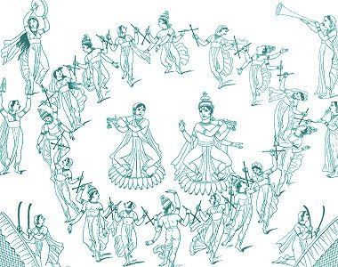

  
[Intangible Textual Heritage](../../index)  [Hinduism](../index) 

------------------------------------------------------------------------

<table width="75%">
<colgroup>
<col style="width: 50%" />
<col style="width: 50%" />
</colgroup>
<tbody>
<tr class="odd">
<td width="50%" data-valign="CENTER"> 
</td>
<td width="50%" data-valign="CENTER"><h1 id="the-prem-sagur" data-align="CENTER">The Prem Sagur</h1>
<h2 id="of-lallu-lal" data-align="CENTER">of Lallu Lal</h2>
<h3 id="translated-by-w.-hollings" data-align="CENTER">translated by W. Hollings</h3>
<h4 id="section" data-align="CENTER">[1848]</h4></td>
</tr>
</tbody>
</table>

------------------------------------------------------------------------

[Contents](#contents)    [Start Reading](psa00)

------------------------------------------------------------------------

The Prem Sagar was one of the first books published in modern Hindi,
written in the Delhi dialect which was eventually adopted as one of the
official national languages of India. It is the tale of the deeds of
Krishna, the invincible avatar of Vishnu. Based on the tenth book of the
Bhagavata Purana, the Prem Sagar, which means 'Ocean of Love,' (one of
Krishna's epithets) was composed by Lallu Lal between 1804 and 1810.
Lallu Lal's retelling of this traditional cycle of legends of Krishna is
distinguished by naturalistic dialog and frank sensuality. The narrative
overlaps with the Krishna section of the [Vishnu Purana](../vp/index)
(also at this site). While the Prem Sagar is not considered part of
Hindu scripture *per se*, it is popular because it makes this portion of
the Purana narrative accessible to Hindi speakers who don't know
Sanskrit.

Krishna is a complex character. His story is a huge mares' nest of
archetypes and folklore motifs. He is spirited away to the countryside
because of a prophecy of regicide, evading a massacre of innocents. In
his youth he is the pastoral trickster, whose stunts eventually arouse
the ire of the gods themselves. Part Coyote, Heracles, and Dionysus, the
adolescent Krishna becomes the beloved of all of the women of the
village, (chastely) consorting with all of them in turn. He battles
monsters and demons in epic battles. As his destiny unfolds, he is lured
into the city, where he overcomes the evil king in single combat, taking
his place. As a ruler, Krishna is a mighty warrior with a plethora of
gorgeous wives. However, he remains a man of the people. The royals
constantly harp on his cow-herding origins. The mature Krishna showers
spiritual and material rewards on his friends regardless of their place
in the social hierarchy.

We don't know of any English translations of the Prem Sagur currently in
print. There were at least two during the 19th century. This was the
only one we were able to obtain. Hollings, who was apparently a British
officer, translated the Prem Sagar into clear, modern English, and
produced a lively, very readable version. The only minor hurdle for
contemporary readers may be his use of *ù*, *u*, and occasionally *ú* to
transcribe short *a*. Thus we get *Krishnù* for Krishna, *Brahmù* for
Brahma, etc. He also uses *ee* for long *i* and *oo* for long *u*. In
addition, he emulated Hindi's tendency to drop final vowels, which makes
some of the names difficult to associate with the Sanskrit equivalent.
However, as is the practice at this site, we have reproduced the
original system of transcription as closely as possible.

------------------------------------------------------------------------

 [Title Page](psa00)  
[Preface to the Translation](psa01)  
[Chapter I](psa02)  
[Chapter II](psa03)  
[Chapter III](psa04)  
[Chapter IV](psa05)  
[Chapter V](psa06)  
[Chapter VI](psa07)  
[Chapter VII](psa08)  
[Chapter VIII](psa09)  
[Chapter IX](psa10)  
[Chapter X](psa11)  
[Chapter XI](psa12)  
[Chapter XII](psa13)  
[Chapter XIII](psa14)  
[Chapter XIV](psa15)  
[Chapter XV](psa16)  
[Chapter XVI](psa17)  
[Chapter XVII](psa18)  
[Chapter XVIII](psa19)  
[Chapter XIX](psa20)  
[Chapter XX](psa21)  
[Chapter XXI](psa22)  
[Chapter XXII](psa23)  
[Chapter XXIII](psa24)  
[Chapter XXIV](psa25)  
[Chapter XXV](psa26)  
[Chapter XXVI](psa27)  
[Chapter XXVII](psa28)  
[Chapter XXVIII](psa29)  
[Chapter XXIX](psa30)  
[Chapter XXX](psa31)  
[Chapter XXXI](psa32)  
[Chapter XXXII](psa33)  
[Chapter XXXIII](psa34)  
[Chapter XXXIV](psa35)  
[Chapter XXXV](psa36)  
[Chapter XXXVI](psa37)  
[Chapter XXXVII](psa38)  
[Chapter XXXVIII](psa39)  
[Chapter XXXIX](psa40)  
[Chapter XL](psa41)  
[Chapter XLI](psa42)  
[Chapter XLII](psa43)  
[Chapter XLIII](psa44)  
[Chapter XLIV](psa45)  
[Chapter XLV](psa46)  
[Chapter XLVI](psa47)  
[Chapter XLVII](psa48)  
[Chapter XLVIII](psa49)  
[Chapter XLIX](psa50)  
[Chapter L](psa51)  
[Chapter LI](psa52)  
[Chapter LII](psa53)  
[Chapter LIII](psa54)  
[Chapter LIV](psa55)  
[Chapter LV](psa56)  
[Chapter LVI](psa57)  
[Chapter LVII](psa58)  
[Chapter LVIII](psa59)  
[Chapter LIX](psa60)  
[Chapter LX](psa61)  
[Chapter LXI](psa62)  
[Chapter LXII](psa63)  
[Chapter LXIII](psa64)  
[Chapter LXIV](psa65)  
[Chapter LXV](psa66)  
[Chapter LXVI](psa67)  
[Chapter LXVII](psa68)  
[Chapter LXVIII](psa69)  
[Chapter LXIX](psa70)  
[Chapter LXX](psa71)  
[Chapter LXXI](psa72)  
[Chapter LXXII](psa73)  
[Chapter LXXIII](psa74)  
[Chapter LXXIV](psa75)  
[Chapter LXXV](psa76)  
[Chapter LXXVI](psa77)  
[Chapter LXXVII](psa78)  
[Chapter LXXVIII](psa79)  
[Chapter LXXI](psa80)  
[Chapter LXXX](psa81)  
[Chapter LXXXI](psa82)  
[Chapter LXXXII](psa83)  
[Chapter LXXXIII](psa84)  
[Chapter LXXXIV](psa85)  
[Chapter LXXXV](psa86)  
[Chapter LXXXVI](psa87)  
[Chapter LXXXVII](psa88)  
[Chapter LXXXVIII](psa89)  
[Chapter LXXXIX](psa90)  
[Chapter XC](psa91)  
