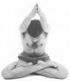

  
[Intangible Textual Heritage](../../index)  [Hinduism](../index) 
[Yoga](../yoga/index)  [Index](index)  [Next](rwy01) 

------------------------------------------------------------------------

[Buy this Book at
Amazon.com](https://www.amazon.com/exec/obidos/ASIN/054808047X/internetsacredte)

------------------------------------------------------------------------

  
*Relax With Yoga*, by Arthur Liebers, \[1960\], at Intangible Textual
Heritage

------------------------------------------------------------------------

p. 1

# RELAX WITH YOGA

  [  
Click to enlarge](img/00100.jpg)

### By ARTHUR LIEBERS

#### STERLING PUBLISHING CO., Inc. New York

#### \[1960\]

Scanned, proofed and formatted at Intangible Textual Heritage, May 2008,
by John Bruno Hare. This text is in the public domain because its
copyright was not renewed at the US Copyright Office in a timely
fashion.

p. 2

##### OTHER BOOKS OF INTEREST

###### Manual of Yoga

###### Teach Yourself Yoga

------------------------------------------------------------------------

[Next: Contents](rwy01)
