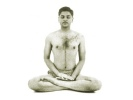

  
[Intangible Textual Heritage](../../index)  [Hinduism](../index) 
[Yoga](../yoga/index)  [Index](index)  [Previous](rwy07)  [Next](rwy09) 

------------------------------------------------------------------------

[Buy this Book at
Amazon.com](https://www.amazon.com/exec/obidos/ASIN/054808047X/internetsacredte)

------------------------------------------------------------------------

  
*Relax With Yoga*, by Arthur Liebers, \[1960\], at Intangible Textual
Heritage

------------------------------------------------------------------------

p. 56

### 7. SPECIFIC POSTURES FOR RELAXATION

While the great majority of the *asanas* have a curative or therapeutic
value, there are several which are purely for the purpose of relaxation.
Relaxation should not be mistaken for inertia. It is not a state of
lethargy; rather, it is rest after effort or, perhaps, conscious rest
after conscious effort. One definition of relaxation is "a complete
resignation of the body to the power of gravity, surrender of the mind
to nature, and the whole body energy being transferred to a deep,
dynamic breathing."

#### Physical Relaxation

Complete relaxation of the voluntary muscles at once transfers energy to
involuntary parts so that, strictly speaking, there can be no such thing
as relaxation except in the voluntary muscles and brain. But this is
quite sufficient! This transfer of energy by voluntary action and
involuntary reaction produces the necessary equilibrium for the renewal
of strength.

In many parts of the world, where human beings still

p. 57

transport heavy loads, it is amazing how far they can carry burdens that
most individuals could not even lift from the ground. Observation of
porters in many parts of the Orient and the Arabic world has shown that
their endurance may be due to the ability to relax. During long, heavy
hauls, they often stop and lie down in apparently semi-lifeless states
for as long as an hour. Then they rise, refreshed, and resume their
arduous journeys.

Proper, purposeful relaxation offers the greatest amount of renewed
strength in the shortest length of time. After extended exertion or
stress, perfect rest in the form of relaxation is the principle which
revitalizes the nerve centers, collects the scattered forces of energy
and invigorates the body. The three poses of Yoga for complete
relaxation are *Dradhasana*, *Shavasana* and *Adhvasana*.

#### Dradhasana, or Firm Pose

This is considered best for sleeping, as it is the most comfortable. To
take the pose, lie relaxed with your right arm under your head, using it
as a pillow. By lying passively on the right side, you favor emptying of
the stomach and make breathing movements easier. In practice, it has
been found that sleeping in this manner generally inhibits dreams

  [  
Click to enlarge](img/05700.jpg)  
Dradhasana, or Firm Pose  

p. 58

and nocturnal emissions and improves digestion. A short period of sleep
becomes the equivalent of a longer sleep for recuperative purposes. It
is also recommended for short periods of waking relaxation.

#### Shavasana, or Corpse Pose

This is recommended for use when the student of Yoga experiences fatigue
during any of his exercises. This pose is described in the tracts as
"destroying fatigue of the body; quieting the agitation of the mind."
Lie face up with your feet extended. Remain motionless with a sense or
feeling of sinking down like a corpse. Gradually relax every muscle of
the body by concentrating on each individually, from the tip of the toe
to the end of the skull. Exercise absolute resignation of will by trying
to forget the existence of your body and detaching yourself from it.
Hold this posture until you feel restored.

Medical authorities have confirmed that the Shavasana pose brings about
a fall in the blood pressure and pulse rate and establishes an even rate
of respiration. If this pose is kept for more than ten minutes, the
deepened respiration and lowered circulation in the brain will probably
bring about a tendency to sleep.

  [  
Click to enlarge](img/05800.jpg)  
Shavasana, or Corpse Pose  

p. 59

#### Adhavasana, or Relaxed Pose

Lie down with your head on your folded arms, as if on a pillow, and
concentrate as in Shavasana. Relax all your muscles. Then stretch your
hands and legs out fully, and permit the power of gravity to take over
the weight of your body as you relax every voluntary muscle.

  [  
Click to enlarge](img/05900.jpg)  
Adhavasana, or Relaxed Pose  

#### Mental Relaxation

Another group of *asanas*, or postures, specifically provides for the
care of the nervous system. These exercises have been found to be
especially helpful to persons of a neurasthenic condition. An individual
in this state will be mentally vague, lack determination, and have
continual feelings of inferiority, fatigue and distraction, accompanied
by a state of anxiety. Lack of will power and other forms of nervous or
mental debility are all indications of a lack of tonicity in the
brain-nervous system.

In many ways, symptoms of the neurasthenic are similar to those of an
older person who is approaching or has reached senility. Yoga
investigators feel that the condition may be

p. 60

due to a degeneration of the nerve cells with resultant subnormal
functions. While the Yoga process may not reverse the situation in the
case of an aged person, it has resulted in relief for neurasthenics of
young and middle age. In addition, the normal person who utilizes these
*asanas* will find that he derives from them a new keenness of mind and
an ability to utilize his nerve-energy to the utmost for whatever
personal goals he may have set for himself.

#### Bhujangasana, or Snake Pose

The anterior and posterior stretching offered by the Snake Pose are said
to be ideal spinal exercises, preserving or restoring tonicity in the
spinal column and nervous channels. Lie on your stomach, with your legs
stretched and toes pointed outward. Keep your arms at your sides, with
palms down, and your forehead on the floor. Then, slowly raise your head
and neck upward and backward.

When your head and neck are slightly raised, plant your hands on both
sides of the abdomen. Inhale, and gradually raise your thorax and the
upper part of your abdomen by increasing the angle between your hands
and rising shoulders. From the navel downward, your body should remain
fixed to the ground. Only the upper portion of your body should be
raised. In some texts, this pose is called the "Like a hooded cobra
striking" pose. Work toward this pose gradually, avoiding muscular
strain or "jerkiness" in your efforts to raise the upper part of your
body. As you practice this pose, you will feel the pressure on your
spinal column gradually working down the vertebrae until you feel a deep
pressure at the coccyx.

At first, concentrate on the posture. Having achieved the

p. 61

  [  
Click to enlarge](img/06100.jpg)  
Bhujangasana, or Snake Pose  

correct pose, exhale and return to the starting position. Lower yourself
slowly. In contrast to the pressure which you felt as you entered this
posture, you will experience a feeling of relief along your spine as you
lower yourself. This *asana* should not be utilized by women during
menstruation or advanced pregnancy, or by men suffering from hernia.
Persons with a weak physical structure should approach this *asana*
slowly and drop it if they find it too arduous. It may be attempted
later when the other muscle-tone *asanas* have shown their effects.

After the pose has been mastered, follow this procedure: (1) Raise
thorax and inhale for three seconds; (2) maintain pose, retaining your
breath for six seconds; (3) return to starting position, while exhaling
for three seconds; (4) repeat five times in a minute.

It is suggested that the Snake Pose be practiced for at least a month,
by which time its effects should be felt. Practice it daily, preferably
in the evening before dinner.

p. 62

#### Halasana, or Plough Pose

The Snake Pose is actually the first of a linked pair of postures, the
second being the Halasana, or Plough Pose. This pose should be
undertaken when you are fully rested. To start, lie on the floor with
your face upward and arms resting at your sides, palms downward. Then
raise your legs together, slowly inhaling until your legs are brought at
a right angle to the body. Next, while exhaling slowly, raise your hips
and lower your legs beyond your head. Keep your legs together and
straight. As you become practiced in this posture, stretch your toes
further and further beyond your head. If you find this posture too
difficult, keep your legs folded or bent and raise them as high as you
can. Practice in the following manner: (1) Raise legs to a right angle
with body and inhale for two seconds; (2) lower legs beyond head and
exhale for two seconds; (3) maintain pose for four seconds while
suspending breath; (4) return to starting position, while inhaling
slowly for two seconds.

Do not overdo this posture. At first try it once daily, then, as it
becomes easier, work toward the completion of six rounds in a minute. It
may be easier at first in the evening, when the body is more supple.
When perfected, it should be practiced in the morning on an empty
stomach. Those who are extremely overweight may find this pose
impossible, as will those with stiff muscles. Also, it is not
recommended for those with any form of hernia. In addition to its
cerebro-nervous system therapy, this pose is highly effective in ridding
the body and nervous systems of toxic accumulations and its perfection
and regular use will aid largely in achieving purification of the
nervous-energy channels.

p. 63

  [  
Click to enlarge](img/06300.jpg)  
Halasana, or Plough Pose  

  [  
Click to enlarge](img/06301.jpg)  
A variation of the Plough Pose, with arms under head.  

p. 64

#### Ultrasana, or Camel Pose

This is the climactic pose of the series suggested for nerve-spinal
adjustment. Generally it is impossible to achieve before the two
previous poses have been perfected. Kneel and while supporting your body
on your toes gradually lean backward, after fixing your arms behind you,
with your palms to the ground, fingers pointed outward and thumbs toward
your toes. Keeping your arms straight, slowly lift your hips while
inhaling. Then, push your body above the waist slowly outward and
upward, throwing your neck downward. As you come into this posture, you
should feel the pressure traveling upward toward your shoulders and
neck,

  [  
Click to enlarge](img/06400.jpg)  
Ultrasana, or Camel Pose  

p. 65

finally reaching your neck and facial muscles. It is suggested that this
pose be practiced in the morning, but not more than once daily. In
timing, the body-lift should take three seconds with inhalation;
retention, six seconds; return to kneeling position while exhaling,
three seconds.

#### TIME SCHEDULE FOR PRACTICING THE ASANAS

The time schedule has been established to enable the person of ordinary
muscular development to follow a routine of Yogic exercises. After
reading the text and gradually taking the step-by-step procedure for the
postures and exercises, you should make a copy of this chart and place
it on the wall of the room in which you practice the *asanas*. Do not
overdo, as the Yoga exercises are designed for a gradual program of
improvement. This is not an easy, one-day course.

Those who have been reading popular articles on Yoga may notice that
there are no standing-on-head *asanas* recommended. Those, and the other
drastic *asanas*, may actually be harmful unless they are preceded by a
full program of physical preparation under a competent teacher of Yoga.
The sequence recommended here goes from easy to difficult movements, and
will exercise alternate sets of muscles. Where breathing routines are
shown with the *asana*, it is of utmost importance that they be followed
closely for maximum benefits.

In a few months the benefits of this program will be evident and the
exercises, diet and mental therapy suggested in this book should be made
a lifetime project.

p. 66

|     |                                         |                  |
|-----|-----------------------------------------|------------------|
|     | *Asanas*                                | *Time*           |
| 1\. | Stitha-Prarthanasana (Prayer Pose)      | 1 Minute         |
| 2\. | Padmasana (Lotus Pose)                  | 1 Minute         |
| 3\. | Yastikasana (Stick Pose)                | 1 Minute         |
| 4\. | Parvatasana (Mountain Pose)             | 2 Minutes        |
| 5\. | Trikonasana and Variant (Triangle Pose) | 2 Minutes        |
| 6\. | Garudasana (Eagle Pose)                 | 2 Minutes        |
| 7\. | Hastapadangustasana (Toe-Finger Pose)   | 1 Minute         |
| 8\. | Hastapadasana (Hand-Leg Pose)           | 1 Minute         |
| 9\. | Ekapadasana (One-Leg Pose)              | <u>1 Minute </u> |
|     | Total Daily Exercise                    | 12 Minutes       |

Please note that a woman in advanced pregnancy should avoid all but the
first two exercises. Men and women who are suffering from serious
arthritis, colic, sciatica or kidney ailments, should also limit
themselves to the first two *asanas*.

------------------------------------------------------------------------

[Next: 8. The Bandhas—Mystic Breathing Exercises](rwy09)
