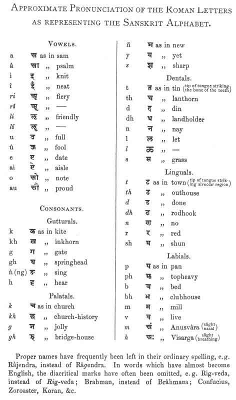

  
[Intangible Textual Heritage](../../index)  [Hinduism](../index) 
[Index](index)  [Previous](sbe01008)  [Next](sbe01010) 

------------------------------------------------------------------------

[Buy this Book at
Amazon.com](https://www.amazon.com/exec/obidos/ASIN/B002DEMBW6/internetsacredte)

------------------------------------------------------------------------

  
*The Upanishads, Part 1 (SBE01)*, by Max Müller, \[1879\], at Intangible
Textual Heritage

------------------------------------------------------------------------

p. lv

 

------------------------------------------------------------------------

[Next: First Translation of the Upanishads](sbe01010)
