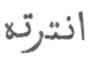
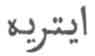
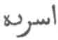

  
[Intangible Textual Heritage](../../index)  [Hinduism](../index) 
[Index](index)  [Previous](sbe01018)  [Next](sbe01020) 

------------------------------------------------------------------------

[Buy this Book at
Amazon.com](https://www.amazon.com/exec/obidos/ASIN/B002DEMBW6/internetsacredte)

------------------------------------------------------------------------

  
*The Upanishads, Part 1 (SBE01)*, by Max Müller, \[1879\], at Intangible
Textual Heritage

------------------------------------------------------------------------

## THE AITAREYA-ÂRA*N*YAKA.

IN giving a translation of the Aitareya-upanishad, I found it necessary
to give at the same time a translation of that portion of the
Aitareya-âra*n*yaka which precedes the Upanishad. The Âra*n*yakas seem
to have been from the beginning the proper repositories of the ancient
Upanishads, though it is difficult at first sight to find out in what
relation the Upanishads stood to the Âra*n*yakas. The Âra*n*yakas are to
be read and studied, not in the village (grâme), but in the forest, and
so are the Upanishads. But the subjects treated in the Upanishads belong
to a very different order from those treated in the other portions of
the Âra*n*yakas, the former being philosophical, the latter liturgical.

The liturgical chapters of the Âra*n*yakas might quite as well have
formed part of the Brâhma*n*as, and but for the restriction that they
are to be read in the forest, it is difficult to distinguish between
them and the Brâhma*n*as. The

p. xcii

first chapter of the Aitareya-âra*n*yaka is a mere continuation of the
Aitareya-brâhma*n*a, and gives the description of the Mahâvrata, the
last day but one of the Gavâmayana, a sattra or sacrifice which is
supposed to last a whole year. The duties which are to be performed by
the Hot*ri* priests are described in the Aitareya-âra*n*yaka; not all,
however, but those only which are peculiar to the Mahâvrata day. The
general rules for the performance of the Mahâvrata are to be taken over
from other sacrifices, such as the Vi*s*va*g*it, Katurvi*m*sa, &c.,
which form the type (prak*ri*ti) of the Mahâvrata. Thus the two
*s*astras or recitations, called âgya-praüga, are taken over from the
Vi*s*va*g*it, the *s*astras of the Hotrakas from the Katurvi*ms*a. The
Mahâvrata is treated here as belonging to the Gavâmayana sattra, which
is described in a different *S*âkhâ, see Taittirîya Sa*m*hitâ VII, 5, 8,
and partly in other Vedas. It is the day preceding the udayanîya, the
last day of the sattra. It can be celebrated, however, by itself also,
as an ekâha or ahîna sacrifice, and in the latter case it is the tenth
day of the Ekada*s*arâtra (eleven nights sacrifice) called Pu*nd*arîka.

Sâyana does not hesitate to speak of the Aitareya-Âra*n*yaka as a part
of the Brâhma*n*a [1](#fn_54); and a still
earlier authority, *S*aṅkara, by calling the Aitareya-upanishad by the
name of Bahvrika-brâhma*n*a-upanishad [2](#fn_55), seems to imply that both the Upanishad
and the Âra*n*yaka may be classed as Brâhma*n*a.

The Aitareya-Âra*n*yaka appears at first sight a miscellaneous work,
consisting of liturgical treatises in the first, fourth, and fifth
Âra*n*yakas, and of three Upanishads, in the second and third
Âra*n*yakas. This, however, is not the case. The first Âra*n*yaka is
purely liturgical, giving a description of the Mahâvrata, so far as it
concerns the Hot*ri* priest. It is written in the ordinary Brâhma*n*a
style. Then follows the first Upanishad, Âra*n*yaka II, 1-3, showing

p. xciii

how certain portions of the Mahâvrata, as described in the first
Âra*n*yaka, can be made to suggest a deeper meaning, and ought to lead
the mind of the sacrificer away from the purely outward ceremonial to
meditation on higher subjects. Without a knowledge of the first
Âra*n*yaka therefore the first Upanishad would be almost unintelligible,
and though its translation was extremely tedious, it could not well have
been omitted.

The second and third Upanishads are not connected with the ceremonial of
the Mahâvrata, but in the fourth and fifth Âra*n*yakas the Mahâvrata
forms again the principal subject, treated, however, not as before in
the style of the Brâhma*n*as, but in the style of Sûtras. The fourth
Âra*n*yaka contains nothing but a list of the Mahânâmnî hymns [1](#fn_56), but the fifth describes the Mahâvrata
again, so that if the first Âra*n*yaka may be looked upon as a portion
of the Aitareya-brâhma*n*as, the fifth could best be classed with the
Sûtras of Â*s*valâyana.

To a certain extent this fact, the composite character of the
Aitareya-Âra*n*yaka, is recognised even by native scholars, who
generally do not trouble themselves much on such questions. They look
both on the Aitareya-brâhma*n*a and on the greater portion of
Aitareya-Âra*n*yaka as the works of an inspired Rishi, Mahidâsa
Aitareya [2](#fn_57), but they consider the
fourth and fifth books of the Âra*n*yaka as contributed by purely human
authors, such as Â*s*valâyana and Saunaka, who, like other Sûtrakâras,
took in verses belonging to other *S*âkhâs, and did not confine their
rules to their own *S*âkhâ only.

There are many legends about Mahidâsa, the reputed author of the
Aitareya-brâhma*n*a and Âra*n*yaka. He is

p. xciv

quoted several times as Mahidâsa Aitareya in the Âra*n*yaka itself,
though not in the Brâhma*n*a. We also meet his name in the
*Kh*ândogya-upanishad (III, 16, 7), where we are told that he lived to
an age of 116 years [1](#fn_58). All this,
however, would only prove that, at the time of the composition or
collection of these Âra*n*yakas and Upanishads, a sage was known of the
name of Mahidâsa Aitareya, descended possibly from Itara or Itarâ. and
that one text of the Brâhma*n*as and the Âra*n*yakas of the Bahvrikas
was handed down in the family of the Aitareyins.

Not content with this apparently very obvious explanation, later
theologians tried to discover their own reasons for the name of
Aitareya. Thus Sâyana, in his introduction to the
Aitareya-brâhma*n*a [2](#fn_59), tells us that
there was once a Rishi who had many wives. One of them was called Itarâ,
and she had a son called Mahidâsa. His father preferred the sons of his
other wives to Mahidâsa, and once he insulted him in the sacrificial
hall, by placing his other sons on his lap, but not Mahidâsa. Mahidâsa's
mother, seeing her son with tears in his eyes, prayed to her tutelary
goddess, the Earth (svîyakuladevatâ Bhûmi*h*), and the goddess in her
heavenly form appeared in the midst of the assembly, placed Mahidâsa on
a throne, and on account of his learning, gave him the gift of knowing
the Brâhma*n*a, consisting of forty adhyâyas, and, as Sâyana calls it,
another Brâhma*n*a, 'treating of the Âra*n*yaka duties'
(âra*n*yakavratarûpam brâhma*n*am).

Without attaching much value to the legend of Itarâ, we see at all
events that Sâyana considered what we call the Aitareyâra*n*yaka as a
kind of Brâhma*n*a, not however the whole of it, but only the first,
second, and third Âra*n*yakas (atha mahâvratam îtyâdikam
â*k*âryâ â*k*âryâ ityantam). How easy it was for Hindu theologians to
invent such legends we see from another account of Mahidâsa, given by
Ânandatîrtha in his notes on the Aitareya-upanishad.

p. xcv

\[paragraph continues\] He, as Colebrooke
was the first to point out, takes Mahidâsa 'to be an incarnation of
Nârâya*n*a, proceeding from Vi*s*âla, son of Ab*g*a,' and he adds, that
on the sudden appearance of this deity at a solemn celebration, the
whole assembly of gods and priests (suraviprasaṅgha) fainted, but at the
intercession of Brahmâ, they were revived, and after making their
obeisance, they were instructed in holy science. This avatâra was called
Mahidâsa, because those venerable personages (mahin) declared themselves
to be his slaves (dâsa) [1](#fn_60).

In order properly to understand this legend, we must remember that
Ânandatîrtha, or rather Vi*s*ve*s*varatîrtha, whose commentary he
explains, treated the whole of the Mahaitareya-upanishad from a
Vaish*n*ava point of view, and that his object was to identify Mahidâsa
with Nârâyana. He therefore represents Nârâyana or Hari as the avatâra
of Visâla, the son of Brahman (ab*g*asuta), who appeared at a sacrifice,
as described before, who received then and there the name of Mahidâsa
(or Mahîdâsa), and who taught this Upanishad. Any other person besides
Mahidâsa would have been identified with the same ease by
Vi*s*ve*s*varatîrtha with Vish*n*u or Bhagavat.

A third legend has been made up out of these two by European scholars
who represent Mahidâsa as the son of Vi*s*âla and Itarâ, two persons who
probably never met before, for even the Vaish*n*ava commentator does not
attempt to take liberties with the name of Aitareya, but simply states
that the Upanishad was called Aitareyî, from Aitareya.

Leaving these legends for what they are worth, we may at all events
retain the fact that, whoever was the author of the Aitareya-brâhma*n*a
and the first three books of the Aitareya-Âra*n*yaka, was not the author
of the two concluding Âra*n*yakas. And this is confirmed in different
ways. Sâyana, when quoting in his commentary on the Rig-veda from the
last books, constantly calls it a Sûtra of *S*aunaka, while the fourth
Âra*n*yaka is specially ascribed

p. xcvi

to Â*s*valâyana, the pupil and successor of Saunaka [1](#fn_61). These two names of *S*aunaka and
Â*s*valâyana are frequently intermixed. If, however, in certain MSS. the
whole of the Aitareya-âra*n*yaka is sometimes ascribed either to
Â*s*valâyana or *S*aunaka, this is more probably due to the colophon of
the fourth and fifth Âra*n*yakas having been mistaken for the title of
the whole work than to the fact that such MSS. represent the text of the
Âra*n*yaka, as adopted by the school of Â*s*valâyana.

The Aitareya-âra*n*yaka consists of the following five Âra*n*yakas:

The first Âra*n*yaka has five Adhyâyas:

1\. First Adhyâya, Atha mahâvratam, has four Kha*nd*as, 1-4.  
2. Second Adhyâya, Â tvâ ratham, has four Kha*nd*as, 5-8.  
3. Third Adhyâya, Hiṅkâre*n*a, has eight [2](#fn_62) Kha*nd*as, 9-16.  
4. Fourth Adhyâya, Atha sûdadohâ*h*, has three Kha*nd*as, 17-19.  
5. Fifth Adhyâya, Va*s*a*m* sa*m*sati, has three Kha*nd*as, 20-22.

The second Âra*n*yaka has seven Adhyâyas:

6\. First Adhyâya, Eshâ panthâ*h*, has eight Kha*nd*as, 1-8.  
7. Second Adhyâya, Esha ima*m* lokam, has four Kha*nd*as, 9-12.  
8. Third Adhyâya, Yo ha vâ âtmânam, has eight (not three) Kha*nd*as,
13-20.  
9. Fourth Adhyâya, Âtma vâ idam, has three Kha*nd*as, 21-23.  
10. Fifth Adhyâya, Purushe ha vâ, has one Kha*nd*a, 24  
11. Sixth Adhyâya, Ko 'yam âtmeti, has one Kha*nd*a, 25.  
12. Seventh Adhyâya, Vâṅ me manasi, has one Kha*nd*a, 26.

The third Âra*n*yaka has two Adhyâyas:

13\. First Adhyâya, Athâta*h* sa*m*hitâyâ upanishat, has six Kha*nd*as,
1-6.  
14. Second Adhyâya, Prâ*n*o va*m*sa iti sthavira*h* *S*âkalya*h*, has
six Kha*nd*as, 7-12.

The fourth Âra*n*yaka, has one Adhyâya:

15\. First Adhyâya, Vidâ maghavan, has one Kha*nd*a (the Mahânâmnî's).

The fifth Âra*n*yaka has three Adhyâyas:

16\. First Adhyâya, Mahâvratasya pañ*k*avi*m*satim, has six Kha*nd*as,
1-6.  
17. Second Adhyâya, (Grîvâ*h*)Yasyedam, has five Kha*nd*as, 7-11.  
18. Third Adhyâya, (Ûrû) Indrâgnî, has four Kha*nd*as, 11-14

(9-11 are labelled Aitareya-upanishad and 6-14 are labelled
Bahv*rik*a-upanishad by vertical brackets in the original)

p. xcvii

With regard to the Upanishad, we must distinguish between the
Aitareya-upanishad, properly so-called, which fills the fourth, fifth,
and sixth adhyâyas of the second Âra*n*yaka, and the
Mahaitareya-upanishad [1](#fn_63), also called
by a more general name Bahv*rik*a-upanishad, which comprises the whole
of the second and third Âra*n*yakas.

The Persian translator seems to have confined himself to the second
Âra*n*yaka [2](#fn_64), to which he gives
various titles, Sarbsar, Asarbeh, Antrteheh. That Antrteheh   is a misreading of   was pointed out long ago by
Burnouf, and the same explanation applies probably to  , asarbeh, and if to that,
then to Sarbsar also. No explanation has ever been given why the
Aitareya-upanishad should have been called Sarvasâra, which Professor
Weber thinks was corrupted into Sarbsar. At all events the
Aitareya-upanishad is not the Sarvasâra-upanishad, the Oupnek'hat Sarb,
more correctly called Sarvopanishatsâra, and ascribed either to the
Taittirîyaka or to the Atharva-veda [3](#fn_65).

The Aitareya-upanishad, properly so called, has been edited and
translated in the Bibliotheca Indica by Dr. Röer. The whole of the
Aitareya-âra*n*yaka with Sâyana's commentary was published in the same
series by Rajendralal Mitra.

Though I have had several MSS. of the text and commentary at my
disposal, I have derived little aid from them, but have throughout
endeavoured to restore that text which *S*aṅkara (the pupil of Govinda)
and Sâyana had before them. Sâyana, for the Upanishad portion, follows
*S*aṅkara's commentary, of which we have a gloss by Ânandagñâna.

Colebrooke in his Essays (vol. ii, p. 42) says that he

p. xcviii

possessed one gloss by Nârâya*n*endra on *S*aṅkara's commentary, and
another by Ânandatîrtha on a different gloss for the entire Upanishad.
The gloss by Nârâya*n*endra [1](#fn_66),
however, is, so Dr. Rost informs me, the same as that of Ânanda*g*ñâna,
while, so far as I can see, the gloss contained in MS. E. I. H. 2386
(also MS. Wilson 401), to which Colebrooke refers, is not a gloss by
Ânandatîrtha at all, but a gloss by Visvesvaratîrtha on a commentary by
Ânandatîrthabhagavatpâdâ*k*ârya, also called Pûr*n*apra*g*ñâkârya, who
explained the whole of the Mahaitareya-upanishad from a Vaish*n*ava
point of view.

------------------------------------------------------------------------

### Footnotes

[xcii:1](sbe01019.htm#fr_54) Aitareyabrâhma*n*e
'sti kâ*nd*am âra*n*yakâbhidham (introduction), a remark which he
repeats in the fifth Âra*n*yaka. He also speaks of the
Âra*n*yaka-vratarûpam brâhma*n*am; see p. cxiv, l. 24.

[xcii:2](sbe01019.htm#fr_55) In the same manner
the Kaushîtaki-upanishad is properly called
Kaushîtaki-brâhma*n*a-upanishad, though occurring in the Âra*n*yaka; see
Kaushîtaki-brâhma*n*a-upanishad, ed. Cowell, p. 30.

[xciii:1](sbe01019.htm#fr_56) See Boehtlingk and
Roth, s*v*. 'Neun Vedische Verse die in ihrem vollständigen Wortlaut
aber noch nachtnachgewiesen sind.' Weber Indische Studien VIII, 68. How
these hymns are to be employed we learn from the Âsvalâyana-sûtras VII,
12, 10, where we are told that if the Udgâtris sing the Sâkvara Sâman as
the Prishthastotra, the nine verses beginning with Vidâ maghavan, and
known by the name of Mahânâmnî, are to be joined in a peculiar manner.
The only excuse given, why these Mahânâmnîs are mentioned here, and not
in the Brâhma*n*a, is that they are to be studied in the forest.

[xciii:2](sbe01019.htm#fr_57) M. M., History of
Ancient Sanskrit Literature, pp. 177, 335.

[xciv:1](sbe01019.htm#fr_58) Not 1600 years, as
I printed by mistake; for 24+44+48 make 116 years. Rajendralal Mitra
should not have corrected his right rendering 116 into 1600. Ait. Âr.
Introduction, p. 3.

[xciv:2](sbe01019.htm#fr_59) M. M., History of
Ancient Sanskrit Literature, p. 336.

[xcv:1](sbe01019.htm#fr_60) Colebrooke,
Miscellaneous Essays, 1873, II, p. 42.

[xcvi:1](sbe01019.htm#fr_61) M. M., History of
Ancient Sanskrit Literature, p. 235.

[xcvi:2](sbe01019.htm#fr_62) Not six, as in
Rajendralal Mitra's edition.

[xcvii:1](sbe01019.htm#fr_63) This may have been
the origin of a Rishi Mahaitareya, by the side of the Rishi Aitareya,
mentioned in the Âsvalâyana Grihya-sûtras III, 4 (ed. Stenzler).
Professor Weber takes Aitareya and Mahaitareya here as names of works,
but he admits that in the Sâṅkhâyana G*ri*hya-sûtras they are clearly
names of *Ri*shis (Ind. Stud. I, p. 389).

[xcvii:2](sbe01019.htm#fr_64) He translates II,
I-II, 3, 4, leaving out the rest of the third adhyâya afterwards II,
4-II, 7.

[xcvii:3](sbe01019.htm#fr_65) Bibliotheca
Indica, the Atharva*n*a-upanishads, p. 394

[xcviii:1](sbe01019.htm#fr_66) A MS. in the
Notices of Sanskrit MSS., vol. ii, p. 133, ascribed to
Abhinavanârâya*n*endra, called Âtmasha*t*kabhâshya*t*îkâ, begins like
the gloss edited by Dr. Röer, and ends like Sâyana's commentary on the
seventh adhyâya, as edited by Rajendralal Mitra. The same name is given
in MS. Wilson 94,
*S*rîmatkaivalyendrasarasvatîpû*g*yapâda*s*ishya-*s*rîmadabhinavanârâya*n*endrasarasvatî.

------------------------------------------------------------------------

[Next: IV. The Kaushîtaki-Brâhmana-Upanishad](sbe01020)
