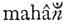

  
[Intangible Textual Heritage](../../index)  [Hinduism](../index) 
[Index](index)  [Previous](sbe01216)  [Next](sbe01218) 

------------------------------------------------------------------------

[Buy this Book at
Amazon.com](https://www.amazon.com/exec/obidos/ASIN/B002DEMBW6/internetsacredte)

------------------------------------------------------------------------

  
*The Upanishads, Part 1 (SBE01)*, by Max Müller, \[1879\], at Intangible
Textual Heritage

------------------------------------------------------------------------

p. 224

### FOURTH KHA*ND*A.

1\. He who knows one sacrifice above another, one day above another, one
deity above the others, he is clever. Now this great uktha (the
nishkevalya-*s*astra) is the sacrifice above another, the day above
another, the deity above others [1](#fn_556).

2\. This uktha is fivefold. With regard to its being performed as a
Stoma (chorus), it is Triv*ri*t, Pañ*k*ada*s*a, Saptada*s*a, Ekavi*m*sa,
and Pañ*k*avi*m*sa. With regard to its being performed as a Sâman
(song), it is Gâyatra, Rathantara, B*ri*hat, Bhadra, and Râgana. With
regard to metre, it is Gâyatrî, Ush*n*ih, B*ri*hatî, Trish*t*ubh, and
Dvipadâ. And the explanation (given before in the Âra*n*yaka) is that it
is the head, the right wing, the left wing, the tail, and the body of
the bird [2](#fn_557).

in each hymn. This, is the first round. He then sings the three middle
verses in each hymn. This is the second round. He lastly sings the last
three verses in each hymn. This is the third round. This song is called
Udyatî.

The Pañ*k*ada*s*a stoma is formed out of one Sûkta only, consisting of
three verses. In the first round he sings the first verse p. 225 three times, the second and third once. In
the second round he sings the middle verse three times, in the third
round he sings the last verse three times. This song is called
Vish*t*uti.

The Saptadasa stoma is formed in the same manner, only that in the first
round he sings the first verse three times, in the second the middle
verse three times, in the third round the middle and last verses three
times. This song is called Da*s*asapta.

The Ekavi*m*sa stoma is formed in the same manner, only that in the
first round he sings the last verse once, in the second the first verse
once, in the third the middle verse once, while the other verses are
each repeated three times. This song is called Saptasaptinî.

The Pañ*k*avi*ms*a stoma is formed in the same manner, only that in the
first round he sings the first verse three times, the second four times,
the last once; in the second round the first once, the second three
times, the third four times; in the third round the first five times,
the second once, the last three times; or he sings in the third round
the first verse four times, the second twice, the last three times.

Sâya*n*a in his commentary on the Ait. Âr. takes the Triv*ri*t stoma to
be formed out of three hymns, each consisting of three verses, while he
says that the other stomas are formed out of one hymn only. B. and R.,
s*v*. triv*ri*t, state that this stoma consists of verses 1, 4, 7; 2, 5,
8; and 3, 6, 9 of the Rig-veda hymn IX, 11, but, according to Sâya*n*a,
the stoma consists (1) of the first verses of the three Sûktas, upâsmai
gâyata, davidyutatyâ, and pavamânasya at the beginning of the
Sâma-veda-Uttarâr*k*ika, (2) of the second, (3) Of the third verses of
the same three hymns. Mahîdhâra (Yv. X, 9) takes the same view, though
the MSS. seem to have left out the description of the second paryâya,
while Sâya*n*a in his commentary to the Tâ*nd*ya-brâhma*n*a seems to
support the opinion of B. and R. There is an omission, however, in the
printed text of the commentary, which makes it difficult to see the
exact meaning of Sâya*n*a.

The Pañ*k*ada*s*a stoma is well described by Sâya*n*a, Tâ*nd*ya Br. II,
4. Taking the Sûkta agna â yâhi (Uttarâr*k*ika I, 1, 4 = Rv. VI, 16,
10-12), he shows the stoma to consist of (1) verse 1 × 3, 2, 3 (2) verse
1, 2 × 3, 3; (3) verse 1, 2, 3 × 3.

The five Sâmans are explained by the commentator. The p. 226 Gâyatra is formed out of the *Rik* (III, 62,
10) tat savitur vare*n*yam. The Rathantara is formed out of the *Rik*
(VII, 32, 22) abhi tvâ *s*ûra nonuma. The B*ri*hat is formed out of the
*Rik* (VI, 46, 1) tvâm id dhi havâmahe. The Bhadra is formed out of the
*Rik* (X, 57, 1) imâ nu kam. The Râ*g*ana is formed out of the *Rik*
(VII, 27, 1) indram naro nemadhitâ.

The metres require no explanation.

In identifying certain portions of the Nishkevalya hymn with a bird, the
head of the bird corresponds to the hymns indram id gâthina*h*, &c.; the
right wing to the hymns abhi tvâ *s*ûra, &c.; the left wing to the hymns
tvâm id dhi, &c.; the tail to the hymns imâ nu kam, &c.; the body to the
hymns tad id âsa, &c. All this was explained in the first Âra*n*yaka.

p. 225

3\. He performs the Prastâva in five ways, he performs the Udgîtha in
five ways, he performs the

p. 226

\[paragraph continues\] Pratihâra in five
ways, he performs the Upadrava in five ways, he performs the Nidhana in
five ways [1](#fn_559). All this together forms
one thousand Stobhas, or musical syllables [2](#fn_560).

4\. Thus also are the *Rik* verses, contained in the Nishkevalya,
recited (by the Hot*ri*) in five orders. What precedes the eighty
t*rik*as, that is one order, then follow the three sets of eighty
t*rik*as each, and what comes after is the fifth order [3](#fn_561).

p. 227

5\. This (the hymns of this Sastra) as a whole (if properly counted with
the Stobha syllables) comes to one thousand (of B*ri*hatî verses). That
(thousand) is the whole, and ten, ten is called the whole. For number is
such (measured by ten). Ten tens are a hundred, ten hundreds are a
thousand, and that is the whole. These are the three metres (the tens,
pervading everything). And this food also (the three sets of hymns being
represented as food) is threefold, eating, drinking, and chewing. He
obtains that food by those (three numbers, ten, hundred, and thousand,
or by the three sets of eighty t*rik*as).

------------------------------------------------------------------------

### Footnotes

[224:1](sbe01217.htm#fr_558) The uktha is to be
conceived as prâ*n*a, breath or life, and this prâ*n*a was shown to be
above the other powers (devatâs), speech, hearing, seeing, mind. The
uktha belongs to the Mahâvrata day, and that is the most important day
of the Soma sacrifice. The Soma sacrifice, lastly, is above all other
sacrifices.

[224:2](sbe01217.htm#fr_559) All these are
technicalities connected with the singing and reciting of the uktha. The
commentator says: The stoma is a collection of single *Rik* verses
occurring in the t*rik*as which have to be sung. The Triv*ri*t stoma, as
explained in the Sâma-brâhma*n*a, is as follows: There are three Sûktas,
each consisting of three verses, the first being upâsmai gâyata, S. V.
Uttarâr*k*ika I, 1, 1 = Rv. IX, 11. The Udgât*ri* first sings the first
three verses [a](#fn_558)

[224:a](sbe01217.htm#fr_560) Hiṅk*ri* with
dative is explained as gai with accusative.

[226:1](sbe01217.htm#fr_561) The Sâmagas sing
the Râ*g*ana at the Mahâvrata, and in that Sâman there are, as usual,
five parts, the Prastâva, Udgîtha, pratihâra, Upadrava, and Nidhana. The
Prastot*ri*, when singing the Prastâva portions, sings them five times.
The Udgât*ri* and Pratihart*ri* sing their portions, the Udgîtha and
Pratihâra, five times. The Udgât*ri* again sings the Upadrava five
times. And all the Udgât*ri*s together sing the Nidhana five times.

[226:2](sbe01217.htm#fr_562) The Stobha
syllables are syllables without any meaning, added when verses have to
be sung, in order to have a support for the music. See *Kh*. Up. I, 13.
In singing the five Sâmans, each five times, one thousand of such Stobha
syllables are required.

[226:3](sbe01217.htm#fr_563) There are in the
Nishkevalya hymn, which the Hot*ri* has to recite, three sets of eighty
t*rik*as each. The first, consisting of Gâyatrîs, begins with   indro ya o*g*asâ. The second,
consisting of B*ri*hatîs, begins with ya *k*id anyad. The third,
consisting of Ush*n*ihs, begins with ya indra somapâtama. These three
sets form the food of the bird, as the emblem of the *s*astra. The hymns
p. 227 which precede these, form the body,
head, and wings of the bird. This is one order. Then follow the three
sets of eighty t*rik*as each; and lastly, the fifth order, consisting of
the hymns which form the belly and the legs of the bird.

------------------------------------------------------------------------

[Next: II, 3, 5](sbe01218)
