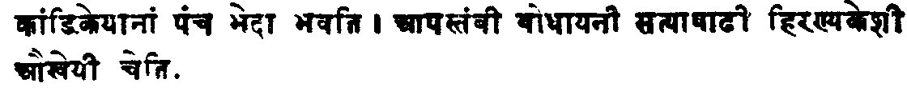
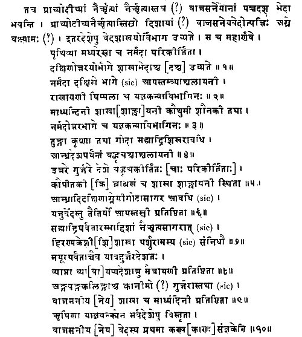

  
[Intangible Textual Heritage](../../index)  [Hinduism](../index) 
[Index](index)  [Previous](sbe0201)  [Next](sbe0203) 

------------------------------------------------------------------------

p. ix

# INTRODUCTION TO ÂPASTAMBA.

FOR all students of Sanskrit philology and Indian history Âpastamba's
aphorisms on the sacred law of the Aryan Hindus possess a special
interest beyond that attaching to other works of the same class. Their
discovery enabled Professor Max Müller, forty-seven years ago, to
dispose finally of the Brahmanical legend according to which Hindu
society was supposed to be governed by the codes of ancient sages,
compiled for the express purpose of tying down each individual to his
station, and of strictly regulating even the smallest acts of his daily
life [1](#fn_0). It enabled

p. x

him not only to arrive at this negative result, but also to substitute a
sounder theory the truth of which subsequent investigations have further
confirmed, and to show that the sacred law of the Hindus has its source
in the teaching of the Vedic schools, and that the so-called revealed
law codes are, in most cases, but improved metrical editions of older

p. xi

prose works which latter, in the first instance, were destined to be
committed to memory by the young Aryan students, and to teach them their
duties. This circumstance, as well as the fact that Âpastamba's work is
free from any suspicion of having been tampered with by sectarians or
modern editors, and that its intimate connection with the manuals
teaching the performance of the great and small sacrifices, the *S*rauta
and G*ri*hya-sûtras, which are attributed to the same author, is
perfectly clear and indisputable, entitle it, in spite of its
comparatively late origin, to the first place in a collection of
Dharma-sûtras.

The Âpastambîya Dharma-sûtra forms part of an enormous Kalpa-sûtra or
body of aphorisms, which digests the teaching of the Veda and of the
ancient *Ri*shis regarding the performance of sacrifices and the duties
of twice-born men, Brâhma*n*as, Kshatriyas, and Vai*s*yas, and which,
being chiefly based on the second of the four Vedas, the Ya*g*ur-veda in
the Taittirîya recension, is primarily intended for the benefit of the
Adhvaryu priests in whose families the study of the Ya*g*ur-veda is
hereditary.

The entire Kalpa-sûtra of Âpastamba is divided into

p. xii

thirty sections, called Pra*s*nas, literally questions [1](#fn_1). The first twenty-four of these teach the
performance of the so-called *S*rauta or Vaitânika sacrifices, for which
several sacred fires are required, beginning with the simplest rites,
the new and full moon offerings, and ending with the complicated Sattras
or sacrificial sessions, which last a whole year or even longer [2](#fn_2). The twenty-fifth Pra*s*na contains the
Paribhâshâs or general rules of interpretation [3](#fn_3), which are valid for the whole Kalpa-sûtra,
the Pravara-kha*nd*a, the chapter enumerating the patriarchs of the
various Brahmanical tribes, and finally the Hautraka, prayers to be
recited by the Hotraka priests. The twenty-sixth section gives the
Mantras or Vedic prayers and formulas for the G*ri*hya rites, the
ceremonies for which the sacred domestic or G*ri*hya fire is required,
and the twenty-seventh the rules for the performance of the latter [4](#fn_4). The aphorisms on the sacred law fill the
next two Pra*s*nas; and the *S*ulva-sûtra [5](#fn_5), teaching the geometrical principles,
according to which the altars necessary for the *S*rauta sacrifices must
be constructed, concludes the work with the thirtieth Pra*s*na.

The position of the Dharma-sûtra in the middle of the collection at once
raises the presumption that it originally formed an integral portion of
the body of Sûtras and that it is not a later addition. Had it been
added later, it would either stand at the end of the thirty Pra*s*nas or
altogether outside the collection, as is the case with some other
treatises attributed to Âpastamba [6](#fn_6). The
Hindus are, no doubt, unscrupulous in adding to the works of famous
teachers. But such additions, if of considerable extent, are usually not
embodied in the works themselves which they are intended to supplement.
They are mostly given

p. xiii

as *s*eshas or parisi*s*h*t*as, tacked on at the end, and generally
marked as such in the MSS.

In the case of the Âpastamba Dharma-sûtra it is, however, not necessary
to rely on its position alone, in order to ascertain its genuineness.
There are unmistakable indications that it is the work of the same
author who wrote the remainder of the Kalpa-sûtra. One important
argument in favour of this view is furnished by the fact that Pra*s*na
XXVII, the section on the G*ri*hya ceremonies has evidently been made
very short and concise with the intention of saving matter for the
subsequent sections on the sacred law. The Âpastambîya G*ri*hya-sûtra
contains nothing beyond a bare outline of the domestic ceremonies, while
most of the other G*ri*hya-sûtras, e.g. those of Â*s*valâyana,
*S*âṅkhâyana, Gobhila, and Pâraskara, include a great many rules which
bear indirectly only on the performance of the offerings in the sacred
domestic fire. Thus on the occasion of the description of the initiation
of Aryan students, Â*s*valâyana inserts directions regarding the dress
and girdle to be worn, the length of the studentship, the manner of
begging, the disposal of the alms collected, and other similar
questions [1](#fn_7). The exclusion of such
incidental remarks on subjects that are not immediately connected with
the chief aim of the work, is almost complete in Âpastamba's
G*ri*hya-sûtra, and reduces its size to less than one half of the extent
of the shorter ones among the works enumerated above. It seems
impossible to explain this restriction of the scope of Pra*s*na XXVII
otherwise than by assuming that Âpastamba wished to reserve all rules
bearing rather on the duties of men than on the performance of the
domestic offerings, for his sections on the sacred law.

A second and no less important argument for the unity of the whole
Kalpa-sûtra may be drawn from the cross-references which occur in
several Pra*s*nas. In the Dharma-sûtra we find that on various
occasions, where the performance

p. xiv

of a ceremony is prescribed, the expressions yathoktam, 'as has been
stated,' yathopade*s*am, 'according to the injunction,' or yathâ
purastât, 'as above,' are added. In four of these passages, Dh. I, 1, 4,
16; II, 2, 3, 17; 2, 5, 4; and 7, 17, 16, the G*ri*hya-sûtra is
doubtlessly referred to, and the commentator Haradatta has pointed out
this fact. On the other hand, the G*ri*hya-Sûtra refers to the
Dharma-sûtra, employing the same expressions which have been quoted from
the latter. Thus we read in the beginning of the chapter on funeral
oblations, G*ri*hya-sûtra VIII, 21, 1, mâsi*s*râddhasyâparapakshe
yathopade*s*a*m* kâlâ*h*, 'the times for the monthly funeral sacrifice
(fall) in the latter (dark) half of the month according to the
injunction.' Now as neither the G*ri*hya-sûtra itself nor any preceding
portion of the Kalpa-sûtra contains any injunction on this point, it,
follows that the long passage on this subject which occurs in the
Dharma-sûtra II, 7, 16, 4-22 is referred to. The expression
yathopade*s*am is also found in other passages of the G*ri*hya-sûtra,
and must be explained there in a like manner [1](#fn_8). There are further a certain number of
Sûtras which occur in the same words both in the Pra*s*na on domestic
rites, and in that on the sacred law, e.g. Dh. I, 1, A; I, 1, 2, 38; I,
1, 4, 14. It seems that the author wished to call special attention to
these rules by repeating them. Their recurrence and literal agreement
may be considered an additional proof of the intimate connection of the
two sections.

Through a similar repetition of, at least, one Sûtra it is possible to
trace the connection of the Dharma-sûtra with the *S*rauta-sûtra. The
rule *ri*tve vâ *g*âyâm, 'or (he may have conjugal intercourse) with his
wife in the proper season', is given, Dh. II, 2, 5, 17, with reference
to a householder who teaches the Veda. In the *S*rauta-sûtra it occurs
twice, in the sections on the new and full moon sacrifices III, 17, 8,
and again in connection with the *K*âturmâsya offerings, VIII, 4, 6, and
it refers both times

p. xv

to the sacrificer. In the first passage the verb, upeyât, is added,
which the sense requires; in the second it has the abbreviated form,
which the best MSS. of the Dharma-sûtra offer. The occurrence of the
irregular word, ritve for *ri*tvye, in all the three passages, proves
clearly that we have to deal with a self-quotation of the same author.
If the Dharma-sûtra were the production of a different person and a
later addition, the Pseudo-Âpastamba would most probably not have hit on
this peculiar irregular form. Finally, the G*ri*hya-sûtra, too, contains
several cross-references to the *S*rauta-sûtra, and the close agreement
of the Sûtras on the Vedic sacrifices, on the domestic rites, and on the
sacred, both in language and style, conclusively prove that they are the
compositions of one author [1](#fn_9).

Who this author really was, is a problem which cannot be solved for the
present, and which probably will. always remain unsolved, because we
know his family name only. For the form of the word itself shows that
the name Âpastamba, just like those of most founders of Vedic schools,
e.g. Bhâradvâ*g*a, Â*s*valâyana, Gautama, is a patronymic. This
circumstance is, of course, fatal to all attempts at an identification
of the individual who holds so prominent a place among the teachers of
the Black Ya*g*ur-veda.

But we are placed in a somewhat better position with respect to the
history of the school which has been named after Âpastamba and of the
works ascribed to him. Regarding both, some information has been
preserved by tradition, and a little more can be obtained from
inscriptions and later works, while some interesting details regarding
the time when, and the place where the Sûtras were composed, may be
elicited from the latter themselves. The data, obtainable from these
sources, it is true, do not enable us to determine with certainty the
year when the Âpastambîya school was founded, and when its Sûtras were
composed. But they make it possible to ascertain the position of the
school and of its Sûtras in Vedic literature,

p. xvi

their relative priority or posteriority as compared with other Vedic
schools and works, to show with some amount of probability in which part
of India they had their origin, and to venture, at least, a not
altogether unsupported conjecture as to their probable antiquity.

As regards the first point, the *K*ara*n*avyûha, a supplement of the
White Ya*g*ur-veda which gives the lists of the Vedic schools, informs
us that the Âpastambîya school formed one of the five branches of the
Khâ*nd*ikîya school, which in its turn was a subdivision of the
Taittirîyas, one of the ancient sections of Brâhma*n*as who study, the
Black Ya*g*ur-veda. Owing to the very unsatisfactory condition of the
text of the *K*ara*n*avyûha it is unfortunately not possible to
ascertain what place that work really assigns to the Âpastambîyas among
the five branches of the, Khâ*nd*ikîyas. Some MSS. name them first, and
others, last. They give either the following list, 1. Kâleyas (Kâletas),
2. Sâ*t*yâvanins, 3. Hira*n*yake*s*ins, 4. Bhâradvâ*g*ins, and 5.
Âpastambins, or, 1. Âpastambins, 2. Baudhâyanins or Bodhâyanins, 3.
Satyâshâ*dh*ins, 4. Hira*n*yake*s*ins, 5. Aukheyas [1](#fn_10). But this defect is remedied to, a certain
extent by the now generally current, and probably ancient tradition that
the Âpastambîyas are younger than, the school of Baudhâyana, and. older
than that of Satyâshâ*dh*a Hira*n*yake*s*in. Baudhâyana, it is alleged,
composed the first set of Sûtras connected with the Black Ya*g*ur-Veda,
which bore the special title 'prava*k*ana,' and he was succeeded by
Bhâradvâ*g*a, Âpastamba, and Satyâshâ*dh*a Hira*n*yake*s*in, who all
founded schools which bear their names [2](#fn_11).

p. xvii

This tradition has preserved two important pieces of in-formation.
First, the Âpastamba school is what Professor Max Müller appropriately
calls a Sûtra*k*ara*n*a, i.e. a school whose founder did not pretend to
have received a revelation of Vedic Mantras or of a Brâhma*n*a text, but
merely gave a new systematic arrangement of the precepts regarding
sacrifices and the sacred law. Secondly, the Sûtras of Âpastamba occupy
an intermediate position between the works of Baudhâyana and
Hira*n*yake*s*in. Both these statements are perfectly true, and capable
of being supported by proofs, drawn from Âpastamba's own and from other
works.

As regards the first point, Professor Max Müller has already
pointed [1](#fn_12) out that, though we
sometimes find a Brâhma*n*a of the Âpastambîyas mentioned, the title
Âpastamba-brâhma*n*a is nothing but another name of the
Taittirîya-brâhma*n*a, and that this Brâhma*n*a, in reality, is always
attributed to Tittiri or to the pupils of Vai*s*ampâyana, who are said
to have picked up the Black Ya*g*ur-veda in the shape of partridges
(tittiri). The same remark applies to the collection of the Mantras of
the Black Ya*g*ur-veda, which, likewise, is sometimes named
Âpastamba-Sa*m*hitâ. The *K*ara*n*avyûha states explicitly that the five
branches of the Khâ*nd*îkîya school, to which the Âpastambîyas belong,
possess one and the same recension of the revealed texts, consisting of
7 Kâ*nd*as, 44 Pra*s*nas, 651 Anuvâkas, 2198 Pannâsîs, 19290 Padas [2](#fn_13), and 253,868 syllables, and indicates
thereby that all these five schools were Sûtra*k*ara*n*as.

If we now turn to Âpastamba's own works, we find still

p. xviii

clearer proof that he laid no claim to the title *Ri*shi, or inspired
seer of Vedic texts. For (Dharma-sûtra I, 2, 5, 4-5 says distinctly that
on account of the prevalent transgression of the rules of studentship no
*Ri*shis are born, among the Avaras, the men of later ages or of modern
times, but that some, by virtue of a residue of the merit which they
acquired in former lives, become similar to *Ri*shis by their knowledge
of the Veda. A man who speaks in this manner, shows that he considers
the holy ages during which the great saints saw with their mind's eye
the uncreated and eternal texts of the Veda to be past, and that all he
claims is a thorough acquaintance with the scriptures which had been
handed down to him. The same spirit which dictated this passage is also
observable in other portions of the Dharma-sûtra. For Âpastamba
repeatedly contrasts the weakness and sinfulness of the Avaras, the men
of his own times, with the holiness of the ancient sages, who, owing to
the greatness of their 'lustre,' were able to commit various forbidden
acts without diminishing their spiritual merit [1](#fn_14). These utterances prove that Âpastamba
considered himself a child of the Kali Yuga, the age of sin, during
which, according to Hindu notions, no *Ri*shis can be born. If,
therefore, in spite of this explicit disclaimer, the Sa*m*hitâ and the
Brâhma*n*a of the Black Ya*g*ur-veda are sometimes called Âpastamba or
Âpastambîya, i.e. belonging to Âpastamba, the meaning of this expression
can only be, that they were and are studied and handed down by the
school of Âpastamba, not that its founder was their author, or, as the
Hindus would say, saw them.

The fact that Âpastamba confined his activity to the composition of
Sûtras is highly important for the determination of the period to which
he belonged. It clearly shows that in his time the tertiary or Sûtra
period of the Ya*g*ur-veda had begun. Whether we assume, with Professor
Max Müller, that the Sûtra period was one and the same for all the four
Vedas, and fix its limits with him

p. xix

between 600-200 B.C., or whether we believe, as I am inclined to do,
that the date of the Sûtra period differed for each Veda, still the
incontestable conclusion is that the origin of the Âpastambîya school
cannot be placed in the early times of the Vedic period, and probably
falls in the last six or seven centuries before the beginning of the
Christian era.

The correctness of the traditional statement that Âpastamba is younger
than Baudhâyana may be made very probable by the following
considerations. First, Baudhâyana's and Âpastamba's works on Dharma have
a considerable number of Sûtras in common. Thus in the chapter on
Penances not less than seven consecutive Sûtras, prescribing the manner
in which outcasts are to live and to obtain readmission into the
Brahmanical community for their children, occur in both treatises [1](#fn_15). Besides this passage, there are a number
of single Sûtras [2](#fn_16) which agree
literally. Taken by itself this agreement does not prove much, as it may
be explained in various ways. It may show either that Baudhâyana is
older than Âpastamba, and that the latter borrowed from the former, or
that the reverse was the case. It may also indicate that both authors
drew from one common source. But if it is taken together with two other
facts, it gains a considerable importance. First, Âpastamba holds in
several cases doctrines which are of a later origin than those held by
Baudhâyana. With respect to this point the puritan opinions which
Âpastamba puts forward regarding the substitutes for legitimate sons and
regarding the appointment of widows (niyoga), and his restriction of the
number of marriage-rites, may be adduced as examples. Like many other
ancient teachers, Baudhâyana permits childless Âryans to satisfy their
craving for representatives bearing their name, and to allay their fears
of falling after death into the regions of torment through a failure of
the funeral oblations, by the affiliation

p. xx

of-eleven kinds of substitutes for a legitimate son. Illegitimate sons,
the illegitimate sons of wives, the legitimate -and illegitimate
offspring of daughters, and the children of relatives, or even of
strangers who may be solemnly adopted, or received as members of the
family without any ceremony, or be acquired by purchase, are all allowed
to take the place and the rights of legitimate sons [1](#fn_17). Âpastamba declares his dissent from this
doctrine. He allows legitimate sons alone to inherit their father's
estate and to follow the occupations of his caste, and he explicitly
forbids the sale and gift of children [2](#fn_18).

In like manner he protests against the custom of making over childless
widows to brothers-in-law or other near relatives in order to obtain
sons who are to offer the funeral oblations to the deceased husband's
manes, while Baudhâyana has as yet no scruple on the subject [3](#fn_19). Finally, he omits from his list of the
marriage-rites the Pai*s*â*k*a vivâha, where the bride is obtained by
fraud [4](#fn_20); though it is reluctantly
admitted by Baudhâyana and other ancient teachers. There can be no doubt
that the law which placed the regular continuance of the funeral
oblations above all other considerations, and which allowed, in order to
secure this object, even a violation of the sanctity of the marriage-tie
and other breaches of the principles of morality, belongs to an older
order of ideas than the stricter views of Âpastamba. It is true that,
according to Baudhâyana's own statement [5](#fn_21), before his time an ancient sage named
Aupa*g*aṅghani, who is also mentioned in the *S*atapatha-brâhma*n*a, had
opposed the old practice of taking substitute's for a legitimate son. It
is also very probable that for a long time the opinions of the
Brâhma*n*a teachers, who lived in different parts of India and belonged
to different schools, may have been divided on this subject. Still it
seems very improbable that of two authors who both belong to the same
Veda and to the same school, the

p. xxi

earlier one should hold the later doctrine, and the later one the
earlier opinion. The contrary appears the more probable assumption. The
same remarks apply to the cases of the Niyoga and of the Pai*s*â*k*a
marriage [1](#fn_22).

The second fact, which bears on the question how the identity of so many
Sûtras in the two Dharma-sûtras is to be explained, affords a still
stronger proof of Âpastamba's posteriority to Baudhâyana. For on several
occasions, it appears, Âpastamba controverts opinions which Baudhâyana
holds, or which may be defended with the help of the latter's Sûtras.
The clearest case of this kind occurs in the chapter on Inheritance,
where the treatment of the eldest son on the division of the estate by
the father is discussed. There Âpastamba gives it as his own opinion
that the father should make an equal division of his property 'after
having gladdened the eldest son by some (choice portion of his) wealth,'
i.e. after making him a present which should have some value, but should
not be so valuable as to materially affect the equality of the
shares [2](#fn_23). Further on he notices the
opinions of other teachers on this subject, and states that the practice
advocated by some, of allowing the eldest alone to inherit, as well as
the custom prevailing in some countries, of allotting to the eldest all
the father's gold, or the black cows, or the black iron and grain, is
not in accordance with the precepts of the Vedas. In order to prove the
latter assertion he quotes a passage of the Taittirîya Sa*m*hitâ, in
which it is declared that 'Manu divided his wealth among his sons,' and
no difference in the treatment of the eldest son is prescribed. He adds
that a second passage occurs in the same Veda, which declares that 'they
distinguish the eldest son by (a larger portion of) the heritage,' and
which thus apparently countenances the partiality for the first-born.
But this second passage, he contends, appealing to the

p. xxii

opinion of the Mîmâ*m*sists, is, like many similar ones, merely a
statement of a fact which has not the authority of an injunction [1](#fn_24). If we now turn to Baudhâyana, we find
that he allows of three different methods for the distribution of the
paternal estate. According to him, either an equal share may be given to
each son, or the eldest may receive the best part of the wealth, or,
also, a preferential share of one tenth of the whole property. He
further alleges that the cows, horses, goats, and sheep respectively go
to the eldest sons of Brâhma*n*as, Kshatriyas, Vai*s*yas and *S*ûdras.
As authority for the equal division he gives the first of the two Vedic
passages quoted above; and for the doctrine that the eldest is to
receive the best part of the estate, he quotes the second passage which
Âpastamba considers to be without the force of an injunction [2](#fn_25). The fact that the two authors' opinions
clash is manifest, and the manner in which Âpastamba tries to show that
the second Vedic passage possesses no authority, clearly indicates that
before his time it had been held to contain an injunction. As no other
author of a Dharma-sûtra but Baudhâyana is known to have quoted it, the
conclusion is that Âpastamba's remarks are directed against him. If
Âpastamba does not mention Baudhâyana by name, the reason probably is
that in olden times, just as in the present day, the Brahmanical
etiquette forbad a direct opposition against doctrines propounded by an
older teacher who belongs to the same spiritual family (vidyâva*m*sa) as
oneself.

A similar case occurs in the chapter on Studentship [3](#fn_26) where Âpastamba, again appealing to the
Mîmâ*m*sists, combats the doctrine that pupils may eat forbidden food,
such as honey, meat, and pungent condiments, if it is given to them as
leavings by their teacher. Baudhâyana gives no explicit rule on this
point, but the wording of his Sûtras is not opposed to the doctrine and
practice, to which Âpastamba objects. Baudhâyana says that students

p. xxiii

shall avoid honey, meat, pungent condiments, &c.; he further enjoins
that pupils are to obey their teachers except when ordered to commit
crimes which cause loss of caste (patanîya); and he finally directs them
to eat the fragments of food given to them by their teachers. As the
eating of honey and other forbidden substances is not a crime causing
loss of caste, it is possible that Baudhâyana himself may have
considered it the duty of a pupil to eat any kind of food given by the
teacher, even honey and meat. At all events the practice and doctrine
which Âpastamba blames, may have been defended by the wording of
Baudhâyana's rules [1](#fn_27).

The three points which have been just discussed, viz. the identity of a
number of Sûtras in the works of the two authors, the fact that
Âpastamba advocates on some points more refined or puritan opinions,
and, especially, that he labours to controvert doctrines contained in
Baudhâyana's Sûtras, give a powerful support to the traditional
statement that he is younger than that teacher. It is, however,
difficult to say how great the distance between the two really is.
Mahâdeva, as stated above, places between them only Bhâradvâ*g*a, the
author of a set of Sûtras, which as yet have not been completely
recovered. But it seems to me not likely that the latter was his
immediate predecessor in the vidyâva*m*sa or spiritual family to which
both belonged. For it cannot be expected that two successive heads of
the school should each have composed a Sûtra and thus founded a new
branch-school. It is

p. xxiv

more probable that Baudhâyana and Bhâradvâ*g*a, as well as the latter
and Âpastamba, were separated by several intervening generations of
teachers, who contented themselves with explaining the works of their
predecessors. The distance in years between the first and the last of
the three Sûtrakâras must, therefore, I think, be measured rather by
centuries than by decades [1](#fn_28).

As regards the priority of Âpastamba to the school of Satyâshâ*dh*a
Hira*n*yake*s*in, there can be no doubt about the correctness of this
statement. For either Hira*n*yake*s*in himself, or, at least, his
immediate successors have appropriated Âpastamba's Dharma-sûtra and have
inserted it with slight modifications in their own collection. The
alterations consist chiefly in some not very important additions, and in
the substitution of more intelligible and more modern expressions for
difficult and antiquated words [2](#fn_29). But
they do not extend so far as to make the language of the Dharma-sûtra
fully agree with that of the other sections of the collection,
especially with the G*ri*hya-sûtra. Numerous discrepancies between these
two parts are observable. Thus we read in the Hira*n*yake*s*i

p. xxv

\[paragraph continues\] G*ri*hya-sûtra that a Brâhma*n*a must,
ordinarily, be initiated in his seventh year, while the rule of the
Dharma-sûtra, which is identical with Âp. Dh. I, 1, 1, 18, prescribes
that the ceremony shall take place in the eighth year after conception.
The commentators, Mât*ri*datta on the G*ri*hya-sûtra and Mahâdeva on the
Dharma-sûtra, both state that the rule of the G*ri*hya-sûtra refers to
the seventh year after birth, and, therefore, in substance agrees with
the Dharma-sûtra. They are no doubt right. But the difference in the
wording shows that the two sections do not belong to the same author.
The same inference may be drawn from the fact that the Hira*n*yake*s*i
G*ri*hya-sûtra, which is much longer than Âpastamba's, includes a
considerable amount of matter which refers to the sacred law, and which
is repeated in the Dharma-sûtra. According to a statement which I have
heard from several learned Brâhma*n*as, the followers of
Hira*n*yake*s*in, when pronouncing the sa*m*kalpa or solemn pledge to
perform a ceremony, declare themselves to be members of the
Hira*n*yake*s*i school that forms a subdivision of Âpastamba's
(âpastambântargatahira*n*yake*s*i*s*âkhâdhyâyî . . . aham). But I have
not been able to find these words in the books treating of the ritual of
the Hira*n*yake*s*ins, such as the Mahesabha*tt*î. If this assertion
could be further corroborated, it would be an additional strong proof of
the priority of Âpastamba, which, however, even without it may be
accepted as a fact [1](#fn_30). The distance in
time between the two teachers is probably not so great as that between
Âpastamba and Baudhâyana, as Mahâdeva mentions no intermediate Sûtrakâra
between them. Still it is probably not less than 100, or 150 years.

The results of the above investigation which show that the origin of the
Âpastamba school falls in the middle of the Sûtra period of the Black
Ya*g*ur-veda, and that its Sûtras belong to the later, though not to the
latest products of Vedic literature, are fully confirmed by an

p. xxvi

examination of the quotations from and references to Vedic and other
books contained in Âpastamba's Sûtras, and especially in the
Dharma-sûtra. We find that all the four Vedas are quoted or referred to.
The three old ones, the *Ri*k, Ya*g*us, and Sâman, are mentioned both
separately and collectively by the name trayî vidyâ, i.e. threefold
sacred science, and the fourth is called not Atharvâṅgirasa*h*, as is
done in most ancient Sûtras, but Atharva-veda [1](#fn_31). The quotations from the *Ri*k and Sâman
are not very numerous. But a passage from the ninth Ma*nd*ala of the
former, which is referred to Dh. I, 1, 2, 2, is of some extent, and
shows that the recension which Âpastamba knew, did not differ from that
which still exists. As Âpastamba was an adherent of the Black
Ya*g*ur-veda, he quotes it, especially in the *S*rauta-sûtra, very
frequently, and he adduces not only texts from the Mantra-Sa*m*hitâ, but
also from the Taittirîya-Brâhma*n*a and Âra*n*yaka. The most important
quotations from the latter work occur Dh. II, 2, 3, 16-II, 2, 4, 9,
where all the Mantras to be recited during the performance of the
Bali-offerings are enumerated. Their order agrees exactly with that in
which they stand in the sixty-seventh Anuvâka of the tenth Prapâ*th*aka
of the recension of the Âra*n*yaka which is current among the Ândhra
Brâhma*n*as [2](#fn_32). This last point is of
considerable importance, both for the history of the text of that book
and, as we shall see further on, for the history of the Âpastambîya
school.

The White Ya*g*ur-veda, too, is quoted frequently in the *S*rauta-sûtra
and once in the section on Dharma by the title Vâ*g*asaneyaka, while
twice its Brâhma*n*a, the Vâ*g*asaneyi-brâhma*n*a, is cited. The longer
one of the two passages, taken from the latter work, Dh. I, 4, 12, 3,
does, however, not fully agree with the published text of the
Mâdhyandina recension. Its wording possesses just sufficient resemblance
to allow us to identify the passage which Âpastamba meant, but differs
from the *S*atapatha-brâhma*n*a

p. xxvii

in many details [1](#fn_33). The cause of these
discrepancies remains doubtful for the present [2](#fn_34). As regards the Atharva-veda, Âpastamba
gives, besides the reference mentioned above and a second to the
Âṅgirasa-pavitra [3](#fn_35), an abstract of a
long passage from Atharva-veda XV, 10-13, regarding the treatment of a
Vrâtya, i.e. a learned mendicant Brâhma*n*a, who really deserves the
title of an atithi, or guest [4](#fn_36). It is
true that Âpastamba, in the passage referred to, does not say that his
rule is based on the Atharva-veda. He merely says that a Brâhma*n*a is
his authority. But it seems, nevertheless, certain that by the
expression a Brâhma*n*a, the Brâhma*n*a-like fifteenth book of the
Atharva-veda is meant, as the sentences to be addressed by the host to
his guest agree literally with those which the Atharva-veda prescribes
for the reception of a Vrâtya. Haradatta too, in his commentary,
expresses the same opinion. Actual quotations from the Atharva-veda are
not frequent in Vedic literature, and the fact that Âpastamba's
Dharma-sûtra contains one, is, therefore, of some interest.

Besides these Vedic texts [5](#fn_37), Âpastamba
mentions, also, the Aṅgas or auxiliary works, and enumerates six
classes, viz. treatises on the ritual of the sacrifices, on grammar,
astronomy, etymology, recitation of the Veda, and metrics [6](#fn_38). The number is the same as that which is
considered the correct one in our days [7](#fn_39).

As the Dharma-sûtra names no less than nine teachers in connection with
various topics of the sacred law, and frequently appeals to the opinion
of some (eke), it follows that a great many such auxiliary treatises
must have existed in Âpastamba's time. The Â*k*âryas mentioned are Eka,
Ka*n*va, Kâ*n*va, Ku*n*ika, Kutsa, Kautsa, Pushkarasâdi,

p. xxviii

\[paragraph continues\] Vârshyâya*n*i, *S*vetaketu, and Hârita [1](#fn_40). Some of these persons, like Hârita and
Kâ*n*va, are known to have composed Sûtras on the sacred law, and
fragments or modified versions of their works are still in existence,
while Kâ*n*va, Kautsa, Pushkarasâdi or Paushkarasâdi, as the
grammatically correct form of the name is, and Vârshyâya*n*i are quoted
in the Nirukta, the Prâti*s*âkhyas, and the Vârttikas on Pâ*n*ini as
authorities on phonetics, etymology, and grammar [2](#fn_41). Kâ*n*va, finally, is considered the
author of the still existing Kalpa-sûtras of the Kâ*n*va school
connected with the White Ya*g*ur-veda. It seems not improbable that most
of these teachers were authors of complete sets of Aṅgas. Their position
in Vedic literature, however, except as far as Kâ*n*va, Hârita, and
*S*vetaketu are concerned, is difficult to define, and the occurrence of
their names throws less light on the antiquity of the Âpastambîya school
than might be expected. Regarding Hârita it must, however, be noticed
that he is one of the oldest authors of Sûtras, that he was an adherent
of the Maitrâya*n*îya *S*âkhâ [3](#fn_42), and
that he is quoted by Baudhâyana, Âpastamba's predecessor. The bearing of
the occurrence of *S*vetaketu's name will be discussed below.

Of even greater interest than the names of the teachers are the
indications which Âpastamba gives, that he knew two of the philosophical
schools which still exist in India, viz. the Pûrvâ or Karma Mîmâ*m*sâ
and the Vedânta. As regards the former, he mentions it by its ancient
name, Nyâya, which in later times and at present is usually applied to
the doctrine of Gautama Akshapâda. In two passages [4](#fn_43) he settles contested points on the
authority of those who know the Nyâya, i.e. the Pûrvâ Mîmâ*m*sâ, and

p. xxix

in several other cases he adopts a line of reasoning which fully agrees
with that followed in *G*aimini's Mîmâ*m*sâ-sûtras. Thus the
arguments [1](#fn_44), that 'a revealed text has
greater weight than a custom from which a revealed text may be
inferred,' and that 'no text can be inferred from a custom for which a
worldly motive is apparent,' exactly correspond with the teaching of
*G*aimini's Mîmâ*m*sâ-sûtras I, 3, 3-4. The wording of the passages in
the two works does not agree so closely that the one could be called a
quotation of the other. But it is evident, that if Âpastamba did not
know the Mîmâ*m*sâ-sûtras of *G*aimini, he must have possessed some
other very similar work. As to the Vedânta, Âpastamba does not mention
the name of the school. But Kha*nd*as 22, 23 of the first Pa*t*ala of
the Dharma-sûtra unmistakably contain the chief tenets of the
Vedântists, and recommend the acquisition of the knowledge of the Âtman
as the best means for purifying the souls of sinners. Though these two
Kha*nd*as are chiefly filled with quotations, which, as the commentator
states, are taken from an Upanishad, still the manner of their
selection, as well as Âpastamba's own words in the introductory and
concluding Sûtras, indicates that he knew not merely the unsystematic
speculations contained in the Upanishads and Âra*n*yakas, but a
well-defined system of Vedântic philosophy identical with that of
Bâdarâya*n*a's Brahma-sûtras. The fact that Âpastamba's Dharma-sûtra
contains indications of the existence of these two schools of
philosophy, is significant as the Pûrvâ Mîmâ*m*sâ occurs in one other
Dharma-sûtra only, that attributed to Vasish*th*a, and as the name of
the Vedânta school is not found in any of the prose treatises on the
sacred law.

Of non-Vedic works Âpastamba mentions the Purâ*n*a. The Dharma-sûtra not
only several times quotes passages from 'a Purâ*n*a' as authorities for
its rules [2](#fn_45), but names in one case the
Bhavishyat-purâ*n*a as the particular Purâ*n*a from which the quotation
is taken [3](#fn_46). References to the

p. xxx

\[paragraph continues\] Purâ*n*a in general are not unfrequent in other
Sûtras on the sacred law, and even in older Vedic works. But Âpastamba,
as far as I know, is the only Sûrakâra who specifies the title of a
particular Purâ*n*a, and names one which is nearly or quite identical
with that of a work existing in the present day, and he is the only one,
whose quotations can be shown to be, at least in part, genuine
Paurâ*n*ic utterances.

Among the so-called Upa-purâ*n*as we find one of considerable extent
which bears the title Bhavishya-purâ*n*a or also
Bhavishyat-purâ*n*a [1](#fn_47). It is true that
the passage quoted in the Dharma-sûtra from the Bhavishyat-purâ*n*a is
not to be found in the copy of the Bhavishya-purâ*n*a which I have seen.
It is, therefore, not possible to assert positively that Âpastamba knew
the present homonymous work. Still, considering the close resemblance of
the two titles, and taking into account the generally admitted fact that
most if not all Purâ*n*as have been remodelled and recast [2](#fn_48), it seems to me not unlikely that
Âpastamba's

p. xxxi

authority was the original on which the existing Upa-purâ*n*a is based.
And in favour of this view it may be urged that passages, similar to
Âpastamba's quotation, actually occur in our Paurâ*n*ic texts. In the
*G*yotishpra*k*âra section of several of the chief Purâ*n*as we find, in
connection with the description of the Path of the Manes
(pit*ri*yâ*n*a) [1](#fn_49), the assertion that
the pious sages, who had offspring and performed the Agnihotra, reside
there until the general destruction of created things (â
bhûtasa*m*plavât), as well as, that in the beginning of each new
creation they are the propagators of the world (lokasya
sa*m*tânakarâ*h*) and, being re-born, re-establish the sacred law.
Though the wording differs, these passages fully agree in sense with
Âpastamba's Bhavishyat-purâ*n*a which says, 'They (the ancestors) live
in heaven until the (next) general destruction of created things. At the
new creation (of the world) they become the seed.' In other passages of
the Purâ*n*as, which refer to the successive creations, we find even the
identical terms used in the quotation. Thus the Vâyup., Adhy. 8, 23,
declares that those beings, which have gone to the *G*analoka, 'become
the seed at the new creation' (puna*h* sarge . . . bî*g*ârtha*m* tâ
bhavanti hi).

These facts prove at all events that Âpastamba took his quotation from a
real Purâ*n*a, similar to those existing. If it is literal and exact, it
shows, also, that the Purâ*n*as of his time contained both prose and
verse.

Further, it is possible. to trace yet another of Âpastamba's quotations
from 'a Purâ*n*a.' The three Purâ*n*as, mentioned above, give,
immediately after the passages referred to, enlarged versions of the two
verses [2](#fn_50) regarding the sages, who
begot offspring and obtained 'burial-grounds,' and

p. xxxii

regarding those who, remaining chaste, gained immortality [1](#fn_51). In this case Âpastamba's quotation can be
restored almost completely, if certain interpolations are cut out. And
it is evident that Âpastamba has preserved genuine Paurâ*n*ic verses in
their ancient form. A closer study of the unfortunately much neglected
Purâ*n*as, no doubt, will lead to further identifications of other
quotations, which will be of considerable interest for the history of
Indian literature.

There is yet another point on which Âpastamba shows a remarkable
agreement with a theory which is prevalent in later Sanskrit literature.
He says (Dh. II, 11, 29, 11-12), 'The knowledge which *S*ûdras and women
possess, is the completion of all study,' and 'they declare that this
knowledge is a supplement of the Atharva-veda.' The commentator remarks
with reference to these two Sûtras, that 'the knowledge which *S*ûdras
and women possess,' is the knowledge of dancing, acting, music, and
other branches of the so-called Artha*s*âstra, the science of useful
arts and of trades, and that the object of the Sûtras is to forbid the
study of such matters before the acquisition of sacred learning. His
interpretation is, without doubt, correct, as similar sentiments are
expressed by other teachers in parallel passages. But, if it is
accepted, Âpastamba's remark that 'the knowledge of *S*ûdras and women
is a supplement of the Atharva-veda,' proves that he knew the division
of Hindu learning which is taught in Madhusûdana Sarasvatî's
Prasthânabheda [2](#fn_52). For Madhusûdana
allots to each Veda an Upa-veda or supplementary Veda, and asserts that
the Upa-veda of the Atharva-veda is the Artha*s*âstra. The agreement of
Âpastamba with the modern writers on this point, furnishes, I think, an
additional argument that he belongs to the later Vedic schoolmen.

In addition to this information regarding the relative position of the
Âpastambîya school in ancient Sanskrit literature, we possess some
further statements as to the

p. xxxiii

part of India to which it belongs, and these, as it happens, are of
great importance for fixing approximately the period in which the school
arose. According to the Brahmanical tradition, which is supported by a
hint contained in the Dharma-sûtra and by, information derivable from
inscriptions and the actual state of things in modern India, the
Âpastambîyas belong to Southern India and their founder probably was a
native of or resided in the Ândhra country. The existence of this
tradition, which to the present day prevails among the learned Brahmans
of Western India and Benares, may be substantiated by a passage from the
above-mentioned commentary of the *K*ara*n*avyûha [1](#fn_53),which,

p. xxxiv

though written in barbarous Sanskrit, and of quite modern origin,
possesses great interest, because its description of the geographical
distribution of the Vedas and Vedic schools is not mentioned elsewhere.
The verses from a work entitled Mahâr*n*ava, which are quoted there,
state that the earth, i.e. India, is divided into two equal halves by
the river Narmadâ (Nerbudda). and that the school of Âpastamba prevails
in the southern half (ver. 2). It is further alleged (ver. 6) that the
Ya*g*ur-veda of Tittiri and the Âpastambîya school are established in
the Ândhra country and other parts of the south and south-east up to the
mouth of the Godâvarî (godâsâgara-âvadhi). According to the Mahâr*n*ava
the latter river marks, therefore, the northern frontier of the
territory occupied by the Âpastambîyas. which comprises the Marâ*th*a
and Kâ*n*ara districts of the Bombay Presidency, the greater part of the
Nizâm's dominions, Berar, and the Madras Presidency with the exception
of the northern Sirkârs and the western coast. This assertion agrees, on
the whole, with the actual facts which have fallen under my observation.
A great number of the De*s*astha-brâhma*n*as in the Nâsik, Pu*n*a,
Ahmadnagar, Sâtârâ, Sholâpur, and Kolhâpur districts, and of the
Kâ*n*arâ or Kar*n*â*t*aka-brâhma*n*as in the Belgâm, Dhârvâ*d*,
Kalâ*d*ghî, and Karvâ*d* collectorates, as well as a smaller number
among the *K*ittapâvanas of the Koṅka*n*a are Âpastambîyas. Of the
Nizâm's dominions and the Madras Presidency I possess no local
knowledge. But I can say that I have met many followers of Âpastamba
among the Teliṅgana-brâhma*n*as settled in Bombay, and that the frequent
occurrence of MSS. containing the Sûtras of the Âpastambîya school in
the Madras Presidency proves that the *K*ara*n*a there must count many
adherents. On the other hand, I have never met with any Âpastambîyas
among the ancient indigenous subdivisions of the Brahmanical community
dwelling north of the Marâ*th*â country and north of the Narmadâ. A few
Brâhma*n*as of this school, no doubt, are scattered over Gu*g*arât and
Central India, and others are found in the great places of

p. xxxv

pilgrimage in Hindustan proper. The former mostly have immigrated during
the last century, following the Marâ*th*â chieftains who conquered large
portions of those countries, or have been imported in the present
century by the Marâ*th*â rulers of Gwalior, Indor, and Baroda. The
settlers in Benares, Mathurâ, and other sacred cities also, have chiefly
come in modern times, and not unfrequently live on the bounty of the
Marâ*th*â princes. But all of them consider themselves and are
considered by the Brâhma*n*as, who are indigenous in those districts and
towns, as aliens, with whom intermarriage and commensality are not
permitted. The indigenous sections of the Brâhma*n*as of Gu*g*arât, such
as the Nâgaras, Khe*d*âvals, Bhârgavas, Kapilas, and Motâlâs, belong, if
they are adherents of the Ya*g*ur-veda, to the Mâdhyandina or Kâ*n*va
schools of the White Ya*g*ur-veda. The same is the case with the
Brâhma*n*as of Ra*g*putâna, Hindustan, and the Pa*ñg*ab. In Central
India, too, the White Ya*g*ur-veda prevails; but, besides the two
schools mentioned above, there are still some colonies of
Maitrâya*n*îyas or Mânavas [1](#fn_54). It
seems, also, that the restriction of the Âpastambîya school to the south
of India, or rather to those subdivisions of the Brahmanical community
which for a long time have been settled in the south and are generally
considered as natives of the south, is not of recent date. For it is a
significant fact that the numerous ancient landgrants which have been
found all over India indicate exactly the same state of things. I am not
aware that in any grant issued by a king of a northern dynasty to
Brâhma*n*as who are natives of the northern half of India, an
Âpastambîya is mentioned as donee. But among the southern landgrants
there are several on which the name of the school appears. Thus in a
*s*âsana of king Harihara of Vidyânagara, dated Sakasa*m*vat 1317 or
1395 A.D., one of the recipients of the royal bounty is 'the learned
Ananta Dîkshita, son of Râmabha*tt*a, chief

p. xxxvi

of the Âpastambya (read Âpastambîya) *s*âkhâ, a scion of the Vasish*th*a
gotra [1](#fn_55).' Further, the eastern
*K*âlukya king Vi*g*ayâditya II [2](#fn_56), who
ruled, according to Dr. Fleet, from A-D. 799-843, presented a village to
six students of the Hira*n*yake*s*i-sûtra and to eighteen students of
the Âpastamba, *recte* the Âpastamba-sûtra. Again, in the abovementioned
earlier grant of the Pallava king Nandivarman, there are forty-two
students of the Âpastamba-sûtra [3](#fn_57)
among the 108 sharers of the village of Udaya*k*andramaṅgalam. Finally,
on an ancient set of plates written in the characters which usually are
called cave-characters, and issued by the Pallava king Si*m*havarman II,
we find among the donees five Âpastambhîya Brâhma*n*as, who, together
with a Haira*n*yakesa, a Vâ*g*asaneya, and a Sâma-vedî, received the
village of Maṅgadûr, in Veṅgŏrâsh*t*ra [4](#fn_58). This inscription is, to judge from the
characters, thirteen to fourteen hundred years old, and on this account
a very important witness for the early existence of the Âpastambîyas in
Southern India.

Under the circumstances just mentioned, a casual remark made by
Âpastamba, in describing the *S*râddhas or funeral oblations, acquires
considerable importance. He says (Dh. II, 7, 17, 17) that the custom of
pouring water into the hands of Brâhma*n*as invited to a *S*râddha
prevails among the northerners, and he indicates thereby that he himself
does not belong to the north of India. If this statement is taken
together with the above-stated facts, which tend to show that the
Âpastambîyas were and are restricted to the south of India, the most
probable construction which can be put on it is that Âpastamba declares
himself to be a southerner. There is yet another indication to the same
effect contained in the Dharma-sûtra. It has been pointed

p. xxxvii

out above that the recension of the Taittirîya Âra*n*yaka which
Âpastamba recognises is that called the Ândhra text or the version
current in the Ândhra country, by which term the districts in the
south-east of India between the Godâvarî and the K*ri*sh*n*â have to be
understood [1](#fn_59). Now it seems exceedingly
improbable that a Vedic teacher would accept as authoritative any other
version of a sacred work except that which was current in his native
country. it would therefore follow, from the adoption of an Ândhra text
by Âpastamba, that he was born in that country, or, at least, had
resided there so long as to have become naturalised in it. With respect
to this conclusion it must also be kept in mind that the above-quoted
passage from the Mahâr*n*ava particularly specifies the Ândhra country
(ândhrâdi) as the seat of the Âpastambîyas. It may be that this is due
to an accident. But it seems to me more probable that the author of the
Mahâr*n*ava wished to mark the Ândhra territory as the chief and perhaps
as the original residence of the Âpastambîyas.

This discovery has, also, a most important bearing on the question of
the antiquity of the school of Âpastamba. It fully confirms the result
of the preceding enquiry, viz. that the Âpastambîyas are one of the
later *K*ara*n*as. For the south of India and the nations inhabiting it,
such as Kaliṅgas, Dravi*d*as, Andhras, *K*olas, and Pâ*nd*yas, do not
play any important part in the ancient Brahmanical traditions and in the
earliest history of India, the centre of both of which lies in the
north-west or at least north of the Vindhya range. Hitherto it has not
been shown that the south and the southern nations are mentioned in any
of the Vedic Sa*m*hitâs. In the Brâhma*n*as and in the Sûtras they do
occur, though they are named rarely and in a not complimentary manner.
Thus the Aitareya-brâhma*n*a gives the names of certain degraded,
barbarous tribes, and among them that of the Andhras [2](#fn_60), in whose country, as

p. xxxviii

has been shown, the Âpastambîyas probably originated. Again, Baudhâyana,
in his Dharma-sûtra I, i, quotes song verses in which it is said that he
who visits the Kaliṅgas must purify himself by the performance of
certain sacrifices in order to become fit for again associating with
Aryans. The same author, also, mentions distinctive forbidden practices
(â*k*âra) prevailing in the south (loc. cit.). Further, Pâ*n*ini's
grammatical Sûtras and Kâtyâyana's Vârttikas thereon contain rules
regarding several words which presuppose an acquaintance with the south
and the kingdoms which flourished there. Thus Pâ*n*ini, IV, 2, 98,
teaches the formation of dâkshi*n*âtya in the sense of 'belonging to or
living in the south or the Dekhan,' and a Vârttika of Kâtyâyana on
Pâ*n*ini, IV, 1, 175, states that the words *K*ola and Pâ*nd*ya are used
as names of the princes ruling over the Kola and Pâ*nd*ya countries,
which, as is known from history, were situated in the extreme south of
India. The other southern nations and a fuller description of the south
occur first in the Mahâbhârata [1](#fn_61).
While an acquaintance with the south can thus be proved only by a few
books belonging to the later stages of Vedic literature, several of the
southern kingdoms are named already in the oldest historical documents.
A*s*oka in his edicts [2](#fn_62), which date
from the second half of the third century B.C., calls the *K*olas,
Pâ*nd*yas, and the Keralaputra or Ketalaputra his pratyantas
(pra*k*antâ) or neighbours. The same monarch informs us also that he
conquered the province of Kaliṅga and annexed it to his kingdom [3](#fn_63), and his remarks on the condition of the
province show that it was thoroughly imbued with the Aryan
civilisation. [4](#fn_64). The same fact is
attested still more clearly by the annals of the *K*eta king of Kaliṅga,
whose thirteenth year fell in the 165th year of the Maurya era, or about
150 B.C. [5](#fn_65) The early

p. xxxix

spread of the Aryan civilisation to the eastern coast-districts between
the Godâvarî and the K*ri*sh*n*â is proved by the inscriptions on the
Bha*tt*iprolu relic caskets, which probably belong to the period of 200
B.C. [1](#fn_66) Numerous inscriptions in the
Buddhist caves of Western India [2](#fn_67), as
well as coins, prove the existence during the last centuries before, and
the first centuries after, the beginning of our era of a powerful empire
of the Andhras, the capital of which was probably situated near the
modern Amarâvati an the lower K*ri*sh*n*â. The princes of the latter
kingdom, though great patrons of the Buddhist monks, appear to have been
Brahmanists or adherents of the ancient orthodox faith which is founded
on the Vedas. For one of them is called Vedisiri (vedi*s*rî), 'he whose
glory is the Vedi,' and another Ya*ñ*asiri (ya*gñ*asrî), 'he whose glory
is the sacrifice,' and a very remarkable inscription on the
Nânâghât [3](#fn_68) contains a curious
catalogue of sacrificial fees paid to priests (dakshi*n*â) for the
performance of *S*rauta sacrifices. For the third and the later
centuries of our era the information regarding Southern India becomes
fuller and fuller. Very numerous inscriptions, the accounts of the
Buddhist chroniclers of Ceylon, of the Greek geographers, and of the
Chinese pilgrims, reveal the existence and give fragments, at least, of
the history of many kingdoms in the south, and show that their
civilisation was an advanced one, and did not differ materially from
that of Northern India.

There can be no doubt that the south of India has been conquered by the
Aryans, and has been brought within the pale of Brahmanical civilisation
much later than India north of the Vindhya range. During which century
precisely that conquest took place, cannot be determined for the
present. But it would seem that it happened a considerable time before
the Vedic period came to an end, and it certainly was an accomplished
fact, long before the

p. xl

authentic history of India begins, about 500 B.C., with the Persian
conquest of the Pa*ñg*ab and Sindh. It may be added that a not
inconsiderable period must have elapsed after the conquest of the south,
before the Aryan civilisation had so far taken root in the conquered
territory, that, in its turn, it could become a centre of Brahmanical
activity, and that it could produce new Vedic schools.

These remarks will suffice to show that a Vedic *K*ara*n*a which had its
origin in the south, cannot rival in antiquity those whose seat is in
the north, and that all southern schools must belong to a comparatively
recent period of Vedic history. For this reason, and because the name of
Âpastamba and of the Âpastambîyas is not mentioned in any Vedic work,
not even in a Kalpa-sûtra, and its occurrence in the older grammatical
books, written before the beginning of our era, is doubtful [1](#fn_69), it might be thought advisable to fix the
terminus a quo for the composition of the Âpastambîya-sûtras about or
shortly before the beginning of the era, when the Brahmanist Ândhra
kings held the greater part of the south under their sway. It seems to
me, however, that such a hypothesis is not tenable, as there are several
points which indicate that the school and its writings possess a much
higher antiquity. For, first, the Dharma-sûtra contains a remarkable
passage in which its author states that *S*vetaketu, one of the Vedic
teachers who is mentioned in the *S*atapatha-Brâhma*n*a and in the
*Kh*ândogya Upanishad, belongs to the Avaras, to the men of later, i.e.
of his own times. The passage referred to, Dh. I, 2, 5, 4-6, has been
partly quoted above in order to show that Âpastamba laid no claim to the
title *Ri*shi, or seer of revealed texts. It has been stated that
according to Sûtra 4, 'No *Ri*shis are born among the Avaras, the men of
later ages, on account of the prevailing transgression of the rules of
studentship;' and that according to Sûtra 5,

p. xli

\[paragraph continues\] 'Some in their new birth become similar to
*Ri*shis by their knowledge of the Veda (*s*rutarshi) through a residue
of merit acquired in former existences.' In order to give an
illustration of the latter case, the author adds in Sûtra 6, 'Like
*S*vetaketu.' The natural, and in my opinion, the only admissible
interpretation of these words is that Âpastamba considers *S*vetaketu to
be one of the Avaras, who by virtue of a residue of merit became a
*S*rutarshi. This is also the view of the commentator Haradatta, who, in
elucidation of Sûtra 6, quotes the following passage from the
*Kh*ândogya Upanishad (VI, 1, 1-2):

'1. Verily, there lived *S*vetaketu, a descendant of Aru*n*a. His father
spake unto him, "O *S*vetaketu, dwell as a student (with a, teacher);
for, verily, dear child, no one in our family must neglect the study of
the Veda and become, as it were, a Brâhma*n*a in name only."

'Verily, he (*S*vetaketu) was initiated at the age of twelve years, and
when twenty-four years old be had learned all the Vedas; he thought
highly of himself and was vain of his learning and arrogant.'

There can be no doubt that this is the person and the story referred to
in the Dharma-sûtra. For the fact which the Upanishad mentions, that
*S*vetaketu learned all the Vedas in twelve years, while, the Sm*ri*tis
declare forty-eight years to be necessary for the accomplishment of that
task, makes Âpastamba's illustration intelligible and appropriate. A
good deal more is told in the *Kh*ândogya Upanishad about this
*S*vetaketu, who is said to have been the son of Uddâlaka and the
grandson of Aru*n*a (âru*n*eya). The same person is also frequently
mentioned in the *S*atapatha-Brâhma*n*a. In one passage of the latter
work, which has been translated by Professor Max Müller [1](#fn_70), it is alleged that he was a contemporary
of Yâ*gñ*avalkya, the promulgator of the White Ya*g*ur-veda, and of the
learned king *G*anaka of Videha, who asked him about the meaning of the
Agnihotra sacrifice, Now, as has been shown above, Âpastamba knew and
quotes the White Ya*g*ur-veda and

p. xlii

the *S*atapatha-brâhma*n*a. The passage of the latter work, which he
quotes, is even taken from the same book in which the story about
*S*vetaketu and *G*anaka occurs. The fact, therefore, that Âpastamba
places a teacher whom he must have considered as a contemporary of the
promulgator of the White Ya*g*ur-veda among the Avaras, is highly
interesting and of some importance for the history of Vedic literature.
On the one hand it indicates that Âpastamba cannot have considered the
White Ya*g*ur-veda, such as it has been handed down in the schools of
the *K*â*n*vas and Mâdhyandinas, to belong to a remote antiquity. On the
other hand it makes the inference which otherwise might be drawn from
the southern origin of the Âpastambîya school and from the
non-occurrence: of its name in the early grammatical writings, viz. that
its founder lived not long before the beginning of our era, extremely
improbable. For even if the term Avara is not interpreted very strictly
and allowed to mean not exactly a contemporary, but a person of
comparatively recent times, it will not be possible to place between
*S*vetaketu and Âpastamba a longer interval than, at the utmost, two or
three hundred years. *S*vetaketu and Yâ*gñ*avalkya would accordingly, at
the best, find their places in the fourth or fifth century B.C., and the
*S*atapatha-Brâhma*n*a as well as all other Vedic works, which narrate
incidents from their lives, must have been composed or at least edited
still later. Though little is known regarding the history of the Vedic
texts, still it happens that we possess some information regarding the
texts in question. For we know from a statement made by Kâtyâyana in a
Vârttika on Pâ*n*ini IV, 3, 105, and from Pata*ñg*ali's commentary on
his words that the Brâhma*n*a proclaimed by Yâ*gñ*avalkya, i.e. the
*S*atapatha-brâhma*n*a of the White Ya*g*ur-veda, was considered to have
been promulgated by one of the Ancients, in the times of these two
writers, i.e. probably in the fourth and second centuries B.C. [1](#fn_71)

p. xliii

These considerations will show that it is necessary to allow for
Âpastamba a much higher antiquity than the first century B.C.

The same inference may also be drawn from another series of facts, viz.
the peculiarities of the language of his Sûtras. The latter are very
considerable and very remarkable. They may be classed under four heads.
In the Âpastambîya Dharma-sûtra we have, first, archaic words and forms
either occurring in other Vedic writings or formed according to the
analogy of Vedic usage; secondly, ancient forms and words specially
prescribed by Pâ*n*ini, which have not been traced except in Âpastamba's
Sûtras; thirdly, words and forms which are both against Vedic usage and
against Pâ*n*ini's rules, and which sometimes find their analogies in
the ancient Prakrits; and fourthly, anomalies in the construction of
sentences. To the first class belong, kravyâdas, I, 7, 21, 15,
carnivorous, formed according to the analogy of *ris*âdas; the frequent
use of the singular dâra, e.g. II, 1, 1, 17-18, a wife, instead of the
plural dârâ*h*; salâv*ri*kî, I, 3, 10, 19, for sâlav*ri*kî; the
substitution of *l* for *r* in pleṅkha, I, 11, 31, 14; occasional

p. xliv

offences against the rules of internal and external Sandhi, e.g. in
ag*ri*hyamânakâra*n*a*h*, I, 4, 12, 8; in skuptvâ, I, 11, 31, 22, the
irregular absolutive of skubh or of sku; in pâdûna, I, 1, 2, 13; in
adhâ*s*ana*s*âyin, I, 19, 2, 21 and in sarvatopeta, I, 6, 19, 8; the
neglect of the rule requiring v*ri*ddhi in the first syllable of the
name Pushkarasâdi, I, 10, 28, 1; the irregular instrumentals vidyâ, I,
11, 30, 3, for vidyayâ, and ni*hs*reyasâ, II, 7, 16, 2, for
ni*hs*reyasena; the nominatives dual âvam, I, 7, 20, 6, for âvâm, and
kru*ñk*akrau*ñk*a, I, 5, 17, 36 for °krau*ñk*au; and the potentials in
îta, such as prakshâlayîta, I, 1, 2, 28; abhiprasârayîta, I, 25 6, 3,
&c.

Among the words mentioned by Pâ*n*ini, but not traced except in the
Dharma-sûtra, may be enumerated the verb st*ri*h, to do damage, I, 11,
31, 9; the verb s*ri*ṅkh, to sneeze, from which s*ri*ṅkhânikâ, I, 5, 16,
14, and ni*hsri*ṅkhana, II, 2, 5, 9, are derived; and the noun
vedâdhyâya, I, 9, 24, 6; II, 4, 8, 5, in the sense of a student of the
Veda. Words offending against rules given by Pâ*n*ini, without being
either archaic or Prakritic, are e.g. sarvânnin, I, 6, 18, 33, one who
eats anybody's food, which, according to Pâ*n*ini V, 2, 9, should be
sarvânnîna; sarpa*s*îrshin, I, 5, 17, 39; annasa*m*skart*ri*, a cook,
II, 3, 6, 16; dhârmya, righteous, for dharmya, I, 2, 7, 21, and
elsewhere; dîvit*ri*, a gambler, II, 10, 2, 5, 13, for devit*ri*, the
very remarkable form prâ*sñ*âti, I, 1, 4, 1, for prâ*s*nâti, finds an
analogy in the Vedic *s*nyaptre for *s*naptre [1](#fn_72) and in Pali, pa*ñ*ha from pra*sñ*a for
pra*sn*a; and the curious compounds avâṅgagra, I, 1, 2, 38,
parâṅgâv*ri*tta, II, 5, 10, 11, where the first parts show the forms of
the nominative instead of the base, and pratisûryamatsya*h*, I, 3, 11,
31, which as a copulative compound is wrong, though not without
analogies in Prakrit and in later Sanskrit [2](#fn_73). The irregular forms caused by the same
tendencies as those which effected the formation of the

p. xlv

\[paragraph continues\] Prakrit languages, are, aviprakrami*n*a, II, 2,
5, 2, for aviprakrama*n*a, where an *a* standing in thesi has been
changed to *i*; sâ*m*v*ri*tti*h*, II, 3, 6, 13, sâ*m*vartete, II, 5, 11,
20, and paryânta, I, 3, 9, 21, and I, 3, 11, 33 (compare Marâ*th*i â*m*t
for anta*h*), in each of which a standing before a nasal has been
lengthened; a*n*ika, I, 6, 19, 1, the initial *a* of which stands for
*ri*, if it really has the meaning of *rin*ika, as some commentators
asserted; anulepa*n*a, I, 3, 11, 13; I, 11, 32, 5, with the Prakritic
change of na to *n*a; vyupa*g*âva, I, 2, 8, 15, with va for pa; *ri*tve
for *ri*tvye, where *y* seems to have been absorbed by the following
*e*; apa*ss*ayîta, I, 11, 32, 16, for apâ*s*rayita, and
bhat*ri*vyatikrama, I, 10, 28, 20, where *r* has been assimilated to the
preceding, or has been lost before the following consonant. The
irregularities in the construction are less frequent. But in two Sûtras,
I, 3, 10, 2, and I, 3, 11, 31, some words which ought to stand in the
locative case have the terminations of the nominative, and it looks as
if the author had changed his mind about the construction which he meant
to use. In a third passage II, 10, 26, 20, *s*i*s*na*kkh*edana*m*
sav*ri*sha*n*asya, the adjective which is intended to qualify the noun
*s*i*s*na has been placed in the genitive case, though the noun has been
made the first part of a compound.

The occurrence of so many irregularities [1](#fn_74) in so small a treatise as the Dharma-sûtra
is, proves clearly that the author did not follow Pâ*n*ini's grammar,
and makes it very unlikely that he knew it at all. If the anomalous
forms used by Âpastamba all agreed with the usage of the other
Sûtrakâras, known to us, it might be contended that, though acquainted
with the rules of the great grammarian, he had elected to adopt by
preference the language of the Vedic schools. But this is by no means
the case. The majority of the irregular forms are peculiar to Âpastamba.
As it is thus not probable that Âpastamba employed his peculiar
expressions- in obedience to the tradition of the

p. xlvi

\[paragraph continues\] Vedic schools or of his particular school, he
must have either been unacquainted with Pâ*n*ini or have considered his
teachings of no great importance. In other words, he must either have
lived earlier than Pâ*n*ini or before Pâ*n*ini's grammar had acquired
general fame throughout India, and become the standard authority for
Sanskrit authors. In either case so late a date as 150 B. C. or the
first century B.C. would not fit. For Pata*ñg*ali's Mahâbhâshya
furnishes abundant proof that at the time of its composition, in the
second century B.C., Pâ*n*ini's grammar occupied a position similar to
that which it holds now, and has held since the beginning of our era in
the estimation of the learned of India. On linguistic grounds it seems
to me Âpastamba cannot be placed later than the third century B.C., and
if his statement regarding *S*vetaketu is taken into account, the lower
limit for the composition of his Sûtras must be put further back by
150-200 years.

But sufficient space has already been allotted to these attempts to
assign a date to the founder of the Âpastambîya school, the result of
which, in the present state of our knowledge of the ancient history of
India, must remain, I fear, less certain and less precise than is
desirable. It now is necessary to say, in conclusion, a few words about
the history of the text of the Dharma-sûtra, and about its commentary,
the U*gg*valâ V*ri*tti of Haradatta. The oldest writer with a known date
who quotes the Âpastambîya Dharma-sûtra is Saṅkarâ*k*ârya [1](#fn_75), c. 800 A.D. Even somewhat earlier
Kumârila, c. 750, refers repeatedly to a law-book by Âpastamba [2](#fn_76). But it is improbable that he had our
Dharma-sûtra before him. For he says, p. 138, that Âpastamba expressly
sanctions local usages, opposed to the teaching of the Vedas, for the
natives of those districts where they had prevailed since ancient times.
Now, that is just an opinion, which our Dharma-sûtra declares to be
wrong and refutes repeatedly [3](#fn_77). As it
seems

p. xlvii

hazardous to impute to a man, like Kumârila, ignorance or spite against
Âpastamba, I am inclined to assume that the great Mîmâ*m*saka refers to
some other work, attributed to Âpastamba, perhaps the metrical
Âpastamba-sm*ri*ti which Aparârka quotes very frequently [1](#fn_78). Among the commentators on Sm*ri*tis the
oldest, who quote the Dharma-sûtra, are Medhâtithi, the author of the
Manubhâshya, and Vi*gñ*âne*s*vara, who composed the Mitâksharâ, the
well-known commentary on Yâ*gñ*avalkya's Dharma-*s*âstra during the
reign of the *K*âlukya king Vikramâditya VI, of *K*âlukya towards the
end of the eleventh century. From that time downwards Âpastamba is
quoted by almost every writer on law. But the whole text, such as it is
given in my edition [2](#fn_79), is vouched for
only by the commentator Haradatta, who wrote his U*gg*valâ V*ri*tti, at
the latest, in the fifteenth century A.D. or possibly 100 years
earlier [3](#fn_80) . Haradatta was, however,
not the first commentator of the Dharma-sûtra. He frequently quotes the
opinions of several predecessors whom he designates by the general
expressions anya*h* or apara*h*, i.e. another (writer). The fact that
the U*gg*valâ was preceded by earlier commentaries which protected the
text from corruption, also speaks in favour of the authenticity of the
latter, which is further attested by the close agreement of the
Hira*n*yake*s*i Dharma-sûtra, mentioned above.

As regards the value of the U*gg*valâ for the explanation of Âpastamba's
text, it certainly belongs to the best commentaries

p. xlviii

existing. Haradatta possessed in the older V*ri*ttis abundant and good
materials on which he could draw; he himself apparently was, well versed
in Hindu law and in Sanskrit grammar, and distinguished by sobriety and
freedom from that vanity which induces many Indian commentators to load
their works with endless and useless quotations. His explanations,
therefore, can mostly be followed without hesitation, and, even when
they appear unacceptable, they deserve careful consideration.

------------------------------------------------------------------------

### Footnotes

[ix:1](sbe0202.htm#fr_0) Max Müller, History of
Ancient Sanskrit Literature, p. 133 seq.

The following letter, addressed to the late W. H. Morley, and published
by him in his Digest of Indian Cases, 1850, may be of interest as
connected with the first discovery of the Âpastamba-sûtras:--

*9, Park Place, Oxford, July 29, 1849.*

MY DEAR MORLEY,--I have been looking again at the law literature, in
order to write you a note on the sources of Manu. I have treated the
subject fully in my introduction to the Veda, where I have given an
outline of the different periods of Vaidik literature, and analysed the
peculiarities in the style and language of each class of Vaidik works. A
hat I consider to be the sources of the Mânava-dharma-*s*âstra, the
so-called Laws of Manu, are the Sûtras. These are works which presuppose
the development of the prose literature of the Brâhma*n*as (like the
Aitareya-brâhma*n*a, Taittirtya-brâhma*n*a, &c.) These Brâhma*n*as,
again, presuppose, not only the existence, but the collection and
arrangement of the old hymns of the four Sa*m*hitâs. The Sûtras are
therefore later than both these classes of Vaidik works, but they must
be considered as belonging to the Vaidik period of literature, not only
on account of their intimate connection with Vaidik subjects, but also
because they still exhibit the irregularities of the old Vaidik
language. They form indeed the last branch of Vaidik literature; and it
will perhaps be possible to fix some of these works chronologically, as
they are contemporary with the first spreading of Buddhism in India.

Again, in the whole of Vaidik literature there is no work written (like
the Mânava-dharma-*s*âstra) in the regular epic *S*loka, and the
continuous employment of this metre is a characteristic mark of
post-Vaidik writings.

One of the principal classes of Sûtras is known by the name of
Kalpa-sûtras, p. x or rules of ceremonies.
These are avowedly composed by human authors, while, according to Indian
orthodox theology, both the hymns and Brâhma*n*as are to be considered
as revelation. The Sûtras generally bear the name of their authors, like
the Sûtras of Â*s*valâyana, Kâtyâyana, &c., or the name of the family to
which the Sûtras belonged. The great number of these writings is to be
accounted for by the fact that there was not one body of Kalpa-sûtras
binding on all Brahmanic families, but that different old families had
each their own Kalpa-sûtras. These works are still very frequent in our
libraries, yet there is no doubt that many of them have been lost.
Sûtras are quoted which do not exist in Europe, and the loss of some is
acknowledged by the Brahmans themselves. There are, however, lists of
the old Brahmanic families which were in possession of their own
redaction of Vaidik hymns (Sa*m*hitâs), of Brâhma*n*as, and of Sûtras.
Some-of these families followed the Rig-veda, some the Ya*g*ur-veda, the
Sâma-veda, and Atharva-veda; and thus the whole Vaidik literature
becomes divided into four great classes of Brâhma*n*as and Sûtras,
belonging to one or the other of the four principal Vedas.

Now one of the families following the Ya*g*ur-veda was that of the
Mânavas (cf. *K*ara*n*avyûha). There can be no doubt that that family,
too, had its own Sûtras. Quotations from Mânava-sûtras are to be met
with in commentaries on other Sûtras; and I have found, not long ago, a
MS. which contains the text of the Mânava-*s*rauta-sûtras, though in a
very fragmentary state. But these Sûtras, the *S*rauta-sûtras, treat
only of a certain branch of ceremonies connected with the great
sacrifices. Complete Sûtra works are divided into three parts: 1. the
first (*S*rauta), treating on the great sacrifices; 2. the second
(G*ri*hya), treating on the Sa*m*skâras, or the purificatory sacraments;
3. the third, (Sâmayâ*k*ârika or Dharma-sûtras), treating on temporal
duties, customs, and punishments. The last two classes of Sûtras seem to
be lost in the Mânava-sûtra. This loss is. however, not so great with
regard to tracing the sources of the Mânava-dharma-*s*âstra, because
whenever we have an opportunity of comparing Sûtras belonging to
different families, but following the same Veda, and treating on the
same subjects, the differences appear to be very slight, and only refer
to less important niceties of the ceremonial. In the absence, therefore,
of the Mânava- sâmayâ*k*ârika-sûtras, I have taken another collection of
Sûtras, equally belonging to the Ya*g*ur-veda, the Sûtras of Âpastamba.
In his family we have not only a Brâhma*n*a, but also Âpastamba
*S*rauta, G*ri*hya, and Sâmayâ*k*ârika-sûtras. Now it is, of course, the
third class of Sûtras, on temporal duties, which are most likely to
contain the sources of the later metrical Codes of Law, written in the
classical *S*loka. On a comparison of different subjects, such as the
duties of a Brahma*k*ârin, a G*ri*hastha, laws of inheritance, duties of
a king, forbidden fruit, &c., I find that the Sûtras contain generally
almost the same words which have been brought into verse by the compiler
of the Mânava-dharma-sûtra. p. xi I consider,
therefore, the Sûtras as the principal source of the metrical Sm*ri*tis,
such as the Mânava-dharma-*s*âstra, Yâ*gñ*avalkya-dharma-*s*âstra, &c.,
though there are also many other verses in these works which may be
traced to different sources. They are paraphrases of verses of the
Sa*m*hitâs, or of passages of the Brâhma*n*as, often retaining the same
old words and archaic constructions which were in the original. This is
indeed acknowledged by the author of the Mânava-dharma-*s*âstra, when he
says (B. II, v. 6), 'The roots of the Law are the whole Veda (Sa*m*hitâs
and Brâhma*n*as), the customs and traditions of those who knew the Veda
(as laid down in the Sûtras), the conduct of good men, and one's own
satisfaction.' The Mânava-dharma-*s*âstra may thus be considered as the
last redaction of the laws of the Mânavas. Quite different is the
question as to the old Manu from whom the family probably derived its
origin, and who is said to have been the author of some very
characteristic hymns in the Rig-veda-sa*m*hitâ. He certainly cannot be
considered as the author of a Mânava-dharma-sûtra, nor is there even any
reason to suppose the author of this work to have had the same name. It
is evident that the author of the metrical Code of Laws speaks of the
old Manu as of a person different from himself, when he says (B. X, v.
63), 'Not to kill, not to lie, not to steal, to keep the body clean, and
to restrain the senses, this was the short law which Manu proclaimed
amongst the four castes.'--Yours truly, M. M.

[xii:1](sbe0202.htm#fr_1) Burnell, Indian
Antiquary, 1, 5 seq.

[xii:2](sbe0202.htm#fr_2) The *S*rauta-sûtra, Pr.
I-XV, has been edited by Professor R. Garbe in the Bibliotheca Indica,
and the remainder is in the press.

[xii:3](sbe0202.htm#fr_3) See Professor Max
Müller's Translation in S. B. E., vol. xxx.

[xii:4](sbe0202.htm#fr_4) The G*ri*hya-sûtra has
been edited by Dr. Winternitz, Vienna, 1887.

[xii:5](sbe0202.htm#fr_5) On the *S*ulva-sûtras
see G. Thibaut in 'the Pandit,' 1875, p. 292.

[xii:6](sbe0202.htm#fr_6) Burnell, loc. cit.

[xiii:1](sbe0202.htm#fr_7) Â*s*valâyana
G*ri*hya-sûtra I, 19, ed. Stenzler.

[xiv:1](sbe0202.htm#fr_8) See the details, given
by Dr. Wintemitz in his essay, Das altindische Hochzeitsrituell, p. 5
(Denkschr. Wiener Akademie, Bd. 40).

[xv:1](sbe0202.htm#fr_9) See Dr. Winternitz, loc.
cit

[xvi:1](sbe0202.htm#fr_10) Max Müller, Hist.
Anc. Sansk. Lit, p. 371. A MS. of the *K*ara*n*avyûha, with an anonymous
commentary, in my possession, has the following passage:

 

[xvi:2](sbe0202.htm#fr_11) Max Müller, Hist.
Anc. Sansk. Lit., p. 194. These statements occur in the introduction of
Mahâdeva's commentary on the *S*rauta-sûtra of Hira*n*yake*s*in (Weber,
Hist. Sansk. Lit., p. 110, 2nd ed.) and, in an interpolated: passage of
Bhâradvâ*g*â's G*ri*hya-sûtra (Winternitz, op. cit., p. 8, note i), as
well as, with the omission of Bhâradvâ*g*â's name, in interpolated
passages of p. xvii Baudhâyana's
Dharma-sûtra (II, 5, 9, 14) and of the same author's G*ri*hya-sûtra
(Sacred Books of the East, vol. xiv, p. xxxvi, note 1). Adherents of a
Prava*k*ana-sûtra, no doubt identical with that of Baudhâyana, the
Prava*k*anakartâ (Sacred Books of the East, vol. xiv, p. xxxvi), are
mentioned in a land grant, originally issued by the Pallava king
Nandivarman in the beginning of the eighth century A.D., see Hultzsch,
South Indian Inscriptions, vol. ii, p. 361 seqq.; see also Weber, Hist
Sansk. Lit., p. 110, 2nd ed.

[xvii:1](sbe0202.htm#fr_12) Max Müller, op.
cit., p. 195.

[xvii:2](sbe0202.htm#fr_13) See also Weber, Ind.
Lit., p. 98, 2nd ed.

[xviii:1](sbe0202.htm#fr_14) Dharma-sûtra II, 6,
x 3, 1-10; II, 10, 27, 4.

[xix:1](sbe0202.htm#fr_15) Baudh. Dh. II, 1, 2,
18-23 = Âp. Dh. I, 10, 29, 8-14.

[xix:2](sbe0202.htm#fr_16) E.g. Âp. Dh. I, 1, 2,
30; I, 2, 6, 8-9; I, 5, 15, 8 correspond respectively to Baudh. Dh. I,
2, 3, 39-40; I, 2, 3, 38; II, 21 3, 29.

[xx:1](sbe0202.htm#fr_17) Baudh. Dh. II, 2, 3,
17 seqq.

[xx:2](sbe0202.htm#fr_18) Âp. Dh. II, 5, 13,
1-2, 11.

[xx:3](sbe0202.htm#fr_19) Âp. Dh. II, 10, 27,
2-7.

[xx:4](sbe0202.htm#fr_20) Âp. Dh. II, 5, 11 and
12.

[xx:5](sbe0202.htm#fr_21) Baudh. Dh. II, 21 3,
33.

[xxi:1](sbe0202.htm#fr_22) For another case, the
rules, referring to the composition for homicide, regarding which
Âpastamba holds later views than Baudhâyana, see the Festgruss an R. von
Roth, pp. 47-48.

[xxi:2](sbe0202.htm#fr_23) Âp. Dh. II, 6, 13,
13, and II, 6, 14, 1

[xxii:1](sbe0202.htm#fr_24) Âp. Dh. II, 6,14,
6-13.

[xxii:2](sbe0202.htm#fr_25) Baudh. Dh. II, 2, 3,
2-7.

[xxii:3](sbe0202.htm#fr_26) Âp. Dh. I, 1, 4,
5-7.

[xxiii:1](sbe0202.htm#fr_27) Cases, in which
Âpastamba's G*ri*hya-sûtra appears to refer to, or to controvert,
Baudhâyana's G*ri*hya-sûtra, have been collected by Dr. Wintemitz, op.
cit., p. 8. Dr. Burnell, Tanjore Catalogue, p. 34, too, considers
Baudhâyana to be older than Âpastamba, because his style is so much
simpler. With this remark may be compared Dr. Winternitz's very true
assertion that Baudhâyana's style resembles sometimes, especially in the
discussion of disputed points, that of the Brâhma*n*as. On the other
hand, Dr. R. G. Bhâ*nd*ârkar, Second Report on the Search for Sanskrit
MSS., p. 34, believes Baudhâyana to be later than Âpastamba and
Bhâradvâ*g*a, because he teaches other developments of sacrificial
rites, unknown to the other two Sûtrakâras. This may be true, but it
must not be forgotten that every portion of Baudhâyana's Sûtras, which
has been subjected to a critical enquiry, has turned out to be much
interpolated and enlarged by later hands.

[xxiv:1](sbe0202.htm#fr_28) The subjoined
pedigree of the Sûtrakâras of the Black Ya*g*ur-veda will perhaps make
the above remarks and my interpretation of the statements of Mahâdeva
and the other authorities mentioned above more intelligible:--

**Khâ*nd*ika**, taught the Taittirîya recension of the Black
Ya*g*ur-veda.  
(Successors of Khâ*nd*ika, number unknown, down to)

**Baudhâyana**, Prava*k*anakartâ, i.e. 1st Sûtrakâra, and founder of
Baudhâyana-*k*ara*n*a.  
(Successors of Baudhâyana down to fellow-pupil of Bhâradvâ*g*a, number
unknown.)  
(Successors of Baudhâyana after the schism down to the present day.)

**Bhâradvâ*g*a**, 2nd Sûtrakâra, and founder of
Bhâradvâ*g*a-*k*ara*n*a.  
(Successors of Bhâradvâ*g*a down to fellow-pupil of Âpastamba, number
unknown.)  
(Successors after the schism down to the present day.)

**Âpastamba**, 3rd Sûtrakâra, and founder of Âpastamba-*k*ara*n*a.  
(Successors of Âpastamba down to fellow-pupil of Satyâshâ*dh*a
Hira*n*yake*s*in, number unknown.)  
(successors of Âpastamba down to the present day.)

**Satyâshâ*dh*a Hira*n*yake*s*in**, 4th Sûtrakâra, and founder of
Hira*n*yake*s*i-*k*ara*n*a.  
(Successors of Satyâshâ*dh*a Hira*n*yake*s*in down to the present day.)

After the schism of Satyâshâ*dh*a Hira*n*yake*s*in the pedigree has not
been continued, though Mahâdeva asserts that several other Sûtrakâras
arose. But to work it out further would be useless.

[xxiv:2](sbe0202.htm#fr_29) See Appendix II to
Part I of my second edition of Âpastamba's Dharma-sûtra, p. 117 seqq.

[xxv:1](sbe0202.htm#fr_30) Compare also Dr.
Winternitz's remarks on the dependence of the G*ri*hya-sûtra of the
Hira*n*yake*s*ins on Âpastamba's, op. cit., p. 6 seqq., and the second
edition of the Âp. Dh., Part 1, p. xi.

[xxvi:1](sbe0202.htm#fr_31) Âp. II, 29, 12.

[xxvi:2](sbe0202.htm#fr_32) The Taittirîya
Âra*n*yaka exists in three recensions, the Kar*n*â*t*a, Drâvi*d*a, and
the Ândhra, the first of which has been commented on by Sâya*n*a.

[xxvii:1](sbe0202.htm#fr_33) Compare on this
point Professor Eggeling's remarks in Sacred Books of the East, vol.
xii, p. xxxix seqq.

[xxvii:2](sbe0202.htm#fr_34) See the passage
from the *K*ara*n*avyûhabhâshya given below, ver. 10.

[xxvii:3](sbe0202.htm#fr_35) Âp. Dh. I, 2, 2.

[xxvii:4](sbe0202.htm#fr_36) Âp. Dh. II, 3, 7,
12-17.

[xxvii:5](sbe0202.htm#fr_37) Some more are
quoted in the *S*rauta-sûtra, see Professor Garbe in the
Gurupû*g*âkaumudî, p. 33 seqq.

[xxvii:6](sbe0202.htm#fr_38) Âp. Dh. II, 4, 8,
10.

[xxvii:7](sbe0202.htm#fr_39) See also Max
Müller, Hist. Anc. Sansk. Lit., p. 111.

[xxviii:1](sbe0202.htm#fr_40) p. Dh. I, 6, 19,
3-8; I, 10, 2 8, 1-2; I, 4, 13, 10; I, 6, 18, 2; I, 6, 19, 12; I, 10,
28, 5, 16; I, 10, 29, 12-16.

[xxviii:2](sbe0202.htm#fr_41) Max Müller, loc.
cit., p. 142.

[xxviii:3](sbe0202.htm#fr_42) A Dharma-sûtra,
ascribed to this teacher, has been recovered of late, by Mr. Vâman
Shâstrî Islâmpurkar. Though it is an ancient work, it does not contain
Âpastamba's quotations, see Grundriss d. Indo-Ar. Phil. und Altertumsk,
II, 8, 8.

[xxviii:4](sbe0202.htm#fr_43) Âp. Dh. II, 4, 8,
13; II, 6, 14, 13.

[xxix:1](sbe0202.htm#fr_44) Âp. Dh. I, 1, 14, 8,
9-10.

[xxix:2](sbe0202.htm#fr_45) Âp. Dh, I, 6, 19,
13; I, 10, 29, 7.

[xxix:3](sbe0202.htm#fr_46) Âp. Dh. II, 9, 24,
6.

[xxx:1](sbe0202.htm#fr_47) Aufrecht, Catalogus
Catalogorum, p. 400.

[xxx:2](sbe0202.htm#fr_48) Max Müller, Hist.
Anc. Sansk. Lit., pp. 40-42. Weber, Literaturgeschichte, pp. 206-208.
Though I fully subscribe to the opinion, held by the most illustrious
Sanskritists, that, in general, the existing Purâ*n*as are not identical
with the works designated by that title in Vedic works, still I cannot
believe that they are altogether independent of the latter. Nor can I
agree to the assertion that the Purâ*n*as known to us, one and all, are
not older than the tenth or eleventh century A.D. That is inadmissible,
because Bêrûnî (India, I, 131) enumerates them as canonical books. And
his frequent quotations from them prove that in 1030 A. D. they did not
differ materially from those known to us (see Indian Antiquary, 19, 382
seqq.). Another important fact bearing on this point may be mentioned
here, viz. that the poet Bâ*n*a, who wrote shortly after 600 A.D., in
the S*rî*hatsha*k*arita, orders his Paurâ*n*ika to recite the
Pavanaprokta-purâ*n*a, i.e. the Vâyu-purâ*n*a (Harsha*k*arita, p. 61,
Calcutta ed.). Dr. Hall, the discoverer of the life of Harsha, read in
his copy Yavanaprokta-purâ*n*a, a title which, as he remarks, might
suggest the idea that Bâ*n*a knew the Greek epic poetry. But a
comparison of the excellent Ahmadâbâd and Benares Devanâgarî MSS. and of
the Ka*s*mîr *S*âradâ copies shows that the correct reading is the one
given above. The earlier history of the Purâ*n*as, which as yet is a
mystery, will only be cleared up when a real history of the orthodox
Hindu sects, especially of the *S*ivites and Vish*n*uites, has been
written. It will, then, probably become apparent that the origin of
these sects reaches back far beyond the rise of Buddhism and Jainism. It
will also be proved p. xxxi that the
orthodox sects used Purâ*n*as as text books for popular readings, the
Purâ*n*apâ*th*ana of our days, and that some, at least, of the now
existing Purâ*n*as are the latest recensions of those mentioned in Vedic
books.

[xxxi:1](sbe0202.htm#fr_49) Vâyup., Adhy. .50,
208 seqq.; Matsyap., Adhy. 123, 96 seqq.; Vish*n*up. II, 8. 86-89; H. H.
Wilson, Vish*n*up., vol. ii, pp. 263-268 (ed. Hall).

[xxxi:2](sbe0202.htm#fr_50) Âp. Dh. II, 9,
23,4-5.

[xxxii:1](sbe0202.htm#fr_51) An abbreviated
version of the same verses, ascribed to the Paurâ*n*ikas, occurs in
Saṅkarâ*k*ârya's Comm. on the *Kh*ândogya Up., p. 336 (Bibl. Ind.).

[xxxii:2](sbe0202.htm#fr_52) Weber, Ind. Stud.
I, 1-24.

[xxxiii:1](sbe0202.htm#fr_53)
*K*ara*n*avyûhabhâshya, fol. 15a, 1- 4 seqq.:--

 

[xxxv:1](sbe0202.htm#fr_54) See Bhâû Dâ*g*î,
Journ. Bombay Br. Roy. As. Soc. X, 40. Regarding the Maitrâya*n*îyas in
Gu*g*arât, of whom the *K*ara*n*avyûha speaks, compare my Report on the
Search for Sanskrit MSS., 1879-80, p. 3.

[xxxvi:1](sbe0202.htm#fr_55) Colebrooke, Essays,
II, p. 264, ver. 24 (Madras ed.).

[xxxvi:2](sbe0202.htm#fr_56) See Hultzsch, South
Indian Inscriptions, vol. i, p. 31 seqq., and Indian Antiquary, vol. xx,
p. 414 seqq.

[xxxvi:3](sbe0202.htm#fr_57) Âpastambha may be a
mistake for Âpastamba. But the form with the aspirate occurs also in the
earlier Pallava grant and in Devapâla's commentary on the Ka*th*aka
G*ri*hya-sûtra.

[xxxvi:4](sbe0202.htm#fr_58) Ind. Ant. V, 133.

[xxxvii:1](sbe0202.htm#fr_59) See Cunningham,
Geography, p. 527 seqq.; Burnell, South Ind. Pal., p. 14, note 2.

[xxxvii:2](sbe0202.htm#fr_60)
Aitareya-brâhma*n*a VII, 18.

[xxxviii:1](sbe0202.htm#fr_61) Lassen, Ind.
Alterthumskunde, I. 684, 2nd ed.

[xxxviii:2](sbe0202.htm#fr_62) Edict II,
Epigraphia Indica, vol. ii, pp. 449-450, 466.

[xxxviii:3](sbe0202.htm#fr_63) Edict XIII, op.
cit., pp. 462-465, 470-472.

[xxxviii:4](sbe0202.htm#fr_64) See also Indian
Antiquary, Vol. xxiii, p. 246.

[xxxviii:5](sbe0202.htm#fr_65) Actes du
6ième Congrès Int. d. Orient., vol. iii, 2, 135 seqq., where,
however, the beginning of the Maurya era is placed wrongly in the eighth
year of A*s*oka.

[xxxix:1](sbe0202.htm#fr_66) Epigraphia Indica.,
vol. ii, p. 323 seqq.

[xxxix:2](sbe0202.htm#fr_67) See Burgess, Arch.
Surv. Reports, West India, vol. iv, pp. 104-114 and vol. v, p. 75 seqq.

[xxxix:3](sbe0202.htm#fr_68) Op. cit., vol. v,
p. 69 seqq. Its date probably falls between 150-140 B.C.

[xl:1](sbe0202.htm#fr_69) The name Âpastamba
occurs only in the ga*n*a vidâdi, which belongs to Pâ*n*ini IV, 1, 104,
and the text of this ga*n*a is certain only for the times of the
Kâ*s*ikâ, about 690 A.D. The *S*rauta-sûtra of Âpastamba is mentioned in
the nearly contemporaneous commentary of Bhart*ri*hari on the
Mahâbhâshya, see Zeitschr. d. Deutschen Morg. Ges., vol. xxxvi, p. 654.

[xli:1](sbe0202.htm#fr_70) Hist. Anc. Sansk.
Lit., p. 421 seq.

[xlii:1](sbe0202.htm#fr_71) This famous Vârttika
has been interpreted in various ways; see Max Müller, Hist. Anc. Sansk.
Lit., pp. 360-364; Goldstücker, Pâ*n*ini, pp. 132-140; Weber, p. xliii Ind. Stud. V, 65-74; XIII, 443, 444. As
regards the explanation of Kâtyâyana's and Pata*ñg*ali's words, I side
with Kaiya*t*a and Professor Goldstücker. But I am unable to follow the
latter in the inferences which he draws from the fact, that Kâtyâyana
and Pata*ñg*ali declare Yâ*gñ*avalkya and other sages to be as ancient
as those whose Brâhma*n*as and Kalpas are designated by the plural of
adjectives formed by the addition of the affix in to the names of the
promulgators. Though Pâ*n*ini asserts, IV, 3, 105, that only those
Brâhma*n*as which are known by appellations like Bhâllavina*h*,
Kaushîtakina*h*, &c, have been proclaimed by ancient sages, and though
Kâtyâyana and the author of the Great Commentary add that this rule does
not hold good in the case of the work called Yâ*gñ*avalkâni
Brâhma*n*âni, it does not necessarily follow, as Professor Goldstücker
thinks, that an extraordinarily long interval lies between Pâ*n*ini and
Kâtyâyana-so long a period that what Pâ*n*ini considered to be recent
had become ancient in Kâtyâyana's time. Professor Weber has rightly
objected to this reasoning. The difference between the statements of the
two grammarians may have been caused by different traditions prevailing
in different schools, or by an oversight on the part of Pâ*n*ini, which,
as the scene of Yâ*gñ*avalkya's activity seems to have been Videha in
eastern India, while Pâ*n*ini belonged to the extreme north-west, is not
at all improbable. As regards the two dates, I place, following, with
Professor Max Müller, the native tradition, Kâtyâyana in the fourth
century B.C., and Pata*ñg*ali, with Professors Goldstücker, Kern, and
Bhâ*nd*arkar, between 178-140 B.C.

[xliv:1](sbe0202.htm#fr_72) Wackernagel,
Altindische Grammatik, vol. i, p. xxxiii.

[xliv:2](sbe0202.htm#fr_73) See Zeitschr. d.
Deutschen Morg. Ges., vol. xl, p. 539 seq.; Epigraphia Indica, vol. i,
p. 3.

[xlv:1](sbe0202.htm#fr_74) Many more may be
collected from the other divisions of the body of Sûtras. See
Winternitz, op. cit., p. 13 seqq.; Gurupû*g*âkaumudî, p. 34 seq.

[xlvi:1](sbe0202.htm#fr_75) See Deussen,
Vedânta, p. 35.

[xlvi:2](sbe0202.htm#fr_76) Tantravârttika, pp.
138, 139, 142, 174,175, 179, Benares ed.

[xlvi:3](sbe0202.htm#fr_77) Âp. Dh. I, 1, 14, 8,
9-10; II, 6, 14, 10-13; II, 6, 15, I.

[xlvii:1](sbe0202.htm#fr_78) Âp. Dh., Introd.,
p. x.

[xlvii:2](sbe0202.htm#fr_79) Âpastambîya
Dharma-sûtram, second edition, Part i, Bombay, 1892; Part ii, Bombay,
1894.

[xlvii:3](sbe0202.htm#fr_80) It seems not
doubtful that Haradatta, the author of the U*gg*valâ, is the same person
who wrote the Anâkula V*ri*tti on the Âpastambîya G*ri*hya-sûtra, an
explanation of the Âpastambîya G*ri*hya-mantras (see Burnell, Ind. Ant.
I, 6), and the Mitâksharâ V*ri*tti on the Dharma-sûtra of Gautama. From
the occurrence in the latter work of Tamil words, added in explanation
of Sanskrit expressions, it follows that Haradatta was a native of the
south of India. I am not in a position to decide if our author also
wrote the Padama*ñg*arî V*ri*tti on the Kâ*s*ikâ of Vâmana and
*G*ayâditya. This is Professor Aufrecht's opinion, Catalogus
Catalogorum, p. 715 seq. See also my remarks in the Introd. to the
second ed., p. viii.

------------------------------------------------------------------------

[Next: Introduction to Gautama](sbe0203)
