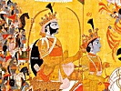

  
[Intangible Textual Heritage](../../index)  [Hinduism](../index) 
[Index](index)  [Previous](sbg02)  [Next](sbg04) 

------------------------------------------------------------------------

[Buy this Book at
Amazon.com](https://www.amazon.com/exec/obidos/ASIN/0766103498/internetsacredte)

------------------------------------------------------------------------

  
*Srimad-Bhagavad-Gita*, English translation and commentary by Swami
Swarupananda, \[1909\], at Intangible Textual Heritage

------------------------------------------------------------------------

p. i

### FOREWORD

The Srimad-Bhagavad-Gitâ occurs in the
Bhishma Parva of the Mahâbhârata and comprises 18 chapters from the 25th
to the 42nd. The discourse between Arjuna and Krishna on the
battle-field, on the eve of the war which forms the subject-matter of
the work, was strung together in seven hundred verses and put in its
place in the body of his great history by Vyâsa.

The Gitâ opens with Dhritarâshtra's query to Sanjaya about the progress
of events. In the second chapter of the Bhishma Parva, we find Vyâsa
offering the power of sight to the blind king, that he might see the
war. Dhritarâshtra declined to have it, saying he did not care to have
eyes with which only to see the death of his own people; but he would
like to hear what was happening. On this the great Rishi Vyâsa said,
that all the occurrences in connection with the war would be reflected
in the mind of Sanjaya, and he would faithfully report them to
Dhritarâshtra.

The Gitâ is called an Upanishad, because it contains the essence of
Self-knowledge, and because its teachings, like those of the Vedas, are
divided into three sections, Karma (work), Upâsanâ (devotion) and Jnâna
(knowledge).

p. ii

The first chapter is introductory. The second is a summary of the whole
work, *e.g.*, in II. 48 and the connected Slokas, self-less work devoid
of desire for fruits, is taught for the purification of the heart; in
II. 61 and the connected Slokas devotion is taught to the pure-hearted,
to qualify them further for the highest Sannyâsa, which last is taught
in II. 71 and the connected Slokas.

It is also usual to divide the work into three sections illustrative of
the three terms of the Mahâvâkya of the Sâma-Veda, "Thou art That"
(Chhând. Upa., VI. viii. 7). In this view the first six chapters explain
the path of work without desire for fruits, and the nature of "Thou."
The next six chapters deal with devotion and the nature of "That." The
last six describe the state of the highest knowledge and the nature of
the middle term of the Mahâvâkya, in other words, the means of
re-establishing the identity of "Thou" and "That."

The central teaching of the Gitâ is the attainment of Freedom, by the
performance of one's Swadharma or duty in life. "Do thy duty without an
eye to the results thereof. Thus shouldst thou gain the purification of
heart which is essential for Moksha,"—seems to be the keynote of
Krishna's teachings to Arjuna.

It is well known why the Gitâ came into existence. It was owing to
Arjuna's unwillingness to do his duty as a Kshatriya—to fight for a just

p. iii

cause—because it involved the destruction of his own people. Not that
Arjuna did not recognise the justice and right of the cause, but he
would rather renounce the world and try for Moksha than kill his
relatives and friends. Krishna's characterisation of this weakly
sentimental attitude of Arjuna is well known. He called it "Un-Arya-like
delusion, contrary to the attainment alike of heaven and honour" and
exhorted Pârtha to "yield not to unmanliness" but to "cast off this mean
faintheartedness." (II. 2-3). "Could a coward who fails to do his duty,
be worthy to attain Moksha?"—seems to be Krishna's rejoinder. Could a
man not purified by the fire-ordeal of his Swadharma, could a renegade,
a slave, attain Moksha? No! says the Lord. And this is the lesson we
Indians have forgotten all these years, though we have been reading and
discussing the Gitâ all the time.

S.

------------------------------------------------------------------------

[Next: Meditation](sbg04)

