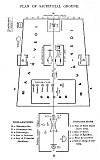

  
[Intangible Textual Heritage](../../../index)  [Hinduism](../../index) 
[Satapatha Brahmana](../index)  [Index](index)  [Previous](sbe2680) 

------------------------------------------------------------------------

[Buy this Book at
Amazon.com](https://www.amazon.com/exec/obidos/ASIN/812080127X/internetsacredte)

------------------------------------------------------------------------

*Satapatha Brahmana Part II (SBE26)*, Julius Eggeling tr. \[1885\], at
Intangible Textual Heritage

------------------------------------------------------------------------

p. 475

### PLAN OF SACRIFICIAL GROUND.

[  
Click to enlarge](img/47500.jpg)  
PLAN OF SACRIFICIAL GROUNDS  

 

 

 
