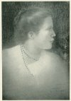
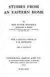

  
[Intangible Textual Heritage](../../index)  [Hindusim](../index) 
[Index](index)  [Next](seh01) 

------------------------------------------------------------------------

[  
Click to enlarge](img/front.jpg)  
SISTER NIVEDITA (MARGARET E. NOBLE)  

# STUDIES FROM AN EASTERN HOME

###### BY

## THE SISTER NIVEDITA

##### (MARGARET E. NOBLE)

###### AUTHOR OF "THE WEB OF INDIAN LIFE," "THE MASTER AS I SAW HIM," ETC.

###### WITH A PREFATORY MEMOIR BY

### S. K. RATCLIFFE

###### *AND A PORTRAIT*

#### LONGMANS, GREEN AND CO.

#### 39 PATERNOSTER ROW, LONDON

#### NEW YORK, BOMBAY, AND CALCUTTA

#### \[1913\]

[  
Click to enlarge](img/title.jpg)  
Title Page  

Scanned at Intangible Textual Heritage, February 2006. Proofed and
formatted by John Bruno Hare. This text is in the public domain in the
United States because it was published prior to January 1st, 1923. These
files may be used for any non-commercial purpose provided this notice of
attribution is left intact in all copies.

------------------------------------------------------------------------

[Next: Works by Sister Nivedita](seh01)
